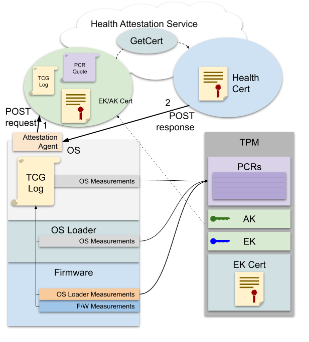
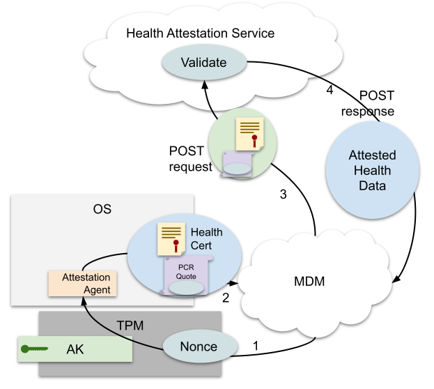
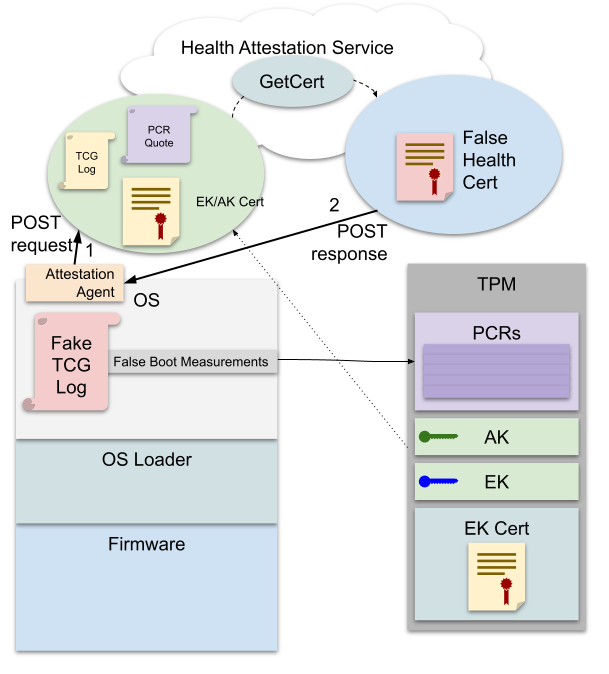
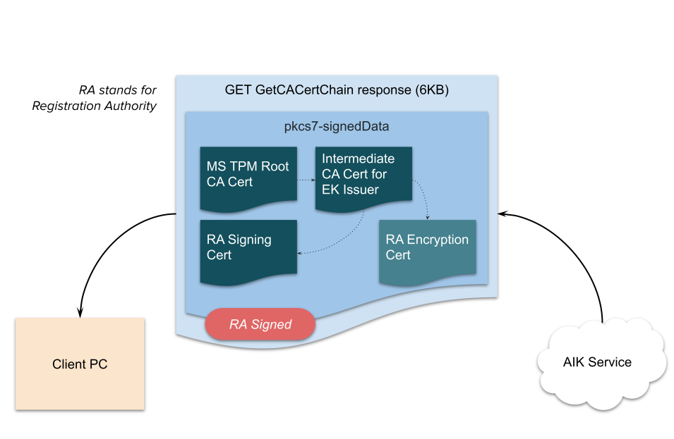
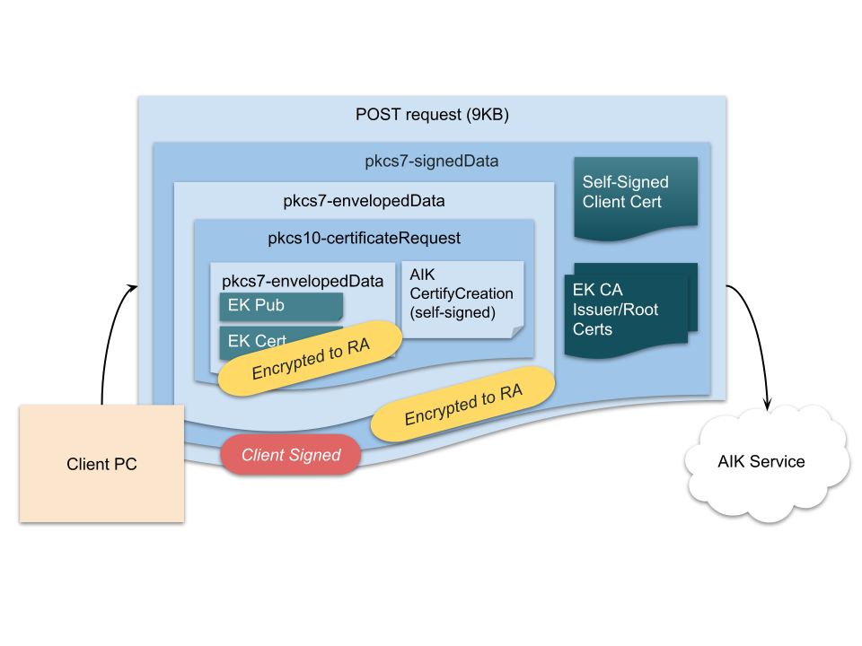
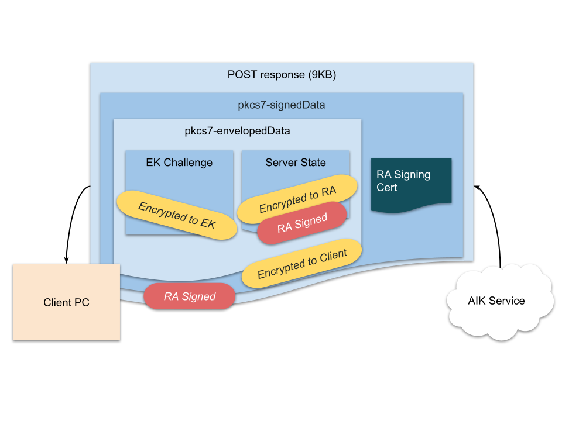
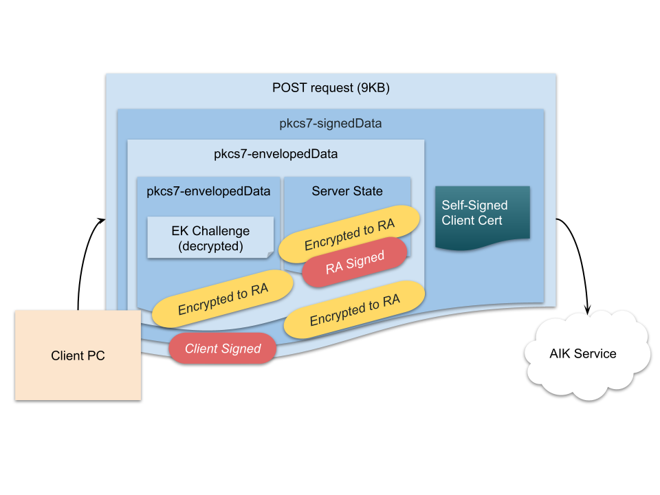
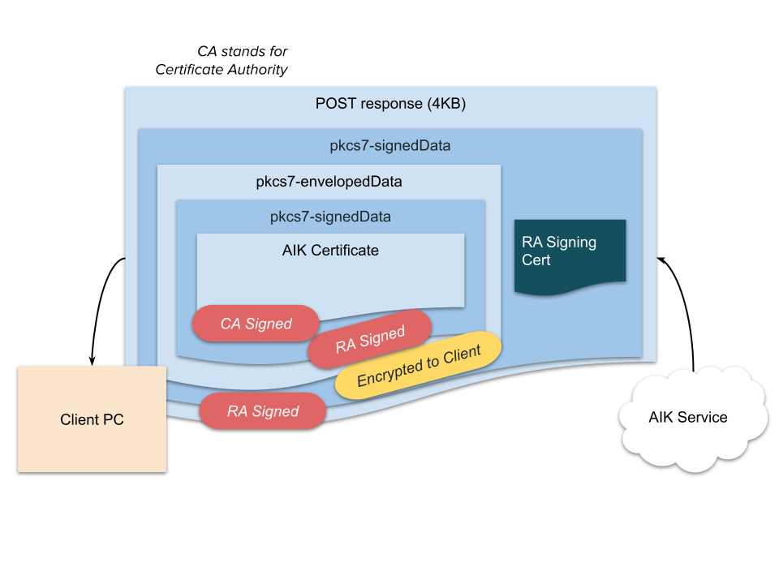

# CVE-2021-44229: TPM Carte Blanche

## Summary
On Surface Pro 3 with the SHA1 and SHA256 PCRs enabled on the TPM, BIOS version 3.11.2550 and earlier, only the SHA1 PCRs are extended by the firmware. This means that an adversary can boot into an unmeasured OS and extend the PCRs with false measurements to obtain false attestations.

## Background
Device Health Attestation is a Windows feature that uses a Trusted Platform Module (TPM) to attest to the boot state of a PC. It accomplishes this feat by leveraging measurements normally made into the TPM during boot, attesting the measurements with an Attestation Key.

<p align="center"></p>
<p align="center"><sup>Figure 1: Overview of Device Health Attestation Certificate Enrollment</sup></p>

<p align="center"></p>
<p align="center"><sup>Figure 2: Overview of Device Health Attestation Validation by MDM</sup></p>

Boot stages make measurements by extending TPM Platform Configuration Registers (PCRs), which are special TPM-memory-resident values that can only be modified by extending:

PCR<sub>new</sub> := Hash(PCR<sub>old</sub> || Hash(data))

These measurements and what they represent are stored informally in the TCG Log, a verbose log of all measurements made during a boot sequence. A log might contain measurements like "UEFI Secure Boot is on and configured with xyz keys" or "BIOS measured the Windows OS loader", along with corresponding PCR extensions. A TCG log can be validated by comparing the digest of all the extended measurements it describes with a live PCR quote signed by an Attestation Key (AK) in a TPM. An AK is a restricted signing key that is guaranteed by the TPM manufacturer not to be usable to sign fake PCR quotes. An Attestation Key is in turn attested by the Endorsement Key (EK) which can be used to decrypt attestation challenges from an AK certificate issuance service (such as the one run by Microsoft). The details of AK attestation are not relevant to this topic, but for more information, see [TPM Key Attestation](https://docs.microsoft.com/en-us/windows-server/identity/ad-ds/manage/component-updates/tpm-key-attestation). For historical reasons, AKs are called AIK (Attestation Identity Keys) in Microsoft services. For the purposes of this document, they are interchangeable.
TPMs support PCR banks for multiple hash algorithms, and even support multiple hash algorithms at once. This means that both SHA1 and SHA256 PCR banks can be enabled at the same time. It is important for firmware to make measurements into all of the active PCR banks.

## Vulnerability
On a Surface Pro 3 running recent platform firmware with SHA1 and SHA256 PCRs enabled (BIOS version 3.11.2550, as reported by `dmidecode`), if the device is booted into Ubuntu 20.04 LTS, there are no measurements at all in the SHA256 bank low PCRs (PCRs 0-7, which are intended to receive measurements of platform firmware according to the [TCG EFI Platform Specification](https://trustedcomputinggroup.org/resource/tcg-efi-platform-specification/)).

A simple tool that can check for this vulnerability is available at [cmd/bugtool](cmd/bugtool).

<p align="center"></p>
<p align="center"><sup>Figure 3: Falsified Measurements in Health Attestation</sup></p>

This is problematic because this allows arbitrary, false measurements to be made (from Linux userland, for example) corresponding to any Windows boot log desired. An honest SHA256 PCR quote over dishonest measurements can be requested using a legitimate AK in the attached TPM.

A tool that can make false measurements for an arbitrary TCG log, quote the measurements, and fetch a health cert is available at [cmd/dhatool](cmd/dhatool).

## Discovery
Basic TPM tools that can read PCRs show the problem:

```
~/src/go-tpm-tools$ sudo ./gotpm read pcr --hash-algo=sha256
0: 0000000000000000000000000000000000000000000000000000000000000000
1: 0000000000000000000000000000000000000000000000000000000000000000
2: 0000000000000000000000000000000000000000000000000000000000000000
3: 0000000000000000000000000000000000000000000000000000000000000000
4: 0000000000000000000000000000000000000000000000000000000000000000
5: 0000000000000000000000000000000000000000000000000000000000000000
6: 0000000000000000000000000000000000000000000000000000000000000000
7: 0000000000000000000000000000000000000000000000000000000000000000
8: 0000000000000000000000000000000000000000000000000000000000000000
9: 0000000000000000000000000000000000000000000000000000000000000000
10: 52dafc83858586083a5b09d80f4c75e77180691ee717d30bc07194713d5884b3
11: 0000000000000000000000000000000000000000000000000000000000000000
12: 0000000000000000000000000000000000000000000000000000000000000000
13: 0000000000000000000000000000000000000000000000000000000000000000
14: 0000000000000000000000000000000000000000000000000000000000000000
15: 0000000000000000000000000000000000000000000000000000000000000000
16: 0000000000000000000000000000000000000000000000000000000000000000
17: ffffffffffffffffffffffffffffffffffffffffffffffffffffffffffffffff
18: ffffffffffffffffffffffffffffffffffffffffffffffffffffffffffffffff
19: ffffffffffffffffffffffffffffffffffffffffffffffffffffffffffffffff
20: ffffffffffffffffffffffffffffffffffffffffffffffffffffffffffffffff
21: ffffffffffffffffffffffffffffffffffffffffffffffffffffffffffffffff
22: ffffffffffffffffffffffffffffffffffffffffffffffffffffffffffffffff
23: 0000000000000000000000000000000000000000000000000000000000000000

~/src/go-tpm-tools$ sudo ./gotpm read pcr --hash-algo=sha1
0: 3dcaea25dc86554d94b94aa5bc8f735a49212af8
1: b2a83b0ebf2f8374299a5b2bdfc31ea955ad7236
2: b2a83b0ebf2f8374299a5b2bdfc31ea955ad7236
3: b2a83b0ebf2f8374299a5b2bdfc31ea955ad7236
4: 27b2c869333dbe59c520294ffb652964da78b7ce
5: fe1b29141dcded019fe3423df304b5676c6c58d6
6: b2a83b0ebf2f8374299a5b2bdfc31ea955ad7236
7: 03e7b21f363721d4a04a550602c0742291f735b4
8: c7e3ff980c58cd67bc554519847b585de6b9bd33
9: 6167364dca8c424a2f5b1a9b3df5f121ddcfab4b
10: e13d0ffa292ef1e530005679978a0c5aae8967d3
11: 0000000000000000000000000000000000000000
12: 0000000000000000000000000000000000000000
13: 0000000000000000000000000000000000000000
14: 0000000000000000000000000000000000000000
15: 0000000000000000000000000000000000000000
16: 0000000000000000000000000000000000000000
17: ffffffffffffffffffffffffffffffffffffffff
18: ffffffffffffffffffffffffffffffffffffffff
19: ffffffffffffffffffffffffffffffffffffffff
20: ffffffffffffffffffffffffffffffffffffffff
21: ffffffffffffffffffffffffffffffffffffffff
22: ffffffffffffffffffffffffffffffffffffffff
23: 0000000000000000000000000000000000000000
```

Note that PCR10 gets at least one measurement even in the SHA256 bank. This measurement is made by IMA and is therefore disable-able (e.g., by [compiling the Linux kernel without IMA](#appendix-c-disabling-all-grublinux-pcr-measurements)).
This measurement is the IMA [boot_aggregate](https://www.redhat.com/en/blog/how-use-linux-kernels-integrity-measurement-architecture) measurement over PCRs[0-7] into PCR[10]. This measurement seems to function similarly to [EV_SEPARATOR](https://trustedcomputinggroup.org/resource/pc-client-specific-platform-firmware-profile-specification/) for distinguishing "platform firmware measurements" from "measurements made afterward by bootloader/OS/user".

## Tools

* Generic detection tool: [cmd/bugtool](cmd/bugtool)
  * Build with `go build ./cmd/bugtool`
* Tool for AIK cert enrollment: [cmd/akcli](cmd/akcli)
  * Build with `go build ./cmd/akcli`
* Tool for health cert enrollment: [cmd/dhatool](cmd/dhatool)
  * Build with `go build ./cmd/dhatool`
* Generic PCR read tool: https://github.com/google/go-tpm-tools
  * Build with `go build ./cmd/gotpm` from that repository.
* Generic TCG log tool: https://github.com/google/go-attestation
  * Build with `go build ./attest/attest-tool` from that repository.

## Exploitation
Engineers familiar with TPM PCRs and the general design of Health Attestation systems may intuitively grasp the problem with firmware that leaves PCRs empty, but it is useful to discuss exactly how an attacker might use this.

In general, all Health Attestation systems involve sending a TCG log and a PCR quote to the service. To successfully fetch a false Microsoft DHA cert, the attacker needs to understand the expected format of the request and where to send it.

The high-level strategy of an attacker with access to a trusted device with blank PCRs is:

* Obtain target TCG log.
  * This is not a secret value, and it can be obtained by reading it from a target device, reading it from another device that is similar to the target device, or hand-crafting it to contain data that is associated with a "healthy" device.
* Replay the log into the empty PCRs, leaving them in an identical state to that of a device that actually booted through the software described by the target TCG log.
* Send a valid health attestation request to the service.
  * This request is valid in the sense that the TPM reports the PCR values honestly. It is invalid in the sense that the measurements the TPM reports on are false.

The attacker can prepare a bootable Linux USB stick to minimize the interactions required with the target device (e.g., as an [Evil Maid attack](https://en.wikipedia.org/wiki/Evil_maid_attack)).

## Appendix A: Reverse-Engineering Device Health Attestation
No information other than [public](https://docs.microsoft.com/en-us/windows-server/security/device-health-attestation) [documentation](https://winprotocoldoc.blob.core.windows.net/productionwindowsarchives/MS-DHA/%5BMS-DHA%5D.pdf) was required to build the necessary tools.

The [WMI bridge](https://docs.microsoft.com/en-us/windows/client-management/mdm/using-powershell-scripting-with-the-wmi-bridge-provider) can be used to manipulate the [Windows Device Health Attestation Configuration Service Provider](https://docs.microsoft.com/en-us/windows/client-management/mdm/healthattestation-csp) for experimentation and reverse-engineering. 

HTTPS requests to the DHA service use TLS, which needs to be traced in a way that tools such as Wireshark can decrypt. http://b.poc.fun/decrypting-schannel-tls-part-1/ describes how to do this with Wireshark. Other tools such as Fiddler can simplify the process of intercepting and decrypting TLS traffic further.

### Triggering Health Attestation

The below commands must be executed in a PowerShell window running as system, i.e., using:

```shell
psexec -s -i powershell
```

```powershell
# Optional: Fetch the TCG log for later manipulation
$tpm = Get-WmiObject -class Win32_Tpm -namespace root\CIMV2\Security\MicrosoftTpm
$log = $tpm.GetTcgLog
Set-Content -Encoding Byte "bootlog.log" $log

# Connect to the DHA CSP
$namespaceName = "root\cimv2\mdm\dmmap"
$HA = Get-CimInstance -Namespace $namespaceName -ClassName MDM_HealthAttestation
# This nonce is used in the PCR quote and normally comes from the MDM manager
$HA.Nonce = "AAAAAAAAAFFFFFFF"
$HA.ForceRetrieve = $True

# Trigger a health attestation (trace network activity with Wireshark)
$session = New-CimSession
$params = New-Object Microsoft.Management.Infrastructure.CimMethodParametersCollection
$session.InvokeMethod($namespaceName, $HA, "VerifyHealthMethod", $params)
```

This allowed saving the HTTPS POST request to has.spserv.microsoft.com along with all its headers, which can be easily replayed by the tool.

```xml
<?xml version="1.0" encoding="utf-8"?>
<HealthCertificateRequest ProtocolVersion="3" xmlns="http://schemas.microsoft.com/windows/security/healthcertificate/request/v3">
<Claims>...snip - around 16KB of base64 data...</Claims>
<AIKCertificate>...snip - base64 AIK cert...</AIKCertificate>
</HealthCertificateRequest>
```

In response to this request, has.spserv.microsoft.com gives a valid Health Certificate explaining what is or isn't true about the device, according to the boot log (Secure Boot on, Windows version, etc).

### Analysis of Health Attestation Request and Response

The `<Claims>` in the XML request can be decomposed into two types of data:

* Data that the tool needs to inject
  * TCG log
  * PCR quote (and signature by AK)
  * Current values of PCRs (optional, but helps with debugging)
  * AK attestations/certificates
* Data that can be copied opaquely from a valid request

When examining the decoded base64 data from a real client, the structure of these fields is simple and self-evident:

* TCG log is several KB and contains various TCG GUIDs and firmware file paths
* PCR quote begins with 0xff'TCG' (the magic marker value for all TPM attestation statements)
* Quote signature is the expected size and structure of TPMT_SIGNATURE as emitted by TPM2_Quote.
* PCR plaintext values are obvious (blocks of 0x00 and 0xff for unused PCRs; exact size of 24 SHA1/SHA256 hashes)
* There are some numeric fields that were not necessary to be comprehended (could be fixed to match sample data from a real client) that seemed to indicate versions and/or capabilities.

Therefore, a tool that can obtain a fake Health Certificate on a device that leaves the PCRs unextended just needs to:

* Obtain an AIK certificate recognized by DHA service
* Obtain a TCG log describing the device whose health it wants to impersonate
* Measure the contents of the log into the TPM and get attestation(s)
* Assemble the XML request and enroll for a Health Certificate
* Provide claims data as requested by the MDM (with nonce) for verification

The proof-of-concept [dhatool](cmd/dhatool) performs self-verification against the Device Health Attestation Service. A real attack would await a request from the MDM, generate the requested claims data with the MDM-selected nonce, and allow the MDM to validate the health state against the service itself.

## Appendix B: Reverse-Engineering AIK Service

No information other than [public](https://docs.microsoft.com/en-us/openspecs/windows_protocols/ms-wcce/adc2aab5-701b-4f91-9dc0-5615543712bf) [documentation](https://winprotocoldoc.blob.core.windows.net/productionwindowsarchives/MS-WCCE/%5BMS-WCCE%5D.pdf) was required to build the necessary tools.

DHA accepts the AIK certificate inline with the Health Attestation request. So, an attacker needs to be able to fetch a valid AIK certificate, preferably from the same environment where they are performing DHA spoofing.

Wireshark shows activity reaching out to a Windows AIK issuance service endpoint during TPM provisioning. This network activity can be broken down into a few HTTPS requests, just like Device Health Attestation. The Windows AIK SCEP enrollment protocol is much more complicated than the Device Health Certificate enrollment protocol. Here are some brief highlights:

* 3 round trips
* 37KB of throughput per AIK certificate enrolled
* Server must complete 10 RSA2048, and one RSA4096 private operation per AIK cert
* Every network hop contains data that is redundantly signed/decrypted by the CA

### AIK Enrollment in Diagrams

First, the client calls GET on GetCACertChain and receives a bundle of certs from the Registration Authority:

<p align="center"></p>
<p align="center"><sup>Figure 4: AIK SCEP GetCACertChain</sup></p>

Then, the client assembles a [SCEP](https://en.wikipedia.org/wiki/Simple_Certificate_Enrollment_Protocol) CSR containing:

* EK certs fetched from the TPM (plus the whole chain from following AIA links)
* The output of TPM2_CertifyCreation (another recognizable TCG structure, because TCG attestation structures are uniquely tagged)

<p align="center"></p>
<p align="center"><sup>Figure 5: AIK SCEP CSR</sup></p>

The RA responds by assembling an EK challenge blob for the client. The server also generates a signed, encrypted RA context blob (presumably to keep the service RESTful). TPM EK challenges are specially formatted messages encrypted to the TPM's EK that instruct the TPM to check that a target AIK public key is present in the TPM (i.e., that the candidate AIK and EK are collocated).

<p align="center"></p>
<p align="center"><sup>Figure 6: AIK SCEP Challenge</sup></p>

The client decrypts the EK challenge (TPM2_ActivateCredential) and returns it along with the RA context blob:

<p align="center"></p>
<p align="center"><sup>Figure 7: AIK SCEP Challenge Solution</sup></p>

The RA, satisfied that the client has passed the challenge, gets the CA to issue an AIK certificate for the device and sends it back.

<p align="center"></p>
<p align="center"><sup>Figure 8: AIK SCEP Certificate Delivery</sup></p>

## Appendix C: Disabling all GRUB/Linux PCR Measurements

As can be seen in the introduction, there is some nonzero amount of measurements being made into SHA256 PCR[10] during Linux boot with vanilla Ubuntu running. At first, this looked like the work of GRUB, but it turned out to be [IMA](https://sourceforge.net/p/linux-ima/wiki/Home/). It was simple enough to disable all the measurements from both GRUB and IMA.

To completely disable all GRUB measurements, this code modification was used:

```diff
grub-core/commands/efi/tpm.c
grub_err_t
grub_tpm_measure (unsigned char *buf, grub_size_t size, grub_uint8_t pcr,
                    const char *description)
{
+  if (pcr < 24)
+    return 0;
  grub_efi_handle_t tpm_handle;
  grub_efi_uint8_t protocol_version;

  if (!grub_tpm_handle_find (&tpm_handle, &protocol_version))
    return 0;

  grub_dprintf ("tpm", "log_event, pcr = %d, size = 0x%" PRIxGRUB_SIZE ", %s\n",
                pcr, size, description);

  if (protocol_version == 1)
    return grub_tpm1_log_event (tpm_handle, buf, size, pcr, description);
  else
    return grub_tpm2_log_event (tpm_handle, buf, size, pcr, description);
}
```

It was less convenient to modify the whole function to return 0 unconditionally, due to the compiler warnings this introduced. (GRUB make has all the dead code findings interpreted as errors by default.)

A new GRUB based on this code can be built and installed with the usual method.

To completely disable all kernel measurements, this config option was required (some other options depend on it and should also be disabled:

```
CONFIG_IMA=n
```

The simplest way to disable IMA is to deselect it in `make menuconfig`:

<p align="center"></p>
<p align="center"><sup>Compiling the kernel without IMA</sup></p>

A new kernel based on this config can be built and installed with the usual method.

Booting through this new GRUB and kernel eliminates all the PCR measurements in SHA1 and SHA256 being made after the platform firmware hands over execution to the boot loader. This leaves the SHA256 PCRs in a usable state for the proof of concept:

```
~/src/go-tpm-tools$ sudo ./gotpm read pcr --hash-algo=sha256
0: 0000000000000000000000000000000000000000000000000000000000000000
1: 0000000000000000000000000000000000000000000000000000000000000000
2: 0000000000000000000000000000000000000000000000000000000000000000
3: 0000000000000000000000000000000000000000000000000000000000000000
4: 0000000000000000000000000000000000000000000000000000000000000000
5: 0000000000000000000000000000000000000000000000000000000000000000
6: 0000000000000000000000000000000000000000000000000000000000000000
7: 0000000000000000000000000000000000000000000000000000000000000000
8: 0000000000000000000000000000000000000000000000000000000000000000
9: 0000000000000000000000000000000000000000000000000000000000000000
10: 0000000000000000000000000000000000000000000000000000000000000000
11: 0000000000000000000000000000000000000000000000000000000000000000
12: 0000000000000000000000000000000000000000000000000000000000000000
13: 0000000000000000000000000000000000000000000000000000000000000000
14: 0000000000000000000000000000000000000000000000000000000000000000
15: 0000000000000000000000000000000000000000000000000000000000000000
16: 0000000000000000000000000000000000000000000000000000000000000000
17: ffffffffffffffffffffffffffffffffffffffffffffffffffffffffffffffff
18: ffffffffffffffffffffffffffffffffffffffffffffffffffffffffffffffff
19: ffffffffffffffffffffffffffffffffffffffffffffffffffffffffffffffff
20: ffffffffffffffffffffffffffffffffffffffffffffffffffffffffffffffff
21: ffffffffffffffffffffffffffffffffffffffffffffffffffffffffffffffff
22: ffffffffffffffffffffffffffffffffffffffffffffffffffffffffffffffff
23: 0000000000000000000000000000000000000000000000000000000000000000

~/src/go-tpm-tools$ sudo ./gotpm read pcr --hash-algo=sha1
0: 3dcaea25dc86554d94b94aa5bc8f735a49212af8
1: b2a83b0ebf2f8374299a5b2bdfc31ea955ad7236
2: b2a83b0ebf2f8374299a5b2bdfc31ea955ad7236
3: b2a83b0ebf2f8374299a5b2bdfc31ea955ad7236
4: 27b2c869333dbe59c520294ffb652964da78b7ce
5: fe1b29141dcded019fe3423df304b5676c6c58d6
6: b2a83b0ebf2f8374299a5b2bdfc31ea955ad7236
7: 03e7b21f363721d4a04a550602c0742291f735b4
8: 0000000000000000000000000000000000000000
9: 0000000000000000000000000000000000000000
10: 0000000000000000000000000000000000000000
11: 0000000000000000000000000000000000000000
12: 0000000000000000000000000000000000000000
13: 0000000000000000000000000000000000000000
14: 0000000000000000000000000000000000000000
15: 0000000000000000000000000000000000000000
16: 0000000000000000000000000000000000000000
17: ffffffffffffffffffffffffffffffffffffffff
18: ffffffffffffffffffffffffffffffffffffffff
19: ffffffffffffffffffffffffffffffffffffffff
20: ffffffffffffffffffffffffffffffffffffffff
21: ffffffffffffffffffffffffffffffffffffffff
22: ffffffffffffffffffffffffffffffffffffffff
23: 0000000000000000000000000000000000000000
```

This leaves the device in a ready state for the proof of concept.
