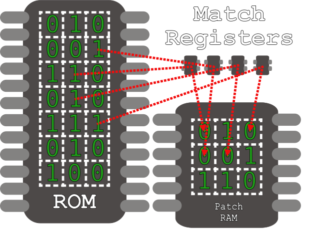
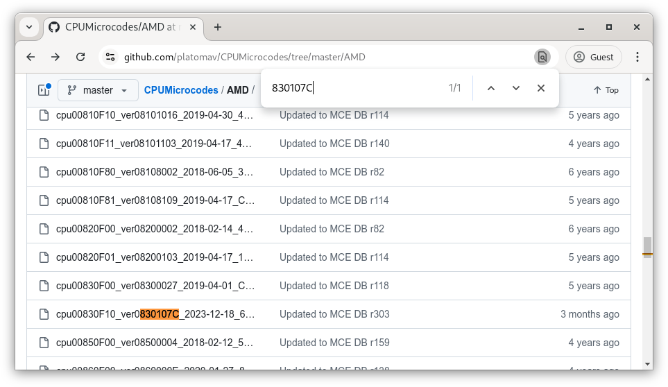

# Microcoding Quickstart
<p align="right">
    <sup>Tavis Ormandy taviso@</sup>
</p>

This is a quick overview of microcode patches for people already familiar with
x64 assembly. If you read this, you should be able to start experimenting with
your own CPU!

> This is a tough topic to write about without getting nitpicked to death, so
> be aware that it is not intended to be comprehensive, or precise! It *is*
> intended to get you started so you can explore on your own.

## Introduction

You probably already have a rough idea of what microcode is. You might have heard
that an x86 CPU appears to be CISC, but internally has a RISC-like
architecture. Well, that's true!

The simplest instructions (`add`, `sub`, `mov`, etc) are all implemented in
hardware. The more complicated instructions like `rdrand`, `fpatan` and
`cmpxchg` are *microcoded*. You can think of them as a bit like calling into a
library of functions written in that RISC-like code.

The "library" is stored in ROM on the CPU. Like all libraries, sometimes
there are bugs that need to be fixed, and that's where microcode updates
come in.

You might have guessed a microcode update is a bit like flashing new firmware
onto your CPU, but nope! This [mask
ROM](https://en.wikipedia.org/wiki/Read-only_memory#Solid-state_ROM) literally
cannot be changed -- it's physically etched into silicon, so you're stuck with it.

> You might have heard about people reverse engineering integrated circuits by
> [decapping](https://en.wikipedia.org/wiki/Decapping) them with lasers and
> acid to dissolve substrate. They're literally reading the bits etched onto
> the silicon with a microscope!

We still need a solution though, so there are two components we need to
discuss, *Match Registers* and *Patch RAM*.

### Match Registers

Put simply, if you put a ROM address into a match register, whenever microcode
is loaded from that address it will be redirected to patch RAM instead. If
you're a software person like me, you might think of this as more like
"hooking" than "patching".



There's a big catch, these resources are super limited! Like, really really
limited. There are maybe 20 match registers, and perhaps a kilobyte of patch
RAM, so you're probably not going to be porting DOOM to microcode, sorry!

> You might have heard vendors talking about "running out of patch ram" on some
> CPUs. This is what they mean, they have more bugs than available space to
> load patches! It's sort of a fun engineering puzzle, they have to get
> creative or play [code golf](https://en.wikipedia.org/wiki/Code_golf) to get
> a new patch shipped.

One more thing -- as the name suggests, patch RAM is *volatile*, meaning when
you turn off the CPU the contents dissapears. When you first turn on your
computer, your CPU just has the original ROM -- your BIOS and/or operating
system will apply updates on every single boot.

### Applications

The first question everyone has about microcode updates is something like
"So can I execute ARM64 code natively on my Athlon?" 😆 It's a fun idea, but
now we know that a microcode patch doesn't work like that -- so the answer is
no, sorry!

Okay, but what *can* you do? That's a huge topic, but we're going to talk about
the most interesting application, replacing microcoded instructions with
our own custom code!

## Warning

Here is a good point to put the warning that you're probably going to void your
warranty, lose your data and brick your hardware if you play with microcode.

# Architecture

There's so much to write about here, but I'm going to keep it brief - the
absolute minimum you need to know to get started.

Here's the thing - the big vendors encrypt and sign their updates so that
you cannot run your own microcode. A big discovery recently means that the
authentication scheme is a lot weaker than intended, and you can now
effectively "jailbreak" your CPU!

If that sounds like fun to you, and you're not scared of voiding your warranty
or losing data - then read on!

## Background

There are two concepts I need to explain before we get started, *OpQuads* and
*Sequence Words*.

### OpQuads

An OpQuad (or just quad) is simply a group of four microcode instructions.
There is no way to execute less than four instructions, if you only want three,
then you need to pad it with `nop`s.

There are a bunch of complicated restrictions on where certain operations can
occur within a quad -- I'll cover some of those later. The important thing
to know for now is that there is no smaller unit of execution than a quad.

> Interested in learning more? The most important reference on the topic of
> microcode is the book "Anatomy of a High Performance Microprocessor" (ISBN
> 0818684003). The details are outdated, but the concepts are still relevant.

### Sequence Words

In x64, execution simply flows from one instruction to the next unless you
branch. If we had some code like this, you just read instructions one after
the other, easy!

```
    mov     rax, rbx
    add     rax, 32
    push    rcx
    mov     rcx, [rel foo]
    sub     rcx, rax
    mov     [rel foo], rcx
    pop     rcx
    ret
```

Unfortunately, it doesn't work like that in microcode! We already know you
can't execute less than a quad, but execution does not flow from one quad to
the next -- each quad has an associated *Sequence Word*.

A sequence word tells the CPU where the next quad to execute is located. Every
quad needs a sequence word - even if you just want to execute the next quad.
The simplest sequence word would just be *forward relative one*, but it can
redirect execution anywhere, and there are flags to specify things like
returning from emulation.

> Emulation in this context means executing micro instructions to simulate a
> macro operation. You might see terms like `ECF` for *Emulated Carry Flag*, this
> is to disambiguate it from the x64 macro *Carry Flag*.

## Basics

Okay, so now we know how execution flows in microcode, and how instructions are
arranged into quads... so what do instructions look like?

> This isn't like x86, every single instruction is 64bits, no exceptions! 😆

They're usually optional, but most instructions have a 3-operand form, like this:

```
    add     rax, rbx, rcx
```

This means, add `rbx` and `rcx` and store the result into `rax`.

All registers can be addressed as qwords, dwords, words and bytes. I write them
like this if you want to override the default size to use `dwords` rather than
`qwords`:

```
    sub.d   rax, rbx, 0x123
```

There are 32 internal registers, some map to the macro registers or have special
purposes, but others are regular registers only accessible to microcode.

You can also *load* and *store* from memory, of course:

```
    st.q    rax, ls:[rbx]
```

This means read a qword from the address in `rbx` onto `rax` from segment `ls`.

### Segments

Yep, we gotta talk about segments.

All addresses are encoded with a segment, they can be virtual addresses,
physical addresses, microcode RAM, architectural-segment relative, etc.

The important ones to know are `ls`, the *linear segment*, which is basically
physical memory and `os`, which is *virtual memory*.


# Hello, μWorld!

Okay, we have enough background, let's execute some microcode!

## Toolchain

The first step is to get your toolchain working, so lets find a template
microcode update for us to embed our code into.

We need an original microcode update because only vendor approved microcode
updates are permitted by default. We hollow-out a valid approved file and put
our own code inside it.

### Finding an update

First, find out which microcode revision your CPU is currently using:

```
$ grep -m1 '^microcode' /proc/cpuinfo
microcode	: 0x830107c
```

There is a convenient collection of update files available
[here](https://github.com/platomav/CPUMicrocodes/tree/master/AMD), so simply
find a matching update for your CPU.

> Note: If the exact revision you're using is not present, just download the
> closest matching version.

I can see my update will be `cpu00830F10_ver0830107C_2023-12-18_6CEA85AD.bin`,
so lets download that file.



### Create a template

Let's take a look inside the file we got.

```
$ zentool print cpu00830F10_ver0830107C_2023-12-18_6CEA85AD.bin
Date:       12182023 (Mon Dec 18 2023)
Revision:   0830107c
Format:     8004
Patchlen:   00
Init:       00
Checksum:   00000000
Nbvid:      0000
Nbdid:      0000
Sbvid:      0000
Sbdid:      0000
Cpuid:      00008310 Rome, Castle Peak
  Stepping  0
  Model:    1
  Extmodel: 3
  Extfam:   8
Biosrev:    08
Flags:      00
Reserved:   0000
Signature:  7a... (use --verbose to see)
Modulus:    c7... (use --verbose to see)
Hash:       5a... (use --verbose to see)
Autorun:    01
Encrypted:  00
Revision:   0830107c (Signed)
```

> Note: Do you see the *encrypted* flag set? Don't worry, just use `zentool
> decrypt` to replace it with a plaintext version.

Here we can see the header data, we can even take a look at the *Match Registers*:

```
$ zentool print --match-regs cpu00830F10_ver0830107C_2023-12-18_6CEA85AD.bin
Match Registers
	[0 ] 10E7
	[1 ] 092E
	[2 ] 12FD
	[3 ] 12FF
	[4 ] 12F8
	[5 ] 06A9
...
```

> Note: Your match registers may be different -- that's okay! Remember these
> are effectively ROM addresses, so they will be different for each base ROM.

These are the ROM addresses the vendor wants to hook! We don't need these just
for our experiment though, so let's remove everything and start with a blank
file.

```
$ zentool --output template.bin edit --hdr-autorun false --nop all --match all=0 cpu00830F10_ver0830107C_2023-12-18_6CEA85AD.bin
```

This will create an empty file `template.bin` for your CPU, ready for us to modify.

# Adding Code

The first program we're going to execute will just replace a donor instruction
to put a constant into `rax`. Let's pick a rarely used instruction for now that
*probably* won't break anything, like
[`f2xm1`](https://www.felixcloutier.com/x86/f2xm1) or
[`fpatan`](https://www.felixcloutier.com/x86/fpatan).

> Note: You can try other instructions if you like!

First, we need to set a match register, so set match register zero to `@fpatan`.
The `@` symbol simply indicates you want to use a symbolic instruction name rather
than a number.

```
$ zentool edit --match 0,1=@fpatan template.bin
```

> Note: This only works if the correct match register for this CPU is known,
> not all instructions are known for every CPU yet! If you want to help add
> support for a new CPU, see [here](matchreg.md).

Now we can choose what we want to happen instead of the default action. Let's
set the first instruction to put a constant into `rax`.

We can do that using `--insn` and setting `q0i0`, this simply means *Quad*
zero, *Instruction* zero, so the first instruction of the first quad.

```
$ zentool edit --insn q1i0="add rax, rax, 0x1337" template.bin
```

Now we need to set the *Sequence Word*, we can set it to the magic value `7`,
which means *return from emulation*, i.e. continue to the next macro instruction.


```
$ zentool edit --seq 0,1=7 template.bin

```

The final step is to choose a revision number. There are some restrictions
here, the first 3 bytes of a revision must match your CPU family, and the final
byte must be greather than or equal to your current revision.

Let's just set it to 0xff, that should be good enough for every system:

```
$ zentool edit --hdr-revlow 0xff template.bin
```

> For clarity I showed each step individually, but you can combine all of
> these steps into one:
> 
> `zentool edit --nop all --match all=0 --hdr-revlow 0xff --match 0=@fpatan --seq 0=7 --insn q0i0="add rax, rax, 0x1337" input.bin`
>

# Loading updates

Now we're ready to load our microcode patch. We made lots of changes to the
file, so the signature  will no longer be correct:

```
$ zentool verify template.bin
template.bin: BAD
```

Let's use the `resign` command to compensate for the changes:

```
$ zentool resign template.bin
$ zentool verify template.bin
template.bin: GOOD
```

Now the CPU should accept it, so we just need to load it. You can use whatever
system your operating system provides, but `zentool` has a simple built-in
loader for testing.

> Note: This could cause your system to crash or behave in unexpected ways!

```
# zentool load --cpu=2 template.bin

```

If that worked, the revision number should be incremented on one of your cores.
We can check with `msr-tools`, which provides some commands for reading Model
Specific Registers. Let's ask each core to report `MSR_PATCH_LEVEL`, which is
register `0x8B`:

```
# rdmsr -a 0x8b
830107c
830107c
83010ff   <----
830107c
830107c
830107c
830107c
830107c
...
```

This looks good -- one core has different microcode loaded!

> Note: If you see two cores with different revisions, that's normal, they're
> probably SMT siblings.

# Testing

Here is some code to invoke any instuction we want:

```c
#include <stdint.h>
#include <stdio.h>

static inline uint64_t invoke_microcode_callback(uint64_t arg1)
{
    uint64_t result = 0;

    asm volatile ("fpatan" : "=a"(result) : "a"(arg1));

    return result;
}


int main(int argc, char **argv)
{
    printf("%#x\n", invoke_microcode_callback(0));
}
```

Let's compile it and see if it works.

```
$ gcc -o test test.c
$ taskset -c 0 ./test
0
$ taskset -c 2 ./test
0x1337
```

That worked, we changed the definition of `fpatan` on the core with the new microcode!

# Step 2

- Reading memory
- Writing memory
- Producing output (VGA?)

