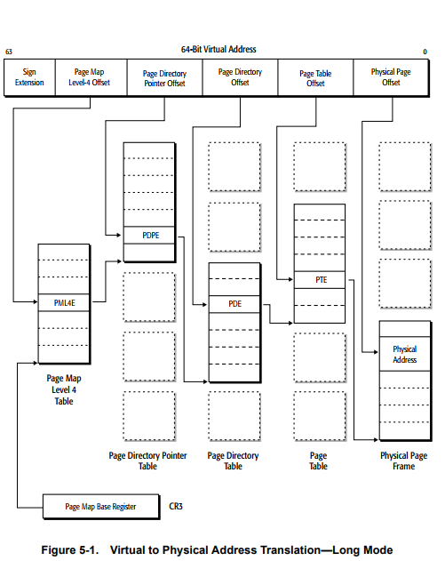
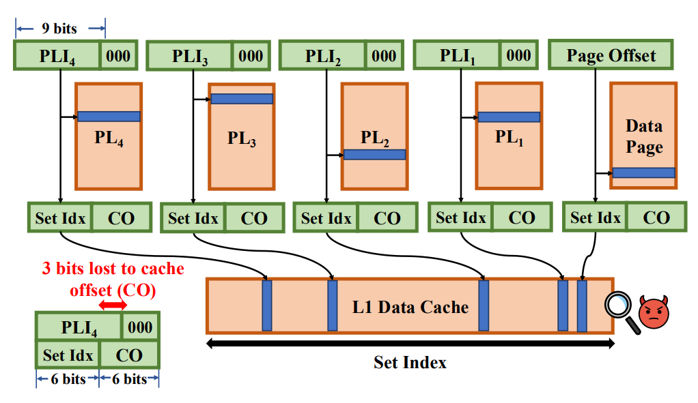

# Page table side channels

This repository contains proof of concept for page table side channels,
implemented in two ways:
- Evict+Time,
- Prime+Probe.

Both were discussed in the VUSec's
[AnC](https://download.vusec.net/papers/anc_ndss17.pdf)
paper, though only the first one was implemented (Prime+Probe was deemed
impractical).
After we conducted our own experiments (described here),
a similar research was afterwards independently published in the
[Peek-a-Walk](https://www.cs.cmu.edu/%7Erpaccagn/papers/peek-a-walk-sp2025.pdf)
paper.

The point of the PoC is to guess the secret pointer that is accessed by the
victim - either for its own sake (e.g. to break ASLR), or as part of a larger
exploit (where secret data is encoded as a pointer).

## Build and run

To build the code, run `make`. To cross-compile for
ARM, run `CROSS=aarch64-linux-gnu- make`. You will now have two binaries:
`anc` and
`eviction_anc`. The recommended way to run them is:
```
taskset -a -c 0 ./anc $RANDOM
```
`$RANDOM` is a seed for the internal PRNG - you can generally reuse it
if you want reproducibility. However, some of the modern ARM CPUs have
fairly advanced prefetchers with state persisting for many seconds,
and across new processes - so for those, reusing seed is discouraged
to avoid unrelated effects.

We ran the code on Intel, AMD, and ARM CPUs.
On Intel and AMD both work (though `anc` on AMD might be somewhat unreliable);
on most ARMs - only `anc` does (`eviction_anc` might return partial results).

### Expected results

When you run `anc`, you should see a line like this at the bottom:
```
TRUE:  0x6585903b62af [4230]
GUESS: 0x6585903b6280 [4230] (OK)
```
The `OK` indicates that the secret pointer has been guessed correctly
(up to a few last bits, which are unknown). If you see `BAD`, the exploit
failed.

When you run `eviction_anc`, you should see something like this at the end:
```
Best guesses: 01 03 1c 16 17  (order unknown)
 True values: 17 16 03 1c 01
```
If the two lines contain the same values (potentially in a different order),
the exploit succeeded.

## Page walk theory

Both x86 and ARM use page walks to find page's
physical address. This is illustrated by the following diagram from
[AMD64 Architecture Programmer's Manual](https://www.amd.com/content/dam/amd/en/documents/processor-tech-docs/programmer-references/24593.pdf):



When an address is loaded,
actually about five loads from main memory can be performed:
first the top level table's entry pointing to the lower level table start,
then one of that table's entries is loaded and so on.

Crucially, each of these hidden, intermediate loads goes through the
processor cache hierarchy - and can be cached, e.g. in L1D.
The attacker can then use one of the well-known cache side channels to
leak the accessed pointer address, since the L1D signal is directly
connected to the bits in the address. Here's a helpful diagram for
ARM with 4kB pages (from
[Linux docs](https://www.kernel.org/doc/html/v5.8/arm64/memory.html)):

```
+--------+--------+--------+--------+--------+--------+--------+--------+
|63    56|55    48|47    40|39    32|31    24|23    16|15     8|7      0|
+--------+--------+--------+--------+--------+--------+--------+--------+
 |                 |         |         |         |         |
 |                 |         |         |         |         v
 |                 |         |         |         |   [11:0]  in-page offset
 |                 |         |         |         +-> [20:12] L3 index
 |                 |         |         +-----------> [29:21] L2 index
 |                 |         +---------------------> [38:30] L1 index
 |                 +-------------------------------> [47:39] L0 index
 +-------------------------------------------------> [63] TTBR0/1
```

Confusingly, ARM uses L0 to refer to the top level, while AMD reverses
the numbering. For the rest of this write-up we'll use ARM terminology.

The page walk as described above only occurs if the translation result is not
cached in TLB, or other paging-structure caches. See e.g.
[this presentation](https://grsecurity.net/h2hc_2024_what_every_hacker_should_know_TLB_invalidation.pdf)
for good introduction. For our attack, the TLB and paging-structure caches
are not needed; in fact, they get in way of our job - so as one of the steps,
we try to clear them.

## Evict+Time

Implemented in `anc.c`.

We can split an address into a sequence of page table entry indexes,
L0:L1:L2:L3:P - for example 1:2:3:4:5. Then let's say we hypothetically
run the following sequence of loads and flushes:
```
load a:b:c:d:e ; attacker controlled
flush everything
load a:b:X:Y:Z ; secret!
load a:b:c:d:e ; attacker controlled
```
The first load will of course perform the whole page table walk, and
the secret load will do that as well. However, the secret load will leave
`L0[a]` and `L1_a[b]` entries cached, making the final load's page table
walk faster (as it will reuse these two entries, and only slowly load the
rest).

This leads to a simple (at least in principle) algorithm of leaking the
address:
```
addr = 0
for level in 0..4:
    best_t, best_addr = inf, -1
    for i in 0..512:
        guess = addr
        guess.level_bits[level] = i
        mmap(guess)
        flush everything
        call victim to load secret pointer
        t = time_access(guess)
        best_t, best_addr = min((best_t, best_addr), (t, guess))

    addr = best_addr
return addr
```
In short, we brute force all possible indexes at the top page table and
check accessing which is fastest; then we repeat for the lower levels.

In practice, there are some optimizations (e.g. we only mmap each guess
once - before the loop; and we time access to all guesses after the secret
pointer is loaded just once).

However, there are still some complications, and unstated details.

### Flush everything

In the pseudocode we have an enigmatic `flush everything` statement. This
is supposed to make sure the secret load is fully uncached at all levels
so that we can differentiate the touched cachelines from the untouched ones.
Additionally, we need it to be uncached also in the TLB.

Since page tables are not directly accessible from userspace, we cannot use
instructions such as x86 `clflush`. Instead, we use cache contention to evict
them. At the program start, we allocate a large number of pages. Then the
eviction step just loads all of them in succession.

The eviction pages are
placed at mostly random locations in order to put as much cache pressure as
possible. However, if we did this naively, we would expect all top-level page
table entries
to be cached after the eviction step (as our random pointers were caching
random L0 entries in the course of loading). To remedy that, we choose
one L0 entry to be "sacrificed": all eviction pages will be allocated under that
L0 index. Other indexes won't be cached (just as we wanted);
we'll have to adjust
the algorithm to ignore that special index (for L0 only). This makes our
algorithm fail if the secret pointer was under that index (though in
principle this condition could be detected by repeating the algorithm with
a different chosen L0 index for eviction pages).

### Background noise

There is a lot of noise in the system, and the timing difference is very small
(~single-digit cycles - or sub-cycle in some cases!).
The noise can be mostly averaged out by repeating the
experiment thousands of times, and averaging the measured time.

However, some noise is systematic - it is consistent between repetitions
(for example cache line 4 could be always uncached regardless of the secret).
To fix this, we sometimes run the experiment with the secret pointer, and
sometimes with a random pointer instead. The average timing measured for
the random pointer is the background noise that we should additionally
subtract from the secret signal. This method is very similar to the
"differential Prime+Probe" described in Peek-a-Walk.

### Self-eviction

Some guess pointers might have unlucky alignment and cause self-eviction
(see the Prime+Probe section below to see discussion of similar effects).
For example,
accessing `1:2:3:4:5` might be a bit faster than `1:1:1:1:1`, since
the latter will have all 5 loads competing for the same cache set.

To reduce this effect, we allocate more than one page for each guess,
and instead of keeping the low-level chunks set to zero, we randomize them.
In other words, when guessing the L0 chunk: until now we would allocate
`0:0:0:0:0`, `1:0:0:0:0`, `2:0:0:0:0` and so on; with this change we might
instead allocate and measure time for: random(`0:13:17:7:9`, `0:3:12:5:1`),
random(`1:8:4:31:22`, `1:9:18:0:7`) and so on.

### Cache line granularity

A page table is typically the same size as a page itself - often 4kB.
Cache line size is typically 64 bytes, and on 64-bit architectures, pointers
are 8 bytes large.

That means a page table hosts 512 entries, but consists of only 64 cache
lines. Since our
side channel's granularity is a cache-line, we cannot distinguish between
the 8 entries sharing a cache line. Each page table level index has 9 bits
(since `2^9 = 512`), but using our side channel we can only leak 6 - missing
3 (since `2^3 * 8 = 64`).

We can guess those 3 unknown bits in the next stage though. For example,
let's say after first level of our algorithm we know the secret pointer
is of the form `A:?:?:?:?`, where `8 <= A <= 15`. Then we can proceed with
the second stage normally, but additionally brute forcing those 3 bits.
We should expect significant signal only if `A` is guessed correctly.

Using this method, we can leak all bits corresponding to page table indexes,
apart from the last level's final three bits.

### Prefetchers

Modern CPUs have quite advanced prefetching mechanisms, that often get in way
of our measurements. Here are some patterns that we noticed and how we handle
them.

#### Next cache line prefetching

Many CPUs prefetch (put in cache) the cache line following the one currently
accessed. This is especially visible on AMD CPUs, where we often see timing
patterns like this:

```
+-----+-----+
|index| time|
+-----+-----+
| ... | ... |
|  33 | 203 |
|  34 |  19 |
|  35 |  17 |
|  36 | 205 |
| ... | ... |
+-----+-----+
```

In other words, two consecutive cache lines have very similar (low) timings,
and distinguishing between them is very difficult. We'd expect 50% chance
of guessing which cache line is the correct one (or noise will choose for us).
However, this prefetcher always runs in the forward direction - so if we notice
a similar situation, we can always choose the earlier cache line.

#### ARM lowest level PT prefetcher

On some (but not all) ARM CPUs, we noticed a similar pattern, except instead
of two consecutive lines being cached, *nine* are. While debugging, we
noticed the nine cached lines are centered around the correct one (i.e. we
have 4 prefetched lines, then the correct one, then 4 prefetched ones). This
effect is only present in the lowest level of the page tables, so we
special-cased it to detect the presence of nine consecutive lines and return
the middle one.

This prefetcher doesn't work across page boundaries though: for example if we
load cache line number 2 in a page, we'll see caches 0-6 being cached (and
lines -1 and -2 - that is, the last two lines of the previous page -
won't be cached).

#### Correlation-based prefetching

Some of the modern ARM CPUs implement CMC - Correlated Miss Caching
([source](https://hc33.hotchips.org/assets/program/conference/day1/20210818_Hotchips_NeoverseN2.pdf)).
CMC detects arbitrary patterns of the form "if address X is loaded, then
address Y is usually loaded soon" and uses that rule to prefetch Y.

This can have a number of surprising effects. For example:
```
while true:
    flush Y
    eviction step - access N constant pointers
    time loading Y
```
This code sequence might not work correctly and might always report Y being
cached, as CMC will learn that soon after accessing `ptrs[N-1]`, `Y` will be
accessed, and CMC will preemptively prefetch it.

Because CMC is so flexible, fixing this problem is a lot of work. We can
mitigate it by:
- making sure each loop iteration uses different eviction pointers,
- when we're timing loads of equispaced pointers, we need to not only
  pseudorandomize the traversal order (see e.g. the classic Spectre
  [code](https://github.com/crozone/SpectrePoC/blob/master/spectre.c#L200)),
  but also make sure that the mixed order is *different* at each outer loop
  iteration.

We also noticed that CMC state persists across process executions - so even
if we pseudorandomized the order perfectly (though deterministically), CMC
could learn from the first process execution and apply the rule in the
consecutive ones. For this reason, we added a `seed` command line argument
to our exploits - and we suggest to change it each time you re-run the exploit.

## Prime+Probe

Implemented in `eviction_anc.c`.

In some cases the Evict+Time method is not possible (e.g. because the attacker
is not able to allocate pages in arbitary locations, such as from JavaScript).
However, the page walk doesn't just cache some data - since the cache
has fixed capacity, it will also evict some data from it.

We can use this effect to leak at least some of the bits of the secret pointer.
Let's assume a 32kB 8-way associative L1D with 64B cache lines. Then we can
`prime` it - load a 32kB buffer, filling the L1D. Then, when we access an
unknown pointer, it will get cached and evict a cache line - in fact, five
of them, since each intermediate page table load also gets cached.
See the following figure from the Peek-a-Walk paper:



Our example L1D has `32kB/64B/8 = 64` sets, so we can leak `log_2(64) = 6` bits
of each load - or 30 bits in total. Unfortunately, that's only in theory:
the five loads occur at approximately the same time, so we will in practice see
5 hits at 64 possible locations, instead of 5 hits at 5 sets of 64 possible
locations. In other words, we might know the pointer looks like:
`..a..b..c..d..e..`, and know
`{a, b, c, d, e} = {0x0c, 0x12, 0x23, 0x34, 0x37}`, but not know the
order of these bit chunks. There are `5! = 120` possible orders, and
`log_2(120) ≈ 7`, so we effectively lose about 7 bits of leak entropy.

### Sliding

On the other hand, if we assume that our `access secret` primitive is really
`access *atkr_ptr` (as is commonly the case), we can use a sliding technique
to access a misaligned pointer. This will give us a different set of bits,
that is partially, but not completely, overlapping the first leak. For example:
```
| byte 0 | byte 1 | byte 2 | byte 3 | byte 4 | byte 5 | byte 6 | byte 7 | byte 8 |
|........|........|xxxxxx..|.xxxxxx.|..xxxxxx|...xxxxx|x...xxxx|xx......|
         |........|........|yyyyyy..|.yyyyyy.|..yyyyyy|...yyyyy|y...yyyy|yy......|
```
The first 8-byte address is made up of bytes 0-7, and the second - 1-8.

The first load leaks all the `x`'s (in unknown order), and the second one
leaks `y`'s. It should be possible to cross-correlate these two sets to (a)
fix the order of `x`'s and `y`'s, and (b) fill in the gaps between the known
bits, as the two sets don't completely overlap.

In steady state (when leaking long sequence of bytes), we would know all the
previous bytes - so in reality we'd only guess 8 new bits. Correlating `y`'s
should in most cases be easy.

The sliding technique is also described in the Peek-a-Walk paper.

## Limitations

Both methods - Evict+Time and Prime+Probe - assume that the page walk actually
happens, which might not be the case for a few reasons. First of all, the
secret pointer might not be canonical (especially if we use the sliding
technique, producing misaligned pointer). However, at least some CPUs
ignore canonicality checks during speculation (see
[Transient Execution of Non-Canonical Accesses](https://arxiv.org/pdf/2108.10771));
similarly certain prefetchers skipped permission checks
during prefetching (see
[CVE-2024-7881](https://developer.arm.com/Arm%20Security%20Center/Arm%20CPU%20Vulnerability%20CVE-2024-7881)).

Additionally, if the secret pointer is not mapped, some corresponding page
tables might not be populated. In that case, we might only see signal
corresponding to a few top-level page tables - or no signal at all, in some
cases. For some threat models, the attacker might be able to allocate their own
pages, populating the page tables by themself.

If we assume the gadget is
actually `mapped_arr[*(uint32_t*)atkr_ptr]` and the `mapped_arr` is large
enough, both limitations all but disappear (32 bits are generally not enough to
push a valid pointer into the noncanonical region, and if the array is
relatively long, the resulting address will also be mapped).

Some papers ([SLAM](https://download.vusec.net/papers/slam_sp24.pdf)) claim that
deep page walks require long speculation window. That's correct: 5 dependent
uncached loads will take many hundreds of cycles, which might be too long for
even generous misspeculation. However, it should be possible to modify the
exploit so that it only flushes the page table level that is being currently
leaked (and caches the upper ones). In that scenario, the speculation window
needs to only be long enough for up to 4 cached loads and 1 uncached, which is
much more likely.

## Conclusion

Page table side channels are a good tool to have while researching novel CPU
vulnerabilities. Even if on their own they might not pose critical danger,
they can open new ways to exploit bugs like Spectre, SLAM or Augury.

Written up by Adam Krasuski.
