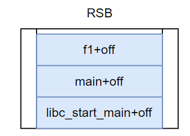
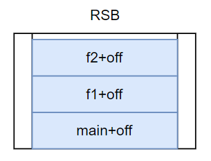
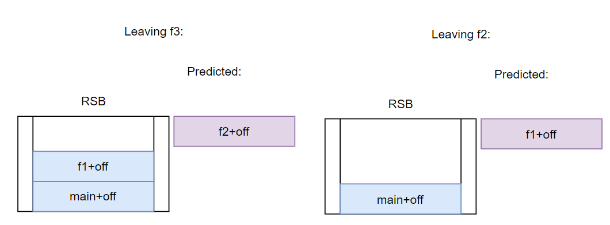
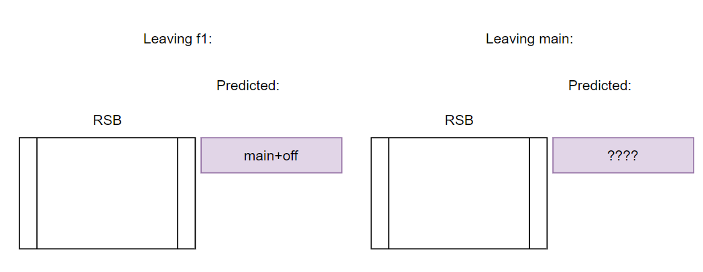
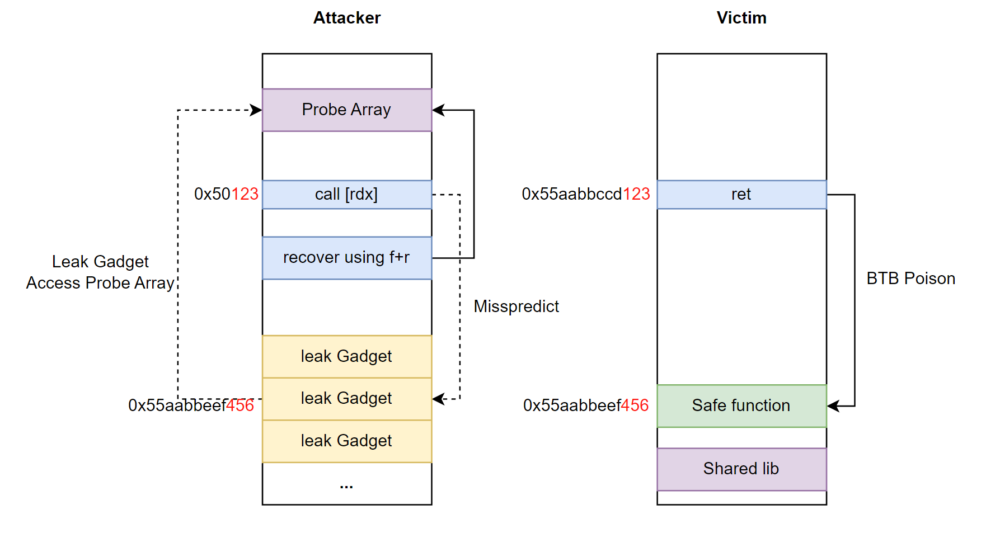

# RET2ASLR - Leaking ASLR from return instructions
### Version 1.0

    Latest version of this paper/code available at
    https://github.com/google/security-research/blob/master/pocs/cpus/ret2aslr/README.md
    This is a working document, please send us feedback if you think we got something wrong or if we missed a citation

<p align="right">José Oliveira (esoj)  <br/>
Rodrigo Branco (BSDaemon)</p>

## Introduction

We observed that return instructions from other processes can leak pointers through the Branch Target Buffer (BTB) in a reversed spectre-BTI like scenario (RET2ASLR), leading to a full Address Space Layout Randomization (ASLR) bypass.  We call it reversed because in the original spectre-BTI, the attacker needs a gadget in the victim and the goal is to leak victim data.  In the RET2ASLR, the BTB entries are the target.  Additionally, mitigation guidance for spectre-BTI [^8][^9][^10] suggests the usage of BTB flushing in the flow between the attacker and the victim. Meanwhile, to mitigate RET2ASLR, such flushes would have to happen in the flow between the victim and the attacker (which would also mitigate the Reverse BTI attacks [^18]), which demonstrates the different threat model of the two attacks.

Moreover, the current mitigation implementation in the Linux Kernel requires, by default, a prctl() call in the victim process to defend against user-to-user spectre-BTI.  The default mitigation (as well as the optional mitigation scenario with seccomp) would in theory still be vulnerable to our attack, but interestingly, the kernel implementation of the mitigation differs from the code comments (that suggest it has to protect only the attacker->victim flow) and it *DOES* flush the BTB in both directions, as we explain in the MITIGATIONS section below.  Linux also provides another, non-default, mitigation option that performs the flush in every context switch and which also mitigates our proposed attack. Right now, systems that implement spectre-BTI mitigations (and enable them for userspace processes), do not seem to be vulnerable. However, the official mitigation guidance from all three vendors we checked does not cover the RET2ASLR attack scenario. We are disclosing our findings and the behavior to help the community test other cases (and to help vendors that followed the official Spectre-BTI mitigation guideline).


### Return Stack Buffer (RSB)
The return stack buffer is a mechanism used to predict the destination addresses of return instructions. It is a hardware-implementation of a stack to store the return addresses after a ‘call’ instruction. After each ‘call’ instruction, the address of the next instruction after the call is pushed to the RSB.  At return, the destination address is popped from the RSB [^1].

Considering the following code, with an RSB of size 3:

```.c
void f3(){}

void f2(){
   f3()
}

void f1(){
   f2()
}

void main(){
  f1();
}
```
If the program counter is at f2 the RSB looks like this, with all slots filled in the RSB:




When entering f3, the f2+off is pushed into RSB:




Each consecutive return then removes one element from RSB (the entry may get removed from the RSB, or a pointer may be updated instead, or any other potential implementation would be microarchitecture dependent and not relevant for this discussion, as different implementations exist [^22]): 



However since the RSB size in this example is only 3, when returning from main, the RSB underflows and the Branch Predictor Unit (BPU) cannot accurately predict the destination using only the RSB.


### RETBLEED
RETBLEED [^2] popularized that in some CPUs, when an underflow in the RSB happens, the BPU relies on the indirect branch predictor to determine the target address of a return instruction. This allows exploiting return instructions when an underflow occurs just like spectre-BTI [^5].  The Branch Target Buffer (BTB) can be poisoned by an unprivileged attacker which leads to a return instruction to speculatively redirect the control flow to an attacker controlled address, thus potentially bypassing mitigations like retpoline (because retpoline replaces indirect branches with a sequence that includes return instructions).

The results of RETBLEED showed that for the BTB to work as a fallback mechanism to RSB, the destination of a return instruction must be written in the BTB at some moment, probably after every return. This is important for the following class of attacks targeting ASLR (or that has similar characteristics of the attack approach, even if with different objectives).


### Reverse Spectre attacks
Previous research [^3] [^4] showed that it is possible to break ASLR from indirect branches using the BTB. In the reverse spectre attacks scenario, the attacker forces a BTB collision with the victim and lets the victim exploit the attacker like in a classic BTI attack. This means that the attacker will mispredict the destination of an indirect branch to a victim-controlled address, usually randomized by ASLR.

If the attacker can discover the address of the misprediction then they can break ASLR. This is done by placing a "leak gadget" in all possible locations that the attacker can mispredict to. The leak gadget uses a local variable (probeArray) to inform if it was executed or not through a measurement similar to a flush+reload.

Since we have learned from RETBLEED that, for every return instruction, the destination of it has to, somehow be loaded in the BTB the same way as for an indirect branch, it's possible to adapt the attack to the following layout:



- The victim executes a ret, that writes its randomized return pointer (0x55aabbeef456) into BTB
- The attacker places an indirect branch in a 12 LSB aligned address with a context that also matches the Branch History Buffer (BHB) value of the victim. Since the 12LSBs are not randomized and the BHB only uses 20 LSBs this part is trivial
- The attacker fills some possible locations of the memory with a "leak gadget" that tells the attacker "I'm executing at this address!" using the probeArray as measurement
- When the attacker executes the indirect branch, it mispredicts to one of the many leak gadgets in memory
- The attacker uses flush+reload to check if ProbeArray was speculatively accessed or not. If the ProbeArray is cached, then a leak gadget was located at the destination of the victim return instruction. 

This hopefully increases the amount of exploitable software when compared to the previous reverse branch target buffer poisoning attack, since we suspect that indirect branches are less prevalent than returns. RET2ASLR doesn’t require an RSB underflow because the ret destination is stored both in the RSB and BTB, meaning that the destination of a return can be used to predict an indirect branch.

There is no need to search for spectre gadgets in the victim context either, since the spectre gadget (leak gadget) is placed in the attacker context (different threat model than spectre-BTI).

The requirements for this attack are:
- Finding a BTB collision with the victim, which can be done by executing the correct branch history of the victim process before the return or by brute forcing the BHB as demonstrated by Spectre-BHI[^6]
- Being able to map the virtual address range of the victim in the attacker process
- The attacker needs to run co-located with the victim on the same CPU core
- The attacker can trigger the victim code path with the targeted return multiple times.

**Therefore, in CPUs that fallback to the BTB for speculating the return instructions destination, all return instructions leak their target through the BTB.**


### leak gadget
In this proof of concept the leak gadget is a simple load probeArray pointed by `r13`

```.nasm
mov r13,[r13]      ;load probearray
```

### Target victim code (full code shared in the repo)
This allows the exploitation of super simple code. 
Here the for loop ensures a static BHB value when executing the return. If this wasn't possible the BHB value should be bruteforced, increasing the time taken to perform the attack.

```.c
#include <stdio.h>

void f1(){
    for(register int i=0;i<200;i++){}
}

int main(){
    printf("Dst: %p\n",f1);
    while (1)
    {
        f1();
    }

}

```

To ensure the BHB state is the same in both contexts, the attacker copies the bytes corresponding to the victim for loop in the form of a shellcode, but replaces the return with an indirect call. The shellcode is copied to all possible 256 positions that can match the 20 LSB alignment required for the BHB state to be the same.

```.asm
gef➤  disas /r f1
Dump of assembler code for function f1:
   0x000055fe04bcc149 <+0>:     f3 0f 1e fa     endbr64   
   0x000055fe04bcc14d <+4>:     55      push   rbp   
   0x000055fe04bcc14e <+5>:     48 89 e5        mov    rbp,rsp   
   0x000055fe04bcc151 <+8>:     53      push   rbx   
   0x000055fe04bcc152 <+9>:     bb 00 00 00 00  mov    ebx,0x0   
   0x000055fe04bcc157 <+14>:    eb 03   jmp    0x55fe04bac15c <f1+19>   
   0x000055fe04bcc159 <+16>:    83 c3 01        add    ebx,0x1   
   0x000055fe04bcc15c <+19>:    81 fb c7 00 00 00       cmp    ebx,0xc7   
   0x000055fe04bcc162 <+25>:    7e f5   jle    0x55fe04bac159 <f1+16>   
   0x000055fe04bcc164 <+27>:    90      nop   
   0x000055fe04bcc165 <+28>:    90      nop   
   0x000055fe04bcc166 <+29>:    5b      pop    rbx   
   0x000055fe04bcc167 <+30>:    5d      pop    rbp 
   0x000055fe04bcc168 <+31>:    c3      ret

gef➤  disas /r main
Dump of assembler code for function main:
=> 0x000055fe04bcc169 <+0>:     f3 0f 1e fa     endbr64
   0x000055fe04bcc16d <+4>:     55      push   rbp   
   0x000055fe04bcc16e <+5>:     48 89 e5        mov    rbp,rsp   
   0x000055fe04bcc171 <+8>:     48 8d 35 d1 ff ff ff    lea    rsi,[rip+0xffffffffffffffd1]        # 0x55fe04bac149 <f1>   
   0x000055fe04bcc178 <+15>:    48 8d 3d 85 0e 00 00    lea    rdi,[rip+0xe85]        # 0x55fe04bad004   
   0x000055fe04bcc17f <+22>:    b8 00 00 00 00  mov    eax,0x0   
   0x000055fe04bcc184 <+27>:    e8 c7 fe ff ff  call   0x55fe04bac050 <printf@plt>   
   0x000055fe04bcc189 <+32>:    b8 00 00 00 00  mov    eax,0x0   
   0x000055fe04bcc18e <+37>:    e8 b6 ff ff ff  call   0x55fe04bac149 <f1>
   0x000055fe04bcc193 <+42>:    eb f4   jmp    0x55fe04bac189 <main+32>

```

The following shellcode should be placed:

```.c
//offset of the instruction target of the return on victim code
#define DSTOFFSET 0x193ULL
//start of the gadget on victim code
#define SRCOFFSET 0x152ULL

/*
In memory, the shellcode below produces the following instructions in the attacker address that replays the victim's branch sequence, leading to a BTB collision:

.asm
   0x7ffff7cc7152:      mov    ebx,0x0
   0x7ffff7cc7157:      jmp    0x7ffff7cc715c
   0x7ffff7cc7159:      add    ebx,0x1
   0x7ffff7cc715c:      cmp    ebx,0xc7
   0x7ffff7cc7162:      jle    0x7ffff7cc7159
   0x7ffff7cc7164:      nop
   0x7ffff7cc7165:      nop
   0x7ffff7cc7166:      nop
   0x7ffff7cc7167:      nop
   0x7ffff7cc7168:      jmp    QWORD PTR [rdi]
*/

uint8_t g1[]="\xbb\x00\x00\x00\x00\xeb\x03\x83\xc3\x01\x81\xfb\xc7\x00\x00\x00\x7e\xf5\x90\x90\x90\x90\xff\x27"; //goes to 0x152
[...]

uint8_t *rwx1 = requestMem(NULL,0x100000);
uint8_t *rwx2 = requestMem(NULL,0x1000*simPages);

//set up source mimic gadget into all possible 20-lsb aligned positions
for(unsigned i=0;i<0x100;i++){
    memcpy(rwx1+i*0x1000UL+SRCOFFSET,g1,sizeof(g1));
}


//real indirect branch destination does nothing
rdiPtr = (uint8_t *)f1;

//but mispredicted destination jumps to leakGadget
for(uint64_t i=0;i<simPages;i++){
    copyLeakGadget(rwx2 +i*0x1000UL + DSTOFFSET);
}  
```


### Results
This technique was tested on an i5-7500 CPU (no SMT available) and it was possible to recover the randomized address in under a minute. Other optimizations can be implemented depending on the architecture. We have reasons to believe that AMD and ARM may present similar behaviors.


### Mitigations
Intel's guidance [^8] to mitigate speculative side-channels does include the usage of a new instruction, IBPB, to flush the predictors.  But according to the guidance: 
	"Software may choose to clear IA32_SPEC_CTRL.IBRS in certain situations (for example, for execution with CPL = 3 in VMX root operation). In such cases, software can use an IBPB command on certain transitions (such as after running an untrusted virtual machine) to prevent software that executed earlier from controlling the predicted targets of indirect branches executed subsequently with IBRS disabled."

AMD's guidance [^9] to mitigate speculative side-channels also includes the usage of the same new instruction, IBPB.  AMD's definition of the instruction is:
	"IBPB – Places a barrier such that indirect branch predictions from earlier execution cannot influence
execution after the barrier."

ARM's guidance [^10][^14] to mitigate speculative side-channels includes similar instructions that flush the predictors (SW sequences or BIALL instruction or ICIALLU instruction depending on the microarchitecture) - more details on the Linux kernel changes for ARM systems are available in [^13].   Their guidance [^14] also shares the same understanding of AMD/Intel about the attack:
	"Where an ability to invalidate the branch predictor exists, it should be used on a context switch.  It should also be used on an exception entry from an exception level where it is judged that code might be used to attack a higher level"


It is clear that the threat model suggested by the CPU vendors (ARM, AMD and Intel) regarding the use of the predictor flushing implies that the attacker's intention is to run before the victim (BTI). In that scenario,the attacker's intention is to control the victim branches. RET2ASLR uses the inverse flow as suggested by [^4], in which the victim execution leaks the victim’s branches through the BTB, subsequently allowing an attacker to bypass victim ASLR.

Indeed, the current BTI mitigation implementation in the Linux Kernel requires, by default, the usage of `prctl` syscall (`PR_SET_SPECULATION_CTRL` option set [^7]) in the victim process to defend against spectre-BTI from other applications.  This mitigation (as well as the optional mitigation scenario with seccomp) would in theory still be vulnerable to our proposed attack, but the implemented logic differs from the comments in the code (that suggest it has to protect only the attacker->victim flow) and it *DOES* flushing in both directions.  Linux also provides another, non-default, mitigation option that performs the flush in every context switch and which mitigates our proposed attack.  FreeBSD has a similar flush always mitigation in place[^12].

As discussed, mitigations for the usual spectre-BTI could work in this new proposed scenario if they flush in both directions (attacker<->victim) but we do not believe retpoline does. In some systems, Intel offered a patch to eliminate the behavior of rets speculating in the BTB (RRSBA_DIS_S and RRSBA_DIS_U), which indicates that Intel was aware of RETBLEED  before (returns speculating from the BTB on deep callstacks) and that this was maybe added to help retpoline to be effective. However, given that for this attack, we do not use the ret speculating through the BTB (we just need the entries created anywhere), it does not help against RET2ASLR.

Since Microsoft does not seem to consider ASLR a security mechanism against local attackers for Windows, we don't expect the attack to be relevant on Windows systems. Same for OSX.


#### SMM and VMM Mitigations
From what we could observe, Intel issues an IBPB (via ucode patch) at SMM entry, but not at SMM return, therefore if any randomization is applied inside SMM as a protection mechanism, this research could potentially be used to bypass it. Intel also seems to issue an IBPB only at the SGX entry, thus this work could potentially be used to disclose memory locations of SGX enclaves (if any is implementing dynamic code loading and randomization as a security mechanism).  It is unclear if XuCode [^21], used to implement SGX in Intel platforms, does perform flushes from flows coming from inside an enclave directed to XuCode itself. AMD does not seem to issue IBPB via ucode patches at SMM entry or exit at all (so we do not know how Spectre v2 is mitigated against SMM code) so in theory (but not confirmed via experiments), one could leak registers from the saved state area, and bypass the OS ASLR, KASLR and potentially even leak actual application secrets depending on what is running and the SMI# targeted. Apparently (but not confirmed via experiments), ARM does issue predictor flushes at higher trust levels entry, but does not at exit. Again, if randomization is used in such levels, RET2ASLR could potentially bypass it.

All hypervisors that mitigate guest to guest BTI do so without the possibility of allow-listing potentially “trusted” virtual machines. This means they flush both directions and are not affected by RET2ASLR.  Hypervisors that do not issue flushes (and that do not use STIBP when sharing threads of the same core between VMs) could be vulnerable.


#### A note on testing BTB flushes in Hardware/Microcode
Some flows implicitly perform a BTB flush (not requiring the use of instructions to do so).  As discussed in this write-up, examples of such flows are in the handling of an SMI# (SMM entry), in an SGX enclave entry (and the privileged code that implements it, named XuCode) and in the privilege change for Trust Zone.  There are a few possible ways to test if the flush happens, and in the case it does, in which direction (or if in both directions).  The list is not exhaustive but we share a few possibilities:
  * Implementing the actual attacks is an obvious way (and can be performed by injecting a target by either recompiling and flashing a new BIOS or through the JTAG to make some of the analysis easier)
  * Analyzing the actual ucode flows (i.e., by leveraging the recent work on ucode reverse engineering [^20])
  * Or, the way that we’ve chosen is by analyzing how many cycles it takes to enter/exit the mode (for example, SMM), and comparing the difference between the patched ucode and the unpatched one.  And then verifying how long it takes for the actual flush operation (by calling the instruction and measuring it).  If the time increases by 2x the flush cycles, then the flush is performed twice (at entry and at exit), if the increase of flush cycles is roughly equal, it indicates the flush is performed at the entry and if there is no observable increase, it indicates that no flush is performed.  Notice that this approach is the easiest to perform, but the less precise (but seems to work in practice).


## Comparison with previous BTB attacks on ASLR
In this section we go over previous work that is somehow related to this write-up.


#### Jump Over ASLR
In Jump Over ASLR: Attacking Branch Predictors to Bypass ASLR[^16], the authors implement a BTB side channel and abuse the time difference it takes to execute when a BTB collision happens, using the generic predictor.

The generic predictor doesn't use the BHB as input for indexing the BTB, it only uses the bits 0-30 and stores the 32 LSBs of the target address, with the full address predicted being a combination of half of the source address of the branch and the 32 bits stored on the BTB for the other half.

The original attack only tries to detect a misprediction for that source address, ignoring the effects of the speculative execution on the target address.


#### mario_baslr
Later research also showed that relying only on the input for the BPU for leaking ASLR may lead to collisions, since multiple source addresses may map into the same BTB entry. The mario_baslr attack against the KVM hypervisor[^17] using this technique, shows that the BTB is not collision safe and the tool is not always able to find a unique base address for the kvm.ko module. This is kind of expected because if the direct predictor receives 31 bits as entry, the BTB would need to have 2^31 entries of 4 bytes of data each, over 8GB on a single CPU component. Later studies as described in Google Project Zero: Reading privileged memory with a side-channel[^5] show that for indexing the BTB 16 bits from the source address are XORed together before being used for deciding the BTB entry. That would imply  2^(31-8) = 8.388.608 different entries or 33MB of BTB size, which is still too big for a CPU component. Probably the BTB for the generic predictor contains a lot fewer entries but also stores a tag of the hash(source_address), allowing it to distinguish different sources with fewer entries.


#### Jann Horn attack against KVM (a.k.a. the original speculative side-channels work)
In reading privileged memory with a side-channel[^5], Jann Horn used multiple techniques to leak the address of vmlinux.

Using speculative execution, a new way of measuring branch collisions was discovered, by placing a "load probeArray" gadget in a mispredicted destination of a branch. This allows for way less noise than timing a branch execution since it relies on flush+reload against probeArray. The problem for this measurement is to discover where to place the gadget since the destination of the mispredicted branch is usually randomized.

Another new technique introduced with speculative execution attacks for leaking ASLR is dumping the BHB using the indirect predictor. The indirect predictor stores a hash of the last N branches taken and in a combination with the 12LSBs from the branch source address, it chooses an entry for the BTB.

If an attacker controls the execution flow exactly after leaving another security domain, for example in a  VM call, it can create 2 memory-aligned programs with a BTB colliding (indirect predictor) call in the end. 

Without the VM call in program 1, both calls must mispredict, but with the VMCALL in program 1 the BTB state is changed and the branches are distinguished. Program 2 tries to replay the behavior of the VMCALL and if a misprediction occurs, it knows the state of the BHB during the VMCALL. Since the inputs for the BHB are the 20LSBs, this technique can be used to leak ASLR, but limited to the 20LSBs. In the Project Zero report, this was used to leak the lower 20 bits of kvm-intel.ko. 

For leaking the full address of kvm.ko, a similar technique as described in Jump Over ASLR was used, but instead of timing a branch, it uses speculative execution to a gadget that loads a test variable.

Since the call exploited is kvm.ko -> kvm-intel.ko the gadget is placed in all possible locations 2^20 multiples of kvm-intel.ko partial address, leaked in the previous step. This step uses the direct predictor, so the leaked data is the 31LSBs of the source used in the indexing of the BTB again, with a possibility of 15 alias addresses due to collision.

In a presentation about this attack[^19] it was also explained that an address-dependent cache-signaling gadget can be used to discover the target of the call to kvm-intel.ko, similar to a reverse BTI attack.


### Reverse BTI attacks - Double BTI attack
In a 2019 paper called "Two methods for exploiting speculative control flow hijacks[^18]". A double BTI attack is used to leak data from the victim context.

The first step of a double BTI attack is a classical spectre BTI attack that poisons a victim's indirect branch. This poisons speculative executes another indirect branch that jumps to a location defined by a register containing a secret. For example `call[rdx] -mispredicts-> call [rax]` with secret in `rax`. This second call poisons the BTB and allows a BTI in the attacker context. The attacker can later retrieve what address was speculatively executed in it's process and leak the secret. This attack was used to leak a byte-size secret from the victim process, so it's assumed that for example 6MSBs of `rax` are known and the secret is the 7th. To discover what address was executed, the attacker must place a cache signalling gadget in all the 256 possible addresses of the `call [rax]` destination with each of them accessing a different cache line (`mov rax, QWORD[array + <idx> * 1024]` for example). Then the cache line accessed during transient execution is recovered using flush+reload and the executed address is discovered, thus leaking the secret in `rax`.

In this attack, ASLR is assumed to be disabled or the victim compiled without PIE support or bypassed using classical memory corruption techniques or using the BTB as described in Jump Over ASLR.

The second phase of this attack contains some of the building blocks for leaking ASLR as done in ExecASLR. It shows that it is possible to discover the destination of an indirect branch of another process by allowing it to poison an attacker branch in a reverse spectre BTI scenario. 

## Discussion

### Why use the direct branch predictor? 
The entropy of the direct branch predictor is very high. Since it uses 31 LSBs as input, if a collision is detected during speculative execution of the matching destination, in the worst case there are only 2^8 aliased addresses (because of the XORed bits of the input).

This technique also allows the attacker to place "leaking gadgets" in an aliased position in the same virtual address. For example, if a kernel address jumps from 0xfffffffffaabb123 to 0xfffffffffccdd456 the attacker can replay the scenario by making a call from 0x0faabb123 to 0xfccdd456, mapped memory obtainable through mmap syscall. 

However, this type of attack targeting the direct predictor only works fully against targets that don't randomize the bits 32-64.

### Why use the indirect branch predictor? 
It's relatively easy to obtain BTB collisions. The BHB only takes 20LSBs as input but predicts 64 bits destinations.

If an attacker knows the last N branches taken before an indirect branch or return instruction, for example in a for loop + ret scenario, it can guess the values for the randomized 11-19 bits. That means that the complexity of finding a collision in such a scenario is 256.


### ExecASLR and RET2ASLR?
In the previous techniques, the target data are the source addresses for a BTB collision, both in the BHB dumping attack and in the generic predictor collision detection.

In RET2ASLR and ExecASLR the indirect predictor is exploited to easily obtain a collision and try to leak the BTB entry. This allows for leaking up to the 64 bits stored in the BTB if that address can be mapped into the attacker's virtual address.

ExecASLR and RET2ASLR also are unable to target the kernel as-is, since the destination of a mispredicted branch can't be mapped, but they target generic user space applications that contain more robust randomization compared to the kernel or KVM.


## Acknowledgements
We would like to thank Alexandra Sandulescu and Eduardo Vela for the excellent feedback, discussions and for reviewing/editing this write-up.


## Timeline
* February 27 2022 - Initial report of "Reverse Branch Target Buffer Poisoning" attacks to Intel, working on 3rd generation
* April 7 2022 - Answer from Intel stating that "Mitigations Intel provides for Spectre V2 apply in this case and no further work from Intel is needed"
* September 2 2022 - "Reverse Branch Target Buffer Poisoning" published  https://cos.ufrj.br/index.php/pt-BR/publicacoes-pesquisa/details/15/3061
* October 25 2022 - Other tests show that exploit works on newer Intel CPUs 
* October 26 2022 - Second report opened to Intel informing that exploit works newer CPUs
* November 03 2022 - Initial research presented at Ekoparty security conference [^15]
* November 07 2022 - Second Answer from Intel stating mitigations works/informative
* November 16 2022 - Ekoparty writeup published [^3]
* November 18 2022 - Variant of "Reverse Branch Target Buffer Poisoning" implemented using return instructions, better understanding of the implications of the attack
* November 20 2022 - OS mitigations checked, other attack targets tested
* November 30 2022 - First public version of this write-up is made available


### References:
[^1]: “Spectre Returns! Speculation Attacks using the Return Stack Buffer". Link: [https://www.usenix.org/system/files/conference/woot18/woot18-paper-koruyeh.pdf](https://www.usenix.org/system/files/conference/woot18/woot18-paper-koruyeh.pdf)
[^2]: “RETBLEED: Arbitrary Speculative Code Execution with Return Instructions”.  Link: [https://comsec.ethz.ch/research/microarch/retbleed/](https://comsec.ethz.ch/research/microarch/retbleed/) 
[^3]: “Exec ASLR: Abusing Intel Branch Predictors to bypass ASLR”. Link: [https://github.com/es0j/ExecASLR-ekoparty](https://github.com/es0j/ExecASLR-ekoparty)
[^4]: “Reverse Branch Target Buffer Poisoning”.  Link: [https://cos.ufrj.br/uploadfile/publicacao/3061.pdf](https://cos.ufrj.br/uploadfile/publicacao/3061.pdf) 
[^5]: “Google Project Zero: Reading privileged memory with a side-channel”.  Link: [https://googleprojectzero.blogspot.com/2018/01/reading-privileged-memory-with-side.html](https://googleprojectzero.blogspot.com/2018/01/reading-privileged-memory-with-side.html) 
[^6]: “Branch History Injection: On the Effectiveness of Hardware Mitigations Against Cross-Privilege Spectre-v2 Attacks”.  Link: [http://download.vusec.net/papers/bhi-spectre-bhb_sec22.pdf](http://download.vusec.net/papers/bhi-spectre-bhb_sec22.pdf) 
[^7]: “The Linux kernel user-space API guide: Speculation Control”.  Link: [https://www.kernel.org/doc/html/latest/userspace-api/spec_ctrl.html](https://www.kernel.org/doc/html/latest/userspace-api/spec_ctrl.html)
[^8]: "Speculative Execution Side Channel Mitigations". Link: [https://www.intel.com/content/www/us/en/developer/articles/technical/software-security-guidance/technical-documentation/speculative-execution-side-channel-mitigations.html#IBPB](https://www.intel.com/content/www/us/en/developer/articles/technical/software-security-guidance/technical-documentation/speculative-execution-side-channel-mitigations.html#IBPB)
[^9]: "Software Techniques for Managing Speculation on AMD Processors".  Link: [https://www.amd.com/system/files/documents/software-techniques-for-managing-speculation.pdf](https://www.amd.com/system/files/documents/software-techniques-for-managing-speculation.pdf)
[^10]: "Speculative Processor Vulnerability". Link: [https://developer.arm.com/Arm%20Security%20Center/Speculative%20Processor%20Vulnerability](https://developer.arm.com/Arm%20Security%20Center/Speculative%20Processor%20Vulnerability)
[^11]: Linux Kernel Source Code.  Link: [https://elixir.bootlin.com/linux/v5.17.9/source/arch/x86/mm/tlb.c](https://reviews.freebsd.org/rS327876)
[^12]: FreeBSD Kernel Source Code.  Link: [https://reviews.freebsd.org/rS327876](https://reviews.freebsd.org/rS327876)
[^13]: "Cache Speculation Side-channels Linux kernel mitigations".  Link: [https://developer.arm.com/support/arm-security-updates/speculative-processor-vulnerability/downloads/cache-speculation-side-channels-linux-kernel-mitigations](https://developer.arm.com/support/arm-security-updates/speculative-processor-vulnerability/downloads/cache-speculation-side-channels-linux-kernel-mitigations)
[^14]: "Cache Speculation Side-channels v2.5". Link: [https://developer.arm.com/documentation/102816/latest/](https://developer.arm.com/documentation/102816/latest/)
[^15]: "Exec ASLR: Abusing intel branch predictors to bypass ASLR". Link: [https://www.youtube.com/watch?v=Qj4z-KvnkxU](https://www.youtube.com/watch?v=Qj4z-KvnkxU)
[^16]: "Jump Over ASLR: Attacking Branch Predictors to Bypass ASLR". Link: [https://www.cs.ucr.edu/~nael/pubs/micro16.pdf](https://www.cs.ucr.edu/~nael/pubs/micro16.pdf)
[^17]: "mario_baslr -  Proof-of-Concept tool for leaking the base address of the KVM hypervisor kernel module (kvm.ko) from a guest VM" [https://github.com/felixwilhelm/mario_baslr](https://github.com/felixwilhelm/mario_baslr)
[^18]: “Two methods for exploiting speculative control flow”. Link: hijacks[https://www.usenix.org/system/files/woot19-paper_mambretti.pdf](https://www.usenix.org/system/files/woot19-paper_mambretti.pdf)
[^19]: “Exploiting Branch Target Injection, page 37”. Link: 
[https://downloads.immunityinc.com/infiltrate2018-slidepacks/jann-horn-exploiting-branch-target-prediction/branch%20injection%20infiltrate%20slides.pdf]
(https://downloads.immunityinc.com/infiltrate2018-slidepacks/jann-horn-exploiting-branch-target-prediction/branch%20injection%20infiltrate%20slides.pdf)
[^20] “Chip Red Pill: How we achieved to execute arbitrary [micro]code inside Intel Atom CPUs”.  Link:
[https://2021.zeronights.ru/en/reports-en/chip-red-pill-how-we-achieved-to-execute-arbitrary-microcode-inside-intel-atom-cpus/](https://2021.zeronights.ru/en/reports-en/chip-red-pill-how-we-achieved-to-execute-arbitrary-microcode-inside-intel-atom-cpus/)
[^21] “XuCode: An Innovative Technology for Implementing Complex Instruction Flows”. Link: [https://www.intel.com/content/www/us/en/developer/articles/technical/software-security-guidance/secure-coding/xucode-implementing-complex-instruction-flows.html](https://www.intel.com/content/www/us/en/developer/articles/technical/software-security-guidance/secure-coding/xucode-implementing-complex-instruction-flows.html)
[^22] “A Recursive Counter for Linked List RSB”. Link: [https://github.com/rrbranco/Papers/blob/master/2019-A_Recursive_Counter_for_Linked_List_RSB.pdf](https://github.com/rrbranco/Papers/blob/master/2019-A_Recursive_Counter_for_Linked_List_RSB.pdf)
