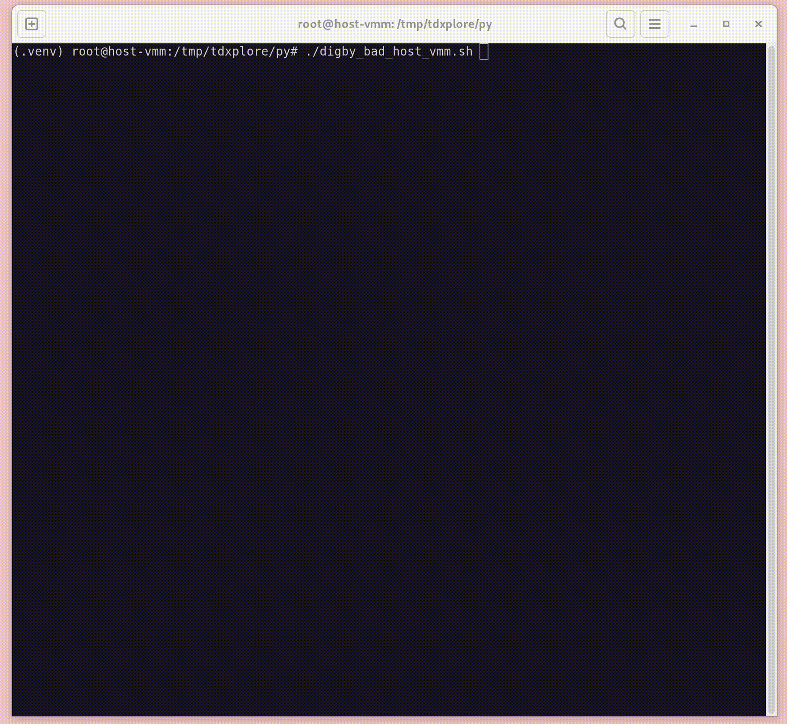

# Proof of Concept Exploits for Intel TDX 1.5

This directory contains a set of proof-of-concept exploits for Intel TDX 1.5.
Please see [Security Assessment of Intel TDX with Support for Live Migration](asdf) for additional details.

## digby (CVE-2025-30513)
**Vulnerability 1: Migratable TD can Become Debuggable During Migration**

A *compromised destination* Virtual Machine Monitor (VMM) participates in the migration of a Trust Domain (TD). The TD was correctly configured by an *uncompromised source* VMM, has completed the attestation process, and was provided with confidential user data. The TD is migratable and a trusted migration TD has been bound to it; however, the TD is *not* debuggable.

In this situation a destination VMM can exploit a Time-of-Check to Time-of-Use vulnerability to change the TD’s `attributes` from `migratable` to `debug` as the TD’s immutable state is being imported.

Note: `tdh_XXX` APIs are located in the trusted TDX module authored by Intel and callable from the untrusted VMM.

`digby.py` loads migration bundles into the TDX Module, using `tdh_import_state_immutable`, while flooding the Logical Processor (LP) performing the import activity with interrupts. When the TDX module returns with `TDX_INTERRUPTED_RESUMABLE`, `tdh_mng_init` is called to initialize the `attributes` with the `debug` flag set.

Once complete, other scripts in the tdxplore toolkit can be used to continue the import activities while also being able to completely decrypt TD state.

<table>
  <tr style="text-align: center;">
    <td></td>
    <td></td>
  </tr>
</table>

`digby_good_host_vmm.sh`, `digby_good_mig_td.sh`, and `digby_bad_host_vmm.sh` were used to create the proof-of-concept GIFs.

## mellver (CVE-2025-32007)
**Vulnerability 2: Metadata Sequence Parsing Leads to an Integer Underflow**

A compromised host VMM creates a template TD to import migration bundles into. A malicious migration TD is created and bound to the template TD. The Migration Session Key (MSK) is provided by the migration TD to the host VMM so it can construct and encrypt migration bundles for import.

In this situation, the host VMM can exploit an integer underflow condition that occurs during import, allowing up to 8KB of Out-Of-Bounds (OOB) data to be read from the current LP’s stack in the Intel TDX Module.

`mellvar.py` constructs a metadata bundle that sets `list_buff_size` to `1` and `num_sequences` to one more than the number of sequences in the metadata bundle. When the TDX Module calls `md_write_list`, the local variable `uint16_t remaining_buff_size` is initialized to `list_buff_size - sizeof(md_list_header_t)` causing an integer underflow to occur. The metadata bundle is crafted such that the `XBUFF` metadata field is the last valid sequence before going out-of-bounds with the `last_field_in_sequence` being used to control the offset of the out-of-bounds data access.

The metadata bundle can be loaded into the TDX Module using `tdh_import_state_vp.py` from the tdxplore toolkit. The leaked data will be returned in extended error information 1.

  

`melllvar_bad_host_vmm.sh` and `digby_bad_mig_td.sh` were used to create the proof-of-concept GIF.
`melllvar_bad.sh` and `digby_bad.sh` were used to create the proof-of-concept GIFs above.

## eddie (No CVE Assigned)
**Bug 2: Required Metadata Entries are Skippable**

A host VMM creates a template TD to import migration bundles into. The host VMM is given the MSK, crafts a metadata bundle, and encryptes it for import.

Metadata bundles are comprised of a `md_list_header_t` and an array of `md_sequence_t` structures. Each sequence can specify, via the `write_mask_valid` flag in the `sequence_header`, whether `element[0]` holds a `wr_mask`. If the `wr_mask` is `0` the entries in the sequence are skipped when `skip_non_writable` is set to `true` when `md_write_sequence` is called (which is the case for import activities). This effectively allows *any* required entry to be skipped.

`eddie.py` sets `write_mask_valid` to `1` and `element[0]` to `0` for the EPTP in a metadata bundle and proceed to perform the import activity. In this situation the `tdcs_ptr->execution_ctl_fields.eptp` is never initialized and results in a SEAM shutdown as the TDX Module will dereference an invalid address in `secure_ept_walk`.

**Credits: Kirk Swidowski, Daniel Moghimi, Josh Eads, and Erdem Aktas.**
