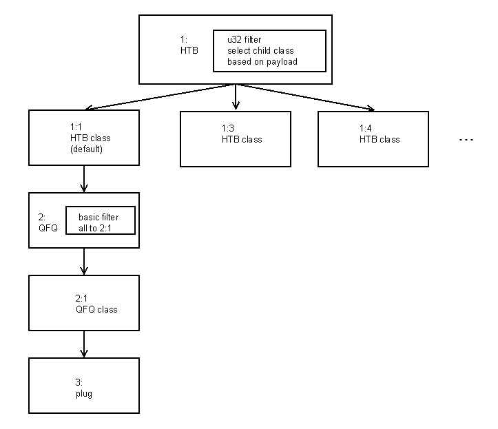

## Setup

Qdiscs were created on lo interface as shown in the diagram below:


All packets were queued to the QFQ qdisc 2: and from there to 3: plug qdisc, unless there was a value in the packet payload selecting a different HTB class (1:3, 1:4 etc). These classes had defaults qdiscs attached to them.

This setup allows us to direct a packet to either a vulnerability triggering QFQ/plug qdisc or a "normal" class that won't trigger any side effects.

## Triggering use-after-free

Sending a packet leads to the allocation of 2 heap objects:
- struct sk_buff with packet's metadata, allocated from a dedicated cache
- data object allocated from a general cache

Freeing an skb also means freeing its associated data object.

We trigger the vulnerability by sending an unknown protocol raw packet through the lo interface.
This skb is queued to the plug qdisc and held there (qdisc is in a "plugged" state), but QFQ returns this skb anyway in the dequeue operation and the skb is freed by network code (reason: unhandled protocol), while still being referenced in the plug qdisc's state.

From this point on, sending new packets through QFQ will lead to dequeue (and later free) of the same initial skb - new skbs will be queued in the plug qdisc, but will never be returned.

Stability note: this step often fails on 6.1 because the freelist pointer in skb cache is at offset 0x70 - which contains important 'len' and 'datalen' fields of struct sk_buff. 
When skb is freed, those fields are overwritten with an essentially random value (free list pointer is obfuscated due to CONFIG_SLAB_FREELIST_HARDENED).

## Getting RIP control

First step is to allocate a user key payload object in place of the previously freed skb data.
User key payload is useful because it will allow us to leak data to bypass kASLR.

Next, we want to free our key payload through our vulnerability. 
To do that, we have to send a packet, but there is a problem - this needs a new skb and heap allocator will return our target skb and overwrite skb->data (which currently points to our key payload) pointer with a newly allocated data object.

To solve this, we switch to a second cpu - skb will be now allocated from a different cache, but dequeue will still return our target skb and key payload will be free (on the second CPU).

Next step is to allocate a "struct Qdisc" in place of the key payload. struct Qdics has function pointers that will give us a leak and later RIP control. They will be attached to HTB classes 1:3, 1:4, 1:5, etc.

We use DRR qdisc because its size fits in the kmalloc-512 (same as the skb data object and key payload object).
One thing to keep in mind is that because free was made on a different CPU we won't get our object back through fastpath freelist on the first allocation - we have to make multiple allocations to reach it.

Another issue is that creating a Qdisc is done through netlink, which means creating a new skb for each operation, which would corrupt our target SKB. 
To work around that we first free a number of previously allocated netlinks skbs to fill the free list and protect target skb.

Now we have allocated a struct Qdisc:
```
struct Qdisc {
        int                        (*enqueue)(struct sk_buff *, struct Qdisc *, struct sk_buff * *); /*     0   0x8 */
        struct sk_buff *           (*dequeue)(struct Qdisc *); /*   0x8   0x8 */
        unsigned int               flags;                /*  0x10   0x4 */
        u32                        limit;                /*  0x14   0x4 */
        const struct Qdisc_ops  *  ops;                  /*  0x18   0x8 */
        struct qdisc_size_table *  stab;                 /*  0x20   0x8 */
...
```

in place of:
```
struct user_key_payload {
        struct callback_head       rcu __attribute__((__aligned__(8))); /*     0  0x10 */
        short unsigned int         datalen;              /*  0x10   0x2 */

        /* XXX 6 bytes hole, try to pack */

        char                       data[] __attribute__((__aligned__(8))); /*  0x18     0 */
};
```

Fortunately, flags field that overwrites datalen has a value of 0x10, giving us 16 byte leak from offset 0x18 in struct Qdisc.
We use it to read ops pointer giving us kASLR bypass.

Next step is to free memory belong to struct Qdisc by deleting the key.

Now we have to allocate our payload into kmalloc-512, but we need to control the first 8 bytes of the object to use .enqueue pointer for code execution.
We can do this using netlink allocating primitive (sending a netlink packet will allocate an associated data object with our data at the beginning), but this will need to allocate another skb and skb cache on the first CPU is corrupted at this point by multiple free operations.

The solution is to move our victim object from the per-cpu partial list to the per-node partial list (in kernelCTF setup both CPUs are on the same NUMA node).
To do this we just have to create enough partial slabs to go over the per-cpu limit in put_cpu_partial() and trigger unfreeze_partials().

We do this by freeing some of the previously prepared xattrs from kmalloc-512.

Then we can switch to the second CPU and allocate our payload over struct Qdisc.

To trigger code execution we just have to send a packet that will get queued to a HTB class with our DRR qdisc attached. 
We don't know which qdisc is our target so we just send one packet to each class.


## Pivot to ROP

When ->enqueue() is called registers are as follows:
- RDI - pointer to the skb
- RSI - pointer to the qdisc
- RAX - copy of the RSI

RDI is not that useful to us, but RSI and RAX point directly to the data under our control..

Stack pivot has three stages using different gadgets.

#### Gadget 1

```
lea rdi, [rax + 0x20]
mov rax, qword ptr [rax + 0x30]
jmp __x86_indirect_thunk_rax
```

This adds 0x20 to our controlled data pointer, stores it into RDI and jumps to the next gadget. 
Adding 0x20 is very helpful, because we can't use the very beginning of the buffer as the start of the ROP - it contains the address of our first gadget.

#### Gadget 2

```
push rdi
jmp qword [rsi+0x0F]
```

This pushes location of our ROP chain to the stack and jumps to the next gadget.

#### Gadget 3

```
pop rsp
ret
```

Finally, we pop the previously pushed ROP location into RSP, completing the pivot

## Second pivot

At this point we have full ROP, but there is not much space - most of our buffer is taken by skb_shared_info struct at the end.
To have enough space to execute all privilege escalation code we have to pivot again.
This is quite simple - we choose an unused read/write area in the kernel and use copy_user_generic_string() to copy the second stage ROP from userspace to that area.
Then we use `pop rsp ; ret` gadget to pivot there.

## Privilege escalation

To escalate our process's privileges we execute following functions from ROP chain:

- commit_creds(init_cred)
- switch_task_namespaces(find_task_by_vpid(1), init_nsproxy)

Then we set up registers for return to the userspace and jump to the `swapgs ; sysret` gadget in return_via_sysret.

After getting back to userspace we call setns() on namespaces of pid 1 to complete escape to the initial namespace.
