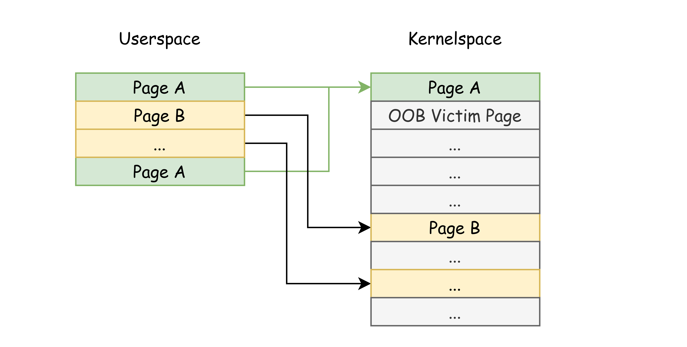
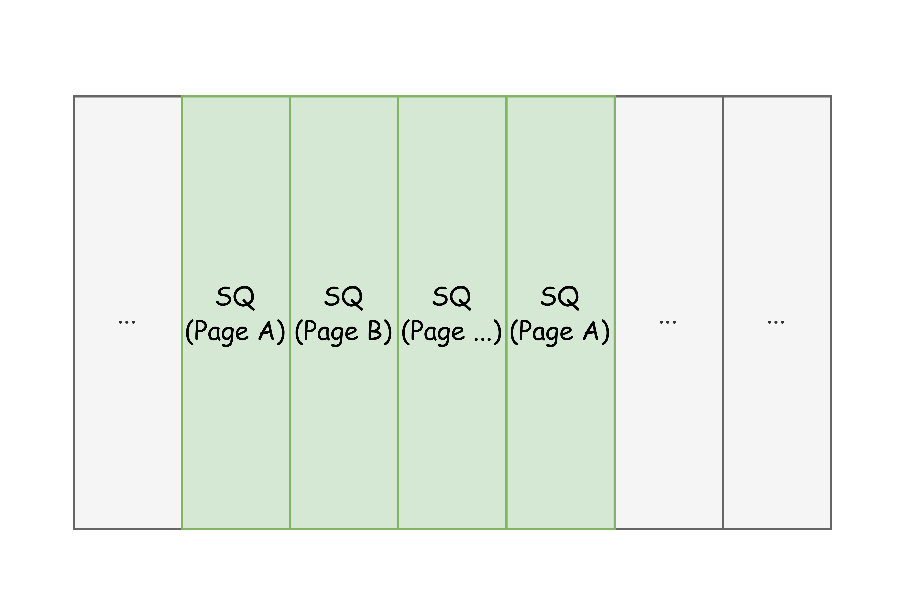
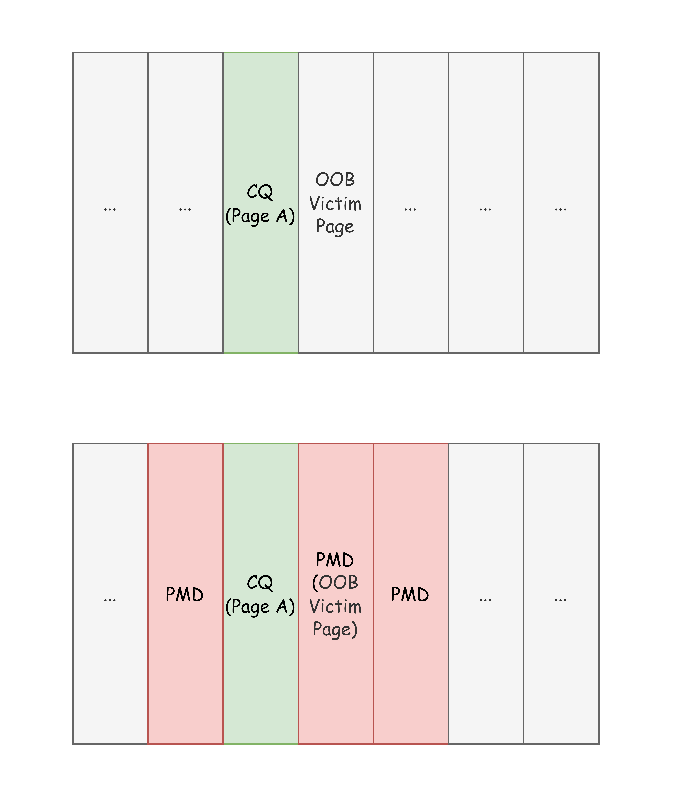
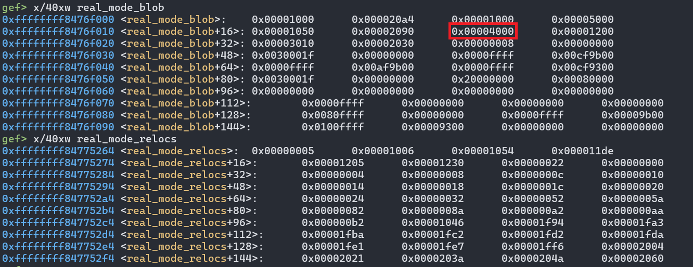
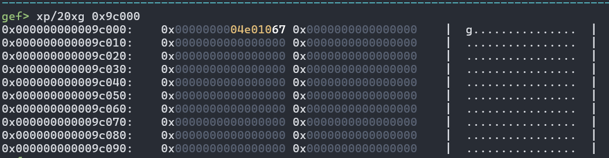
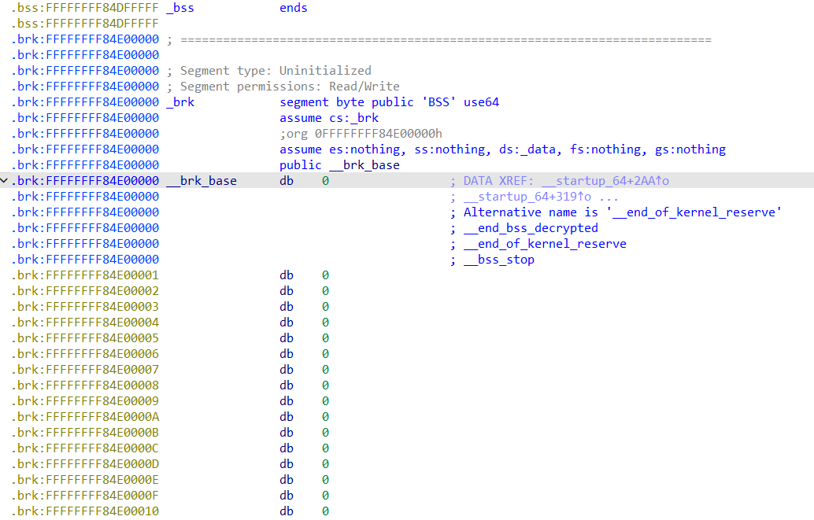

## Trigger the vulnerability

The vulnerability was reported by Jann Horn. The original report and POC can be found at [io_uring: __io_uaddr_map() handles multi-page region dangerously - Project Zero](https://project-zero.issues.chromium.org/issues/42451652). I highly recommend reading the original report before proceeding.

Since [03d89a2de25b](https://git.kernel.org/pub/scm/linux/kernel/git/torvalds/linux.git/commit/?id=03d89a2de25b), the kernel has provided a mechanism to use user-allocated memory for rings and SQEs:

```c
static __cold int io_allocate_scq_urings(struct io_ring_ctx *ctx,
					 struct io_uring_params *p)
{
	/*...*/
	if (!(ctx->flags & IORING_SETUP_NO_MMAP))
		rings = io_mem_alloc(size);
	else
		rings = io_rings_map(ctx, p->cq_off.user_addr, size);

	if (IS_ERR(rings))
		return PTR_ERR(rings);
    
    ctx->rings = rings;
	/*...*/
	if (!(ctx->flags & IORING_SETUP_NO_MMAP))
		ptr = io_mem_alloc(size);
	else
		ptr = io_sqes_map(ctx, p->sq_off.user_addr, size);

	if (IS_ERR(ptr)) {
		io_rings_free(ctx);
		return PTR_ERR(ptr);
	}

	ctx->sq_sqes = ptr;
	return 0;
}

static void *io_rings_map(struct io_ring_ctx *ctx, unsigned long uaddr,
			  size_t size)
{
	return __io_uaddr_map(&ctx->ring_pages, &ctx->n_ring_pages, uaddr,
				size);
}

static void *io_sqes_map(struct io_ring_ctx *ctx, unsigned long uaddr,
			 size_t size)
{
	return __io_uaddr_map(&ctx->sqe_pages, &ctx->n_sqe_pages, uaddr,
				size);
}

static void *__io_uaddr_map(struct page ***pages, unsigned short *npages,
			    unsigned long uaddr, size_t size)
{
	/*...*/
	ret = pin_user_pages_fast(uaddr, nr_pages, FOLL_WRITE | FOLL_LONGTERM,
					page_array);
	if (ret != nr_pages) {
err:
		io_pages_free(&page_array, ret > 0 ? ret : 0);
		return ret < 0 ? ERR_PTR(ret) : ERR_PTR(-EFAULT);
	}
	/*
	 * Should be a single page. If the ring is small enough that we can
	 * use a normal page, that is fine. If we need multiple pages, then
	 * userspace should use a huge page. That's the only way to guarantee
	 * that we get contigious memory, outside of just being lucky or
	 * (currently) having low memory fragmentation.
	 */
	if (page_array[0] != page_array[ret - 1])
		goto err;

	/*...*/

	*pages = page_array;	// <--- ctx->{ring, sqe}_pages = page_array
	*npages = nr_pages;		// <--- ctx->n_{ring, sqe}_pages = nr_pages
	return page_to_virt(page_array[0]);
}
```

However, because the check to ensure all user-provided pages come from a single page is incorrect, the kernel mistakenly treats the memory as contiguous. This can lead to out-of-bounds memory access in situations like the one illustrated below:



## Exploit Details

### Primitive Overview

The primitive we have is page-level out-of-bounds access.

Because we must set the `IORING_SETUP_NO_MMAP` flag to trigger the vulnerability, we cannot directly mmap the pages into userspace to turn this into a straightforward page use-after-free scenario:

```c
static void *io_uring_validate_mmap_request(struct file *file,
					    loff_t pgoff, size_t sz)
{
	struct io_ring_ctx *ctx = file->private_data;
	loff_t offset = pgoff << PAGE_SHIFT;
	struct page *page;
	void *ptr;

	/* Don't allow mmap if the ring was setup without it */
	if (ctx->flags & IORING_SETUP_NO_MMAP)
		return ERR_PTR(-EINVAL);
	/*...*/
	return ptr;
}
```

Next, let's see what happens inside io_uring when using the aforementioned primitive.

When a user calls the `io_uring_enter` syscall to consume an SQE, the kernel fetches that SQE from `ctx->sqes`:

``` c
static bool io_get_sqe(struct io_ring_ctx *ctx, const struct io_uring_sqe **sqe)
{
	unsigned mask = ctx->sq_entries - 1;
	unsigned head = ctx->cached_sq_head++ & mask;
	/*...*/
	*sqe = &ctx->sq_sqes[head];
	return true;
}
```

It then initializes the io_uring request (req) based on the contents of the SQE:

```c
static int io_init_req(struct io_ring_ctx *ctx, struct io_kiocb *req,
		       const struct io_uring_sqe *sqe)
	__must_hold(&ctx->uring_lock)
{
	const struct io_issue_def *def;
	unsigned int sqe_flags;
	int personality;
	u8 opcode;

	/* req is partially pre-initialised, see io_preinit_req() */
	req->opcode = opcode = READ_ONCE(sqe->opcode);
	/* same numerical values with corresponding REQ_F_*, safe to copy */
	req->flags = sqe_flags = READ_ONCE(sqe->flags);
	req->cqe.user_data = READ_ONCE(sqe->user_data);
	req->file = NULL;
	req->rsrc_node = NULL;
	req->task = current;

	if (unlikely(opcode >= IORING_OP_LAST)) {
		req->opcode = 0;
		return -EINVAL;
	}
	def = &io_issue_defs[opcode];
	/*...*/
	return def->prep(req, sqe);
}
```

When an SQE completes, the kernel writes the result to the CQ ring:

```c
static inline bool io_get_cqe_overflow(struct io_ring_ctx *ctx,
					struct io_uring_cqe **ret,
					bool overflow)
{
	io_lockdep_assert_cq_locked(ctx);

	if (unlikely(ctx->cqe_cached >= ctx->cqe_sentinel)) {
		if (unlikely(!io_cqe_cache_refill(ctx, overflow)))
			return false;
	}
	*ret = ctx->cqe_cached;
	ctx->cached_cq_tail++;
	ctx->cqe_cached++;
	if (ctx->flags & IORING_SETUP_CQE32)
		ctx->cqe_cached++;
	return true;
}

static inline bool io_get_cqe(struct io_ring_ctx *ctx, struct io_uring_cqe **ret)
{
	return io_get_cqe_overflow(ctx, ret, false);
}

static __always_inline bool io_fill_cqe_req(struct io_ring_ctx *ctx,
					    struct io_kiocb *req)
{
	struct io_uring_cqe *cqe;

	/*
	 * If we can't get a cq entry, userspace overflowed the
	 * submission (by quite a lot). Increment the overflow count in
	 * the ring.
	 */
	if (unlikely(!io_get_cqe(ctx, &cqe)))
		return false;

	if (trace_io_uring_complete_enabled())
		trace_io_uring_complete(req->ctx, req, req->cqe.user_data,
					req->cqe.res, req->cqe.flags,
					req->big_cqe.extra1, req->big_cqe.extra2);

	memcpy(cqe, &req->cqe, sizeof(*cqe));
	if (ctx->flags & IORING_SETUP_CQE32) {
		memcpy(cqe->big_cqe, &req->big_cqe, sizeof(*cqe));
		memset(&req->big_cqe, 0, sizeof(req->big_cqe));
	}
	return true;
}
```

It is clear that we can submit enough SQEs to carry out out-of-bounds writes. Meanwhile, if the kernel interprets a memory region (e.g., part of a kernel object) as an SQE, it will subsequently copy `sqe->user_data` into `cqe->user_data`, thereby leaking values from the kernel object’s members.

By abusing this out-of-bounds access:

- We can leak KASLR or other kernel addresses through the SQ.

- We can perform out-of-bounds writes using the CQ.

### Preserving SQ Functionality

When the `IORING_SETUP_NO_MMAP` flag is set, we must trigger the vulnerability in both the SQ and CQ simultaneously:

```c
static __cold int io_allocate_scq_urings(struct io_ring_ctx *ctx,
					 struct io_uring_params *p)
{
	/*...*/
	if (!(ctx->flags & IORING_SETUP_NO_MMAP))
		rings = io_mem_alloc(size);
	else
		rings = io_rings_map(ctx, p->cq_off.user_addr, size);

	if (IS_ERR(rings))
		return PTR_ERR(rings);
    
    ctx->rings = rings;
	/*...*/
	if (!(ctx->flags & IORING_SETUP_NO_MMAP))
		ptr = io_mem_alloc(size);
	else
		ptr = io_sqes_map(ctx, p->sq_off.user_addr, size);

	if (IS_ERR(ptr)) {
		io_rings_free(ctx);
		return PTR_ERR(ptr);
	}

	ctx->sq_sqes = ptr;
	return 0;
}
```

Because `io_uring_sqe` is significantly larger than `io_uring_cqe`, we want to ensure more controllable space in the SQ for stable out-of-bounds writes:

```c
➜  pahole -C io_uring_sqe ./vmlinux
struct io_uring_sqe {
        __u8                       opcode;               /*     0     1 */
        __u8                       flags;                /*     1     1 */
        __u16                      ioprio;               /*     2     2 */
        __s32                      fd;                   /*     4     4 */
		/*...*/
        union {
                struct {
                        __u64      addr3;                /*    48     8 */
                        __u64      __pad2[1];            /*    56     8 */
                };                                       /*    48    16 */
                __u8               cmd[0];               /*    48     0 */
        };                                               /*    48    16 */

        /* size: 64, cachelines: 1, members: 13 */
};

➜  pahole -C io_uring_cqe ./vmlinux
struct io_uring_cqe {
        __u64                      user_data;            /*     0     8 */
        __s32                      res;                  /*     8     4 */
        __u32                      flags;                /*    12     4 */
        __u64                      big_cqe[];            /*    16     0 */

        /* size: 16, cachelines: 1, members: 4 */
        /* last cacheline: 16 bytes */
};
```

To create more easily controlled kernel memory, we can use a function like `packet_mmap()` to obtain a continuous virtual address range:

```c
static struct pgv *alloc_pg_vec(struct tpacket_req *req, int order)
{
	unsigned int block_nr = req->tp_block_nr;
	struct pgv *pg_vec;
	int i;

	/*...*/

	for (i = 0; i < block_nr; i++) {
        // 👇 We can control the `order` to get a continuous memory
		pg_vec[i].buffer = alloc_one_pg_vec_page(order);
	/*...*/
	}

out:
	return pg_vec;

	/*...*/
}

static int packet_mmap(struct file *file, struct socket *sock,
		struct vm_area_struct *vma)
{
	/*...*/
		for (i = 0; i < rb->pg_vec_len; i++) {
			struct page *page;
			void *kaddr = rb->pg_vec[i].buffer;
			int pg_num;

			for (pg_num = 0; pg_num < rb->pg_vec_pages; pg_num++) {
				page = pgv_to_page(kaddr);
				err = vm_insert_page(vma, start, page);
				if (unlikely(err))
					goto out;
				start += PAGE_SIZE;
				kaddr += PAGE_SIZE;
			}
		}
	/*...*/
	return err;
}
```

With this approach, we can simplify the exploit and increase reliability. To make the whole exploit even more reliable, ideally, we want an exploit chain where we only do an out-of-bounds write in the CQ, preserving SQ functionality.



### Page Fengshui

The object we choose to corrupt is the page table entry. We use "page fengshui" to shape the pages, with the primary goal of maintaining pages' continuity by splitting lower-order pages from higher-order pages.

We begin by allocating multiple pages and classifying them for two different uses. First, we occupy some discontinuous order-0 pages. Next, for the remaining pages, we free those whose indices satisfy `indices % 4 == 0`, and hopefully reuse one of the freed slots for a `pg_vec` array(We only care about the first `pg_vec` buffer, which later will serve as CQ’s Page A). Finally, we free the pages whose indices satisfy `indices % 4 != 0`, and spray page table entries in their place. This arrangement likely make that CQ’s Page A ends up adjacent to the page table entries we intend to corrupt:



If this is the first time you play with page table entries, I highly recommend reading the below blog post before proceed.

[How a simple Linux kernel memory corruption bug can lead to complete system compromise - Project Zero](https://googleprojectzero.blogspot.com/2021/10/how-simple-linux-kernel-memory.html#:~:text=Attack%20stage%3A%20Reallocating%20the%20victim%20page%20as%20a%20pagetable)

### Leak Through Write

Early in the kernel boot process, a global variable called `real_mode_header` is always allocated at a **fixed physical address** (`0x98000`). This is only affected by how memblock allocations are handled, which causes it to remain at the same address:

```c
// start_kernel() -> setup_arch() -> reserve_real_mode()
/**
 * memblock_phys_alloc_range - allocate a memory block inside specified range
 * @size: size of memory block to be allocated in bytes
 * @align: alignment of the region and block's size
 * @start: the lower bound of the memory region to allocate (physical address)
 * @end: the upper bound of the memory region to allocate (physical address)
 *
 * Allocate @size bytes in the between @start and @end.
 *
 * Return: physical address of the allocated memory block on success,
 * %0 on failure.
 */
phys_addr_t __init memblock_phys_alloc_range(phys_addr_t size,
					     phys_addr_t align,
					     phys_addr_t start,
					     phys_addr_t end)
{
	memblock_dbg("%s: %llu bytes align=0x%llx from=%pa max_addr=%pa %pS\n",
		     __func__, (u64)size, (u64)align, &start, &end,
		     (void *)_RET_IP_);
	return memblock_alloc_range_nid(size, align, start, end, NUMA_NO_NODE,
					false);
}

static inline void set_real_mode_mem(phys_addr_t mem)
{
	real_mode_header = (struct real_mode_header *) __va(mem);
}

void __init reserve_real_mode(void)
{
	phys_addr_t mem;
	size_t size = real_mode_size_needed();

	if (!size)
		return;

	WARN_ON(slab_is_available());

	mem = memblock_phys_alloc_range(size, PAGE_SIZE, 0, 1<<20);
	if (!mem)
		pr_info("No sub-1M memory is available for the trampoline\n");
	else
		set_real_mode_mem(mem);

	memblock_reserve(0, SZ_1M);
}
```

Later, in `kernel_init() -> kernel_init_freeable() -> do_pre_smp_initcalls() -> do_init_real_mode() -> setup_real_mode()`, the kernel copies fixed data to `real_mode_header` and relocates it:

```c
static void __init setup_real_mode(void)
{
	u16 real_mode_seg;
	const u32 *rel;
	u32 count;
	unsigned char *base;
	unsigned long phys_base;
	struct trampoline_header *trampoline_header;
	size_t size = PAGE_ALIGN(real_mode_blob_end - real_mode_blob);
#ifdef CONFIG_X86_64
	u64 *trampoline_pgd;
	u64 efer;
	int i;
#endif

	base = (unsigned char *)real_mode_header;

	/*...*/

	memcpy(base, real_mode_blob, size);
	// 👇 Fixed address 0x98000
	phys_base = __pa(base);
	real_mode_seg = phys_base >> 4;

	rel = (u32 *) real_mode_relocs;

	/* 16-bit segment relocations. */
	count = *rel++;
	while (count--) {
		u16 *seg = (u16 *) (base + *rel++);
		*seg = real_mode_seg;
	}

	/* 32-bit linear relocations. */
	count = *rel++;
	while (count--) {
		u32 *ptr = (u32 *) (base + *rel++);
		*ptr += phys_base;
	}

	/* Must be performed *after* relocation. */
	trampoline_header = (struct trampoline_header *)
		__va(real_mode_header->trampoline_header);

	/*...*/
	rdmsrl(MSR_EFER, efer);
	trampoline_header->efer = efer & ~EFER_LMA;

	trampoline_header->start = (u64) secondary_startup_64;
	trampoline_cr4_features = &trampoline_header->cr4;
	*trampoline_cr4_features = mmu_cr4_features;

	trampoline_header->flags = 0;

	trampoline_lock = &trampoline_header->lock;
	*trampoline_lock = 0;

	trampoline_pgd = (u64 *) __va(real_mode_header->trampoline_pgd);

	/* Map the real mode stub as virtual == physical */
	trampoline_pgd[0] = trampoline_pgd_entry.pgd;

	/*...*/
}
```

After relocation, `__va(real_mode_header->trampoline_pgd)` is set to `0x9c000` (which is `0x4000 + 0x98000` ), and `trampoline_pgd_entry.pgd` is copied there as both virtual and physical address point to the same location after all.



```c
// pahole -C real_mode_header ./vmlinux
struct real_mode_header {
        /*..*/
        u32                        trampoline_pgd;       /*    24     4 */
        /*..*/
        /* size: 44, cachelines: 1, members: 11 */
};
```

`0x9c000` in memory shows like:



**What is the `trampoline_pgd_entry.pgd`**

The `tramoline_pgd_entry` is initialized at `init_trampoline()`:

```c
static void __init init_trampoline(void)
{
#ifdef CONFIG_X86_64
	/*
	 * The code below will alias kernel page-tables in the user-range of the
	 * address space, including the Global bit. So global TLB entries will
	 * be created when using the trampoline page-table.
	 */
	if (!kaslr_memory_enabled())
		trampoline_pgd_entry = init_top_pgt[pgd_index(__PAGE_OFFSET)];
	else
		init_trampoline_kaslr();
#endif
}
```

When KASLR is enabled, `trampoline_pgd_entry` consists of the physical address of `pud_page_tramp` plus page table flags:

```c
void __meminit init_trampoline_kaslr(void)
{
	pud_t *pud_page_tramp, *pud, *pud_tramp;
	p4d_t *p4d_page_tramp, *p4d, *p4d_tramp;
	unsigned long paddr, vaddr;
	pgd_t *pgd;

	pud_page_tramp = alloc_low_page();

	/*
	 * There are two mappings for the low 1MB area, the direct mapping
	 * and the 1:1 mapping for the real mode trampoline:
	 *
	 * Direct mapping: virt_addr = phys_addr + PAGE_OFFSET
	 * 1:1 mapping:    virt_addr = phys_addr
	 */
	paddr = 0;
	vaddr = (unsigned long)__va(paddr);
	pgd = pgd_offset_k(vaddr);

	p4d = p4d_offset(pgd, vaddr);
	pud = pud_offset(p4d, vaddr);

	pud_tramp = pud_page_tramp + pud_index(paddr);
	*pud_tramp = *pud;

	if (pgtable_l5_enabled()) {
		p4d_page_tramp = alloc_low_page();

		p4d_tramp = p4d_page_tramp + p4d_index(paddr);

		set_p4d(p4d_tramp,
			__p4d(_KERNPG_TABLE | __pa(pud_page_tramp)));

		trampoline_pgd_entry =
			__pgd(_KERNPG_TABLE | __pa(p4d_page_tramp));
	} else {
		trampoline_pgd_entry =
			__pgd(_KERNPG_TABLE | __pa(pud_page_tramp));
	}
}
```

When "`the allocating memory is not overlapping with brk pgt`" and `(pgt_buf_end + num) <= pgt_buf_top`, the `alloc_low_page()` function calls `extend_brk()` to allocate memory:

```c
static inline void *alloc_low_page(void)
{
	return alloc_low_pages(1);
}

__ref void *alloc_low_pages(unsigned int num)
{
	unsigned long pfn;
	int i;

	if (after_bootmem) {
		unsigned int order;

		order = get_order((unsigned long)num << PAGE_SHIFT);
		return (void *)__get_free_pages(GFP_ATOMIC | __GFP_ZERO, order);
	}

	if ((pgt_buf_end + num) > pgt_buf_top || !can_use_brk_pgt) {
		unsigned long ret = 0;

		if (min_pfn_mapped < max_pfn_mapped) {
			ret = memblock_phys_alloc_range(
					PAGE_SIZE * num, PAGE_SIZE,
					min_pfn_mapped << PAGE_SHIFT,
					max_pfn_mapped << PAGE_SHIFT);
		}
		if (!ret && can_use_brk_pgt)
			ret = __pa(extend_brk(PAGE_SIZE * num, PAGE_SIZE));

		if (!ret)
			panic("alloc_low_pages: can not alloc memory");

		pfn = ret >> PAGE_SHIFT;
	} else {
		pfn = pgt_buf_end;
		pgt_buf_end += num;
	}

	for (i = 0; i < num; i++) {
		void *adr;

		adr = __va((pfn + i) << PAGE_SHIFT);
		clear_page(adr);
	}

	return __va(pfn << PAGE_SHIFT);
}
```

This means the allocated page comes from the `_brk` area near the end of the `.bss` section.



Regardless of the complicated analysis, the conclusion is straightforward: if you can leak the value at physical address `0x9c000`, you can obtain the physical locations of the other parts of the kernel image.

**Slight difference caused by KASLR**

KASLR can introduce a small variation in the outcome, due to different initialization of `trampoline_pgd_entry`:

```c
static void __init init_trampoline(void)
{
	if (!kaslr_memory_enabled())
		trampoline_pgd_entry = init_top_pgt[pgd_index(__PAGE_OFFSET)];
	else
		init_trampoline_kaslr();
}
```

When KASLR is disabled, the kernel directly uses `init_top_pgt[pgd_index(__PAGE_OFFSET)]` as `trampoline_pgd_entry`.

Because `__kernel_physical_mapping_init()` calls several `alloc_low_page()` operations in advance when setting `init_top_pgt[pgd_index(__PAGE_OFFSET)]` and its related page entries:

```c
static unsigned long __meminit
__kernel_physical_mapping_init(unsigned long paddr_start,
			       unsigned long paddr_end,
			       unsigned long page_size_mask,
			       pgprot_t prot, bool init)
{
	bool pgd_changed = false;
	unsigned long vaddr, vaddr_start, vaddr_end, vaddr_next, paddr_last;

	paddr_last = paddr_end;
	vaddr = (unsigned long)__va(paddr_start);
	vaddr_end = (unsigned long)__va(paddr_end);
	vaddr_start = vaddr;

	for (; vaddr < vaddr_end; vaddr = vaddr_next) {
		pgd_t *pgd = pgd_offset_k(vaddr);
		p4d_t *p4d;

		vaddr_next = (vaddr & PGDIR_MASK) + PGDIR_SIZE;

		if (pgd_val(*pgd)) {
			p4d = (p4d_t *)pgd_page_vaddr(*pgd);
			paddr_last = phys_p4d_init(p4d, __pa(vaddr),
						   __pa(vaddr_end),
						   page_size_mask,
						   prot, init);
			continue;
		}

		p4d = alloc_low_page();
		paddr_last = phys_p4d_init(p4d, __pa(vaddr), __pa(vaddr_end),
					   page_size_mask, prot, init);

		spin_lock(&init_mm.page_table_lock);
		if (pgtable_l5_enabled())
			pgd_populate_init(&init_mm, pgd, p4d, init);
		else
			p4d_populate_init(&init_mm, p4d_offset(pgd, vaddr),
					  (pud_t *) p4d, init);

		spin_unlock(&init_mm.page_table_lock);
		pgd_changed = true;
	}

	if (pgd_changed)
		sync_global_pgds(vaddr_start, vaddr_end - 1);

	return paddr_last;
}
```

This can reduce a `0x3000` offset in `_brk` for `trampoline_pgd_entry` when KASLR is disabled.

### Overwrite `core_pattern`

Once we have the physical address, we can leverage our out-of-bounds write to modify another page table entry and ultimately gain arbitrary read/write access to physical pages. In this exploit, we overwrite `core_pattern` to gain privileges and retrieve the flag.

## Stability Notes

Because we corrupt only a small amount of data (two CQEs, i.e., 32 bytes), the chance of crashing the kernel is relatively low. If the exploit fails, we simply retry. This approach can yield a high success rate, such that we might achieve ten successful runs out of ten attempts.

