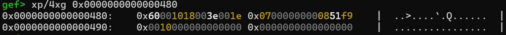
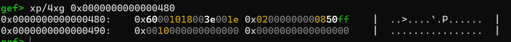

## Root cause

The vulnerability was reported by Jann Horn. The original report and POC can be found at [Linux >=6.6: race between mremap (move_normal_pmd) and MADVISE_COLLAPSE (retract_page_tables) - Project Zero](https://project-zero.issues.chromium.org/issues/371047675). I highly recommend reading the original report before proceeding.

The vulnerability, reported by Jann Horn of Google Project Zero, is a race condition in the Linux kernel (`>=6.6`) between the `mremap` and `madvise(MADV_COLLAPSE)` syscalls. A detailed analysis and the original proof-of-concept are available in the [original report](https://project-zero.issues.chromium.org/issues/371047675).

The race occurs because the `move_normal_pmd()` function, which is called during an `mremap` operation to move page tables, does not anticipate that the pmd can be concurrently cleared by `retract_page_tables()` during a `MADV_COLLAPSE` operation.

The execution flow that exposes the race taken from the original report:
```c
process A                      process B
=========                      =========
mremap
  mremap_to
    move_vma
      move_page_tables
        get_old_pmd
        alloc_new_pmd
                      *** PREEMPT ***
                               madvise(MADV_COLLAPSE)
                                 do_madvise
                                   madvise_walk_vmas
                                     madvise_vma_behavior
                                       madvise_collapse
                                         hpage_collapse_scan_file
                                           collapse_file
                                             retract_page_tables
                                               i_mmap_lock_read(mapping)
                                               pmdp_collapse_flush
                                               i_mmap_unlock_read(mapping)
        move_pgt_entry(NORMAL_PMD, ...)
          take_rmap_locks
          move_normal_pmd
          drop_rmap_locks
```

Successfully exploiting this race condition allows a malicious process to **install physical address 0 as a page table**.
## How to trigger

The original poc reliably triggers the race by manipulating scheduler priorities to force a context switch at a precise moment.:

```c
// Victim:
			...
      struct sched_param param = { .sched_priority = 0 };
      SYSCHK(sched_setscheduler(0, SCHED_IDLE, &param));

      /* race (outer side, will be preempted) */
      SYSCHK(mremap((void*)0x200000, 0x200000, 0x200000, MREMAP_MAYMOVE|MREMAP_FIXED, (void*)0x40000000));
      ...
// Hammer:
			...
			usleep(10);
	    /* race (inner side, will preempt after timer and voluntary resched) */
	    int madv_res = madvise(ptr, 0x200000, MADV_COLLAPSE);
	    ...
```

However, the preempt configs in kernelCTF mitigation instance are **disabled**. 

```
CONFIG_PREEMPT_BUILD=y
CONFIG_PREEMPT_NONE=y
# CONFIG_PREEMPT_VOLUNTARY is not set
# CONFIG_PREEMPT is not set
```

This exploit relied on the timerfd trick to raise an interrupt and widen the race window to reliably trigger the race condition on the kernelCTF instance. 

## Exploit Details

The original report mentioned two possible ways to exploit this vulnerability, both of which are inspiring and interesting.

When exploring the possibility of exploiting this vulnerability to target the kernelCTF mitigation instance, I discovered another approach to make the entire exploit process smoother, resulting in a fully data-only exploit.

### Race Oracle

To begin with, we should be able to know whether we successfully hit the bug after each try, in other words, whether the physical address 0 was installed as the page table. After examining the contents near physical address 0, you will find an interesting value at 0x488:



The value `0x07000000000851f9` is interesting because, according to `Intel SDM`, except for the highest 1 bit, which represents the NX flag, the highest 12 bits are either reserved or ignored.(Actually, in Linux, some of them are used as PKEY bits). At the same time, we know the lowest 12 bits are used as page table entry flags. This entry could be considered a pointer to `0x85000`, which is a valid physical address.

But when investigating deeper, `0x07000000000851f9` doesn’t have the `_PAGE_BIT_USER` bit set, but with several strange bits. If we read it directly, we will trigger a segfault and crash the exploit.

```c
// arch\x86\include\asm\pgtable_types.h
#define _PAGE_BIT_PRESENT	0	/* is present */
#define _PAGE_BIT_RW		1	/* writeable */
#define _PAGE_BIT_USER		2	/* userspace addressable */
```

Fortunately, calling `mprotect()` on the memory region containing this faulty mapping causes the kernel to "fix" the page table entry by setting the necessary user-access bits:

This provides the basis for an oracle:

- Win the race, potentially installing physical address 0 as a pmd.
- Call `mprotect()` on the target virtual address range to make it readable.
- Read the content at the virtual address corresponding to physical offset `0x488`.
- If the read is successful and the content differs from its expected value (e.g., the character 'a' used to fill the file), the bug was successfully triggered.

### Pivoting the Primitive

With a reliable oracle, the race can be triggered twice to get two separate processes whose PMDs both point to physical address 0. This shared page table state can be abused to bypass VMA permission checks and write to read-only memory.
The `mprotect` syscall validates a permission change by checking the VMA flags, specifically the `VM_MAY*` flags, which define the maximum allowed permissions:

```c
		/*
		 * Each mprotect() call explicitly passes r/w/x permissions.
		 * If a permission is not passed to mprotect(), it must be
		 * cleared from the VMA.
		 */
		mask_off_old_flags = VM_ACCESS_FLAGS | VM_FLAGS_CLEAR;

		new_vma_pkey = arch_override_mprotect_pkey(vma, prot, pkey);
		newflags = calc_vm_prot_bits(prot, new_vma_pkey);
		newflags |= (vma->vm_flags & ~mask_off_old_flags);

		/* newflags >> 4 shift VM_MAY% in place of VM_% */
		if ((newflags & ~(newflags >> 4)) & VM_ACCESS_FLAGS) {
			error = -EACCES;
			break;
		}
```

When normally calling mremap, the kernel will copy the vma into the proper place before setting up the page table:

```c
	new_vma = copy_vma(&vma, new_addr, new_len, new_pgoff,
			   &need_rmap_locks);
...
	moved_len = move_page_tables(vma, old_addr, new_vma, new_addr, old_len,
				     need_rmap_locks);
```

But since now we have two processes with the same physical address 0 as pmd. 

When remapping a page into the target address within the pmd space, only one of the processes’ vma will be set properly, leaving the other one unchanged.

This primitive grants the ability to modify any read-only page that can be `mmap`ed into user space.

### LPE && Container Escape

With the ability to write to read-only file mappings, local privilege escalation is straightforward. By mapping a SUID binary (e.g., `/bin/mount`), overwriting its code, and then executing it, the exploit gains root privileges.

To escape a container, a similar technique is used to modify the **vDSO**. Since functions within the vDSO are called by processes running inside the `nsjail` sandbox, overwriting them with shellcode allows for arbitrary code execution outside the container.

## Stability Notes

Since the vulnerability is a race condition, a failed race attempt does not cause a kernel crash; the syscalls simply complete normally. However, the kernel often emits a `BUG` message upon a successful trigger. Once the vulnerability has been triggered once, subsequent attempts in the near future are highly likely to succeed. Given sufficient time, the exploit can achieve a near-100% success rate.