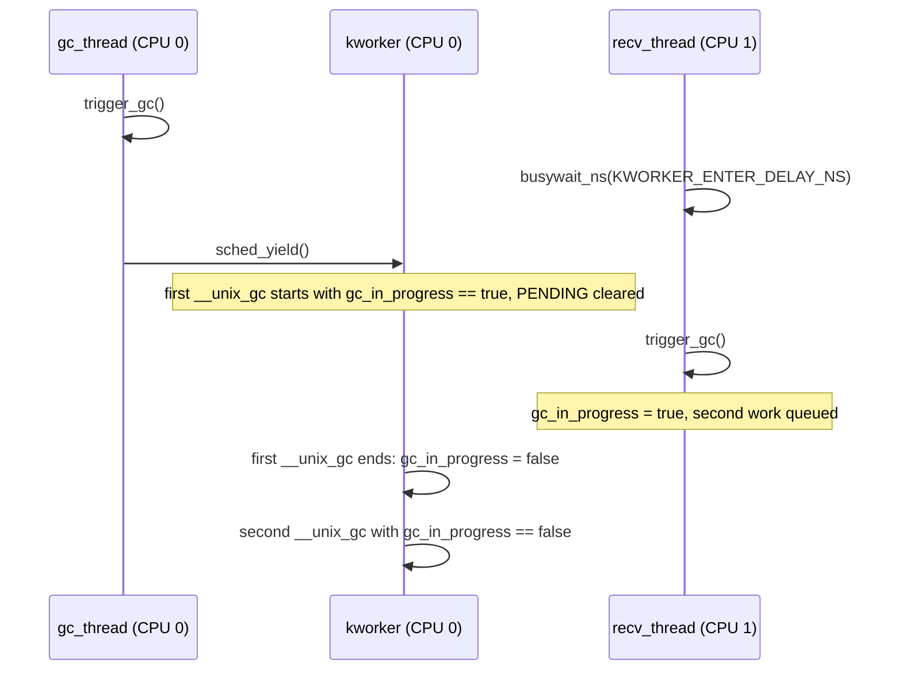
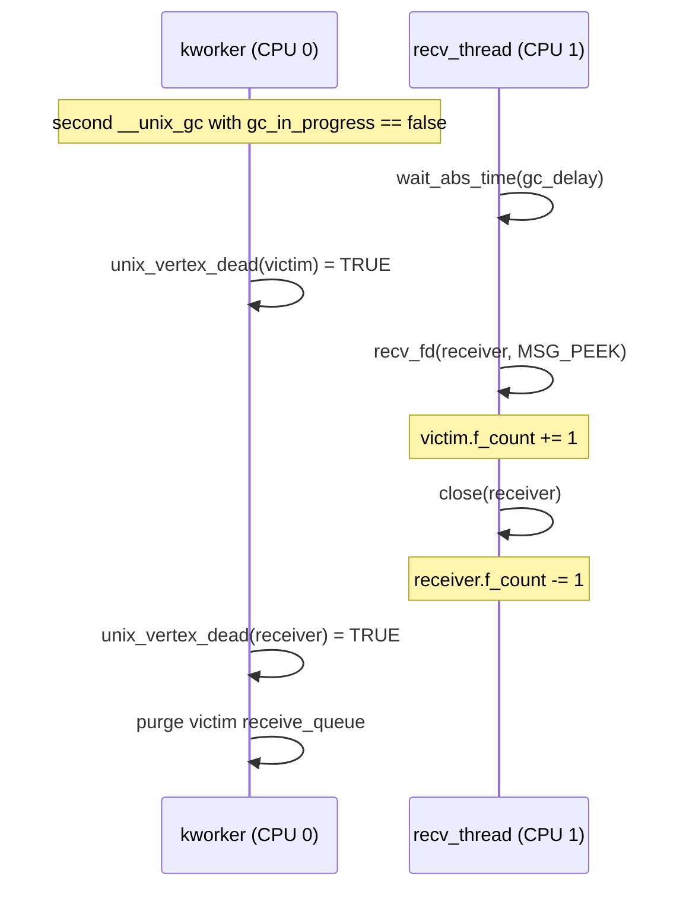
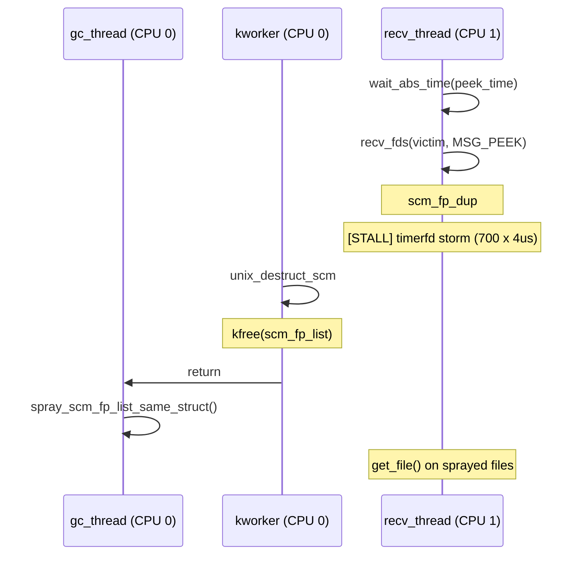

# CVE-2026-53361

This is the documentation for a universal kernelctf exploit using CVE-2026-53361. The exploit has been tested in all affected lts/cos/mitigation images and was used to get a flag on the lts-6.12.93 instance.

As stated in vulnerability.md, the bug gives us the ability to disable the optimistic locking used to prevent MSG_PEEK operations in the process of Unix socket garbage collection.

This can be used to achieve an alive socket's receive queue purging that leads to UAF on skb.

## Overview

The exploit consists of a 3-stage race to give us a dangling file descriptor to a UAF file that is used to achieve KRW via `struct pipe_buffer` forging.

One-line overview:

`gc_in_progress` desync -> optimistic locking for MSG_PEEK disabled -> GC purges receive queue -> `skb` UAF -> `scm_fp_list` UAF -> `file` UAF -> `pipe->bufs` UAF -> Unix socket fragment reclaim -> arbitrary r/w -> core_pattern `ctl_table` entry search -> `core_pattern.mode` override -> `core_pattern` write -> crash a child

The 3-stage race delays are swept in reasonable bounds and each attempt is running in a forked child.

### Step 1: Preparation

`vuln_prepare()` builds a long Unix GC cycle so that the cycle checking starts at the victim and ends at the receiver. This increases the MSG_PEEK+close race window to give us a chance to peek a victim socket from the cycle after it is already checked and close the receiver, so the whole cycle is considered as dead.

Additionally we send 251 pipes to the victim in the first skb in its receive queue. This will be used in the `scm_fp_dup` race to get a file descriptor without calling `get_file` on the file.

### Step 2: Trigger `gc_in_progress` desync and disable optimistic locking

This step is the 3-stage race.

The racing threads are: gc_thread (pinned to CPU0) and recv_thread (pinned to CPU1).

#### Step 2.1: Trigger `gc_in_progress` desync

This race is the vulnerability trigger. The GC assumes that `queue_work` will deduplicate calls and won't add 2 instances of `unix_gc_work` at once.

```c
void unix_gc(void)
{
	WRITE_ONCE(gc_in_progress, true);
	queue_work(system_unbound_wq, &unix_gc_work);
}
```

And that is true. But we can schedule the work while another one is running. `queue_work` only checks the PENDING bit of the work before adding it to the queue and the PENDING is cleared before the work function is called.

This creates an ability to enqueue 2 works at once if the second work is scheduled after the first one's worker function starts running.

In that case the first work will clear `gc_in_progress` after the second work is already queued, so the second work will run with `gc_in_progress == false`.

So we just schedule the first work in `gc_thread` and wait till it enters the worker function (`__unix_gc`), after that we have a chance to enqueue our second work.

The second work will be executed after the first one in the kworker which already executes on CPU0.



#### Step 2.2: MSG_PEEK+close vs GC

With the flag cleared we have an ability to use MSG_PEEK operations right during a cycle check.

The GC is secured from this using a `seqcount_t` based optimistic locking. The MSG_PEEK path signals the GC that it happened by incrementing the counter and the GC discards a calculated result if the counter is changed.

As an optimization the MSG_PEEK path does not increment the counter if there are no Unix sockets peeked [1] and if the GC is not running (`gc_in_progress == false`) [2].

```c
void unix_peek_fpl(struct scm_fp_list *fpl)
{
	static DEFINE_SPINLOCK(unix_peek_lock);

	if (!fpl || !fpl->count_unix)    //                [1]
		return;

	if (!READ_ONCE(gc_in_progress))  //                [2]
		return;

	/* Invalidate the final refcnt check in unix_vertex_dead(). */
	spin_lock(&unix_peek_lock);
	raw_write_seqcount_barrier(&unix_peek_seq);
	spin_unlock(&unix_peek_lock);
}
```

Therefore we can use MSG_PEEK in the second unix GC and peek the victim socket from the receiver socket after the victim gets checked, then close the receiver before the receiver check.

The `gc_delay` is used to determine the time when the GC will be after the victim check and before the receiver check. At this time many hrtimer interrupts are firing to widen the window, also the cycle consists of many sockets, so the checking time is long.

The GC will purge the `victim_socket`'s receive queue while we can interact with skbs in that queue.



#### Step 2.3: scm_fp_dup vs unix_destruct_scm

Now we can finally trigger UAF on skb in many ways. In this exploit to make it a generic kernelctf exploit we want to achieve arbitrary r/w in the kernel. To get it we have sent 251 pipes into the victim and now we can peek the files while the GC is freeing the skb carrying these files.

When we call MSG_PEEK on victim we enter into `scm_fp_dup` which increments refcounts of all files. The function looks like:

```c
struct scm_fp_list *scm_fp_dup(struct scm_fp_list *fpl)
{
	struct scm_fp_list *new_fpl;
	int i;

	if (!fpl)
		return NULL;

	new_fpl = kmemdup(fpl, offsetof(struct scm_fp_list, fp[fpl->count]),
			  GFP_KERNEL_ACCOUNT);
	if (new_fpl) {
		for (i = 0; i < fpl->count; i++)
			get_file(fpl->fp[i]);            // [1]

		// ...
	}
	return new_fpl;
}
```

The cycle will iterate over 251 pipes incrementing the refcounts [1]. We have `scm_fp_dup_delay` to determine the time when we enter into this function. At that time many hrtimer interrupts will fire to widen the window in `recv_thread` while the kworker will be freeing the skb with this `scm_fp_list`.

When the skb is being freed the kernel calls `unix_destruct_scm` as a destructor which frees the `scm_fp_list`. The destructor also nullifies the `skb->fp` pointer to `scm_fp_list`, therefore we must enter `scm_fp_dup` before that to save the pointer.

We can notice that in the cycle we use not the `kmemdup`'ed structure (`new_fpl`) but the initial structure (`fpl`) that can be freed at the moment we will increment the refcounts [1].

The `scm_fp_list` is allocated in `kmalloc-cg-4096` with the freelist pointer at offset of 2048. At this offset we have a pointer to the 252nd file. This is the reason we have sent only 251 files instead of the maximum which is 253. This decreases the count of panics on dereferencing the freelist even if we do not manage to reclaim the slot.

We will reclaim this slot with another `scm_fp_list` by sending files via a Unix socket in `gc_thread` after the GC is finished freeing. This will lead to incrementing the refcounts of other files, but our pipes will not be `get_file()`'ed.

Finally we have peeked pipes some of which have undercounted `f_count` because `get_file` was called on another file.



### Step 3: Fill `pipe_inode_info` slots with live entries

We allocate many `pipe_inode_info`. It is used to saturate the freelist because we will corrupt a freelist pointer for one slot.

If we do not do that the kernel will crash sometimes while executing our `core_pattern` handler which allocates `pipe_inode_info`.

### Step 4: Grow `pipe_buffers` to an Order-2 allocation

We resize the last of the pipes we sent to an Order-2 allocation for `pipe_buffers`. This will use `kmalloc_large` giving us pages directly from buddy. This helps to bypass cross-cache mitigations on the mitigation instance, also we don't need to drain `kmalloc` slabs to buddy, just free `pipe_buffers` and reclaim with any other buddy allocation.

### Step 5: Create Unix sockets for Order-2 page spraying

To spray Order-2 pages we will use Unix sockets. We pre-create them because later we will close the UAF pipe and we don't want to reclaim its slot.

### Step 6: Create a pipe for arbitrary KRW via forged `pipe_buffer`s

Also create a pipe (`krw_pipe`) which will be used to get KRW. We intend to make `pipe->bufs` and a `spray_socket`'s fragment point to the same page.

### Step 7: Free `pipe_buffers` of the UAF pipe

We close both ends of the UAF pipe holding the peeked file descriptor. Since we have undercounted `uaf_pipe->f_count` the pipe will be freed even if we have a file descriptor to it.

This frees an Order-2 page allocated as `uaf_pipe->bufs`.

### Step 8: Reclaim `pipe_buffers` with an skb fragment

We send 16kb of data (filled with our marker `G`) in each `spray_socket`. This allocates an Order-2 page, one of the allocations will get the same page as was freed in Step 7.

Finally we have `uaf_pipe->bufs` pointing to a `spray_socket` fragment.

### Step 9: Free the skb fragment via the UAF pipe

We resize the `uaf_pipe` via the UAF file descriptor. This frees previous `uaf_pipe->bufs` (which now is the `spray_socket` fragment).

While resizing the kernel writes `nr_accounted` to the `pipe_inode_info` (allocated in `kmalloc-cg-192`) of the `uaf_pipe`. This field aligns with a freelist pointer (4-bytes write at offset 96) of `kmalloc-cg-192`, so we corrupt the freelist and next allocations can crash the kernel.

But we have pipes allocated in Step 3 which we can free to get many valid `pipe_inode_info` slots.

### Step 10: Reclaim the freed fragment with KRW `pipe_buffers`

One of `spray_socket` fragments is freed, so we reclaim this page by resizing `pipe_buffers` of our KRW pipe to an Order-2 allocation.

Now we have `krw_pipe->bufs == spray_socket.fragment`.

### Step 11: Add data to the KRW pipe to create a leak `pipe_buffer`

We write some data to the KRW pipe to create a `pipe_buffer` structure in `krw_pipe->bufs`. This will help us to leak kernel pointers needed to forge `pipe_buffer` structures without knowing either KASLR or vmemmap_base.

### Step 12: Find the socket that reclaimed `pipe_buffers` and leak pointers

We use MSG_PEEK on all spray sockets to see which one was reclaimed by the KRW pipe. If the reclamation is successful the initial marker (we filled spray sockets with `G`) will be cleared.

Instead of the marker we have a valid `pipe_buffer` structure in one of the sockets. This socket will be `spray_socket`.

We leak these fields from the `pipe_buffer` structure to make fake ones in the future:

- `leaked_page` — `pipe_buffer.page`
- `leaked_ops` — `anon_pipe_buf_ops`

### Step 13: Scan for the `core_pattern` `ctl_table` entry

Now we can free `krw_pipe->bufs` reading from the `spray_socket` and fill it by writing fake `pipe_buffers` to it.

We use this to scan the RAM searching for the `core_pattern` `ctl_table` entry.

The `ctl_table` entry layout is quite specific. We use this pattern: 2 kernel pointers, 128 (maxlen, unique across `ctl_table` entries), 0644 (the initial mode).

Since on the kernelctf structure randomization is off, this pattern is sufficient.

### Step 14: Patch `core_pattern.mode` from 0644 to 0666

Now we have a pointer to a `page` structure containing the `core_pattern.mode`. We change the rights to world-writable by crafting a fake `pipe_buffer` with `PIPE_BUF_FLAG_CAN_MERGE` flag and writing to the `krw_pipe`.

### Step 15: Give further pipe allocations live slots

We have allocated several pipes to fill `kmalloc-cg-192` slab with `pipe_inode_info`. We just free them to fill the freelist with valid entries.

### Step 16: Write `core_pattern` and trigger a crash

Now we have `core_pattern` world-writable, so we just write our handler which pipes the flag to the kernel messages and crash a child.
